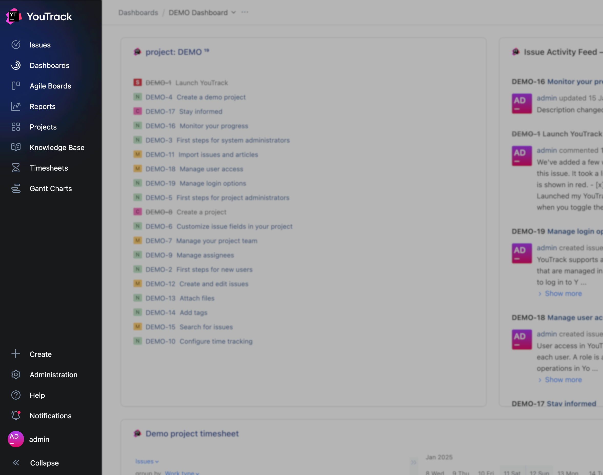
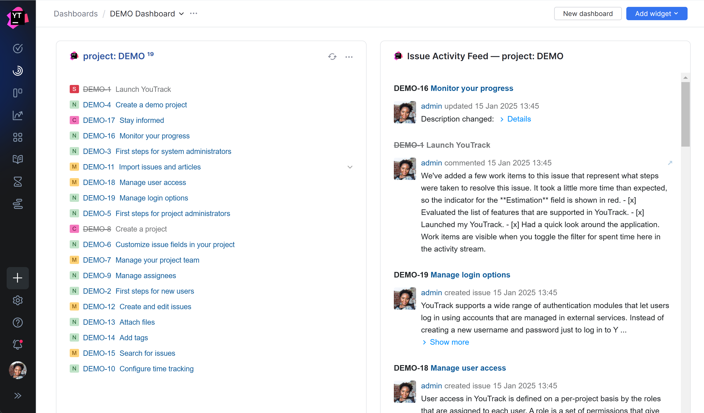
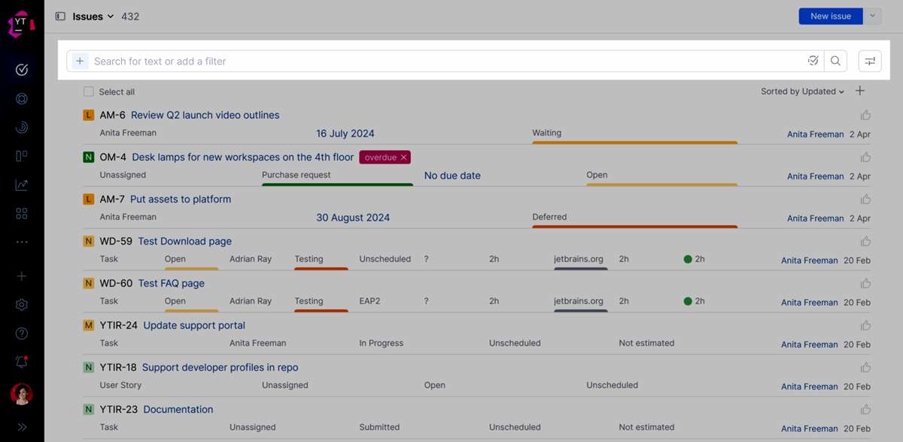
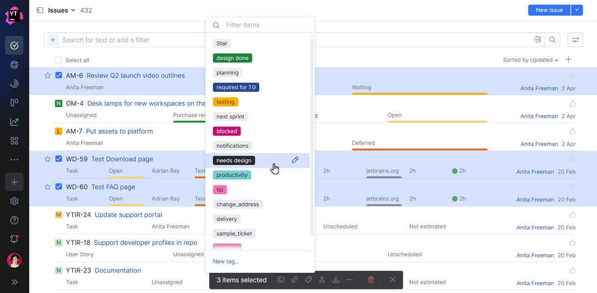

## Erste Schritte

Letzte Änderung: 04\. Juni 2025

Falls Sie YouTrack noch nicht kennen, finden Sie hier ein paar Tipps, die Ihnen den Einstieg erleichtern.

## Hauptnavigation

Wenn Sie sich zum ersten Mal bei YouTrack anmelden, finden Sie die Hauptnavigation auf der linken Seite der Seite.

Die Hauptnavigation in YouTrack.

Diese Links und Symbole ermöglichen Ihnen den Zugriff auf verschiedene Seiten der Anwendung. Die Sichtbarkeit der Links und Symbole hängt von den Berechtigungen Ihres Benutzerkontos ab. Wenn Ihr Konto beispielsweise nicht über die Berechtigung „Projekte lesen“ verfügt, wird der Link „Projekte“ in der Hauptnavigation nicht angezeigt. Auch die Sichtbarkeit der Optionen im Menü „Administration“ richtet sich nach den Berechtigungen Ihres Benutzerkontos.

Das Navigationspanel hat zwei Zustände:

- Im aufgeklappten Zustand werden für jeden Menüpunkt Bezeichnungen angezeigt. Dies kann für Benutzer hilfreich sein, die mit der Anwendung noch nicht vertraut sind.
- Im ausgeblendeten Zustand werden die Beschriftungen nur angezeigt, wenn Sie den Mauszeiger über das entsprechende Symbol im Menü bewegen. Diese Einstellung wird in der Regel von Nutzern bevorzugt, die mit YouTrack vertraut sind oder die maximale Informationsmenge auf der Seite anzeigen möchten.

## Startseite

Die Standard-Startseite Ihrer YouTrack-Website ist „Dashboards“. Diese Seite öffnet sich automatisch, wenn Sie sich bei YouTrack anmelden oder auf das Logo in der Hauptnavigation klicken. Die Dashboard \-Seite ist ein anpassbarer Bereich, der Ihnen eine zentrale Übersicht der wichtigsten und umsetzbaren Informationen Ihrer Projekte bietet. So bleiben Sie organisiert, verfolgen den Fortschritt und überwachen die Teamaktivitäten – alles an einem Ort. Auf dieser Seite können Sie:

- Konfigurieren Sie ein persönliches Dashboard, mit dem Sie den Überblick über Ihre eigene Arbeit behalten.
- Erstellen Sie ein Dashboard, das Ihnen hilft, die Aktivitäten Ihres gesamten Teams zu überwachen.
- Erstellen Sie benutzerdefinierte Ansichten, um Informationen zwischen verschiedenen Teilen Ihrer Organisation auszutauschen.

Ein Dashboard in YouTrack.

Mehr über diese Funktion erfahren Sie unter [Dashboards](https://www.jetbrains.com/help/youtrack/cloud/youtrack-live-dashboard.html).

## Such- und Filteroptionen

Bei der Bearbeitung von Problemen oder Helpdesk-Tickets stehen Ihnen verschiedene Optionen zur Verfügung, mit denen Sie nach bestimmten Problemen suchen oder die aktuelle Liste filtern können.

Nutzen Sie die Optionen in diesem Abschnitt der Seite, um Probleme und Tickets in YouTrack zu finden.

Such- und Filteroptionen in YouTrack.

Es stehen zwei verschiedene Modi zur Verfügung, um Probleme zu finden:

- Mit der einfachen Suche können Sie die Suchergebnisse so filtern, dass nur Vorgänge angezeigt werden, die übereinstimmende Werte in einem oder mehreren benutzerdefinierten Feldern enthalten. Weitere Informationen zur Verwendung von Filtern finden Sie unter [Einfache Suche](https://www.jetbrains.com/help/youtrack/cloud/smart-filters.html).
- Die erweiterte Suche ermöglicht es Ihnen, nach Vorgängen zu suchen, die übereinstimmende Werte für bestimmte Attribute und beliebige Textzeichenfolgen enthalten. Weitere Informationen zu Suchanfragen in YouTrack finden Sie unter [Suche](https://www.jetbrains.com/help/youtrack/cloud/search-for-issues.html).

Wie Sie zwischen diesen beiden Optionen wechseln, erfahren Sie unter [Einstellungen](https://www.jetbrains.com/help/youtrack/cloud/issues-list.html#issues-list-settings).

## Die Themenliste

Wenn Sie im Hauptmenü auf die Seite „ Vorgänge“ navigieren, zeigt YouTrack eine Liste der Vorgänge an. Alle Vorgänge, die den aktuellen Suchkriterien entsprechen, werden in dieser Liste angezeigt. Die Liste wird aktualisiert, sobald Sie eine Suchanfrage eingeben oder einen Filter anwenden.

Die Problemliste verfügt über eine Symbolleiste, mit der Sie bestimmte Aktionen auf ein oder mehrere Probleme anwenden können. Diese Symbolleiste wird angezeigt, sobald Sie ein oder mehrere Probleme in der Liste auswählen. Beispielsweise können Sie die Kontrollkästchen für mehrere Probleme in der Liste aktivieren und auf die Schaltfläche „Tag hinzufügen“ klicken, um allen ausgewählten Problemen gleichzeitig ein Tag hinzuzufügen.

Mehreren Vorgängen über die Symbolleiste in der Vorgangsliste Tags hinzufügen.

- Eine detaillierte Übersicht der in der Problemliste verfügbaren Steuerelemente finden Sie [unter Problemliste](https://www.jetbrains.com/help/youtrack/cloud/issues-list.html).
- Mehr über die Arbeit mit Issues in dieser Ansicht erfahren Sie unter [Issues](https://www.jetbrains.com/help/youtrack/cloud/issues.html).

Links neben der Problemliste befindet sich eine Seitenleiste. Diese Seitenleiste hat zwei Modi:

- Im aufgeklappten Zustand ist die Seitenleiste immer sichtbar.
- Im zusammengeklappten Zustand ist die Seitenleiste nur sichtbar, wenn man den Mauszeiger über das Symbol bewegt.

Sie können zwischen diesen Modi wechseln, indem Sie auf das Symbol in der Kopfzeile klicken.

Die Seitenleiste bietet Ihnen schnellen Zugriff auf Vorgänge in Ihren bevorzugten Projekten und zeigt Vorgänge an, die Ihren gespeicherten Suchanfragen und Schlagwörtern entsprechen. Nutzen Sie die Seitenleiste, um Verknüpfungen für häufig verwendete Suchkriterien und relevante Schlagwörter zu speichern. Informationen zum Anpassen der Elemente in der Seitenleiste finden Sie unter „ [Vorgangs-Seitenleiste“](https://www.jetbrains.com/help/youtrack/cloud/issues-list.html#sidebar).

Hier können Sie auch alle noch nicht gemeldeten Problementwürfe finden und deren Bearbeitung fortsetzen. Informationen zum Arbeiten mit Entwürfen in YouTrack finden Sie unter [Problementwürfe laden](https://www.jetbrains.com/help/youtrack/cloud/issue-drafts.html).

## Einzelansicht

YouTrack bietet eine Ansicht für einzelne Vorgänge, die alle zugehörigen Informationen anzeigt. Verwenden Sie eine der folgenden Optionen, um einen einzelnen Vorgang zu öffnen und anzuzeigen:

- Klicken Sie in der Problemliste auf die ID oder den Zusammenfassungslink .
- Wählen Sie das Kontrollkästchen für ein Problem aus und drücken Sie die Taste Enter.

Um mehr über diese Ansicht zu erfahren, siehe [Einzelansicht](https://www.jetbrains.com/help/youtrack/cloud/issue-full-page-view.html).

Vielen Dank für Ihr Feedback!

War diese Seite hilfreich?