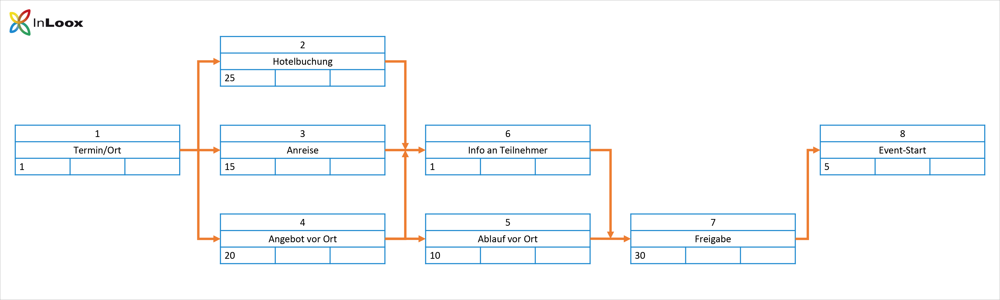
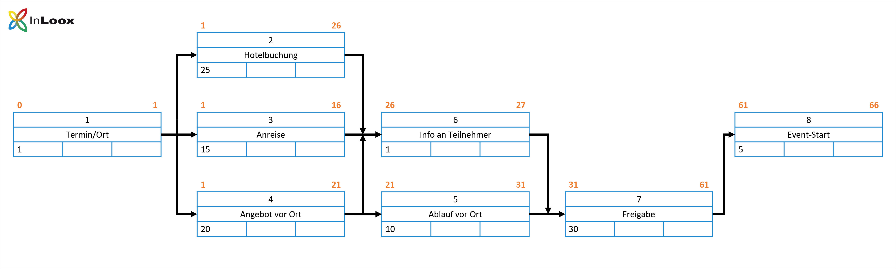
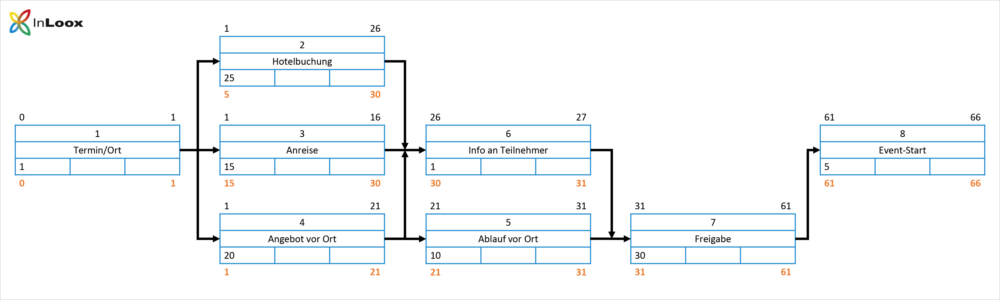
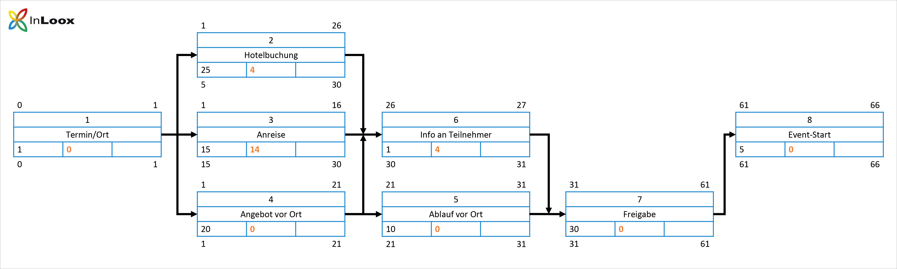
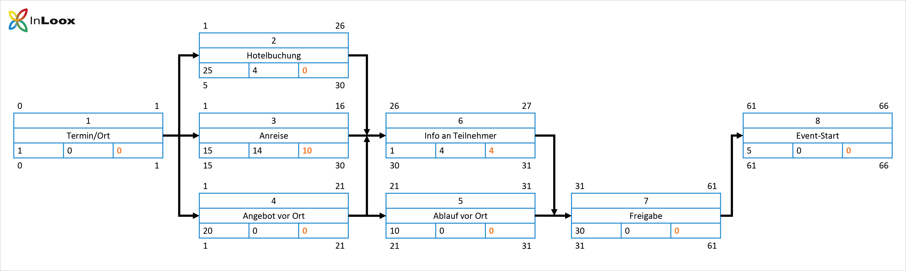
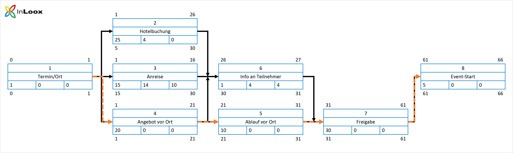

Planung eines Teambuilding-Events

### Schritt 1: Vorgänge, Dauer, Anordnungsbeziehungen definieren

- Erstellen Sie eine Liste aller Vorgänge und definieren Sie die Dauer der Vorgänge. Bestimmen Sie außerdem die Anordnungsbeziehung zwischen den Vorgängen:

| Nr. | Phase                | Dauer  | Vorgänger |
| --- | -------------------- | ------ | --------- |
| 1   | Termin/Ort festlegen | 1      | -         |
| 2   | Hotelbuchung         | 25     | 1         |
| 3   | Anreise              | 15     | 1         |
| 4   | Angebot vor Ort      | 20     | 1         |
| 5   | Ablauf vor Ort       | 10     | 4         |
| 6   | Info an Teilnehmer   | 1      | 2,3,4     |
| 7   | Freigabe             | 30     | 5,6       |
| 8   | Event-Start          | 5      | 7         |

### Schritt 2: Stellen Sie die Vorgänge in Form von Knoten dar und tragen Sie die Vorgangsdauern (d) ein.

Jeder Knoten wird folgendermaßen dargestellt:

Die Abkürzungen stehen dabei für folgende Werte:
- **PS**
	- Prozessschritt
- **D**
	- Dauer des jeweiligen Vorgangs
- **FAZ**
	- Frühester Anfangszeitpunkt, 
	- zu dem der Prozessschritt begonnen werden kann
- **FEZ**
	- Frühester Endzeitpunkt, 
	- zu dem der Prozessschritt abgeschlossen werden kann
- **SAZ**
	- Spätester Anfangszeitpunkt, 
	- um den Gesamtprozess planmäßig beenden zu können
- **SEZ**
	- Spätester Endzeitpunkt, 
	- zu dem ein Schritt abgeschlossen sein muss, 
	- um den geplanten Abschlusstermin nicht zu gefährden
- **GP**
	- Gesamtpuffer, der genutzt werden kann, 
	- bevor der pünktliche Abschluss des Gesamtprozesses gefährdet wird
- **FP**
	- Freier Puffer, der zur Verfügung steht, 
	- bevor der unmittelbar folgende Prozessschritt beeinflusst wird
- In **das leere Feld oben rechts** 
	- kann bei Bedarf eine genauere Bezeichnung 
	- des Prozesses eingetragen werden.

- Diese Felder werden im Laufe des Erstellungsprozesses eines Netzplans 
	- schrittweise ausgefüllt.

### Schritt 3: Vorgänge miteinander verknüpfen

Bestimmen Sie die Anordnungsbeziehung und die Abhängigkeit zwischen den Vorgängen. Vorgänger und Nachfolger werden über Pfeile miteinander verknüpft – so sehen Sie welcher Vorgang bzw. welche Vorgänge Sie abschließen müssen, bevor Sie mit dem nächsten Schritt fortfahren können.

#### **Schritt 4: Vorwärtsterminierung**

Bei der Vorwärtsterminierung starten wir beim Vorgang 1 und gehen alle Vorgänge Schritt für Schritt durch, bis wir bei Vorgang 8 angelangt sind.  
Tragen Sie den **FAZ** (frühester Anfangszeitpunkt) und den **FEZ** (frühesten Endzeitpunkt) ein  
So berechnen Sie die jeweiligen Zeitpunkte:

1. **FAZ** des ersten Vorgangs (1)
	- ist immer 0
2. **FEZ** eines Vorgangs
	- **Summe** von FAZ und D
3. **FEZ** eines Vorgangs
	- ist gleichzeitig **FAZ** des Nachfolgers
4. Hat ein Knoten mehrere Vorgänger 
	- wird der Vorgänger-FEZ genommen, 
	- der den **HÖCHSTEN** Wert hat

#### **5. Rückwärtsterminierung**

Die Rückwärtsterminierung dient dazu den spätesten Anfangszeitpunkt (**SAZ**) und den spätesten Endzeitpunkt (**SEZ**) zu berechnen. Bei der Rückwärtsterminierung starten wir beim letzten Vorgang (8) und gehen alle Vorgänge durch, bis wir wieder bei Vorgang 1 angekommen sind.

So berechnen Sie die jeweiligen Zeitpunkte:

1.  **SEZ** des letzten Vorgangs (8)
	- ist gleich seinem **FEZ** und 
	- stellt den Start der Rückwärtsterminierung dar.
2.  **SAZ** eines Vorgangs
	- **SEZ – D**
3.  Der **SAZ** eines Vorgangs 
	- ist immer gleich dem **SEZ** des **vorherigen** Vorgangs.
4.  Hat ein Vorgang mehrere Nachfolger, 
	- so wird der **KLEINSTE SAZ** übernommen.
5.  Die Rückwärtsterminierung ist korrekt,
	- wenn **FAZ = SAZ = 0** bei Vorgang 1 steht.

#### **Schritt 6: Pufferzeiten**

Bestimmen Sie als nächstes den Gesamtpuffer und den freien Puffer für alle Vorgänge.

-  Gesamtpuffer 
	- GP = SAZ – FAZ

- Der Gesamtpuffer zeigt an, 
	- wie viel Verzögerung man sich bei der Bearbeitung 
	- des jeweiligen Vorgangs leisten kann, 
		- bevor es den pünktlichen Abschluss des Projektes gefährdet.

- Freie Puffer
	- FP = FAZ des Nachfolgers - eigener FEZ
- Sollte ein Vorgang mehrere Nachfolger haben, 
	- so nimmt man den **KLEINSTEN FAZ** für die Berechnung.

- Der freie Puffer zeigt an, 
	- wie viel Verzögerung man sich 
		- bei der Bearbeitung leisten kann, 
			- um die Bearbeitung des 
				- unmittelbaren Nachfolges nicht zu gefährden.

#### **Schritt 7: Kritischen Pfad bestimmen**

- Der kritische Pfad stellt die längste Kette von Vorgängen und Meilensteinen dar, 
	- bei denen es keinen (zeitlichen) Puffer gibt. 
- Selbst die kleinste Verzögerung führt automatisch 
	- zu einer Verzögerung des Projektendes.

- Bei der Netzplantechnik gehören alle Vorgänge zum kritischen Pfad, 
	- die keinen freien Puffer und 
	- auch keinen Gesamtpuffer haben.
- Es gilt: **FP = GP = 0**

- Der kritische Pfad bestimmt somit die Mindestprojektdauer und 
	- hilft dem Projektmanager rechtzeitig zu erkennen, 
	- bei welchen Vorgängen im Projekt Verzögerungen besonders riskant sind und
		- so kann dieser von Anfang an dagegen steuern. 
- Projektmanager sollten daher die Vorgänge 
	- auf dem kritischen Pfad besonders genau überwachen. 
- Wenn man es schafft, bei den kritischen Vorgängen Zeit einzusparen, 
	- kann man die Laufzeit des gesamten Projektes verkürzen.