Letzte Änderung: 05\. September 2025

Demoprojekte sind eine hervorragende Möglichkeit, YouTrack in einer sicheren Umgebung kennenzulernen. Sie können sie auch nutzen, um verschiedene Konfigurationsoptionen auszuprobieren, bevor Sie mit einem neuen Projekt beginnen oder die Konfiguration auf ein bereits laufendes Projekt anwenden.

Das Demoprojekt enthält eine vorkonfigurierte Auswahl an Beispielvorgängen, die Ihnen helfen, sich mit den wichtigsten Funktionen von YouTrack vertraut zu machen. Das Demoprojekt umfasst außerdem eine Sammlung agiler Boards, Berichte und ein Dashboard.

Bei Neuinstallationen wird automatisch ein Demoprojekt erstellt. Der Benutzer, der die Anwendung installiert oder registriert, kann das Demoprojekt behalten oder verwerfen und mit einer leeren YouTrack-Installation arbeiten.

Ihre YouTrack-Installation unterstützt eine unbegrenzte Anzahl von Demoprojekten. Nutzen Sie Demoprojekte für die folgenden Anwendungsfälle:

- Wenn Sie YouTrack als mögliche Lösung für das Projektmanagement in Ihrem Unternehmen evaluieren, nutzen Sie das Demo-Projekt, um sich mit einer Reihe von Funktionen vertraut zu machen und dabei minimale Ausfallzeiten für Einrichtung und Konfiguration zu vermeiden.
- Nutzen Sie Demoprojekte, um Arbeitsabläufe und Integrationen zu testen, bevor Sie sie in aktiven Projekten einsetzen.
- Erstellen Sie Demo-Projekte für neue Mitarbeiter als Teil ihres Einarbeitungsprozesses.

## Demoprojekt erstellen

Das Demoprojekt basiert wie jedes andere YouTrack-Projekt auf einer Projektvorlage. Die Vorlage definiert von Anfang an, welche benutzerdefinierten Felder, Workflows und Zeiterfassungseinstellungen im Projekt verwendet werden.

Die Möglichkeit, Projekte zu erstellen, ist auf Benutzer mit der Berechtigung „Projekt erstellen“ beschränkt. Wenn Sie Demoprojekte zur Einarbeitung neuer Benutzer ohne diese Berechtigung verwenden möchten, muss jemand das Projekt für sie erstellen und ihnen Zugriff darauf gewähren. Weitere Informationen finden Sie unter „ [Projektteam verwalten“](https://www.jetbrains.com/help/youtrack/cloud/managing-project-team.html).

### So erstellen Sie ein Demo-Projekt:

> ### Tipp
> 
> Erforderliche Berechtigungen: Projekt erstellen, Projekt-Grundlagen lesen

1. Im Hauptmenü wählen Sie „Projekte“.
2. Klicken Sie auf der Seite „Projekte“ auf die Schaltfläche „Neues Projekt“.
	- Die erste Seite des Projekteinrichtungsassistenten öffnet sich.
	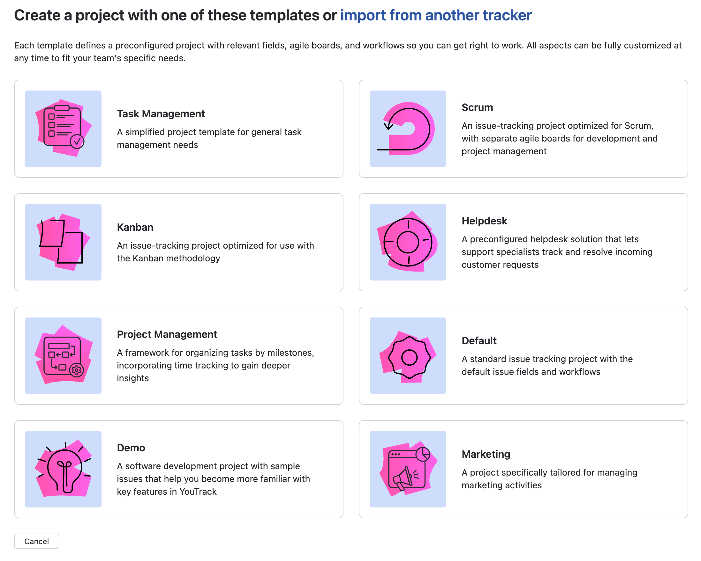
	Erster Schritt im Projekt-Setup-Assistenten.
3. Wählen Sie die Demo- Vorlage aus.
	- Es öffnet sich ein Dialogfeld mit zusätzlichen Informationen zur Demo-Vorlage.
4. Klicken Sie auf die Schaltfläche „Diese Vorlage verwenden“.
5. Geben Sie einen Namen für das Demoprojekt ein und klicken Sie auf „Projekt erstellen“.
	- Ein neues Demo-Projekt wurde erstellt.
	- Zusätzliche Funktionen des Demoprojekts werden automatisch generiert.
	- YouTrack zeigt die Übersichtsseite für das neue Projekt an.
	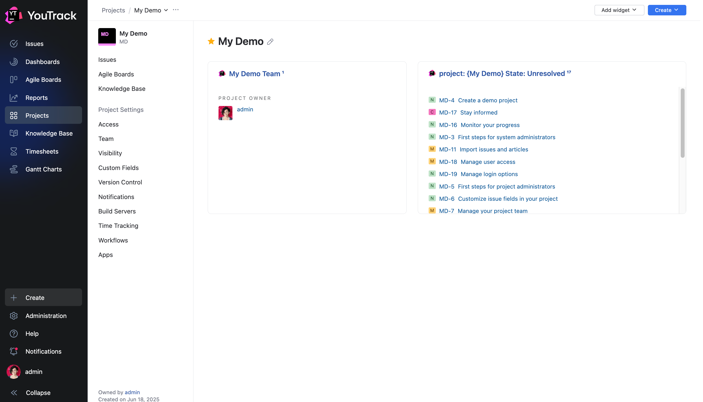
	Überblick über das neue Demo-Projekt.

## Demo-Projektfunktionen

Wenn Sie ein Demoprojekt erstellen, generiert YouTrack eine vordefinierte Sammlung von Vorgängen und Vorgangsansichten. Diese helfen Ihnen, sich in der Anwendung zurechtzufinden und sich mit ihren Funktionen vertraut zu machen. Sie können auf diese Funktionen des Demoprojekts über die Navigationslinks im Hauptmenü zugreifen.

### Probleme

When you click the Issues link in the main menu, you can browse and view issues in your demo project.

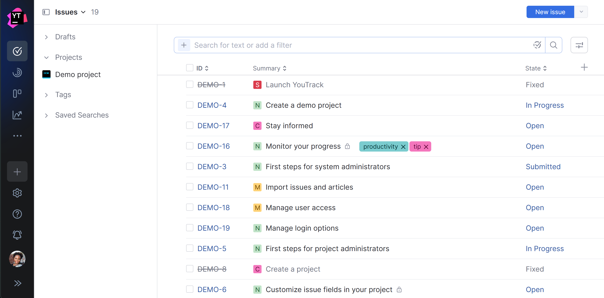

Probleme im Demoprojekt.

If you click the Issues link on the project overview page, you only see issues that belong to this project.

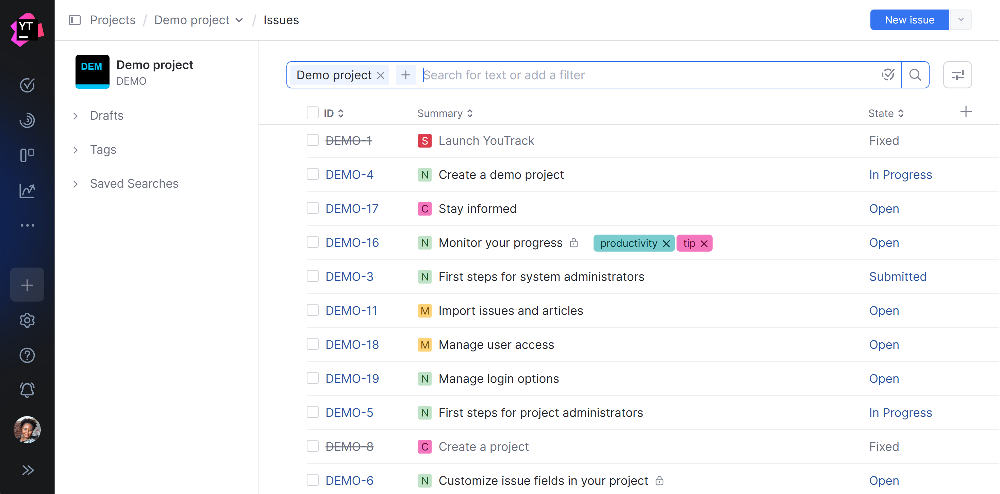

Issues in the demo project when accessed from the project overview page.

The issues have also been arranged into a predefined hierarchy. When the Structure setting for the page is set to Hierarchical (tree), each subtask is nested under its parent issue.

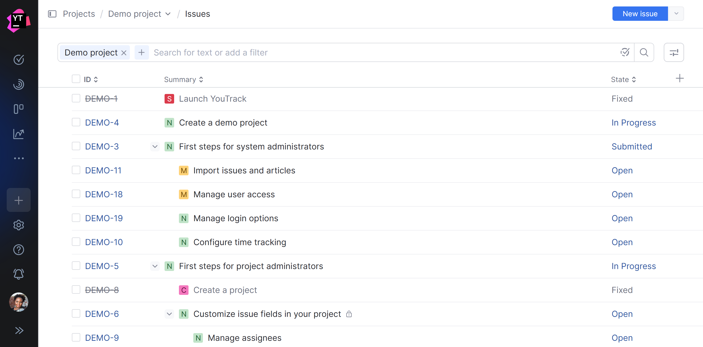

Issues in the demo project in tree view.

When you select an issue from the list, it opens in single issue view.

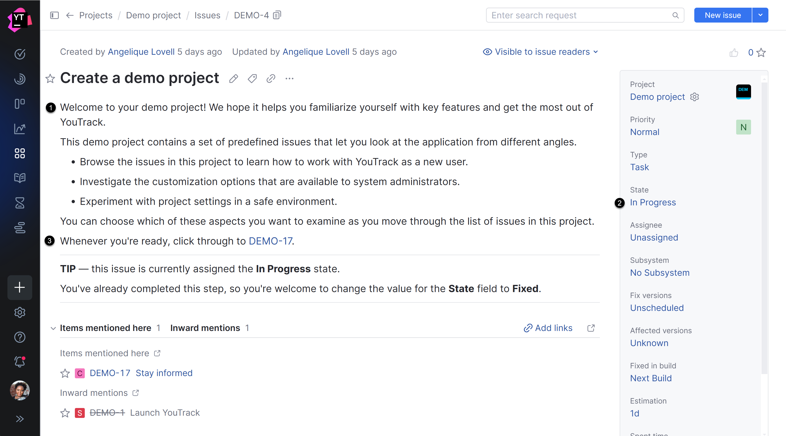

Sample issue in the demo project.

The descriptions for issues in the demo project are written to help you discover a specific feature, then move on to the next issue. Follow these steps for each issue in the demo project:

1. Read the issue description and follow the instructions provided.
2. Resolve the issue by changing the value for the State field to Fixed.
3. Continue with the next issue in the project.

You can work with issues in the demo project in any order. There's no right or wrong way. Keep going until you've resolved all the issues in the project or are confident enough to use the application without further assistance.

### Dashboards

When the demo project is created, YouTrack generates a dashboard that displays information that is specific to the demo project. This dashboard is accessible from the list of dashboards as <demo project name> Dashboard.

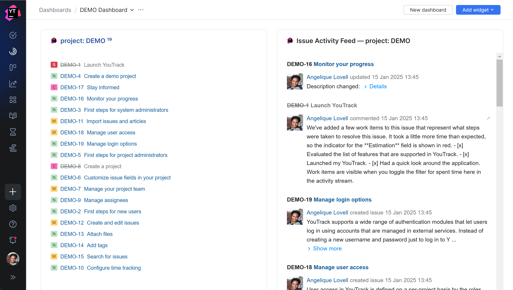

Dashboard for the demo project.

The dashboard is pre-populated with the following widgets:

| Widget | Description |
| --- | --- |
| Issue List Widget | This widget displays a simple list of all issues that belong to the demo project. You can customize the widget to show only issues that match specific search parameters. For example, if you add `#Unresolved` to the search query in the settings, the widget only shows issues that are assigned an unresolved state.  To learn more about this widget, see [Issue List Widgets](https://www.jetbrains.com/help/youtrack/cloud/issue-widgets.html). |
| Issue Activity Feed Widget | This widget shows you a timeline that represents all the issue-related activity that has taken place in your demo project. Even though these updates were generated automatically, the activity that is recorded in the demo project upon its creation is attributed to the user who created the project. As you apply changes to issues in the demo project, your activity will be reflected in this widget as well.  To learn more about this widget, see [Issue Activity Feed Widgets](https://www.jetbrains.com/help/youtrack/cloud/issue-activity-feed-widget.html). |
| Time Tracking Report Widget | This widget displays data that is calculated for and presented on a preconfigured [Timesheet Report](https://www.jetbrains.com/help/youtrack/cloud/timesheet-report.html). This timesheet shows you who has allocated spent time by adding work items to issues in the demo project.  The demo project includes predefined work items that help demonstrate this functionality. In each of these work items, the user who creates the demo project is assigned as the work author.  To learn more about this widget, see [Time Tracking Report Widgets](https://www.jetbrains.com/help/youtrack/cloud/time-tracking-report-widget.html). |

You can use the dashboard to track your progress as you resolve each issue in the demo project. You can also tune the dashboard any way you like.

- Customize and resize the pre-populated widgets.
- Add your own widgets.

To learn more about dashboards in YouTrack, see [Dashboards](https://www.jetbrains.com/help/youtrack/cloud/youtrack-live-dashboard.html).

### Agile Boards

When you create a demo project, YouTrack creates a sample agile board. The board is designed to support a lightweight Kanban framework. With this model, cards are simply meant to flow from left to right, one column at a time, until all the tasks are marked as complete.

This board is automatically assigned the name <demo project name> Overview.

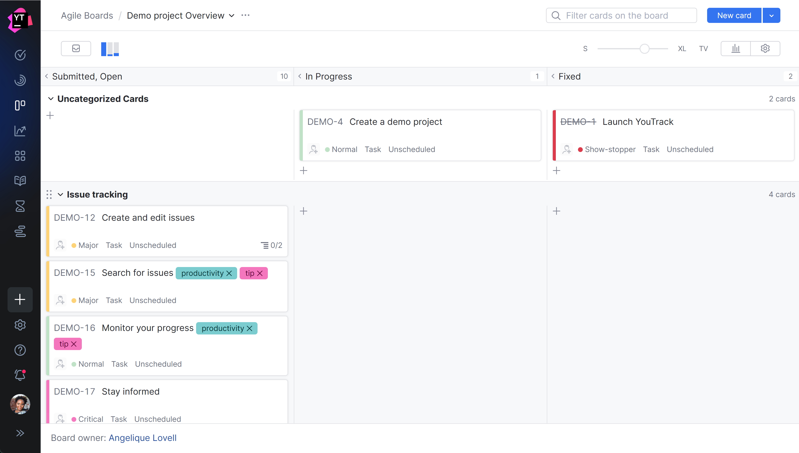

Kanban board with swimlanes by subsystem.

The kanban board has the following characteristics:

- The board has three columns for issues in an Open or Submitted state on the left, issues In Progress in the middle, and issues that are Fixed on the right. The goal is to work on each open issue one by one and mark them as Fixed when you have finished reviewing the task.
- The swimlanes are identified by values for the Subsystem field. This means that issues are grouped in predefined categories like Issue tracking, Project management, and Migration.

To learn more about agile boards in YouTrack, see [Agile Boards](https://www.jetbrains.com/help/youtrack/cloud/agile-board.html).

### Reports

Each demo project comes with three preconfigured reports. These are accessible from the Reports menu in the main navigation menu. These reports show you how to present and analyze issue data in your project.

#### The Issues per Subsystem Report

The first report shows you how many issues are assigned to each of the subsystems that are used in the demo project. This type of report helps teams decide which aspects of a particular project require the most attention at any given time.

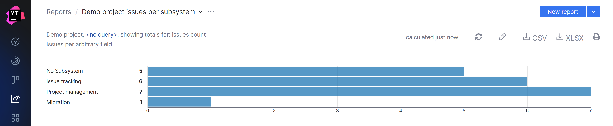

Issues per subsystem report for a demo project.

To learn more about this type of report, see [Issues per Arbitrary Field](https://www.jetbrains.com/help/youtrack/cloud/issues-per-arbitrary-field.html).

#### The Time Report

The second report shows how much time has been spent working on various issues in the demo project. This information is based on the amount of spent time that has been added to issues as work items.

This type of report is particularly helpful to teams that estimate the amount of time required to complete various tasks.

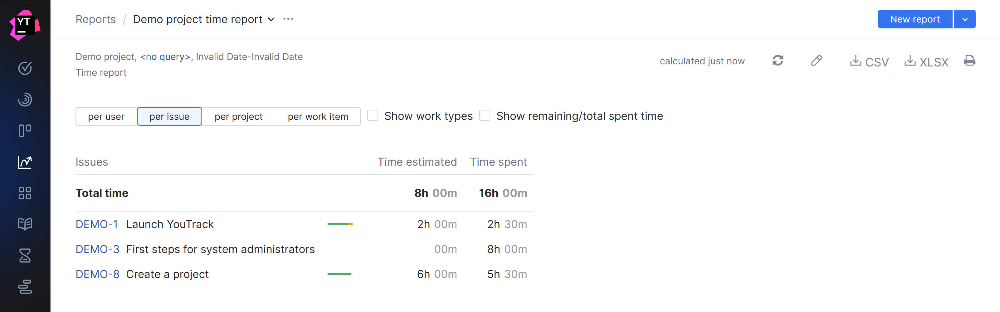

Time report for a demo project.

To learn more about this type of report, see [Time Report](https://www.jetbrains.com/help/youtrack/cloud/time-report.html).

#### The Timesheet Report

The last report shows the same information that is presented in the Time report, but from a different perspective. On the Timesheet report, the amount of time spent working on issues in the demo project is plotted on a timeline.

Dieser Berichtstyp hilft Ihnen, Aktivitäten über einen bestimmten Zeitraum hinweg zu verfolgen. Häufig werden diese Informationen genutzt, um Rechnungen zu erstellen und die historische Ressourcenzuweisung in einem Projekt nachzuvollziehen.

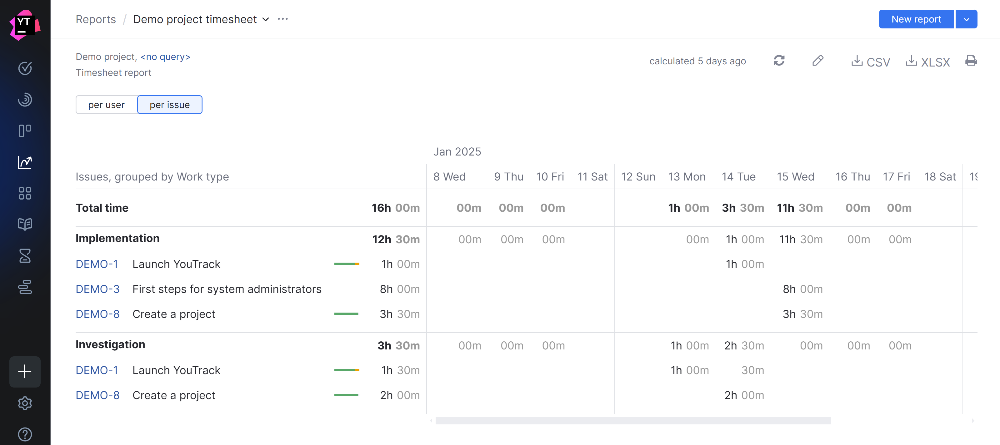

Timesheet report for a demo project.

Um mehr über diese Art von Bericht zu erfahren, siehe [Stundenzettelbericht](https://www.jetbrains.com/help/youtrack/cloud/timesheet-report.html).

Dies ist nur eine kleine Auswahl der verschiedenen Berichtstypen, die Sie in YouTrack erstellen können. Eine vollständige Liste finden Sie unter [Berichte](https://www.jetbrains.com/help/youtrack/cloud/youtrack-reports.html).

### Projekte

Wenn Sie im Anwendungskopf auf den Link „Projekte“ klicken, zeigt YouTrack eine Liste der im System erstellten Projekte an. Ihr Demoprojekt wird zusammen mit anderen bevorzugten Projekten auf der Seite angezeigt.

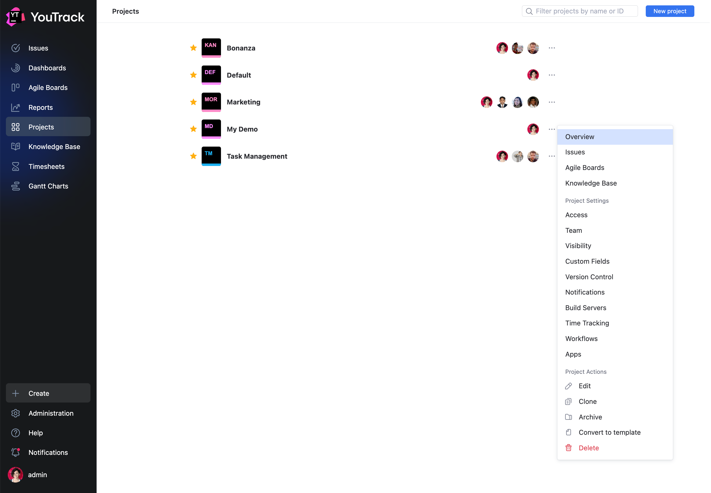

Menu options for a demo project in the Projects list.

Über das Symbol „Weitere Optionen“ Ihres Demoprojekts können Sie zu den zugehörigen Problemen und Artikeln navigieren. Weitere Links ermöglichen Ihnen den direkten Zugriff auf verschiedene Projekteinstellungen.

## Was tun, wenn die Demo abgeschlossen ist?

Sobald Sie alle Probleme in Ihrem Demoprojekt behoben haben, sollten Sie mit den wichtigsten Funktionen von YouTrack vertraut sein. Das bedeutet wahrscheinlich auch, dass Sie das Demoprojekt nicht mehr benötigen.

Das heißt nicht, dass Sie es sofort löschen müssen. Hier sind ein paar Möglichkeiten, wie Sie das Demoprojekt noch länger nutzen können:

- Nutzen Sie es als Testumgebung – YouTrack ermöglicht Ihnen unzählige Anpassungsmöglichkeiten für Ihre Projekte. Sie können das Demoprojekt behalten und damit Workflows testen, Integrationen prüfen und verschiedene Zugriffsprofile überprüfen.
- Verwalten Sie ein echtes Projekt – das Dashboard, die agilen Boards und die Berichte, die beim Erstellen des Demoprojekts generiert werden, sind genauso eingerichtet wie für ein typisches Projektteam. Sie können weitere Benutzer zum Projektteam hinzufügen und das Demoprojekt nutzen, um neue Aktivitäten zu verfolgen. Falls die Beispielprobleme Sie oder Ihr Team stören, können Sie sie einfach löschen.
- Behalten Sie Ihre persönlichen Aufgaben im Blick – viele der beim Erstellen der Demo generierten Komponenten helfen Ihnen bei der Verwaltung Ihrer persönlichen To-do-Liste. Sie können weiterhin Aufgaben erfassen und verfolgen, die mit Ihrer beruflichen Weiterentwicklung oder anderen Projekten zusammenhängen, an denen keine anderen Mitglieder Ihres Projektteams beteiligt sind. Dashboard, Agile Boards und Berichte stehen Ihnen weiterhin zur Verfügung, ohne dass Sie diese neu erstellen müssen.

Wenn Ihnen keine der Optionen zusagt und Sie Ihre YouTrack-Installation übersichtlich halten möchten, können Sie das Demoprojekt jederzeit löschen. Beim Löschen des Demoprojekts:

- Alle zum Projekt gehörenden Probleme werden ebenfalls gelöscht.
- Das Dashboard, die agilen Boards und die Berichte, die bei der Erstellung des Projekts generiert wurden, werden aus dem System gelöscht.

Mehr Informationen zum Löschen eines Projekts in YouTrack finden Sie unter [Projekt löschen](https://www.jetbrains.com/help/youtrack/cloud/remove-project.html).

Thanks for your feedback!

War diese Seite hilfreich?