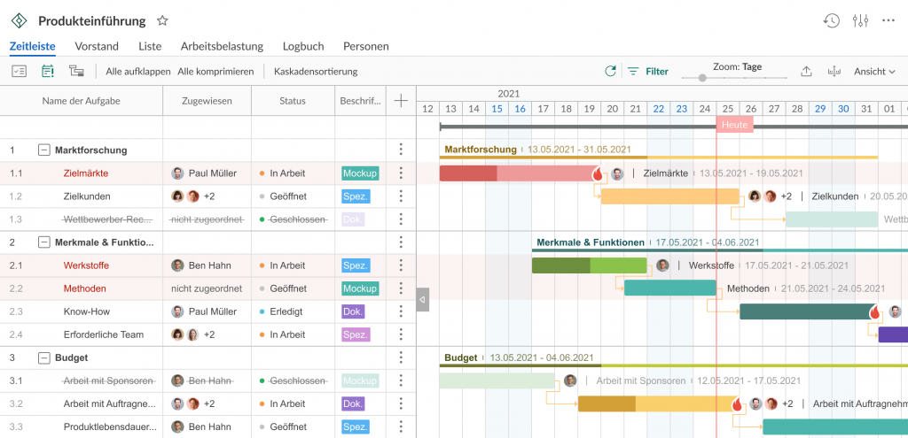

- Ein Gantt-Diagramm ist ein Balkendiagramm mit zwei Achsen
    - einer vertikalen für die **Aufgaben** und
    - einer horizontalen für **zeiliche Einordnung**
- Das Gantt-Diagramm kann
    - die Start- und Enddaten von
        - Aufgaben,
        - Meilensteine,
        - Abhängigkeiten zwischen Aufgaben und
        - zugewiesene Personen enthalten.

- hilft den Fortschritt eines Projektes
    - zu verfolgen und
    - alle Termine richtig zu definieren.

## Ursprünge des Gantt-Diagramms

- Zu Beginn des 20. Jahrhunderts revolutionierte Henry Gantt
    - mit seinen Gantt-Diagrammen das Projektmanagement.
- Damals waren sie noch auf Papier geschrieben.
- Als in den 1980er Jahren der Computer Einzug hielt,
    - wurden Gantt-Diagramme immer komplexer und umfangreicher.
- Heute gehören sie noch immer zu den
    - am **häufigsten** eingesetzten Projektmanagementtools.

### **Wofür wird ein Gantt-Diagramm verwendet?**

- Das Ziel eines Gantt-Charts ist eine Terminplanung.
    
- Es ermöglicht einen Zeitplan für jede Phase des Projektes
    
    - mit klar definierten Start- und Enddaten zu erstellen.
- Einen Zusatznutzen bringen Meilensteine bei einem Gantt-Chart.
    
    - Das sind wichtige Ereignisse ohne Dauer.
- Unter Verwendung einer Projektmanagement-Software können Gantt-Diagrammen für folgenden Aufgaben verwendet werden:
    
    - Aufgabenplanung.
    - Auszeichnen von Meilensteinen.
    - Terminverfolgung.
    - Fortschrittsverfolgung.
    - Teamarbeit.
    - Ressourcenmanagement.
    - Budgetkontrolle.
- Dazu enthälit ein typisches Gantt-Diagramm Informationen über:
    
    - Aufgaben, deren Dauer, Status und Priorität.
    - Start- und Enddaten.
    - Fortschritt.
    - Zeitplan.
    - Meilensteine.
    - Abhängigkeiten zwischen Aufgaben.
    - Termine.
    - Kritischer Pfad.
- Ein robustes Projektmanagement-Tool mit Gantt-Diagramm,
    
    - das die meisten Anforderungen abdecken kann, umfasst außerdem:
    - Beauftragte.
    - Berechnungen.
    - Arbeitsbelastung von Ressourcen:
        - wer an welchen Aufgaben arbeitet,
        - wer überlastet ist und
        - wer mehr Aufgaben bekommen könnte.
    - Kosten.
    - Benutzerdefinierte Spalten bei der Planung.
    - Kommentare, Anhänge, Benachrichtigungen für Teamarbeit.
    - Basispläne.
    - Vorlagen.
    - Automatische Planung.

## Die Vorteile der Arbeit mit Gantt-Diagrammen

- Es gibt zwei Hauptgründe dafür, dass sich Gantt-Diagramme
    
    - in der Projektmanagementwelt einer hohen Beliebtheit erfreuen.
        - Sie erleichtern die Erstellung komplizierter Pläne,
            - insbesondere wenn mehrere Teams und
            - sich ändernde Fristen involviert sind.
        - Gantt-Diagramme helfen Teams, ihre Arbeit
            - an Terminen auszurichten und
            - Ressourcen sinnvoll zu verteilen.
- Projektplaner verwenden Gantt-Diagramme,
    
    - um den Überblick über Projekte zu behalten.
- Unter anderem wird in den Diagrammen die Beziehung
    
    - zwischen dem Start- und Enddatum von
        - Tasks,
        - Meilensteinen und
        - abhängigen Tasks dargestellt.
- Moderne Programme wie Jira Software,
    
    - die mit Roadmaps und Advanced Roadmaps Gantt-Diagramme bereitstellen,
        - synthetisieren Informationen und
        - veranschaulichen, wie sich Entscheidungen auf die Fristen auswirken.

## Gantt-Diagramme im Wasserfall- und Agile-Modell

- Gantt-Diagramme können sowohl
    - für Wasserfall- als auch
    - für Agile-Methoden ein leistungsstarkes Tool sein.

### Wasserfall

- Beim Wasserfallmodell der Projektplanung wird ein linearer Ansatz verfolgt,
    
    - bei dem die Anforderungen der Stakeholder und
    - Kunden zu Beginn des Projekts gesammelt werden.
- Daraus erstellen Projektmanager einen
    
    - sequenziellen Projektplan mit Meilensteinen und Fristen.
- Jeder Abschnitt des Projekts stützt sich auf die Erledigung vorangehender Tasks.
    
- Diese Vorgehensweise wird von Teams bevorzugt,
    
    - die sich auf Prozesse
        - (z. B. im Bauwesen oder in der Fertigung) und
    - weniger auf Ideenbildung oder Problemlösung konzentrieren,
        - da die Schritte im Voraus geplant werden müssen.
- Gantt-Diagramme werden normalerweise bevorzugt von Projektmanagern eingesetzt,
    
    - die das Wasserfallmodell verwenden.
- Zur Bestimmung eines Projektzeitplans werden die Projekte
    
    - in übersichtliche Arbeitseinheiten unterteilt,
    - denen anschließend Start- und Enddaten zugewiesen werden.
- Außerdem lassen sich wichtige Meilensteine in einem Projekt
    
    - mit Gantt-Diagrammen leichter ermitteln.
- Meilensteine sind Ergebnisse, die ein Team
    
    - spätestens bis zum festgelegten Termin erreicht haben sollte.
- Sie sind optional, aber dringend zu empfehlen.
    

### Agile

- Beim Agile-Modell der Projektplanung stehen dagegen Flexibilität und Anpassungsfähigkeit im Vordergrund.
    
- Anstatt eine vollständige Zeitleiste mit festen Terminen zu erstellen, teilen agile Teams Projekte in kleinere Iterationen auf (auch bekannt als Sprints).
    
- Zu Beginn eines Sprints richtet ein Team seine Arbeit anhand der Projektziele über die nächsten zwei Wochen aus.
    
- Wenn dieser Sprint vorbei ist, fließen die Ergebnisse und Entwicklungen in die Erstellung des Plans für den nächsten Sprint ein.
    
- In einem Gantt-Diagramm kann veranschaulicht werden,
    
    - wie sich die Änderung einer Task auf den Plan oder die Produkt-Roadmap auswirken kann.
- Für agile Teams ist dies unerlässlich,
    
    - da das Feedback der Stakeholder
        - einen großen Teil der Methodik ausmacht.