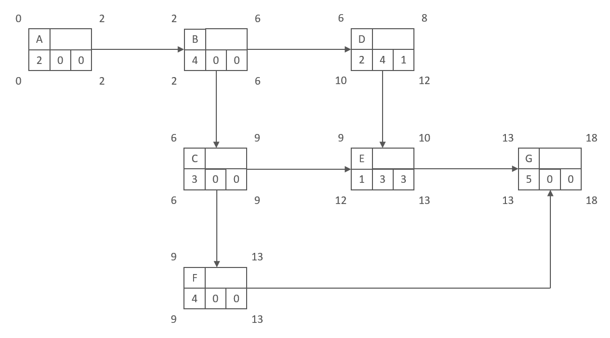
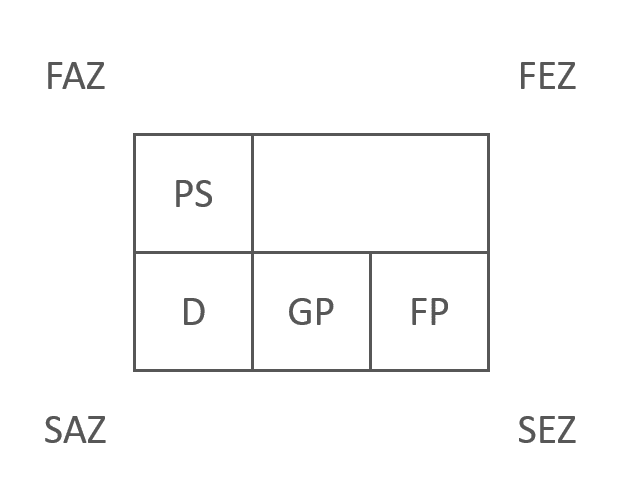
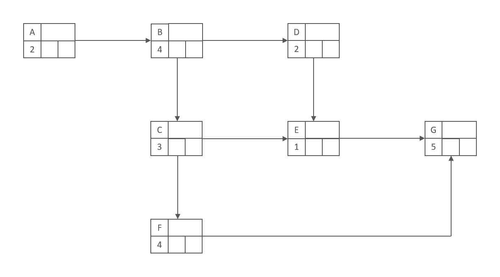
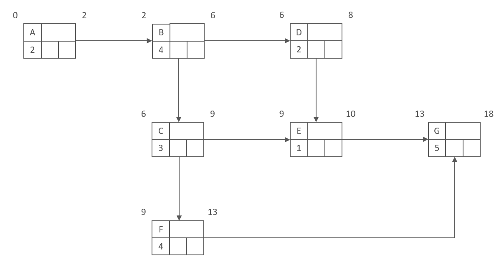
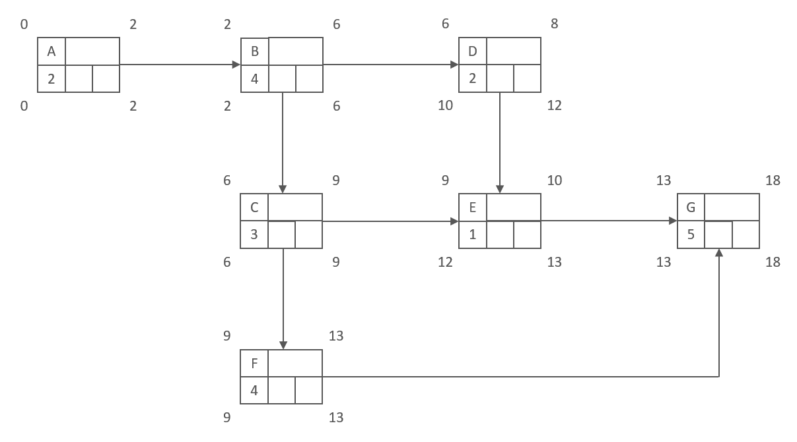
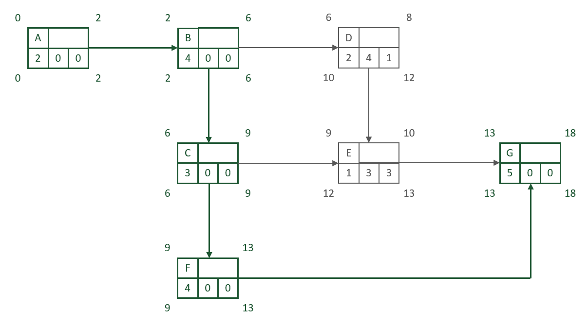

- Im Bereich der Ablauforganisation ist der Netzplan eines der präzisesten,
    
    - aber auch aufwändigsten Instrumente,
    - um betriebliche Prozesse abzubilden.
- In neutraler Form,
    
    - also mit durchnummerierten Teilschritten A bis G,
    - könnte ein Netzplan beispielsweise so aussehen:

[Open: 7c9ebf8c52533cb3540eab8a3a0c5343_MD5.png](_resources/e71f7c4ed7dd9b9ff2477333ecbeec0a_MD5.jpg)

- Im Netzplan werden verschiedenste Faktoren eines Prozesses berücksichtigt und abgebildet:
    
    - **Abhängigkeiten zwischen den Teilschritten**
        - Welcher Schritt oder welche Schritte müssen abgeschlossen sein,
            - damit die nächste Etappe beginnen kann?
    - **Dauer der jeweiligen Aufgaben**
        - Wie viel Zeit muss für die jeweiligen Teilschritte
            - eingeplant werden?
    - **Pufferzeiten**
        - An welchen Stellen darf es (nicht) zu Verzögerungen kommen,
        - wenn ein vorher definierter Endtermin erreicht werden soll?
    - **Frühester und spätester Startpunkt einer Aufgabe**
        - Wann kann ein Schritt frühestens begonnen werden?
        - Wann darf er spätestens starten,
            - ohne dass die zeitliche Planung in Gefahr gerät?
    - **Frühester und spätester Endpunkt eine Aufgabe**
        - Wann ist ein Teilprozess frühestens abgeschlossen?
        - Wann muss er fertig sein,
            - damit der letzte Schritt nicht verspätet startet?
    - **Kritischer Pfad**
        - Hierbei werden alle Teilaufgaben hervorgehoben,
            - die aus zeitlicher Sicht besonders wichtig sind,
            - um den geplanten Fertigstellungstermin einzuhalten.
        - Sie verfügen über keinen Puffer,
            - sodass bereits kleine Verzögerungen den
                - finalen Termin in Gefahr bringen.
- Durch die Berücksichtigung all dieser Faktoren gehört der Netzplan
    
    - zu den genauesten Instrumenten in der Prozessorganisation.

## Vor- und Nachteile der Netzplantechnik

- Die zentrale Stärke des Netzplans ist **seine Ausführlichkeit**,
    
    - denn er bildet einen Prozess mit all seinen Details ab.
- Besonders die **Analyse des kritischen Pfads**
    
    - macht das Verfahren so wertvoll.
- Dadurch schafft die Netzplantechnik eine
    
    - solide **Basis für die Festlegung von Terminen und Deadlines**.
- Allerdings ist die Erstellung und ggf. Korrektur eines Netzplans mit
    
    - **relativ hohem Aufwand** verbunden.
- Verzögerungen oder sonstige Änderungen,
    
    - die sich im Verlauf der praktischen Umsetzung ergeben,
    - bringen viel Arbeit mit sich,
        - um den Netzplan an die 
        - neue Situation anzupassen.

## Beispiel

- Die Basis für den Netzplan ist ein Prozess,
    - der aus insgesamt sieben Teilschritten besteht.
- Zu jedem Schritt sind sowohl die Dauer
    - als auch die vorher abzuschließenden Aufgaben bekannt:

| Prozessschritt | Dauer in Stunden | Vorher zu beenden |
| -------------- | ---------------- | ----------------- |
| A              | 2                | -                 |
| B              | 4                | A                 |
| C              | 3                | B                 |
| D              | 2                | B                 |
| E              | 1                | C, D              |
| F              | 4                | C                 |
| G              | 5                | E, F              |

- Diese Schritte werden in Form
    
    - von sogenannten Knoten dargestellt und
    - miteinander verbunden.
- Dabei weist ein Knoten folgende Struktur auf:  
    [Open: e21765aaf184938be376015d0e849dce_MD5.png](_resources/a98ec70440ec2323fd482c6566846358_MD5.jpg)
  
    Die Abkürzungen stehen dabei für folgende Werte:
    
- **PS**
    
    - Prozessschritt
- **D**
    
    - Dauer des jeweiligen Vorgangs
- **FAZ**
    
    - Frühester Anfangszeitpunkt,
    - zu dem der Prozessschritt begonnen werden kann
- **FEZ**
    
    - Frühester Endzeitpunkt,
    - zu dem der Prozessschritt abgeschlossen werden kann
- **SAZ**
    
    - Spätester Anfangszeitpunkt,
    - um den Gesamtprozess planmäßig beenden zu können
- **SEZ**
    
    - Spätester Endzeitpunkt,
    - zu dem ein Schritt abgeschlossen sein muss,
    - um den geplanten Abschlusstermin nicht zu gefährden
- **GP**
    
    - Gesamtpuffer, der genutzt werden kann,
    - bevor der pünktliche Abschluss des Gesamtprozesses gefährdet wird
- **FP**
    
    - Freier Puffer, der zur Verfügung steht,
    - bevor der unmittelbar folgende Prozessschritt beeinflusst wird
- In **das leere Feld oben rechts**
    
    - kann bei Bedarf eine genauere Bezeichnung
    - des Prozesses eingetragen werden.
- Diese Felder werden im Laufe des Erstellungsprozesses eines Netzplans
    
    - schrittweise ausgefüllt.

### Schritt 1: Knoten verknüpfen

- Vorläufigen Netzplan erstellen,  
    - in dem einerseits die Prozessschritte und  
    - ihre Abhängigkeiten abgebildet sind und  
    - andererseits die jeweilige Dauer der Knoten.  
    [Open: 95e6aa3f7b995bb660dc63c26da0c486_MD5.png](_resources/40a6972a22ab2f098b966a8843641fa4_MD5.jpg)

- Die Pfeile ergeben sich aus der letzten Spalte
    - der Tabelle in der Aufgabenstellung.,
- durch Prüfung,
    - welche Schritte vorher abgeschlossen werden müssen,
    - bevor die nächste Aufgabe begonnen werden kann.
- Dazu werden entsprechende Verlaufspfeile eingezeichnen.

### Schritt 2: Vorwärtsterminierung

- Bei der sogenannten Vorwärtsterminierung werden alle Pfade
    
    - vom Anfang bis zum Ende durchlaufen.
- Dabei wird jeweils
    
    - der frühesten Anfangszeitpunkt (FAZ, oben links) und
    - der frühesten Endzeitpunkt (FEZ, oben rechts)
- für jeden Prozessschritt in das Schema eingetragen.
    
- Um die jeweiligen Zeitpunkte zu berechnen, muss folgendes beachten werden:  
    - Der FAZ des ersten Prozessschrittes (A) ist immer gleich 0.  
    - Der FEZ eines Vorgangs ergibt sich immer  
    - aus der Summe von FAZ und Dauer.  
    - Der FEZ eines Vorgangs ist gleichzeitig  
    - der FAZ des nachfolgenden Prozessschrittes bzw.  
    - der nachfolgenden Prozessschritte.  
    - Hat ein Knoten mehrere Vorgänger  
    - wird derjenige Vorgänger-FEZ genommen,  
    - der den höchsten Wert aufweist.  
    [Open: ec1a171583b02d5607406bcdcb45cc16_MD5.png](_resources/5c07d58dc79adf6069484137f2697bcb_MD5.jpg)

    

### Schritt 3: Rückwärtsterminierung

- Anschließend werden die Pfade nochmal rückwärts durchlaufen,
    - um jeweils den spätesten Anfangszeitpunkt (SAZ, unten links) und den
    - spätesten Endzeitpunkt (SEZ, unten rechts) zu ergänzen.
- Folgende Regeln gelten dabei:
    - Der SEZ des letzten Prozessschrittes,
        - entspricht immer seinem FEZ.
            - Er ist der Ausgangspunkt für die Rückwärtsterminierung.
    - Der SAZ ergibt sich immer aus der Differenz von SEZ und
        - Dauer des Vorgangs.
    - Der SAZ zeigt an,
        - wann ein Prozessschritt spätestens begonnen werden muss.
    - Der SAZ eines Schrittes ist identisch zum
        - SEZ des vorherigen Schrittes.
    - Hat ein Prozessschritt mehrere Nachfolger,
        - wird als SEZ der jeweils kleinste Wert der
            - möglichen SAZ übernommen.

> **Kleiner Tipp zur Kontrolle**:  
> Wenn die Rückwärtsterminierung korrekt verlaufen ist,  
> dann muss der erste Prozessschritt sowohl für den FAZ als auch den SAZ  
> einen Wert von 0 aufweisen.

[Open: bf968664a6e0aaa65e1b0b22dd5ee589_MD5.png](_resources/f322965d7c712fc9b6c603f22ebbe42c_MD5.jpg)

### Schritt 4: Pufferzeiten berechnen

- Für jeden Teilschritt ist jetzt der jeweiligen Puffer zu berechnen:  
    - Für den Gesamtpuffer GP ermittelt sich aus der  
    - Differenz aus SAZ und FAZ.  
    - Er zeigt an,  
    - wie viel Verzögerung akzeptabel ist,  
    - bevor **der pünktliche Abschluss des Gesamtprozesses**  
    - gefährdet wird  
    - also der Zeitraum,  
    - um den ein Arbeitspaket im Netzplan verschoben werden darf,  
    - ohne dass das Projektende verschoben werden muss.  
    - Für den freien Puffer eines Prozessschritts (FP)  
    - muss jeweils die Differenz aus  
    - dem FAZ des nachfolgenden Schritts und  
    - dem eigenen FEZ beechnet werden.  
    - Sollte es mehrere Nachfolger geben, wird stets  
    - die kleinste Alternative der FAZ genommen.  
    - Hiermit wird abgebildet, wie viel Puffer vorhanden ist,  
    - bevor **ein unmittelbar folgender Prozessschritt beeinflusst**  
    - also der Zeitraum,  
    - um den ein Vorgang im Netzplan verschoben werden kann,  
    - ohne dass ein anderer Vorgang ebenfalls verschoben wird  
    [Open: 7c9ebf8c52533cb3540eab8a3a0c5343_MD5.png](_resources/e71f7c4ed7dd9b9ff2477333ecbeec0a_MD5.jpg)

### Schritt 5: Kritischen Pfad ermitteln

- Der kritischen Pfad des gesamten Prozesses ergibt sich aus:
    
    - allen Teilschritten,
        - in denen sich **keine** Verzögerung ergeben darf,
        - wenn der ursprüngliche Termin eingehalten werden soll.
- Dazu gehören alle Prozessschritte,
    
    - die weder einen freien Puffer
    - noch einen Gesamtpuffer aufweisen.

[Open: 0d50fff73a8a9b3a0b6da46f069dac36_MD5.png](_resources/37b74b46cb1841a3db1868cceb77abc2_MD5.jpg)

_kritischer Pfad A->B->C->F->G_

## Pufferzeiten und kritischer Pfad in einem Gantt-Diagramm dargestellt
<svg width="900" height="400" xmlns="http://www.w3.org/2000/svg">

  <!-- Horizontale Achse -->
  <line x1="50" y1="50" x2="770" y2="50" stroke="black" />

  <!-- Tag Labels -->
  <g font-size="12" text-anchor="middle">
    <text x="50" y="40">0</text>
    <text x="90" y="40">1</text>
    <text x="130" y="40">2</text>
    <text x="170" y="40">3</text>
    <text x="210" y="40">4</text>
    <text x="250" y="40">5</text>
    <text x="290" y="40">6</text>
    <text x="330" y="40">7</text>
    <text x="370" y="40">8</text>
    <text x="410" y="40">9</text>
    <text x="450" y="40">10</text>
    <text x="490" y="40">11</text>
    <text x="530" y="40">12</text>
    <text x="570" y="40">13</text>
    <text x="610" y="40">14</text>
    <text x="650" y="40">15</text>
    <text x="690" y="40">16</text>
    <text x="730" y="40">17</text>
    <text x="770" y="40">18</text>
  </g>

  <!-- Vertikale Linien bei Tag 6 und Tag 13 -->
  <line x1="290" y1="50" x2="290" y2="270" stroke="gray" stroke-dasharray="4" />
  <line x1="570" y1="50" x2="570" y2="270" stroke="gray" stroke-dasharray="4" />

  <!-- Aktivitäten -->
  <rect x="50" y="70" width="80" height="20" fill="skyblue" />
  <text x="90" y="85" text-anchor="middle" font-size="12">A</text>

  <rect x="130" y="100" width="160" height="20" fill="orange" />
  <text x="210" y="115" text-anchor="middle" font-size="12">B</text>

  <rect x="290" y="130" width="120" height="20" fill="lightgreen" />
  <text x="350" y="145" text-anchor="middle" font-size="12">C</text>

  <rect x="290" y="160" width="80" height="20" fill="pink" />
  <text x="330" y="175" text-anchor="middle" font-size="12">D</text>

  <rect x="410" y="190" width="40" height="20" fill="violet" />
  <text x="430" y="205" text-anchor="middle" font-size="12">E</text>

  <rect x="410" y="220" width="160" height="20" fill="yellow" />
  <text x="490" y="235" text-anchor="middle" font-size="12">F</text>

  <rect x="570" y="250" width="200" height="20" fill="lightcoral" />
  <text x="670" y="265" text-anchor="middle" font-size="12">G</text>

  <!-- Kritischer Pfad als echte S-Kurve -->
  <!-- A -> B -->
  <path d="M130 80 
           C150 70, 110 110, 130 110" 
           stroke="red" stroke-width="2" fill="none" />
  <!-- B -> C -->
  <path d="M290 110 
           C310 100, 270 140, 290 140" 
           stroke="red" stroke-width="2" fill="none" />
  <!-- C -> F -->
  <path d="M410 140 
           C430 130, 390 230, 410 230" 
           stroke="red" stroke-width="2" fill="none" />
  <!-- F -> G -->
  <path d="M570 230 
           C590 220, 550 260, 570 260" 
           stroke="red" stroke-width="2" fill="none" />

</svg>
