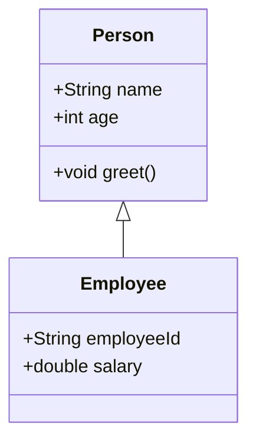

Um UML-Diagramme in Obsidian einzubetten, kannst du **Mermaid** verwenden, da es direkt in Markdown-Dateien unterstützt wird. Mermaid ist eine leichtgewichtige Sprache, die für die Erstellung von Diagrammen geeignet ist und einfach in Markdown eingebettet werden kann.

Hier sind einige Beispiele für UML 2.5-Diagramme, die du in Obsidian verwenden kannst:

---

### 1. **Klassendiagramm**




---

### 2. **Anwendungsfalldiagramm**

```mermaid
usecaseDiagram
    actor User
    actor Admin

    User --> (Login)
    User --> (Browse Content)
    Admin --> (Manage Users)
    Admin --> (Generate Reports)
```
