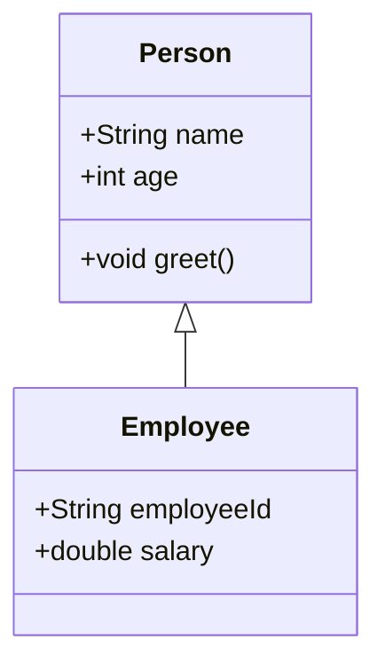
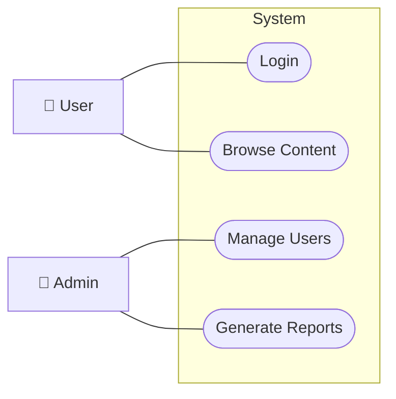

Um UML-Diagramme in Obsidian einzubetten, kannst du **Mermaid** verwenden, da es direkt in Markdown-Dateien unterstützt wird. Mermaid ist eine leichtgewichtige Sprache, die für die Erstellung von Diagrammen geeignet ist und einfach in Markdown eingebettet werden kann.

Hier sind einige Beispiele für UML 2.5-Diagramme, die du in Obsidian verwenden kannst:

---

### 1. **Klassendiagramm**

---

### 2. **Anwendungsfalldiagramm**

> [!note] Kein eigener Diagrammtyp in Mermaid
> Mermaid kennt keine Anwendungsfalldiagramme (`usecaseDiagram` ist PlantUML-Syntax). Das Beispiel ist deshalb als Flowchart nachgebaut: Akteure außerhalb, Anwendungsfälle als abgerundete Knoten innerhalb der Systemgrenze, Assoziationen als Linien ohne Pfeilspitze.

