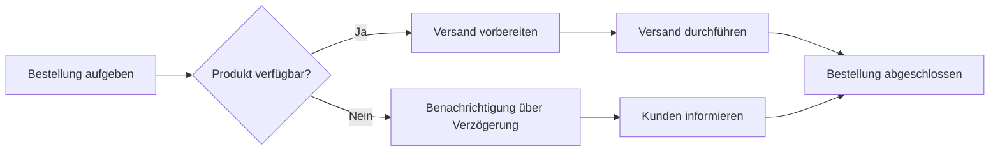

![[Pasted image 20250116094652.png]]

Hier ist ein aussagekräftiges UML-Aktivitätsdiagramm, das einen komplexen Prozessablauf darstellt. Lass mich wissen, ob es weitere Anpassungen geben soll!

```mermaid
graph LR
    A[Bestellung aufgeben] --> B{Produkt verfügbar?}
    B -- Ja --> C[Versand vorbereiten]
    B -- Nein --> D[Benachrichtigung über Verzögerung]
    C --> E[Versand durchführen]
    D --> F[Kunden informieren]
    E --> G[Bestellung abgeschlossen]
    F --> G
```
