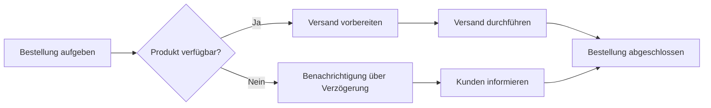

> [!missing] Bild nicht im Vault
> Die ursprüngliche Bilddatei `Pasted image 20250116094652.png` fehlt. Das Diagramm steht unten als Mermaid-Block und wird von Obsidian gerendert.

Hier ist ein aussagekräftiges UML-Aktivitätsdiagramm, das einen komplexen Prozessablauf darstellt. Lass mich wissen, ob es weitere Anpassungen geben soll!

