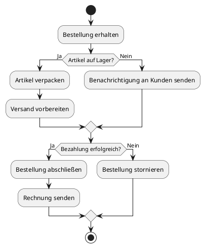

Hier ist ein Beispiel für ein UML-Aktivitätsdiagramm in PlantUML-Syntax, das einen einfachen Bestellprozess darstellt:

Du kannst dieses Diagramm in einem PlantUML-Editor oder einer kompatiblen Anwendung rendern, um es visuell darzustellen. Lass mich wissen, falls du weitere Anpassungen oder ein komplexeres Diagramm benötigst!