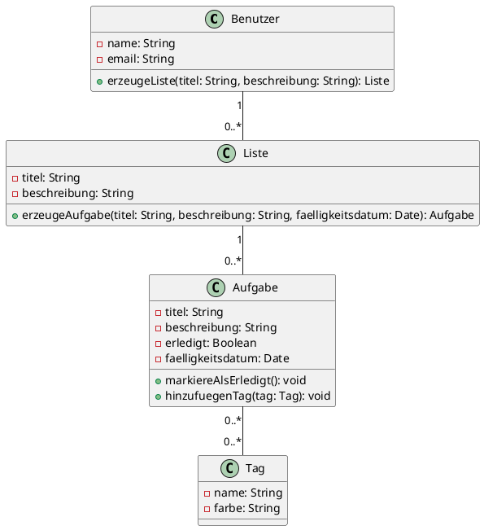

Erstellen Sie ein UML-Klassendiagramm für eine einfache TODO-App. 
Die App soll folgende Anforderungen erfüllen:

1. **Benutzer**:
    - Ein Benutzer kann mehrere Listen erstellen.
    - Jeder Benutzer hat einen Namen und eine E-Mail-Adresse.
2. **TODO-Liste**:
    - Eine Liste hat einen Titel und eine Beschreibung.
    - Eine Liste gehört genau einem Benutzer.
3. **Aufgabe (Task)**:
    - Eine Aufgabe gehört zu genau einer Liste.
    - Eine Aufgabe hat einen Titel, eine Beschreibung, ein Erledigt-Flag (`done`) und ein Fälligkeitsdatum.
    - Eine Aufgabe kann mehrere Tags besitzen.
4. **Tag**:
    - Ein Tag hat einen Namen und eine Farbe.
    - Ein Tag kann mehreren Aufgaben zugeordnet sein.

Zeichen Sie das Klassendiagramm mit den entsprechenden Beziehungen, Attributen und Methoden. Stelle sicher, dass die Kardinalitäten korrekt sind.

---

## Hinweise
- Verwenden Sie Assoziationen, um Beziehungen wie "Ein Benutzer hat mehrere Listen" oder "Eine Aufgabe hat mehrere Tags" darzustellen.
- Fügen Sie Kardinalitäten zu den Assoziationen hinzu:
    - `1..*` für mindestens eine Instanz.
    - `0..*` für keine oder mehrere Instanzen.
- Nutzen Sie Komposition (`Has-A`), wo Objekte abhängig voneinander existieren (z. B. Listen sind von Benutzern abhängig).
- Überlegen Sie sich sinnvolle Methoden für die Klassen.

---

## Lösung

