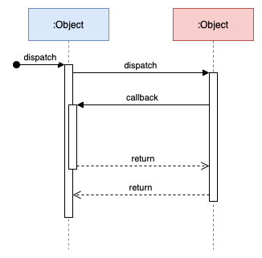
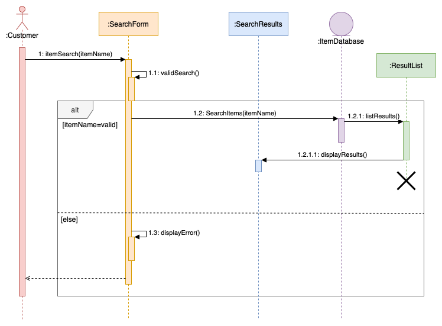
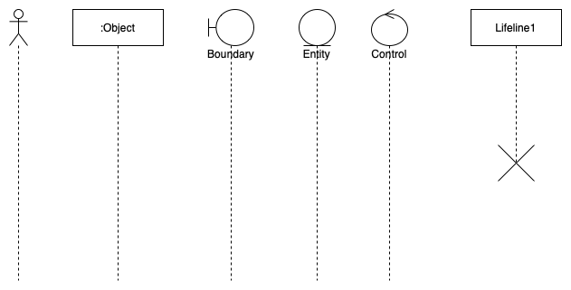
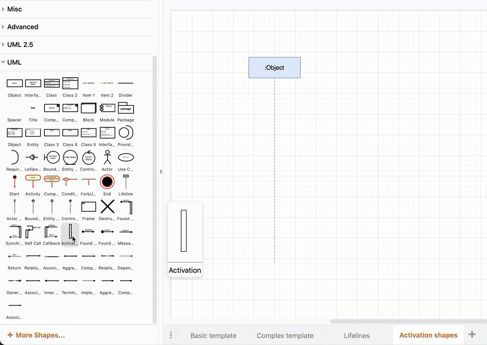
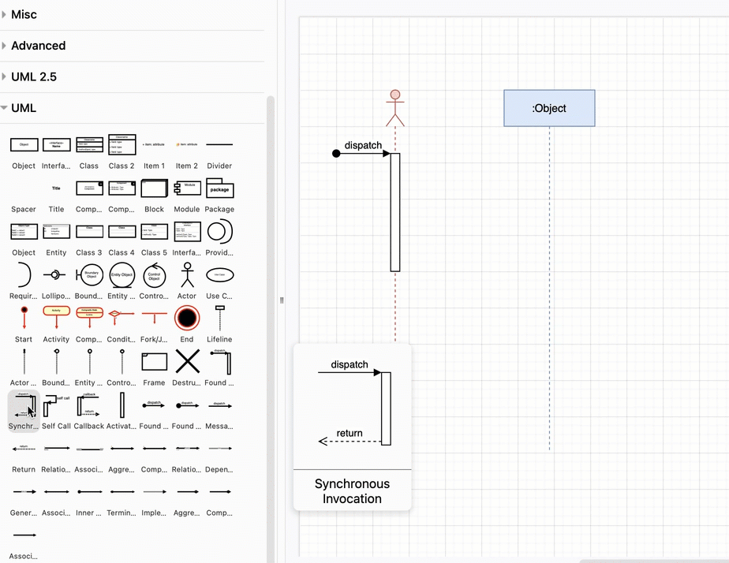
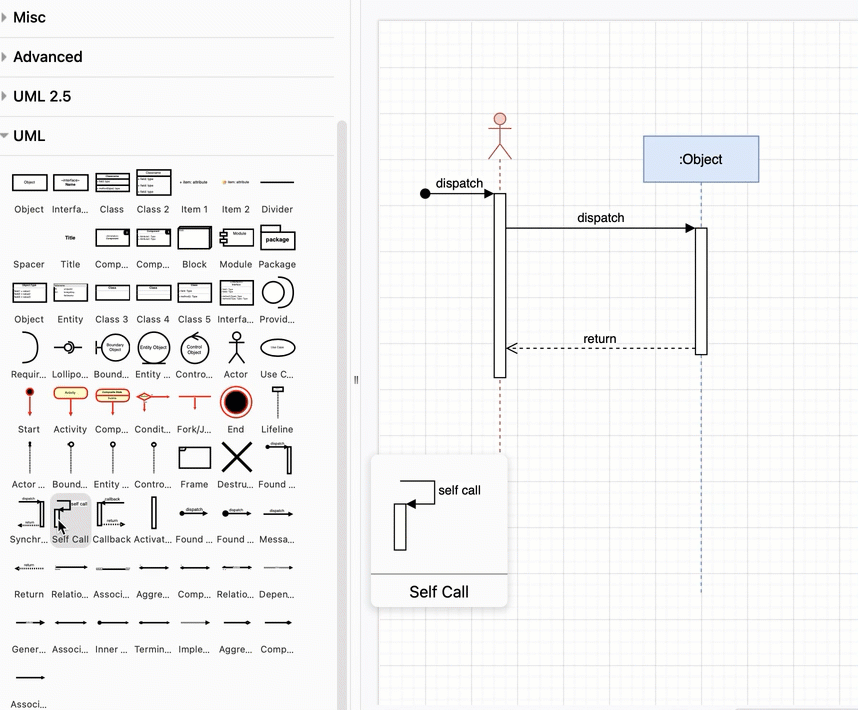
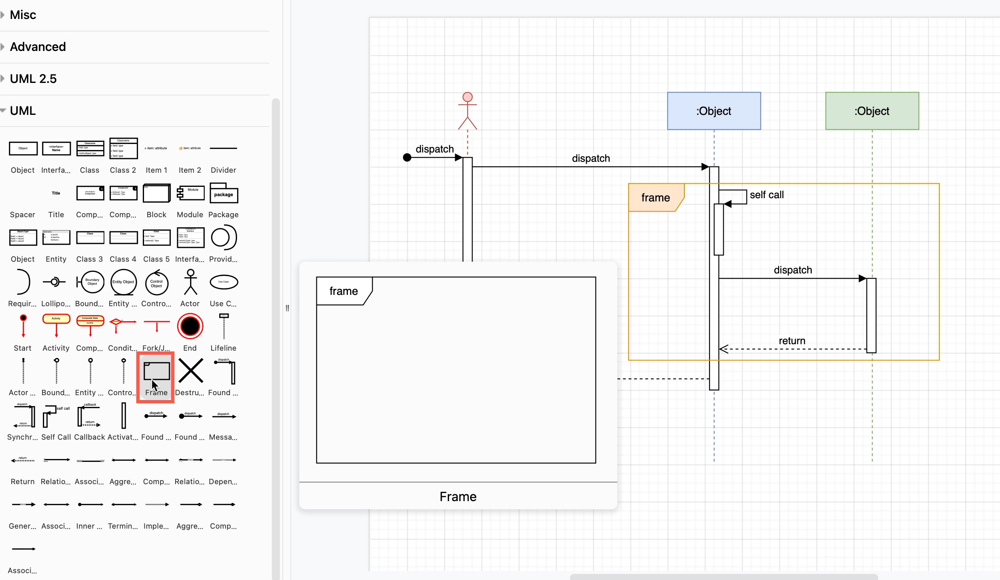
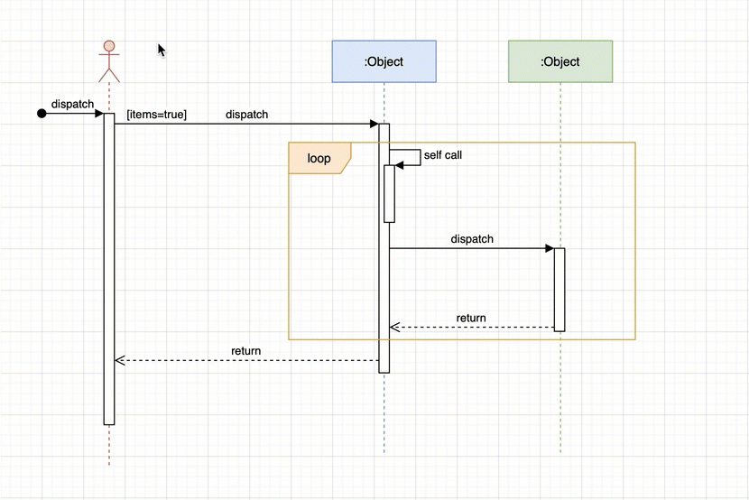
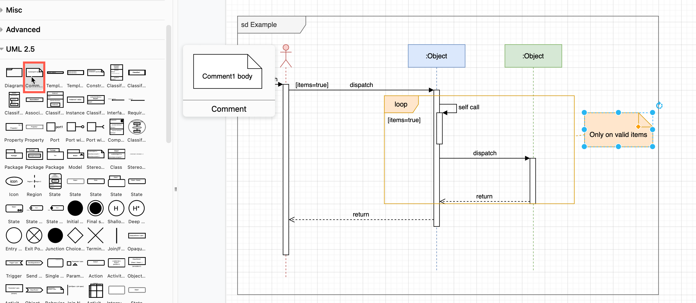

Sequence diagrams show the order of messages that are passed between elements of a system to complete a particular task or use case. The events that cross system boundaries are used by objects and people (actors) to complete their processes.  

Also known as system sequence diagrams, they are one of the main types of UML diagrams. They are used to plan the development or extension of a software product and complement [UML class diagrams](https://www.drawio.com/blog/uml-class-diagrams.html), showing which class data is passed between which elements.

Sequence diagrams extend [use-case diagrams](https://www.drawio.com/blog/uml-use-case-diagrams.html) - they model the series of events that a scenario or use-case must execute. They are are closer to the actual code as they show all cross-system messages. However, they are still programming language neutral, and thus above the level of actual code.

## How to read a UML sequence diagram

Read a sequence diagram from the top down. The further you progress down a sequence diagram, the more time has elapsed and the more events have occurred.

  

Each system/object instance and actor is placed on a _lifeline_ - a vertical dotted line - going across the top of the sequence diagram.

The _messages_ that pass between the lifelines are connectors - solid for an initial message or outgoing call, and dotted for a return value (optional).

When a system has to perform a process that takes some time to complete, use a vertical box on the lifeline (an _activation box_). The box ‘starts’ when it first receives a message, and ‘ends’ when all messages have been sent/received and the process has been completed.

If an object instance is _deleted_ before the overall sequence ends, its lifeline is terminated in an `X`.

If a call message _creates_ a new object instance, a new lifeline is added at that point.

Repetition or recursion - where part of a sequence or messages are repeated - is surrounded by a _frame_ shape, also known as a sequence fragment. If this is a complex sub-process, break it out into a separate diagram.

**Tip:** Place each of these sequence fragment diagrams on their own diagram page in the same diagram file. [Add a link to that diagram page](https://www.drawio.com/doc/faq/insert-text-link.html) on the originating frame shape.

[Learn more about working with multi-page diagrams in draw.io](https://www.drawio.com/blog/multiple-page-diagrams.html)

Frames can be used to show alternate sequences - ones that only execute if a certain condition is true. They are also used for parallel sequences or to indicate there is a critical single thread.

See the [section on frame labels below](https://www.drawio.com/blog/sequence-diagrams#frame-labels-for-sequence-fragments) for how to label and use the various types of sequence fragments.

## Drawing sequence diagrams in draw.io

There are several sequence diagram templates you can modify to start your sequence diagram faster.

The [UML 2.5](https://www.drawio.com/blog/uml-2-5.html) and UML shape libraries contain all the shapes you will need. Click _More Shapes_ at the bottom of the left panel, enable the UML and UML 2.5 libraries in the _Software_ section, and click _Apply_.

**Lifelines:** Drag the end of a lifeline to lengthen or shorten it. There are several types of lifelines in the UML shape library.  

Drop a _Destruction_ shape from the UML shape library on the end a lifeline to discontinue it, or use the _Destruction Occurrence Specification_ shape in the UML 2.5 shape library.

**Activation boxes:** Drop an _Activation_ shape over a lifeline when the outline is purple to attach it. The activation shape will stay in place on the lifeline if you move it on the drawing canvas.  

Drag the start or end of the activation shape to shorten or lengthen it. Drag it box up or down the lifeline to move it.

**Message connectors:** Use the _Found Message_ shape in the UML shape library to start a sequence.

The _Synchronous Invocation_ shape calls a new activation box on the right - drop this on an existing lifeline, and drop the ends of the messages to the originating activation box.

**Tip:** A green outline on a shape when you drop a connector represents a [fixed connection](https://www.drawio.com/doc/faq/connector-fixed-vs-floating.html), a blue outline means the message connector will ‘float’ if you move the activation box.  

The _Callback_ shape adds a new activation box to the left in a sequence - drop this on a lifeline, and drag/drop the messages on the originating activation box to the right.

Drop the _Self Call_ shape a little bit offset to the right on an existing activation box when the lifeline outline is purple. You can extend and move this self call shape just like an activation box, and the originating end of the message is attached to the underlying activation box.  

Alternatively drag a connector from one activation box and drop it on another, or use one of the _Found Message_, _Message_ or _Message Return_ shapes in the UML shape library..

**Frame shape:** Use the _Frame_ shape from the _UML_ shape library. For alternate paths or parallel sequences, drag a dotted or dashed line from the _General_ shape library and attach the ends as a fixed connector on the inside of the frame shape.  

**Conditions:** Double click on a blank section of the drawing canvas, and type the condition inside square brackets. Drag this text inside an existing frame shape to add it as a condition (guard). Group the frame and the condition so they can be moved together easily.  

Double click on a message connector to add a label - connectors can have multiple labels at different locations.

**Notes and comments:** Type additional information into a _Comment_ shape from the UML 2.5 shape library.  

Surrounding your sequence diagram in an overall frame shape (or the _Diagram_ shape in the UML 2.5 shape library) is optional.

## Labeling messages and roles in sequence diagrams

**Role names** for instances of objects/systems and actors are indicated with a colon. E.g. `: Customer`

**Conditions (guards)** on messages are indicated with square brackets either on the message, or in the frame shape. E.g. `[value > $1000]`

**Message numbers** can be used to clearly show the sequence of events. This works similar to release numbering, where each lifeline adds another point. Add the message number and a colon at the start of the message label. E.g. `1.3: searchByItem(itemName)`  
  
[_Open this sequence diagram in our diagram viewer_](https://app.diagrams.net/?lightbox=1&highlight=0000ff&edit=_blank&layers=1&nav=1&title=#Uhttps%3A%2F%2Fraw.githubusercontent.com%2Fjgraph%2Fdrawio-diagrams%2Fdev%2Fexamples%2Fsequence-diagram-examples.drawio)

### Frame labels for sequence fragments

The type of sequence fragment is written in the top left of the frame shape.

- **alt** - Alternative fragments, only one of which is true.
- **opt** - An optional fragment containing a single sequence which will only execute if a condition is true.
- **par** - A parallel fragment that executes multiple sequences at the same time.
- **loop** - A fragment that executes multiple times. The condition (guard) must be true for this sequence to continue looping.
- **region** - This fragment can only have one thread executing it once - it is a critical region.
- **neg** - A fragment that shows an invalid sequence.
- **sd** - a nested sequence diagram, fully drawn inside the containing frame shape on that diagram page.
- **ref** - A fragment that refers to a sub-sequence drawn in another diagram, [ideally linked to another diagram page](https://www.drawio.com/blog/multiple-page-diagrams.html). Set the _Lanecolor_ in the _Style_ tab for this frame shape to white to cover over the underlying sequence details and make this reference fragment stand out from other frame shapes.