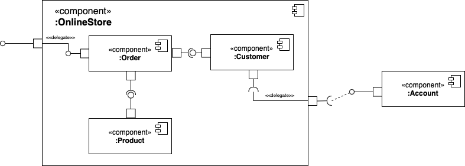
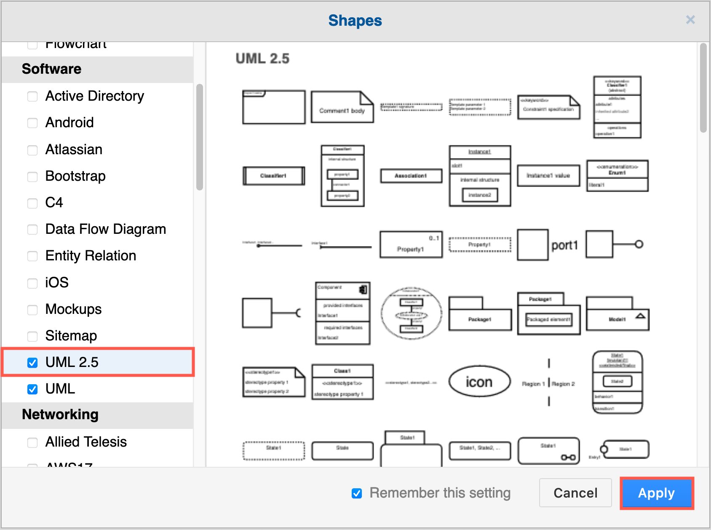
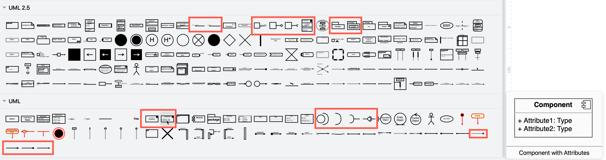
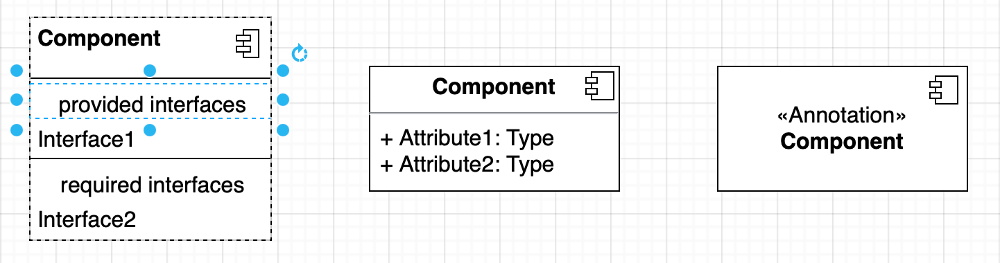
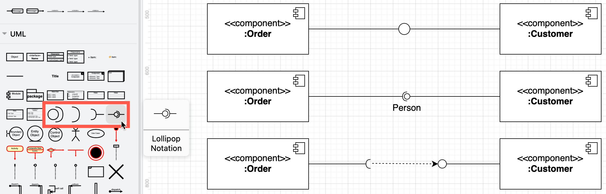
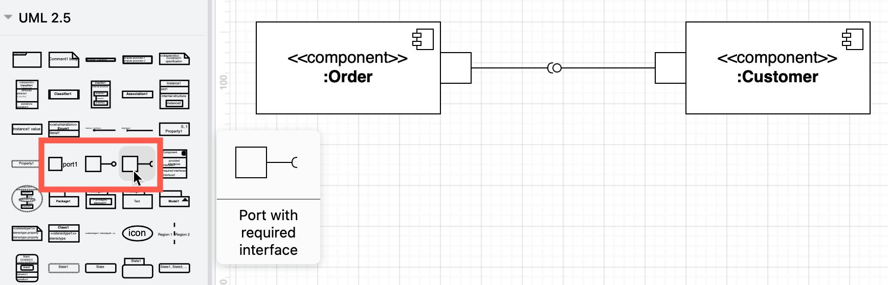
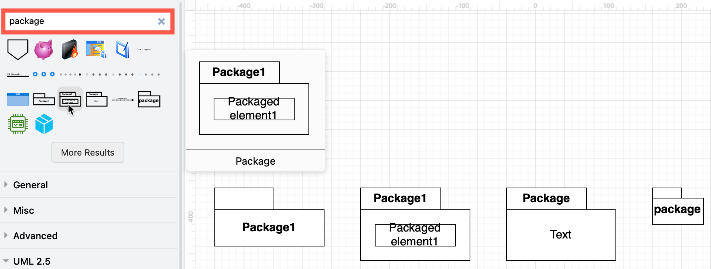
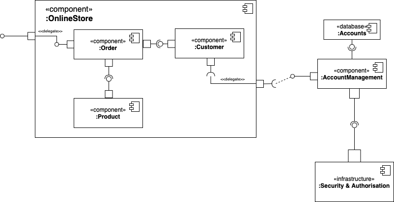
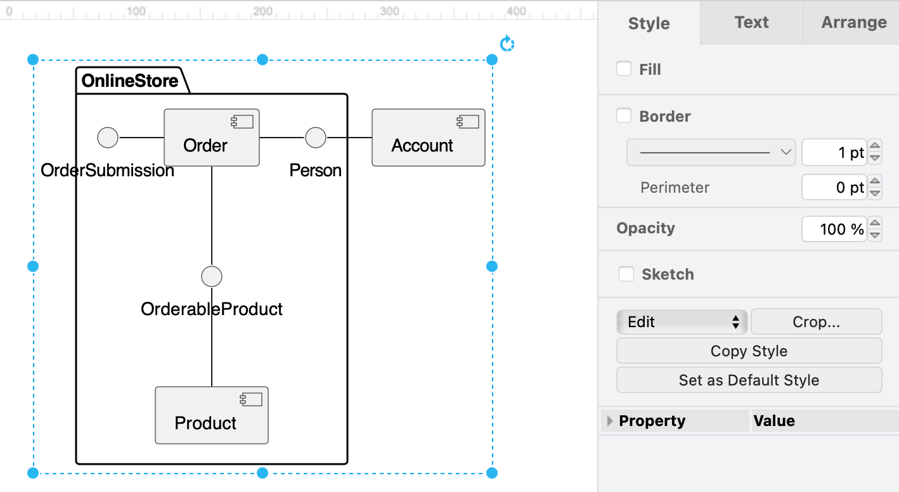
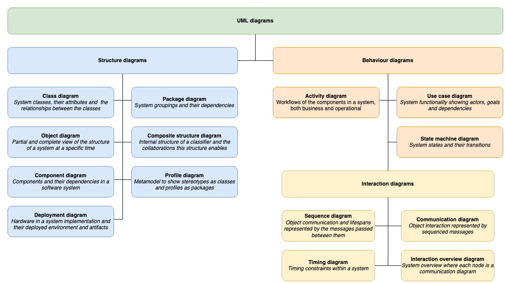

UML component diagrams are used to model the high-level software components and subsystems in service-oriented architectures and component-based development projects, and more importantly, define the interfaces between those components. As component diagrams provide a clear visual overview of a system, they are drawn early in a project as they are useful both to seek approval from stakeholders and to develop an implementation roadmap.  
[](https://viewer.diagrams.net/?lightbox=1&highlight=0000ff&edit=_blank&page=1&layers=1&nav=1&title=#Uhttps%3A%2F%2Fraw.githubusercontent.com%2Fjgraph%2Fdrawio-diagrams%2Fdev%2Fexamples%2Fuml-component-example.drawio)

They are related to [UML class diagrams](https://www.drawio.com/blog/uml-class-diagrams.html) in that they also provide implementation details to developers, in this case by defining the interfaces through which the various components interact.

After implementation, components can be treated as individual elements for for testing in continuous integration deployments.

Unlike class diagrams, the detail of the internal data structure or methods within the component itself are hidden, showing only the interfaces used to interact with that component. Decoupling the internal workings of a component from external parts of the system

Component diagrams encourage developers to design modular components that can be reused both within a complex system, and in other projects.

They can also highlight where third-party packages of components can be used to more efficiently implement a system, reducing the the time and cost of a project, especially where in-house expertise is lacking.

To draw a component diagram, enable the UML and UML 2.5 shape libraries in draw.io.

1. Click on _More Shapes_ at the bottom of the shape panel.
2. Enable the UML and UML 2.5 checkboxes in the _Software_ section and click _Apply_.  
    

Component diagram shapes are spread out through both shape libraries. Hover over any shape in the shape libraries to see a larger preview with its name.  


## How to draw a UML component diagram

UML component diagrams breaks down a system into levels of functionality, with each system, subsystem and related system modelled in a component shape. Each component in this type of diagram interacts with other components through specific ports and interfaces.

**Component**

Component shapes must have the `<<component>>` stereotype label and/or the component icon in the rectangular shape. A blank rectangle shape with out a component specifier is interpreted as a class element.

They can contain details of their internal components in an optional text section of the component shape, similar to UML class shapes.

draw.io provides three different component shapes containing the component icon in the top right, one of which has rows to quickly enter its provided and required interfaces.  


Components may contain subcomponents or subsystems - collections of tightly related components. These may use the `<<subsystem>>` stereotype in their label.

**Interface**

Interfaces may be drawn as a circle between components, or use a lollipop-and-socket construct to show which component _provides_ the interface, and which _depends_ on or _requires_ the interface.

- A **required interface** is drawn with a lollipop (circle at the end of a line).
    
- A **provided interface** is drawn with a socket (open arc at the end of a line).
    

An interface label may be used to describe its purpose and/or the data that is passed between components where it is unclear. You can separate the lollipop and the socket and draw a dependency relationship between them if it makes your diagram easier to read.  


**Tip:** To show an inherited interface in a specialised component, use a caret (`^`) before its name on the connector label.

**Port**

A square _port_ shape is added to the edge of a component to specify that the interface is not provided directly by the component itself, but by one of its internal encapsulated components. A port is like a tunnel to pass the data and control from an external entity to an internal subsystem or subcomponent.

Use the port shapes in the UML 2.5 shape library as these are the easiest to move around the drawing canvas.  


**Package**

Tightly related components in large systems are often grouped together into packages.

Packages do not have ports or interfaces. Where two packages interact, the lines indicating relationships or communication between their respective internal components cross the package boundaries and attach to the internal interfaces.

draw.io has several package shapes for both component and package diagrams. Use the search feature in the shape panel to find them quickly, or hover over the shapes in the UML shape libraries to see a larger preview.  


To use a package shape, resize it so that it surrounds its components, and then send it to the back via the _Arrange_ tab of the format panel. If you want to be able to move the package and its components together, select them all and click _Group_ in the _Arrange_ tab of the format panel.

**Relationships**

Most component diagrams don’t indicate specific types of relationships between components like a class diagram would. You don’t need to use arrows on association relationships as this is indicated shown by the required and provided interfaces.

There are two main types of relationships.

- Association: A solid line, maybe with an arrow at one end.
- Dependency: A dashed line, sometimes with an arrow to indicate the direction of the dependency.
- Delegation: A solid line with a `<<delegation>>` label when a relationship goes through a port to interact with external parts of the sysem. This is more common when you are visualising the internal structure of multiple levels of components.

**Multiple levels of components**

The following example shows the internal structure of one of the components, with delegation relationships into and out of the Online Store component, and a dependency between the customer and their account.  
[](https://viewer.diagrams.net/?lightbox=1&highlight=0000ff&edit=_blank&page=1&layers=1&nav=1&title=#Uhttps%3A%2F%2Fraw.githubusercontent.com%2Fjgraph%2Fdrawio-diagrams%2Fdev%2Fexamples%2Fuml-component-example.drawio)

To draw the internal structure of a component:

1. Resize the containing component to be large enough.
2. While it is selected, go to the _Arrange_ tab of the format panel and click _Send to back_ so you can select the internal elements.

### Artifacts

Component diagrams can be used to visualise both the structural design of a system as well as how each component works in a instanced, running system.

Each source code file, library and database is drawn as a separate component, aiming to show the dependencies between these components. Packages are used to show groups of these files.

Component diagrams of an executable or a running instance of a system focus more on the interfaces between the components.

To visualise a database schema, each database table is represented as a component. The implementation details of each table are not included - [entity relationship diagrams](https://www.drawio.com/blog/entity-relationship-table.html) are better suited for this level of detail.

On each of these special types of components, you can include a stereotype label to make it visually clear what type of component it is: `<<database>>`, `<<application>>`, `<<library>>`, and even `<<infrastructure>>` for multi-packaged components that implement concepts like security or persistence.  


### Notes and constraints

If you need to add extra information to any component or relationship, use the Note shape from the _General_ shape library. Attach it with a dashed connector to the part it is describing.

**Component diagrams changed in UML 2.0**

The concept of a _component_ was redefined for UML 2.

In earlier versions of the UML specification, components referred to the files and executables of a running system. In UML 2.0 and later, files and executables are now referred to as _artifacts_ and components represent large design units, where implementation details are encapsulated behind interfaces. This has made it easier to reuse and substitute components in system designs.

## Component diagrams from text with PlantUML

You can also generate [UML component diagrams from PlantUML](https://plantuml.com/component-diagram) text in draw.io. PlantUML functionality in only available in online versions of draw.io, not draw.io Desktop or draw.io for Confluence/Jira DC, for example. Note that you have limited styling options as the generated diagram is an SVG image, and the lollipop-socket notation is not available.

1. Select _Arrange > Insert from > Advanced > PlantUML_ or click on the `+` in the toolbar and select _Advanced > PlantUML_.
2. Click _Insert_ to generate the diagram as an SVG image and add it to the drawing canvas.
3. Double click on the PlantUML diagram again to open the dialog and edit the text, should you need to change something.

The first example at the top of this page looks as follows in PlantUML.

```
@startuml
package "OnlineStore" {
  OrderSubmission - [Order] 
  [Order] - Person 
  [Order] -down- OrderableProduct
  OrderableProduct -down- [Product]
}
Person - [Account]
@enduml
```



## More UML diagrams

There are many more types of UML diagrams that can show both the various structural aspects and behaviours of your system, both in how it is implemented and used.

- [UML class diagrams](https://www.drawio.com/blog/uml-class-diagrams.html)
- [Activity diagrams](https://www.drawio.com/blog/uml-activity-diagrams.html)
- [Use case diagrams](https://www.drawio.com/blog/uml-use-case-diagrams.html)
- [Sequence diagrams](https://www.drawio.com/blog/sequence-diagrams.html)
- [State machine diagrams](https://www.drawio.com/blog/uml-state-diagrams.html)
- [Composite structure and deployment diagrams](https://www.drawio.com/blog/uml-2-5.html#example-uml-diagrams)

**Tip:** Component shapes are also used in UML deployment diagrams.

[](https://app.diagrams.net/?lightbox=1&highlight=0000ff&edit=_blank&layers=1&nav=1&title=#Uhttps%3A%2F%2Fraw.githubusercontent.com%2Fjgraph%2Fdrawio-diagrams%2Fdev%2Fexamples%2Fconcept-map-uml-diagrams-overview.drawio)