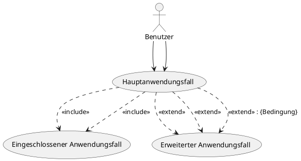

In einem **Use-Case-Diagramm** in der UML gibt es die Beziehungen **«include»** und **«extend»**, die unterschiedliche Bedeutungen und Anwendungsfälle haben. Hier sind die Unterschiede:
### **1. «include» (Einbeziehung)**

- **Zweck:** Wird verwendet, um einen gemeinsamen Teil von Verhalten zwischen mehreren Use-Cases zu modularisieren. Es zeigt, dass ein Use-Case (A) immer einen anderen Use-Case (B) aufruft.
    
- **Beschreibung:** Der inkludierte Use-Case wird immer ausgeführt, wenn der übergeordnete Use-Case ausgeführt wird.
    
- **Verwendung:**
    
    - Wiederverwendung von Funktionen, die in mehreren Use-Cases benötigt werden.
    - Strukturierung großer Use-Cases in kleinere, wiederverwendbare Teile.
- **Beispiel:**
    
    - **Haupt-Use-Case:** „Bestellung aufgeben“
    - **Inkludierter Use-Case:** „Zahlungsdetails prüfen“
    - Bedeutung: Immer wenn eine Bestellung aufgegeben wird, wird automatisch die Prüfung der Zahlungsdetails durchgeführt.
- **Notation:** Der inkludierte Use-Case wird mit einer gestrichelten Linie und dem Stereotyp «include» verbunden.
    
### **2. «extend» (Erweiterung)**

- **Zweck:** Zeigt optionales oder alternatives Verhalten eines Use-Cases an, das nur unter bestimmten Bedingungen ausgeführt wird.
    
- **Beschreibung:** Ein Erweiterungs-Use-Case tritt nur ein, wenn eine bestimmte Bedingung erfüllt ist.
    
- **Verwendung:**
    
    - Um optionales Verhalten zu modellieren.
    - Um alternative Szenarien darzustellen, die nicht immer stattfinden.
- **Beispiel:**
    
    - **Haupt-Use-Case:** „Bestellung aufgeben“
    - **Erweiterungs-Use-Case:** „Rabatt anwenden“
    - Bedeutung: Wenn bestimmte Voraussetzungen (z. B. ein Rabattcode) erfüllt sind, wird zusätzlich der Rabatt angewendet.
- **Notation:** Der Erweiterungs-Use-Case wird ebenfalls mit einer gestrichelten Linie und dem Stereotyp «extend» verbunden. Die Bedingung wird oft in eckigen Klammern angegeben, z. B. [Rabattcode vorhanden].
    
### **Zusammenfassung der Unterschiede**

| Merkmal          | «include»                              | «extend»                               |
| ---------------- | -------------------------------------- | -------------------------------------- |
| **Bedeutung**    | Gemeinsames Verhalten wird eingebunden | Optionales oder alternatives Verhalten |
| **Abhängigkeit** | Immer ausgeführt                       | Nur unter bestimmten Bedingungen       |
| **Verwendung**   | Wiederverwendbarkeit                   | Erweiterbarkeit                        |
| **Richtung**     | Vom Haupt-Use-Case zum inkludierten    | Vom Erweiterungs-Use-Case zum Haupt    |
|                  |                                        |                                        |

