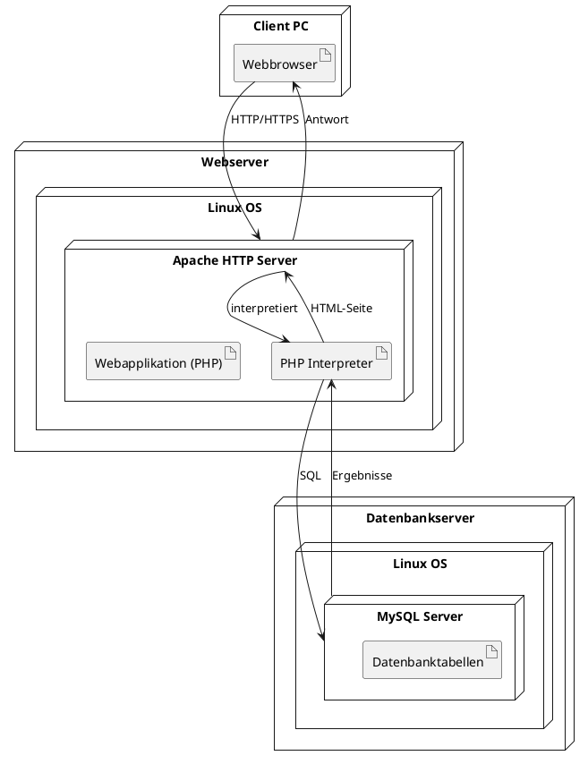

### Was wurde verbessert:

1. **Eindeutige Artefakte und Nodes**:
    - Artefakte wie `PHP Webapplikation` oder `Datenbanktabellen` sind explizit als Artefakte dargestellt.
    - Nodes wie `Linux OS` sind als physische Ausführungseinheiten für Server- und Datenbanksoftware dargestellt.
2. **Kommunikationspfade**:
    - Die Verbindungen sind konsistenter mit UML 2.5 (z. B. zwischen Artefakten und Nodes).
3. **Detaillierte Schachtelung**:
    - Die Hierarchie von OS → Software → Artefakte wurde genauer dargestellt.