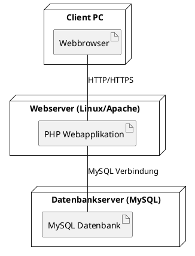

Hier ist das aktualisierte PlantUML-Verteilungsdiagramm, das den klassischen LAMP-Stack widerspiegelt. Ich habe die Elemente angepasst, um die typischen Komponenten eines LAMP-Stacks (Linux, Apache, MySQL, PHP) darzustellen.

### Änderungen:

1. Der Webserver wurde explizit als "Linux/Apache" benannt.
2. Die Webapplikation wurde als "PHP Webapplikation" definiert, da dies den typischen LAMP-Stack repräsentiert.
3. Die Verbindung zwischen der Webapplikation und der Datenbank wurde als "MySQL Verbindung" benannt.
4. Die Verbindung zwischen dem Browser und der Webapplikation wurde als "HTTP/HTTPS" spezifiziert.

Füge dies in dein PlantUML-Tool ein, um das aktualisierte Diagramm zu sehen.