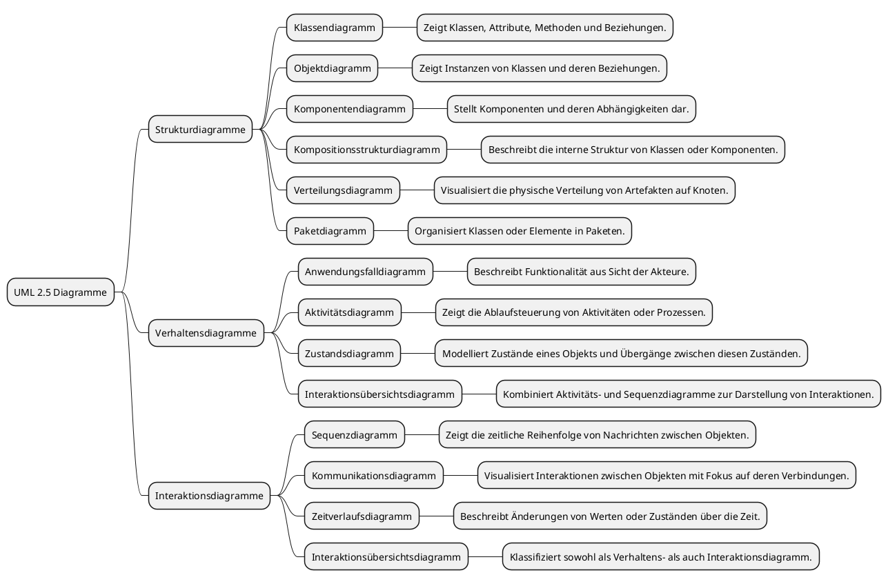

### PlantUML Code für die UML-Übersicht

### Anleitung zur Verwendung in Obsidian

1. Stelle sicher, dass das **PlantUML-Plugin** in Obsidian installiert ist.
2. Kopiere den obigen Code in eine Markdown-Datei.
3. Speichere die Datei, und Obsidian rendert automatisch die Mindmap.