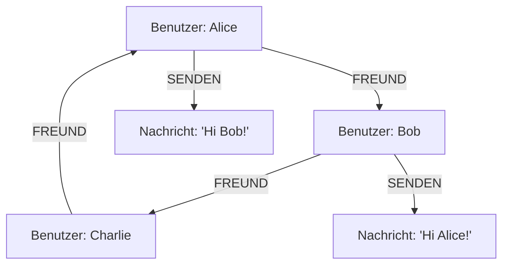

## Szenario

Eine Social-Media-Plattform speichert Informationen über Benutzer, deren Freundschaften, sowie Nachrichten zwischen diesen Benutzern. Die Plattform muss effizient folgende Informationen bereitstellen können:

- Welche Benutzer sind miteinander befreundet?
- Gemeinsame Freunde zwischen zwei Benutzern.
- Nachrichtenhistorien zwischen Benutzern.
- Vorschläge für potenzielle neue Freunde basierend auf Netzwerkanalysen.

## Herausforderungen

- **Komplexe Beziehungen:** Viele Beziehungen zwischen Benutzern (n:m).
- **Leistung:** Häufige Abfragen von Netzwerkinformationen wie „gemeinsame Freunde“ oder „kürzester Pfad“.
- **Skalierbarkeit:** Millionen bis Milliarden von Benutzerknoten und Beziehungsdaten.

## Datenbankmodell

Graphdatenbank (z. B. Neo4j):

- Vorteile:
    - Optimiert für Beziehungsdaten und Traversierungen.
    - Einfache Abfrage komplexer Beziehungsnetzwerke mittels Cypher (bei Neo4j) oder ähnlicher Abfragesprachen.
    - Hohe Leistung bei Pfadanalysen und Nachbarschaftssuchen.
- Nachteile:
    - Kann bei datenbankfernen Operationen weniger effizient sein als andere Modelle.
    - Zusätzliche Einarbeitung in spezielle Abfragesprachen notwendig.

---

## Datenmodell für eine Graphdatenbank

- Knoten:
    - `Benutzer`: Attribute wie Name, Geburtsdatum, Ort.
    - `Nachricht`: Attribute wie Inhalt, Datum, Uhrzeit.
- Kanten:
    - `FREUND`: Verbindet zwei Benutzerknoten.
    - `SENDEN`: Verbindet Benutzer mit Nachrichten.




Das obige Diagramm zeigt die Grundstruktur einer Social-Media-Plattform. Sie verdeutlicht die Beziehungstypen (`FREUND`, `SENDEN`) sowie die grundlegenden Datenobjekte (`Benutzer`, `Nachricht`). Diese Struktur ermöglicht eine intuitive und performante Darstellung sowie Abfrage von Netzwerkinformationen.
## Beispielabfragen

1. Gemeinsame Freunde zwischen Alice und Bob:
    
    - Cypher-Abfrage:
```cypher
MATCH (a:Benutzer {name: 'Alice'})-[:FREUND]-(friend)-[:FREUND]-(b:Benutzer {name: 'Bob'})
RETURN friend
```
        
2. Kürzester Pfad zwischen Alice und Charlie:
    - Cypher-Abfrage:
        
```cypher
MATCH p=shortestPath((a:Benutzer {name: 'Alice'})-[:FREUND*]-(c:Benutzer {name: 'Charlie'}))
RETURN p
```
        
3. Nachrichten zwischen zwei Benutzern:
    - Cypher-Abfrage:
        
```cypher
MATCH (a:Benutzer {name: 'Alice'})-[:SENDEN]->(msg:Nachricht)<-[:SENDEN]-(b:Benutzer {name: 'Bob'})
RETURN msg
```
        

## Github-Projekte
1. **Twitter Graph Example**:
	- Dieses Projekt von Neo4j demonstriert die Modellierung und Analyse eines sozialen Netzwerks unter Verwendung von Twitter-Daten. Es bietet Einblicke in die Strukturierung von Benutzern, Tweets, Hashtags und deren Beziehungen in einer Graphdatenbank.
	- https://github.com/neo4j-graph-examples/twitter-v2
    
2. **Social Network using Graph**:
	- Dieses Projekt implementiert ein soziales Netzwerk unter Verwendung von Graphstrukturen. Es zielt darauf ab, die Dynamik und Skalierbarkeit eines sozialen Netzwerks ähnlich wie Instagram zu demonstrieren.
	- https://github.com/TartejBrothers/Social-Media-Network

3. **Backend für eine Social-Network-App mit Neo4j**:
	- Dieses Projekt stellt das Backend einer Social-Network-Anwendung für Reisende dar, entwickelt mit Spring und Neo4j als Graphdatenbank. Es zeigt die Anwendung von Graphdatenbanken zur Verwaltung komplexer Beziehungen in sozialen Netzwerken.
	- https://github.com/PetarRan/social-network-neo4j