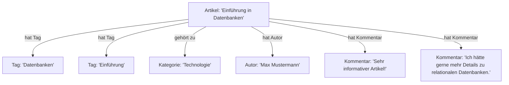

## Szenario

Ein Blog-System speichert Artikel, die von verschiedenen Autoren verfasst werden, und ordnet jedem Artikel Tags und Kategorien zu. Es muss eine flexible Suche nach Artikeln auf Basis von Tags und Kategorien möglich sein, sowie eine einfache Erweiterung von Tags und Kategorien ohne die bestehende Struktur zu ändern.

## Herausforderungen

- **Flexible Datenstruktur:** Artikel können unterschiedliche Attribute haben (z. B. optionale Felder wie `Veröffentlichungsdatum` oder `Kommentare`).
- **Einfache Erweiterbarkeit:** Neue Tags oder Kategorien können jederzeit hinzugefügt werden.
- **Hohe Abfragegeschwindigkeit:** Inhalte müssen schnell nach Tags und Kategorien gefiltert werden können.

## Datenbankmodell

Dokumentenbasierte Datenbank (z. B. MongoDB):

- Vorteile:
    - Speichert Daten in flexiblen, JSON-ähnlichen Dokumenten.
    - Ermöglicht die Speicherung unstrukturierter oder semi-strukturierter Daten.
    - Unterstützt schnelle Abfragen basierend auf Indizes, z. B. für Tags und Kategorien.
- Nachteile:
    - Schwieriger bei komplexen Beziehungen zwischen Entitäten (z. B. bei n:m-Beziehungen).
    - Eventuelle Redundanz der Daten (z. B. gleiche Tags in verschiedenen Dokumenten).

---

## Datenmodell für eine Dokumentendatenbank

Ein Artikel wird als Dokument gespeichert. Jedes Dokument enthält folgende Felder:

- `title`: Der Titel des Artikels.
- `author`: Der Name des Autors.
- `content`: Der Inhalt des Artikels.
- `tags`: Eine Liste von Tags, die den Artikel beschreiben.
- `category`: Die Kategorie, zu der der Artikel gehört.
- Optionale Felder wie `published_date` oder `comments`.

## Beispiel in JSON:

```json
{
  "title": "Einführung in Datenbanken",
  "author": "Max Mustermann",
  "content": "Datenbanken sind ein wichtiges Werkzeug zur Verwaltung von Informationen.",
  "tags": ["Datenbanken", "Einführung", "IT"],
  "category": "Technologie",
  "published_date": "2025-01-28",
  "comments": [
    {
      "user": "Anna",
      "text": "Sehr informativer Artikel!"
    },
    {
      "user": "Tom",
      "text": "Ich hätte gerne mehr Details zu relationalen Datenbanken."
    }
  ]
}
```

---

## Visualisierung

Struktur eines Blog-Systems mit einer dokumentenbasierten Datenbank:



---

## Beispielabfragen

1. Suche nach Artikeln mit einem bestimmten Tag:
    
    - MongoDB-Abfrage:
        
```javascript
db.articles.find({ tags: "Datenbanken" })
```
        
2. Suche nach Artikeln in einer bestimmten Kategorie:
    
    - MongoDB-Abfrage:
        
```javascript
db.articles.find({ category: "Technologie" })
```
        
3. Finden aller Artikel eines bestimmten Autors:
    
    - MongoDB-Abfrage:
        
```javascript
db.articles.find({ author: "Max Mustermann" })
```
        

---

## Zusammenfassung

- **Dokumentenbasierte Datenbanken** sind hervorragend geeignet für Systeme mit flexiblen und dynamischen Datenstrukturen wie ein Blog-System.
- Tags und Kategorien können leicht hinzugefügt oder geändert werden, ohne dass bestehende Datenstrukturen angepasst werden müssen.
- Suchabfragen nach Attributen wie `tags`, `category` oder `author` sind effizient und flexibel.

Wenn Sie noch weitere Details oder eine andere Visualisierung wünschen, lassen Sie es mich wissen!

## Github-Projekte
1. **Blog-Website mit MongoDB**:
	- Dieses Projekt ist eine einfache Blog-Website, die MongoDB zur Speicherung von Blogbeiträgen und Benutzerdaten verwendet. 
	- Es bietet eine gute Grundlage, um zu verstehen, wie man ein Blogsystem mit einer NoSQL-Datenbank implementiert.
	- https://github.com/Jessyveena/Blog-Website
    
2. **Blogging-Website mit dem MERN-Stack**:
	- Dieses Projekt verwendet den MERN-Stack (MongoDB, Express.js, React und Node.js) für den Aufbau einer Blogging-Website. MongoDB dient dabei als NoSQL-Datenbank zur Speicherung von Benutzerdaten, Blogs und anderen Anwendungsdaten.
	- https://github.com/Prashant0664/Blog-website