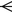
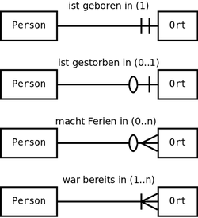

Die **Martin-Notation** (auch _Krähenfußnotation_; englisch _crow’s foot notation_) nach James Martin, [Charles Bachman](https://de.wikipedia.org/wiki/Charles_Bachman "Charles Bachman") und Odell ist eine Notation zur [semantischen Datenmodellierung](https://de.wikipedia.org/wiki/Semantisches_Datenmodell "Semantisches Datenmodell"), um vereinfachte [Entity-Relationship-Modelle](https://de.wikipedia.org/wiki/Entity-Relationship-Modell "Entity-Relationship-Modell") darzustellen.

Sie verwendet für eine 1:n-Beziehung sogenannte Krähenfüße und wird daher auch Krähenfußnotation genannt.

Die Rechtecke bezeichnen die [Entitätstypen](https://de.wikipedia.org/wiki/Entit%C3%A4t_\(Informatik\) "Entität (Informatik)"), die mittels Beziehungslinien miteinander verbunden sind. Beispielsweise steht im Diagramm „Person“ in Beziehung zu „Ort“.

- Die Kardinalitäten (Multiplizitäten) werden durch 
	- 0 (Null), 
	- | (Eins) bzw. den 
	-  Krähenfuß (beliebig viele) gekennzeichnet. 
- Bei jeder Beziehung stehen zwei Kardinalitäten hintereinander, die das minimale und das maximale Auftreten beschreiben.

Die Diagramme in der Grafik lesen sich wie folgt:

- Eine Person ist geboren in minimal einem, maximal einem Ort.
- Eine Person ist gestorben in minimal Null, maximal einem Ort.
- Eine Person macht Ferien in minimal Null, maximal vielen Orten.
- Eine Person war bereits in minimal einem, maximal vielen Orten.
- In die Gegenrichtung wird keine Aussage über die Kardinalität gemacht.

Die in Klammern angegebenen [Kardinalitäten](https://de.wikipedia.org/wiki/Kardinalit%C3%A4t_\(Datenbanken\) "Kardinalität (Datenbanken)") im Diagramm (zum Beispiel „0..n“) bezeichnen die analoge [UML](https://de.wikipedia.org/wiki/UML "UML")-Notation und gehören nicht zur Martin-Notation.