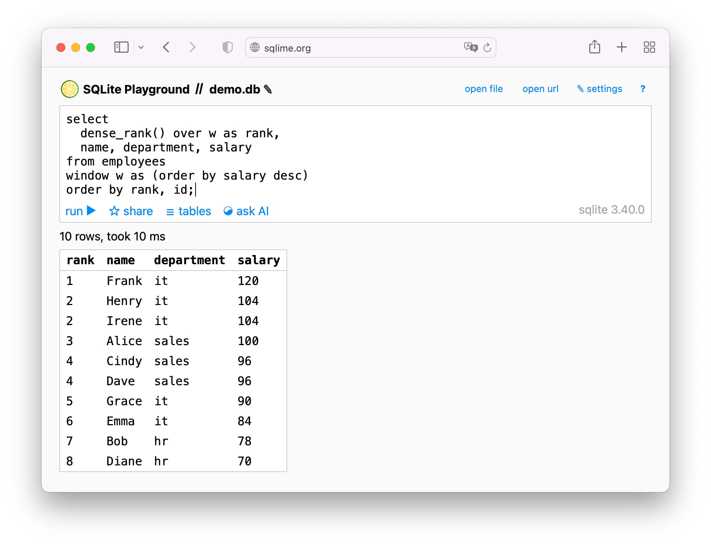

**[Sqlime](http://sqlime.org/)** is an online SQLite playground for debugging and sharing SQL snippets. Kinda like JSFiddle, but for SQL instead of JavaScript.

Here are some notable features:

### 🔋 Full-blown database in the browser

Sqlime is backed by the latest version of SQLite via the [sqlean.js](https://github.com/nalgeon/sqlean.js) project. It provides a full-featured SQL implementation, including indexes, triggers, views, transactions, CTEs, window functions and execution plans.

It also includes essential SQLite extensions, from math statistics and regular expressions to hash functions and dynamic SQL.

### 🔌 Connect any data source

Connect any local or remote SQLite database. Both files and URLs are supported. For example, try loading the [Employees database](http://sqlime.org/#https://raw.githubusercontent.com/nalgeon/sqliter/main/employees.en.db) from the GitHub repo.

### 🔗 Save and share with others

Sqlime saves both the database and the queries to GitHub so that you can revisit them later or share them with a colleague. The database is stored as a plain text SQL dump, so it's easy to read the code or import data into PostgreSQL, MySQL, or other databases.

For example, here is the [gist](https://gist.github.com/nalgeon/e012594111ce51f91590c4737e41a046) for the Employees database, and here is the [sharing link](https://sqlime.org/#gist:e012594111ce51f91590c4737e41a046) for it.

### 🤖 Ask AI

Connect an OpenAI account to get help with your queries from the state-of-the-art ChatGPT assistant. AI can explain, teach, and troubleshoot your SQL.

[

### 📱 Mobile friendly

Most playgrounds are not meant for small screens. Sqlime was specifically designed and tested on mobile devices. No need to zoom or aim at tiny buttons — everything looks and works just fine.

### 🔒 Secure and private

There is no server. Sqlime works completely in the browser. GitHub and OpenAI credentials are also stored locally. Queries are saved as private GitHub gists within your account. Your data is yours only.

### ⌨️ Dead simple

Sqlime has zero third-party dependencies other than SQLite. Good old HTML, CSS, and vanilla JS — that's all. No frameworks, no heavy editors, no obsolete and vulnerable libraries. Just some modular open-source code, which is easy to grasp and extend.

## Last but not least

**⭐️ Star the project** if you like it

🚀 [**Subscribe**](https://antonz.org/subscribe/) to stay on top of new features

🍋 [**Use Sqlime**](https://sqlime.org/) to debug and share SQL snippets