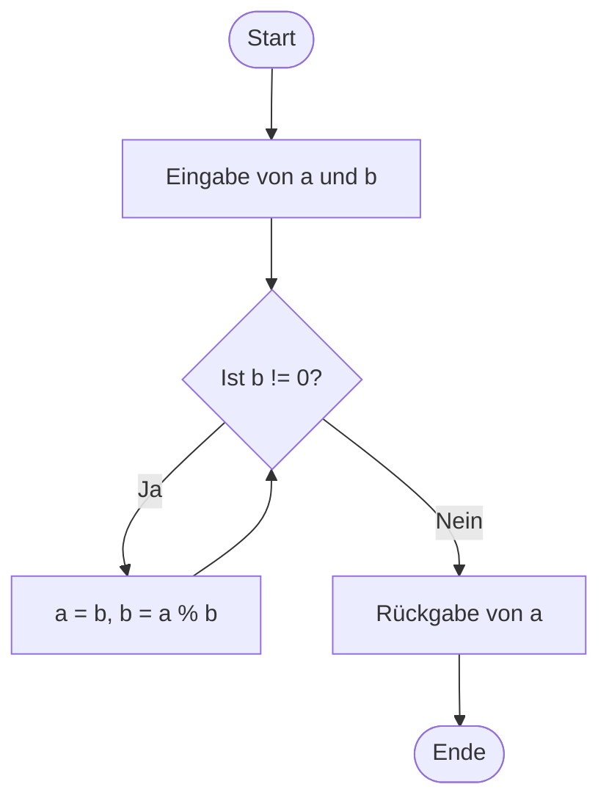

## Block 1: Einführung in Funktionen

> Verständnis, was Funktionen sind und warum sie nützlich sind.

1. **Rückblick auf Modul 3:**
    
    - Kurze Wiederholung der Schleifenarten (`for`, `while`) und deren Anwendungen.
    - Teilnehmer können offene Fragen stellen.
2. **Theorie: Was sind Funktionen?**
    
    - Definition: Eine Funktion ist ein Block von Anweisungen, der unter einem Namen zusammengefasst ist und bei Bedarf ausgeführt werden kann.
    - Vorteile:
        - Wiederverwendbarkeit von Code.
        - Verbesserung der Lesbarkeit und Strukturierung von Programmen.
        - Vereinfachung von Debugging und Fehlerbehebung.
    - **Syntax einer Funktion in Python:**
        
        ```python
        def funktionsname(parameter1, parameter2):
            # Anweisungen
            return ergebnis
        ```
        
3. **Praxis: Schreiben und Aufrufen einfacher Funktionen:**
    
    - Beispiel: Funktion für eine Begrüßung.
        
        ```python
        def begruessung(name):
            print(f"Hallo, {name}!")
        begruessung("Anna")
        ```
        
    - Teilnehmer schreiben ihre eigene Begrüßungsfunktion mit einem Namen als Eingabeparameter.
## Block 2: Parameter und Rückgabewerte

> Verständnis von Parametern und Rückgabewerten in Funktionen.

1. **Theorie: Parameter und Rückgabewerte:**
    
    - Parameter: Übergabe von Eingabewerten an Funktionen.
    - Rückgabewerte: Rückgabe eines Ergebnisses an den Aufrufer.
    - **Beispiele:**
        
        ```python
        def addiere(a, b):
            return a + b
        
        ergebnis = addiere(5, 3)
        print(f"Das Ergebnis ist: {ergebnis}")
        ```
        
2. **Praxis: Funktionen mit Parametern und Rückgabewerten:**
    
    - Aufgabe 1: Schreibe eine Funktion, die den Flächeninhalt eines Rechtecks berechnet.
        
        ```python
        def flaeche(l, b):
            return l * b
        ```
        
    - Aufgabe 2: Schreibe eine Funktion, die prüft, ob eine Zahl gerade oder ungerade ist.
        
        ```python
        def ist_gerade(zahl):
            return zahl % 2 == 0
        ```
        
3. **Gruppenaufgabe:**
    
    - Entwickle eine Funktion, die den größten gemeinsamen Teiler (ggT) von zwei Zahlen berechnet.
## Block 3: Funktionsbibliotheken und Modularisierung

> Verständnis der Nutzung externer Bibliotheken und der Modularisierung von Programmen.

1. **Theorie: Einführung in Module und Bibliotheken:**
    
    - Was sind Module?
        - Module sind Dateien, die Funktionen und Variablen enthalten, die in anderen Programmen importiert und verwendet werden können.
    - Beispiele für Standardmodule:
        - `math` (Mathematische Funktionen):
            
            ```python
            import math
            print(math.sqrt(16))  # Quadratwurzel
            ```
            
        - `random` (Zufallszahlen):
            
            ```python
            import random
            print(random.randint(1, 10))  # Zufällige Zahl zwischen 1 und 10
            ```
            
2. **Praxis: Nutzung von Modulen:**
    
    - Aufgabe 1: Nutze das Modul `math`, um den Umfang und die Fläche eines Kreises zu berechnen.
        
        ```python
        import math
        
        def kreis_flaeche(radius):
            return math.pi * radius**2
        ```
        
    - Aufgabe 2: Nutze das Modul `random`, um ein Zufallszahlenspiel zu programmieren.
3. **Modularisierung:**
    
    - Theorie: Ein großes Programm in kleinere Module unterteilen.
    - Praxis:
        - Schreibe zwei Dateien: Eine enthält eine Funktion zur Berechnung des ggT, die andere verwendet diese Funktion, um Ergebnisse auszugeben.
## Block 4: Abschlussaufgabe – Mini-Projekt

> Anwendung der erlernten Inhalte zur Modularisierung eines komplexen Programms.

### 1. Aufgabe:
    
- Entwickle ein kleines Programm, das folgende Anforderungen erfüllt:
	- Eine Datei (`funktionen.py`) enthält Funktionen:
		- Eine Funktion zur Begrüßung.
		- Eine Funktion zur Flächenberechnung.
		- Eine Funktion zur Berechnung des ggT.
	- Eine zweite Datei (`main.py`) importiert die Funktionen und verwendet sie.
    
### Hinweis
Ablauf für den größten gemeinsamen Teiler:


