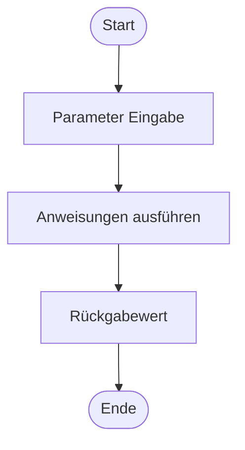
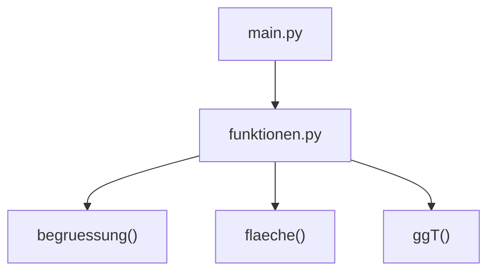
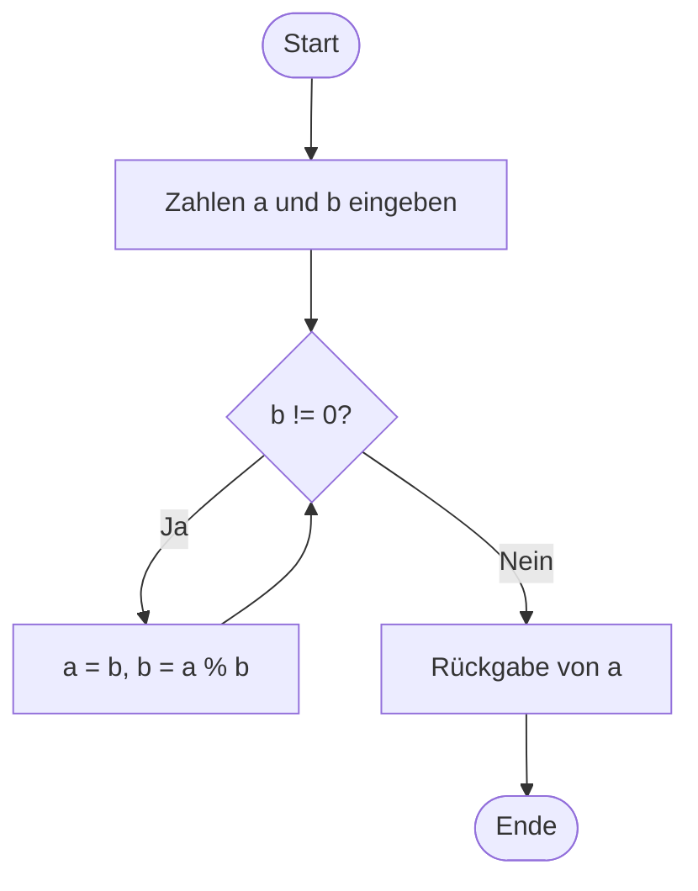

## 1. Beispielcodes für Demonstrationen

### a) Einfache Funktion – Begrüßung

```python
# Begrüßung mit Eingabe eines Namens
def begruessung(name):
    print(f"Hallo, {name}!")

begruessung("Anna")
```
### b) Funktion mit Parameter und Rückgabewert

```python
# Funktion zur Berechnung des Flächeninhalts eines Rechtecks
def flaeche(l, b):
    return l * b

ergebnis = flaeche(5, 3)
print(f"Die Fläche beträgt: {ergebnis}")
```
### c) Funktionsbibliotheken – Math

```python
# Nutzung der math-Bibliothek zur Berechnung von Kreisflächen
import math

def kreis_flaeche(radius):
    return math.pi * radius**2

radius = 5
print(f"Die Fläche des Kreises beträgt: {kreis_flaeche(radius)}")
```
### d) Modularisierung – Funktionen in einer separaten Datei

**Datei `funktionen.py`:**

```python
# Enthält die Funktionen, die in main.py importiert werden
def begruessung(name):
    print(f"Hallo, {name}!")

def flaeche(l, b):
    return l * b

def ggT(a, b):
    while b != 0:
        a, b = b, a % b
    return a
```

**Datei `main.py`:**

```python
# Hauptprogramm, das Funktionen aus funktionen.py verwendet
import funktionen

funktionen.begruessung("Anna")

laenge = 5
breite = 3
print(f"Die Fläche beträgt: {funktionen.flaeche(laenge, breite)}")

zahl1 = 36
zahl2 = 48
print(f"Der ggT von {zahl1} und {zahl2} ist: {funktionen.ggT(zahl1, zahl2)}")
```
## 2. Visualisierungen in Mermaid

### a) Aufbau einer Funktion


### b) Modularisierung von Programmen


### c) Ablauf einer ggT-Funktion


## 3. Aufgaben für die Teilnehmer

### Aufgabe 1: Funktionen schreiben

- Schreibe eine Funktion `begrüßung(name)`, die einen Namen als Parameter nimmt und eine Begrüßung ausgibt.

### Aufgabe 2: Funktion mit Rückgabewert

- Schreibe eine Funktion `flaeche(l, b)`, die die Fläche eines Rechtecks berechnet und zurückgibt.

### Aufgabe 3: Nutzung von Modulen

- Nutze die Bibliothek `math`, um die Fläche eines Kreises mit gegebenem Radius zu berechnen.

### Aufgabe 4: Modularisierung

- Erstelle zwei Dateien:
    - `funktionen.py`: Enthält die Funktionen `begrüßung`, `flaeche`, und `ggT`.
    - `main.py`: Importiert die Funktionen aus `funktionen.py` und nutzt sie in einem kleinen Programm.
## 4. Typische Fehler und Fehlersuche

### Fehler 1: Vergessene Einrückung

```python
def begruessung(name):
print(f"Hallo, {name}!")
```

**Fehler:** `IndentationError: expected an indented block`  
**Lösung:** Funktion korrekt einrücken.

### Fehler 2: Keine Rückgabe

```python
def flaeche(l, b):
    ergebnis = l * b
```

**Fehler:** Keine Rückgabe (`None` wird ausgegeben).  
**Lösung:** `return ergebnis` hinzufügen.

### Fehler 3: Modul nicht gefunden

```python
import funktione
```

**Fehler:** `ModuleNotFoundError: No module named 'funktione'`  
**Lösung:** Dateiname korrekt schreiben: `funktionen.py`.