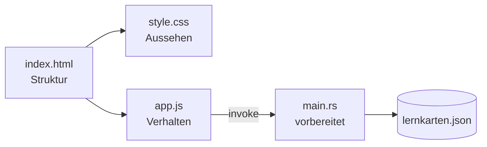

# Vom Web zur Desktop-App – Kompaktkurs mit Tauri

> [!abstract] Kurzbeschreibung
> Drei Teilnehmende ohne Vorkenntnisse in Webtechniken bauen in 30 Unterrichtseinheiten eine kleine, lauffähige Desktop-Anwendung. HTML, CSS und JavaScript werden von Grund auf eingeführt, aber ausschließlich an dem einen Projekt, das am Ende als Flatpak auf dem eigenen Rechner installiert ist.

> [!important] Nicht zu verwechseln mit [[00 Kurskonzept Tauri]]
> Das ausführliche Konzept setzt Web-Vorkenntnisse voraus, arbeitet mit Vue 3, Vite und Node und umfasst 64 UE. Dieses Konzept hier ist eigenständig, nicht dessen Kurzfassung. Es teilt lediglich Umgebung und Zielsystem.

## Ehrliche Zielsetzung

30 UE sind 22,5 Zeitstunden. HTML, CSS, JavaScript und Tauri sind in dieser Zeit nicht als Handwerk erlernbar. Das Kursziel ist deshalb verschoben:

**Was die Teilnehmenden am Ende können**

- eine Benutzeroberfläche aus vorgegebenen HTML-Bausteinen aufbauen und verändern
- Aussehen über CSS gezielt anpassen: Farben, Schrift, Abstände, einfache Anordnung mit Flexbox
- kleine JavaScript-Funktionen lesen, verstehen und abwandeln
- auf Klicks reagieren, Werte aus Eingabefeldern lesen, Inhalte im Fenster verändern
- Daten in einer Liste halten und daraus die Anzeige erzeugen
- den Weg vom Quelltext bis zur installierten Anwendung im Anwendungsmenü beschreiben

**Was danach ausdrücklich noch nicht geht**

- eigenständig eine Anwendung von null entwerfen
- Frameworks wie Vue oder React
- CSS Grid, komplexe Layouts, responsives Design
- Promises und asynchrone Programmierung als Konzept. Es wird nur `await` als Rezept benutzt.
- Rust schreiben. Der Rust-Anteil ist vollständig vorbereitet und wird nur gelesen.

> [!tip] Formulierung für die Kursbeschreibung
> „Sie bauen Ihre erste eigene Desktop-Anwendung und verstehen, wie Webtechniken dahinterstecken." Nicht: „Sie lernen HTML, CSS und JavaScript." Die zweite Formulierung erzeugt eine Erwartung, die 30 UE nicht einlösen.

## Technologieentscheidung

| Baustein | Auswahl | Begründung |
|---|---|---|
| Framework | **keines** | Vue auf null JavaScript-Kenntnisse aufzusetzen funktioniert nicht |
| Frontend | eine `index.html`, eine `style.css`, eine `app.js` | drei Dateien, überschaubar, kein Suchen |
| Werkzeugkette | **`cargo` allein** | kein Node, kein npm, kein Bundler. Ein Befehl zum Starten. |
| Tauri-Brücke | `withGlobalTauri: true` | `invoke` steht als globale Funktion bereit, ohne `import` |
| Dateizugriff | zwei vorbereitete Rust-Commands | Die Tauri-Plugins liegen als npm-Pakete vor und bräuchten einen Bundler. Ohne Node ist der Rust-Command der einfachere Weg. |
| Auslieferung | Flatpak | einziges sinnvolles Format auf dem Zielsystem |

Damit gilt in diesem Kurs wieder wörtlich, was der Leitfaden [[Von der leeren Toolbx zur installierten Flatpak-App]] vorgibt: durchgängig `cargo`, kein Node.

## Voraussetzung: vorbereitete Umgebung

> [!danger] Entscheidend für die Zeitplanung
> Dieses Konzept setzt voraus, dass die Kursleitung Container und Projektgerüst **vorab** einrichtet. Die Teilnehmenden bekommen am ersten Tag eine fertige Umgebung und eine geführte Kurzeinführung von 2 UE.
>
> Wird stattdessen der vollständige Leitfaden mit den Teilnehmenden durchlaufen, kostet das etwa 8 UE. Bei 30 UE Gesamtbudget bleiben dann 22 UE für die Inhalte, und das Kursziel ist nicht mehr erreichbar. In diesem Fall bitte das Budget auf 38 UE erhöhen oder das Ausliefern als Flatpak streichen.

Alles Vorzubereitende steht in [[Anhang Vorbereitung durch die Kursleitung]].

## Das Projekt: Lernkarten

Eine Karteikartenanwendung mit Frage und Antwort. Karten anlegen, durchblättern, umdrehen, löschen. Die Daten liegen als JSON-Datei auf der Platte.

Warum gerade das:

- der Datenbestand ist eine Liste aus Objekten mit zwei Feldern, also genau das Minimum, an dem sich Arrays und Objekte erklären lassen
- die Anwendung ist nach jedem Modul benutzbar und wächst sichtbar
- die Teilnehmenden sind selbst in einer Umschulung und können das Ergebnis danach tatsächlich verwenden

## Modulübersicht

| # | Baustein | UE | Ergebnis am Ende |
|---|---|---|---|
| K0 | [[K0 Ankommen und erste eigene Änderung]] | 2 | Fenster läuft, eigener Text steht drin |
| K1 | [[K1 HTML – die Struktur]] | 4 | vollständige Oberfläche, noch ohne Funktion |
| K2 | [[K2 CSS – das Aussehen]] | 5 | Oberfläche sieht aus wie eine Anwendung |
| K3 | [[K3 JavaScript – die Bausteine]] | 6 | erste eigene Funktionen, Ausgabe in der Konsole |
| K4 | [[K4 JavaScript im Fenster]] | 4 | Knöpfe funktionieren, Karten erscheinen |
| K5 | [[K5 Daten behalten]] | 4 | Karten überleben den Neustart |
| K6 | [[K6 Feinschliff]] | 2 | eigene Gestaltung, kleine Verbesserungen |
| K7 | [[K7 Als Anwendung ausliefern]] | 3 | Flatpak im Anwendungsmenü |

Summe: 30 Unterrichtseinheiten à 45 Minuten.

**Anhänge:** [[Anhang Befehlskarte]] · [[Anhang Vorbereitung durch die Kursleitung]] · [[Anhang Sprachumfang JavaScript]]

## Tagesplan

| Tag | UE | Inhalt |
|---|---|---|
| 1 | 8 | K0 (2), K1 (4), K2 Beginn (2) |
| 2 | 8 | K2 Abschluss (3), K3 Beginn (5) |
| 3 | 7 | K3 Abschluss (1), K4 (4), K5 Beginn (2) |
| 4 | 7 | K5 Abschluss (2), K6 (2), K7 (3) |

> [!note] Warum die Module über Tagesgrenzen laufen
> Der Zuschnitt folgt dem Stoff, nicht dem Kalender. Wichtiger ist, dass **jeder Tag mit einem lauffähigen Stand endet**, den die Teilnehmenden vorführen können. Das ist bei dieser Aufteilung gegeben.

## Didaktik bei drei Teilnehmenden

Die kleine Gruppe erlaubt ein Format, das bei zwölf Personen nicht funktioniert:

- **Kein Vortrag.** Alle drei tippen mit, die Kursleitung tippt sichtbar mit. Tempo richtet sich nach der langsamsten Person.
- **Reihum erklären.** Nach jedem Abschnitt erklärt eine Person der Gruppe, was gerade passiert ist. Das deckt Missverständnisse sofort auf.
- **Fehler bewusst erzeugen.** Jeder Abschnitt enthält einen absichtlich eingebauten Fehler, der gemeinsam gefunden wird. Fehlersuche ist bei Umschülern die wichtigste Einzelkompetenz.
- **Jede Datei bleibt kurz.** Sobald `app.js` über 150 Zeilen wächst, wird zusammengefasst statt weiter angebaut.
- **Nichts auswendig.** Die [[Anhang Befehlskarte]] liegt ausgedruckt auf dem Tisch. Befehle werden nachgeschlagen, nicht erinnert.

## Sprachumfang

Bewusst begrenzt. Was nicht in [[Anhang Sprachumfang JavaScript]] steht, kommt im Kurs nicht vor. Das gilt auch dann, wenn eine elegantere Lösung existiert.

## Lernstandsprüfung

Keine Noten. Stattdessen an drei Stellen ein kurzes Gespräch am Bildschirm:

| Nach | Frage |
|---|---|
| K2 | Ändern Sie die Hintergrundfarbe der Karte und erklären Sie, welche Datei Sie dafür anfassen. |
| K4 | Was passiert zwischen dem Klick auf den Knopf und der Änderung im Fenster? |
| K7 | Beschreiben Sie den Weg von Ihrer `index.html` bis zum Eintrag im Anwendungsmenü. |

## Anschluss

Nach diesem Kurs ist der Übergang in [[00 Kurskonzept Tauri]] möglich, allerdings nicht unmittelbar. Empfohlen ist dazwischen ein vertiefender Web-Grundlagenkurs von etwa 40 UE mit CSS Grid, Formularverarbeitung, Funktionen höherer Ordnung und asynchroner Programmierung.

## Risiken und Gegenmaßnahmen

| Risiko | Wann es auftritt | Gegenmaßnahme |
|---|---|---|
| JavaScript überfordert | typischerweise ab UE 14 | strenger Sprachumfang, K3 notfalls um 1 UE aus K6 verlängern |
| Tippfehler blockieren einzelne Teilnehmende | durchgehend | fertige Zwischenstände je Baustein bereithalten, siehe Anhang |
| Flatpak-Bau scheitert | K7 | Manifest und Metadaten vollständig vorbereitet, K7 ist reine Mitmach-Vorführung |
| Weißes Fenster beim Start | Tag 1 | `WEBKIT_DISABLE_DMABUF_RENDERER` vorab dauerhaft im Container setzen |
| Ungleiches Tempo bei drei Personen | ab Tag 2 | Zusatzaufgaben je Baustein für Schnellere, nie neuer Stoff |

## Offene Punkte

- [ ] Drei vorbereitete Container anlegen und testen
- [ ] Zwischenstände für alle acht Bausteine erzeugen und ablegen
- [ ] Befehlskarte drucken
- [ ] Prüfen, ob im Raum drei ausreichend große Bildschirme stehen. Zwei Dateien nebeneinander sind hier kein Luxus.
- [ ] Klären, ob die Teilnehmenden ihre Geräte behalten. Falls nein, Ergebnis als Bundle mitgeben.
