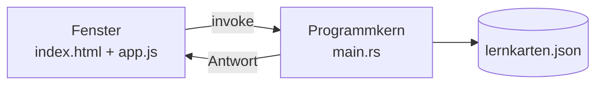

# K5 – Daten behalten

> [!abstract] Ziel des Bausteins
> Bis jetzt sind alle Karten nach dem Schließen weg. Hier kommt die Brücke zum Rust-Teil ins Spiel und die Karten landen in einer Datei. Das ist der Punkt, an dem sich die Anwendung von einer Webseite unterscheidet.

## Lernziele

- Erklären, warum ein Browser nicht einfach Dateien schreiben darf und eine Tauri-Anwendung schon
- Die Rolle der beiden Programmteile benennen: Fenster und Programmkern
- Einen vorbereiteten Rust-Command mit `invoke` aufrufen
- `await` als Rezept anwenden
- Daten beim Start laden und bei Änderungen speichern

> [!note] Rust wird nicht unterrichtet
> Die Datei `main.rs` ist vollständig vorbereitet und wird nur gemeinsam gelesen. Es geht darum zu verstehen, **dass** es einen zweiten Teil gibt und wie man ihn anspricht. Nicht darum, ihn zu schreiben.

## Ablauf

### 1. Warum das nötig ist (20 min)

Anwendung schließen, neu starten, alle Karten sind weg. Das Problem wird erlebt, bevor es gelöst wird.

Danach die Frage: Warum kann eine Webseite das nicht? Antwort ohne Fachbegriffe: Weil eine Webseite von einem fremden Server kommt und nicht in Ihre Dateien schreiben können soll. Eine installierte Anwendung darf das, weil Sie sie bewusst installiert haben.

### 2. Die zwei Teile (25 min)



Gemeinsam `main.rs` lesen. Die beiden vorbereiteten Funktionen `karten_speichern` und `karten_laden` werden Zeile für Zeile in normalem Deutsch beschrieben. Es wird nichts daran verändert.

### 3. Der erste Aufruf (45 min)

```js
async function speichern() {
  await window.__TAURI__.core.invoke("karten_speichern", { karten: karten });
  console.log("gespeichert");
}
```

Drei Dinge werden als Rezept eingeführt, nicht als Konzept:

| Wort | Rezeptregel |
|---|---|
| `invoke` | „Ruf den Programmkern" |
| `await` | „Warte, bis er fertig ist" |
| `async` | „Diese Funktion darf warten" |

> [!tip] Merksatz für die Tafel
> Wo `await` steht, muss `async` davorstehen. Wer das vergisst, bekommt eine Fehlermeldung mit genau diesem Hinweis.

### 4. Laden beim Start (45 min)

```js
async function laden() {
  const geladen = await window.__TAURI__.core.invoke("karten_laden");
  for (const karte of geladen) {
    karten.push(karte);
  }
  listeAnzeigen();
}

laden();
```

Anwendung schließen, neu starten, Karten sind da. Das ist der zweite große Motivationsmoment des Kurses nach K2.

### 5. Speichern an den richtigen Stellen (30 min)

Wo muss `speichern()` aufgerufen werden? Gemeinsam die Stellen suchen: nach dem Anlegen, nach dem Löschen. Diese Suche ist die Übung, nicht der Code.

### 6. Absichtlicher Fehler (15 min)

`await` weglassen. In der Konsole erscheint `Promise` statt der Liste. Gemeinsam anschauen und benennen: Das Programm war zu schnell und hat nicht gewartet.

## Praxisteil

- [ ] `main.rs` gemeinsam lesen und in eigenen Worten beschreiben
- [ ] `speichern()` schreiben und in der Konsole prüfen
- [ ] Die erzeugte Datei im Dateisystem suchen und öffnen
- [ ] `laden()` schreiben und beim Start aufrufen
- [ ] Alle Stellen finden, an denen gespeichert werden muss
- [ ] Anwendung schließen und neu starten, Ergebnis prüfen
- [ ] Zusatzaufgabe: Knopf „Alle Karten löschen" mit Sicherheitsabfrage über `confirm()`

Die Datei ansehen, in Nushell:

```nu
ls ~/.local/share/de.metarow.Lernkarten
open ~/.local/share/de.metarow.Lernkarten/lernkarten.json
```

## Typische Stolpersteine

> [!warning]
> - `await` ohne `async`. Die Fehlermeldung ist eindeutig, wird aber nicht gelesen.
> - `await` vergessen. Ergebnis ist ein `Promise`, keine Liste. Häufigster Fall.
> - Der Name des Commands stimmt nicht mit `main.rs` überein. Groß- und Kleinschreibung beachten.
> - Nach dem Laden wird `listeAnzeigen()` nicht aufgerufen. Die Daten sind da, aber unsichtbar. Gleicher Fehler wie in K4, jetzt mit anderer Ursache.
> - Speichern nur an einer Stelle eingebaut, deshalb gehen gelöschte Karten wieder auf.

## Verknüpfung

Weiter mit [[K6 Feinschliff]] · zurück zu [[00 Kompaktkonzept Tauri Grundlagen]]
