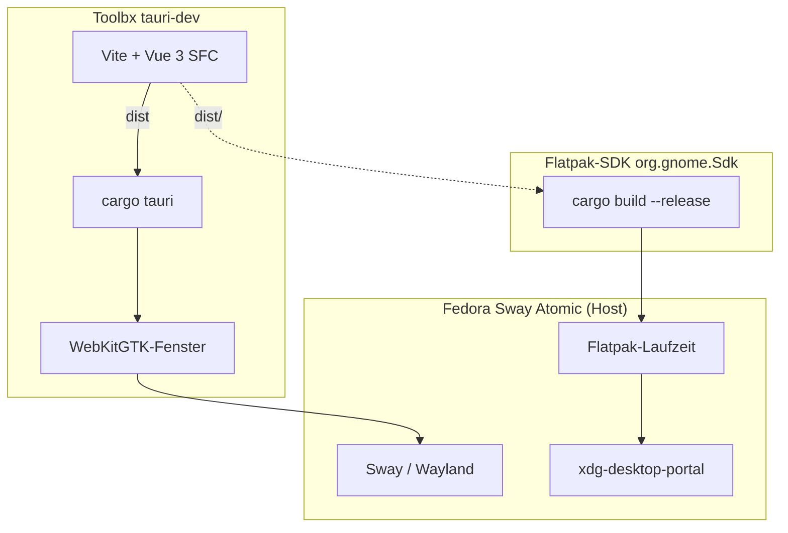

# Einführung in die Entwicklung plattformunabhängiger Apps mit Tauri

> [!abstract] Kurzbeschreibung
> Der Kurs vermittelt, wie mit Tauri 2 aus einem Web-Frontend eine native Desktop-Anwendung entsteht. Schwerpunkt ist die Frontend-Seite: Komponentenarchitektur, Zustandsverwaltung, UI-Gestaltung und die Anbindung nativer Funktionen. Entwickelt wird auf **Fedora Atomic** in einem **Toolbx-Container**, gesteuert über **Nushell** und `cargo tauri`. Auslieferungsformat ist **Flatpak**.

> [!info] Anschluss an die Vorarbeit
> Voraussetzung ist der abgearbeitete Leitfaden [[Von der leeren Toolbx zur installierten Flatpak-App]]. Alle Teilnehmenden haben damit bereits: Nushell in `~/.local/bin`, den Container `tauri-dev`, eine containergetrennte Rust-Toolchain, `cargo-tauri` und eine als Flatpak installierte Beispielanwendung. Der Kurs setzt genau dort an und baut das dortige Beispiel `notizblock` zum Kursprojekt aus.

## Zielgruppe und Voraussetzungen

Auszubildende und Berufseinsteiger im Bereich Fachinformatik Anwendungsentwicklung.

**Erwartete Vorkenntnisse**
- [ ] HTML und CSS auf solidem Grundniveau (Selektoren, Flexbox, Grid)
- [ ] JavaScript-Grundlagen (Funktionen, Arrays, Objekte, Promises)
- [ ] Leitfaden Toolbx/Flatpak vollständig durchlaufen, Kontrollpunkte bestanden
- [ ] Grundverständnis von Nushell-Syntax (Leitfaden Abschnitt 24)

**Nicht vorausgesetzt**
- Rust-Kenntnisse
- Erfahrung mit einem Frontend-Framework
- Erfahrung mit npm oder Bundlern

## Die vier Ebenen im Kurs

Übernommen aus dem Leitfaden und für den Kursstand konkretisiert:

| Ebene | Werkzeug | Inhalt im Kurs |
|---|---|---|
| Basisimage | `rpm-ostree` / `bootc` | Sway, Wayland, `flatpak`, Portals. Wird nie verändert. |
| Entwicklung | **Toolbx `tauri-dev`** | Rust, `cargo-tauri`, WebKitGTK-Devel, **neu: Node.js** |
| Auslieferung | **Flatpak-SDK** | Release-Build gegen `org.gnome.Sdk` |
| Anwendung | Flatpak | die installierte App im Sandkasten |

> [!danger] Regel für den gesamten Kurs
> Auf dem Host wird **nichts** gelayert. Kein `rpm-ostree install`. Jede fehlende Abhängigkeit gehört in den Toolbx oder in das Flatpak-Manifest. Wer diese Regel bricht, hat den Sinn des Leitfadens nicht verstanden.

## Technologieentscheidung

| Baustein | Auswahl | Begründung in Kurzform |
|---|---|---|
| Shell | Tauri 2 | Kursgegenstand |
| Framework | Vue 3 (Composition API, SFC) | flachste Lernkurve, Template nah an HTML, im DACH-Raum verbreitet |
| Sprache | TypeScript | Typen sichern den IPC-Vertrag zwischen Frontend und Rust |
| Build | Vite | Tauri-Standard, schnelles HMR |
| Steuerung | `cargo tauri` aus Nushell | Vite wird von Tauri über `beforeDevCommand` gestartet |
| Styling | natives CSS mit Custom Properties | übertragbares Wissen statt Framework-Konventionen |
| Auslieferung | Flatpak gegen `org.gnome.Platform` | einzig sinnvolles Format auf Atomic-Systemen |

### Der Node-Konflikt und seine Auflösung

Der Leitfaden verzichtet ausdrücklich auf Node und npm. Für eine einzelne HTML-Datei trägt das. Für einen Kurs mit Frontend-Schwerpunkt trägt es nicht: SFCs, `<script setup>` und TypeScript brauchen einen Build-Schritt, und der braucht Node.

Drei Wege standen zur Wahl:

| Weg | Bewertung |
|---|---|
| **A** Node im Toolbx, `dist/` vorgebaut ins Flatpak | **gewählt.** Host bleibt sauber, Container ist ohnehin wegwerfbar. Statische Web-Assets haben keine glibc-Bindung, dürfen also außerhalb der SDK entstehen. |
| **B** Vue über Import Map ohne Build-Schritt | bleibt Node-frei, verliert aber SFC, `<style scoped>` und TypeScript. Damit fallen die Module 03 und 04 in sich zusammen. Verworfen. |
| **C** Node-Erweiterung auch in der Flatpak-SDK, Offline-Quellen per `flatpak-node-generator` | technisch die saubere Lösung und für Flathub Pflicht. Als Vertiefung in [[M11 Flatpak Build und Verteilung]], nicht als Kursbasis. |

> [!important] Die Kernaussage des Leitfadens bleibt gültig
> „Gebaut wird gegen dieselbe Umgebung, in der später gelaufen wird." Das betrifft **nativen Code**. Das Rust-Binary entsteht weiterhin ausschließlich in der Flatpak-SDK. Nur die statischen Frontend-Dateien werden vorgebaut. Diese Unterscheidung ist selbst Lehrstoff und wird in [[M11 Flatpak Build und Verteilung]] ausdrücklich behandelt.

## Was durch Fedora Atomic und Sway anders ist

> [!warning] Für die Kursplanung entscheidend
> - **Nur WebKitGTK.** Kein WebView2, kein WKWebView vor Ort. Rendering-Unterschiede zu anderen Plattformen sind nur theoretisch behandelbar.
> - **Kein lokaler Build für Windows und macOS.** Cross-Plattform-Artefakte entstehen ausschließlich in CI. Siehe [[M11 Flatpak Build und Verteilung]].
> - **Wayland statt X11.** Globale Tastenkürzel funktionieren nicht wie unter X11. Siehe [[M09 Fenster und Wayland-Integration]].
> - **Sway ist ein Tiling-Compositor.** Fenstergröße, Position und `center` werden vom Compositor bestimmt, nicht von der Anwendung.
> - **Zwei Berechtigungsschichten.** Tauri-Capabilities *und* Flatpak-Sandkasten. Das ist ein Gewinn für [[M07 Sicherheit Capabilities und Sandkasten]].

## Angestrebte Lernergebnisse

Nach dem Kurs können die Teilnehmenden

1. die Architektur einer Tauri-Anwendung erklären und im Ebenenmodell des Atomic-Systems verorten
2. ein Vue-3-Frontend mit Komponenten, reaktivem Zustand und Navigation aufbauen
3. den Entwicklungszyklus vollständig aus Nushell im Toolbx steuern
4. native Funktionen aus dem Frontend nutzen
5. Tauri-Capabilities und Flatpak-`finish-args` gegeneinander abgrenzen und beide minimal setzen
6. eigene Rust-Commands schreiben und typsicher aufrufen
7. Anwendungsdaten im Flatpak-Sandkasten korrekt ablegen
8. eine Anwendung als Flatpak bauen, signieren und über ein Repository verteilen
9. Fehler über die Grenzen Frontend, Rust, Container und Sandkasten hinweg eingrenzen

## Durchgängiges Projekt: NoteFlow

Ausbau des `notizblock` aus dem Leitfaden zu einem lokalen Markdown-Notizmanager. Bundle-Identifier bleibt `de.metarow.NoteFlow` in Anlehnung an die dortige Namenskonvention.

Warum das Beispiel trägt: Dateizugriff zwingt zur Auseinandersetzung mit Portals und Sandkasten, eine Volltextsuche über viele Dateien liefert den Anlass für einen eigenen Rust-Command, und die Notizverwaltung erzeugt genug Zustand für einen sinnvollen Pinia-Store.

## Modulübersicht

| # | Modul | UE | Phase | Wo |
|---|---|---|---|---|
| 00 | [[M00 Umgebung erweitern und Vue-Projekt anlegen]] | 3 | Orientierung | Toolbx |
| 01 | [[M01 Architektur im Ebenenmodell]] | 3 | Orientierung | beide |
| 02 | [[M02 Notizblock ausbauen ohne Framework]] | 4 | Fundament | Toolbx |
| 03 | [[M03 Umstieg auf Vue 3 und Vite]] | 6 | Fundament | Toolbx |
| 04 | [[M04 Komponenten und UI-Gestaltung]] | 6 | Frontend-Kern | Toolbx |
| 05 | [[M05 Zustand und Navigation]] | 4 | Frontend-Kern | Toolbx |
| 06 | [[M06 Tauri-Plugins im Frontend]] | 5 | Frontend-Kern | Toolbx |
| 07 | [[M07 Sicherheit Capabilities und Sandkasten]] | 4 | Frontend-Kern | beide |
| 08 | [[M08 Eigene Commands und Events]] | 5 | Brücke zu Rust | Toolbx |
| 09 | [[M09 Fenster und Wayland-Integration]] | 4 | Desktop | beide |
| 10 | [[M10 Persistenz im Sandkasten]] | 3 | Desktop | beide |
| 11 | [[M11 Flatpak Build und Verteilung]] | 6 | Auslieferung | Host |
| 12 | [[M12 Debugging über vier Grenzen]] | 3 | Qualität | beide |
| 13 | [[M13 Abschlussprojekt]] | 8 | Transfer | beide |

Summe: 64 Unterrichtseinheiten à 45 Minuten, etwa 8 Kurstage.

**Anhänge:** [[Anhang Nushell-Befehlsreferenz]] · [[Anhang Flatpak-Manifest NoteFlow]] · [[Anhang Container-Setup-Skript]]

## Zeitvarianten

> [!tip] Kompaktvariante mit 44 UE
> Module 00 bis 08 vollständig, Modul 11 auf den Bau- und Installationsvorgang gekürzt (3 UE), Module 09, 10 und 12 als Vorführung, Abschlussprojekt auf 4 UE.

> [!tip] Variante mit React-Vorwissen
> Modul 03 wird ersetzt (Vite-Template `react-ts`, `useState` statt `ref`, Zustand statt Pinia in Modul 05). Alle übrigen Module bleiben unverändert, da Toolbx, Nushell und Flatpak framework-unabhängig sind.

## Didaktische Leitlinien

- **Problem vor Lösung.** Modul 02 baut bewusst ohne Framework weiter. Der entstehende DOM-Code begründet Modul 03.
- **Ein Projekt statt vieler Beispiele.** NoteFlow wächst aus dem `notizblock` des Leitfadens heraus.
- **Der Host bleibt unberührt.** Jede Übung, die den Host verändern würde, ist falsch gelöst.
- **Alle Befehle in Nushell.** Fremdmaterial aus bash wird im Unterricht gemeinsam übersetzt. Das ist Übung, kein Ärgernis.
- **Jedes Modul endet lauffähig.**

## Leistungsnachweis

| Anteil | Form |
|---|---|
| 40 % | Abschlussprojekt, abgenommen als installiertes Flatpak |
| 30 % | Code-Review eines fremden Projektstands |
| 20 % | Kurztests am Ende der Phasen |
| 10 % | Repository-Hygiene und Dokumentation |

## Änderungen gegenüber Fassung 0.1

- Setup-Modul auf den Stand nach dem Leitfaden verkürzt, dafür Node-Installation im Container ergänzt
- Alle Befehle von bash und npm-Skripten auf Nushell und `cargo tauri` umgestellt
- Modul 02 setzt auf dem `notizblock` des Leitfadens auf statt bei null zu beginnen
- Modul 07 um die zweite Berechtigungsschicht (Flatpak, Portals) erweitert, 3 auf 4 UE
- Modul 09 von Menü und Tray auf Wayland- und Sway-Realität umgeschrieben
- Modul 10 um die Pfadverschiebung im Sandkasten ergänzt
- Modul 11 von plattformspezifischen Installern auf Flatpak umgestellt, 4 auf 6 UE
- Drei Anhänge ergänzt

## Offene Punkte

- [ ] Läuft ein Benachrichtigungsdienst (`mako` oder gleichwertig) auf allen Kursgeräten? Ohne ihn scheitert Modul 06 stumm.
- [ ] Ist `xdg-desktop-portal-gtk` und `xdg-desktop-portal-wlr` im Basisimage enthalten?
- [ ] Ist ein Tray-Anbieter vorhanden (Waybar mit `tray`-Baustein)? Falls nein, Modul 09 entsprechend kürzen.
- [ ] GPG-Schlüssel für das Kurs-Repository in Modul 11 vorbereiten
- [ ] CI-Zugang für den Matrix-Build in Modul 11 klären
- [ ] Fassung von `org.gnome.Sdk` zum Kursstart prüfen, Rust-Erweiterung passend dazu
