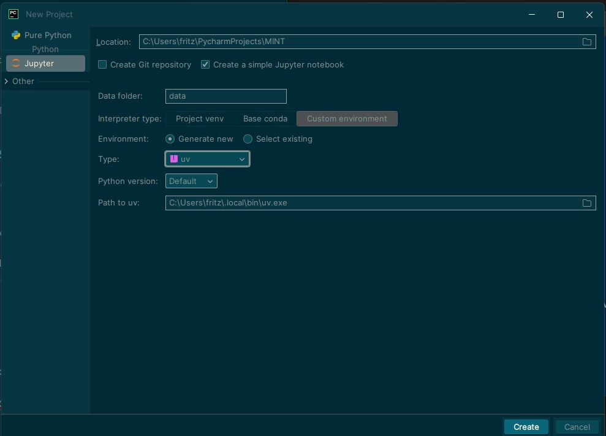

Öffnen des Diloges "Neues Projekt"


damit das aktuelle Jupyter Notebook auch im Browser isoliert angezeigt werden kann muss auch der klassischen Notebook-Server installiert werden.

```powershell
uv pip install notebook nbclassic
```

- **404-Fehler bei `/notebooks/…`** entstehen oft, wenn nur `JupyterLab` installiert ist oder der Notebook-Server in der Umgebung fehlt oder falsch konfiguriert ist.
- Jupyter Lab kann über `/lab/tree/...` als URL im Browser aktiviert werden:
  
```text
http://localhost:8888/lab/tree/sample.ipynb

statt

http://localhost:8888/notebooks/sample.ipynb
```
