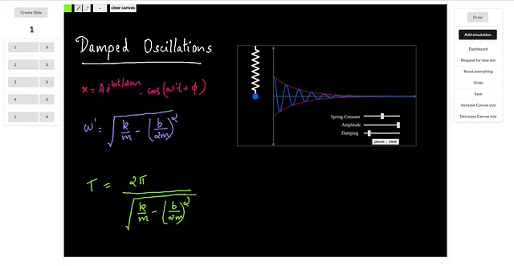
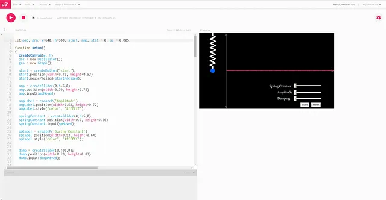
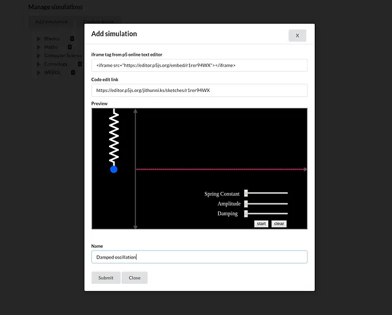
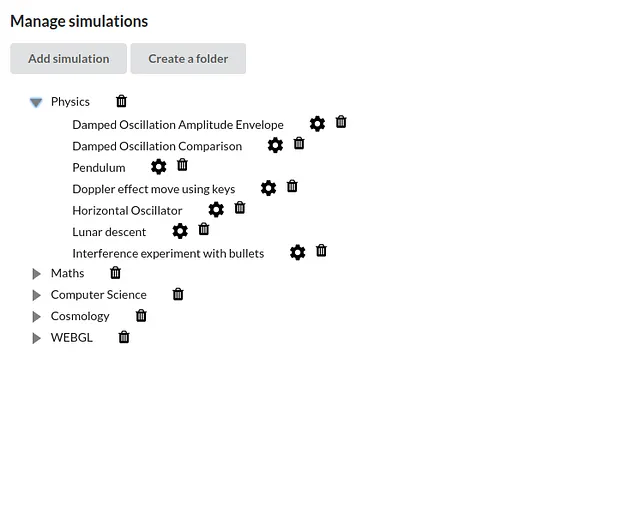
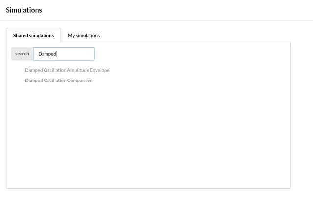

[Sitemap](https://medium.com/sitemap/sitemap.xml)## [Processing Foundation](https://medium.com/processing-foundation?source=post_page---publication_nav-2a37167d7d06-d434beea465c---------------------------------------)

*This summer was the Processing Foundation’s seventh year participating in Google Summer of Code. We received 112 applications, a significant increase from previous years, and were able to offer 16 positions. Over the next few weeks, we’ll be posting articles written by some of the GSoC students, explaining their projects in detail. The series will conclude with a wrap-up post of all the work done by this year’s cohort.*

[Open: 6b586799223fcd1308cdc4392c497606_MD5.webp](_resources/a61547ef3ea50418bad7c106840d83a4_MD5.webp)

A slide in the Lesson plan creator. On the left is the list of slides in the lesson plan, in the middle, the canvas which holds a simulation and some writings, and on the right, the menu bar. \[image description: Most of the frame is filled with a black square that has handwriting in different colors on it. The text reads “Damped Oscillations” and shows mathematical equations and diagrams. On the left side of the image is a list of the number of slides. This image shows that we are on the first slide. On the right side of the image is a menu with buttons that include: “Draw, Add Simulation, Dashboard, Request for new sim, Reset everything, Undo, Save, Increase Canvas Size, Decrease Canvas size.”\]

When I was in 8th grade, I stumbled upon an amazing documentary on the Discovery channel called [*Into The Universe With Stephen Hawking: The Story of Everything*](https://www.youtube.com/watch?v=dpma-J68Etc). It completely altered my perception of the world we live in. It made me realize how wonderful and mysterious our universe is. I started admiring the people who’ve strived to shed light upon its mysteries: the scientists. I wanted to become one, but life took a different turn. I couldn’t fulfill this wish because of the problems I faced in assimilating the knowledge of science and math in school. Eventually, I pursued a career in computer science.

I have always wanted to do something to help students who were like me, those who loved science but faced difficulties learning. I found out that interactive visualizations can significantly enhance the comprehension of STEM subject concepts, because they make complex concepts visual and interactive. There are plenty of lessons available on the web, which use interactive visualizations, that beautifully illustrate how various STEM subject concepts work. However, the problem is that not only are most of them scattered across the web, but few of them let you see the source code for yourself, to experiment in creating your own modified versions of the simulations.

A while ago, I came across Daniel Shiffman’s YouTube channel called [Coding Train](https://www.youtube.com/channel/UCvjgXvBlbQiydffZU7m1_aw) and found out that the Javascript library called [p5.js](https://p5js.org/) has immense potential for easily creating interactive visualizations and sharing them on the web. I started thinking about creating an environment that would collect interactive visualizations (created in p5) on different topics in STEM subjects, which could be used by teachers. I realized, though, that it would be impossible for only me or a small number of people to create simulations covering the large collection of topics in STEM subjects. It could be accomplished only through a collective effort.

So I changed my plan. I decided to create an environment in which teachers and creative coders can collaborate on creating lessons that would include interactive visualizations. With the help of my friend, [Anupam Asok](https://medium.com/@anupamasok), I started working and developed [a web app called Dynamic Learning](http://dynamiclearning.io/), which was accepted into Google Summer of Code 2018, under Processing Foundation.

Here are the core features we hoped to include in the app:

1) Teachers are able to create, save, present, and share lessons which make use of interactive visualizations;

2) Teachers are able to collaborate with creative coders to produce new simulations;

3) Students are able to use the interactive visualizations simultaneously as they watch video lessons.

These features were implemented with the help of the functionalities in the app listed below.

[*Creation of lesson plans*](http://dynamiclearning.io/createlessonplan)

The lesson plan consists of a sequence of slides, with each slide containing a group of simulations and writings. A teacher can show the lesson plan to the class, or they can use the lesson plan to prepare screen-recorded video lessons. The lesson plan can also be shared with other teachers if needed. The state of a simulation in a slide can be preserved and retained by saving and loading its necessary parameters as Javascript objects.

*Adding simulations*

I decided to integrate the [online p5 text editor](https://alpha.editor.p5js.org/) project into Dynamic Learning, because it allows you to prepare your simulations in the online text editor and import them into Dynamic Learning using the iframe share feature. One of the coolest things about this is that if a user wants to see the code of a simulation, they can immediately view it and even edit it in the online text editor.

[Open: a417e00932681394d7977e28c047caa4_MD5.webp](_resources/e0ae7e21d0eb8946cf95ef35609ad499_MD5.webp)

Code for a simulation in the online text editor. The simulations are made from the online text editor and then imported to Dynamic Learning. \[image description: Screenshot that shows the p5.js online text editor. The window is divided in half vertically. On the left side of the image is code written in p5. On the right is a preview image of a simulation. It is a black rectangle with a white line showing an oscillation. There are three bars that let the user control spring constant, amplitude, and damping.\]

Additionally, if a teacher wants to illustrate a feature which is not in a simulation, with a single click, they can move to the online text editor and create their own modified version of the simulation, which can be used in the lesson plan.

[Open: 4ef9af8d27c006e833ad3af02951dcfd_MD5.webp](_resources/bac699e34dbab892cd7c94f4f4858979_MD5.webp)

Simulations can be added using the iframe export feature in the p5 online text editor. The first field takes in the iframe tag of the simulation, and the second field takes in the code edit link obtained from the online text editor. \[image description: A window with the heading “Add Simulation” gives code for the iframe tag from the p5 online text editor. There are two text fields below this, and then a preview image that takes up much of the window. A field offers the link for “Code edit link.” Below this, the preview image shows the same oscillation image as the simulation before. At the bottom of the window, the user can give the simulation a name and click on of two buttons, either Submit or Close.\]

*Creating dynamic lessons*

Students can use the simulations at the same time they view the tutorials. This is done by splitting the screen. On one side we have the video tutorial, and on the other, the interactive visualizations. This feature gives the students the ability to experiment with the simulations and gain more insight about different cases that have not been discussed in the lesson. The students can also see the code of the simulation and experiment with it to further their understanding of the system under study.

*The collaboration of teachers and creative coders*

Teachers can create forum posts requesting new simulations or modifications to existing simulations. These requests will be visible to the other users, and if they want to, they can participate in the discussions and help the teachers to create or modify simulations.

Please note that the above two features (dynamic lessons and collaboration) have not been fully implemented yet. They are still under development.

Organizing contents using nested file structures. Folders can be made and the simulations can be added to the folder by dragging them into it. \[image description: A window with the heading “Manage Simulations,” and two buttons, “Add Simulation” and “Create a folder.” A nested file structure below the title shows the main folders as, Physics, Maths, Computer Science, Cosmology, and WEBGL. The Physics folder has been dropped down, and nested within it are: Damped Oscillation Amplitude Envelope, Damped Oscillation Comparison, Pendulum, Doppler Effect move using keys, Horizontal Oscillator, Lunar Descent, and Interference experiment with bullets. Beside each folder and subfolder heading are trash and gear icons.\]

*Organizing lesson plans, lessons, and simulations*

The app helps you to neatly organize the contents by creating nested file structures.

Searching for simulations shared by others. As more and more users start using the web app, the collection of simulations increases. \[image description: A window with the heading “Simulations,” shows two tabs: Shared simulations and My simulations. This image shows the Shared Simulations Tab, where the word “Damped” is being searched in search bar. Two results are being shown below: Damped Oscillation Amplitude Envelope and Damped Oscillation Comparison.\]

The main objective for our participation in GSoC 2018 was to lay down a basic structure of the app, to act as a foundation for future developments, and to introduce the idea to teachers and future contributors. I’m happy that the project has had an excellent head start because of the guidance from the Processing Foundation and the creators of p5. I’m now looking forward to continuing the development, in particular by improving the overall user experience and design of the application by sharing it with teachers and hearing their feedback.

I’d like to thank my mentor Saber Khan, my friend [Anupam Asok](https://medium.com/@anupamasok), and Cassie Tarakajian, Lauren McCarthy, Daniel Shiffman, Casey Reas, who have helped me. If you are interested in contributing to the project or giving any sort of suggestions, feel free to contact me.

My email is jithunni.ks@gmail.com

Web app — [http://dynamiclearning.io](http://dynamiclearning.io/)

Github repo — [https://github.com/JithinKS97/dynamic-learning-app](https://github.com/JithinKS97/dynamic-learning-app)

**If you are a teacher, please set aside a few minutes to fill out** [**this questionnaire**](http://bit.ly/gecdl)**, which would help me improve the app.**

[Last published Mar 31, 2025](https://medium.com/processing-foundation/p5-js-2-0-you-are-here-f827f40519a7?source=post_page---post_publication_info--d434beea465c---------------------------------------)

The Processing Foundation promotes software learning within the arts, artistic learning within technology, and celebrates diversity within these fields.

## More from Processing Foundation and Processing Foundation

## Recommended from Medium

[

See more recommendations

](https://medium.com/?source=post_page---read_next_recirc--d434beea465c---------------------------------------)