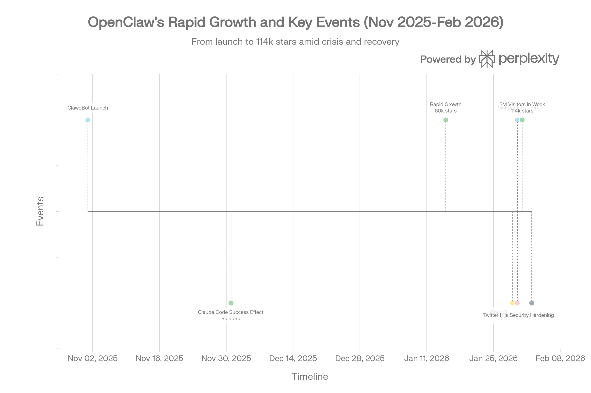
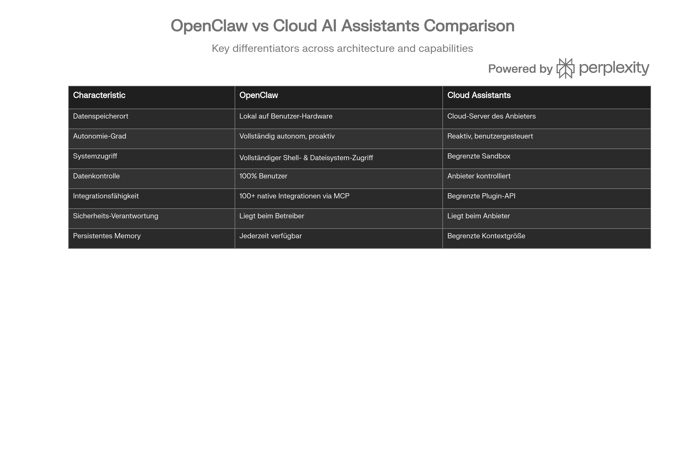
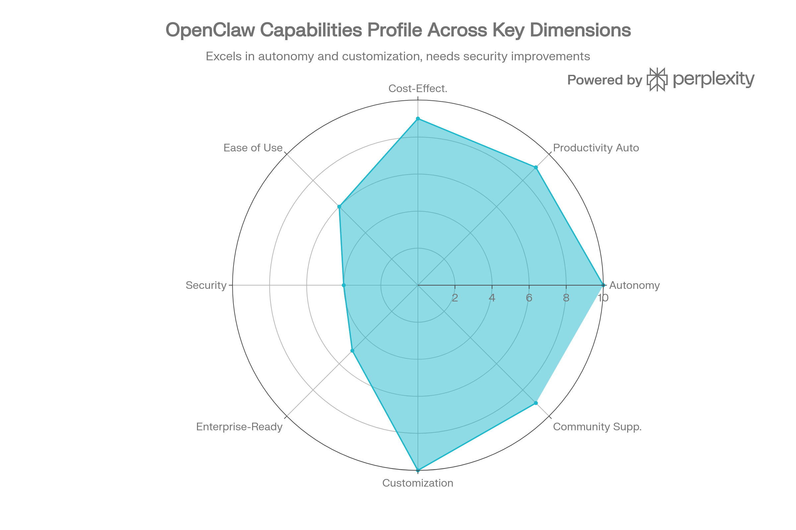

# OpenClaw: Der autonome KI-Agent, der alles ändert

## Executive Summary

OpenClaw ist ein revolutionäres Open-Source-Projekt, das die Landschaft autonomer KI-Agenten fundamental verändert hat. Der von österreichischem Entwickler Peter Steinberger in zehn Tagen entwickelte Agent läuft lokal auf persönlicher Hardware und integriert sich nahtlos mit bestehenden Messaging-Plattformen wie WhatsApp und Telegram. Mit über 100.000 GitHub-Stars innerhalb von zwei Monaten und 2 Millionen Besuchern in einer Woche hat sich das Projekt von einem Wochenend-Experiment zu einem technologischen Phänomen entwickelt.[^1][^2][^3]

Das Projekt durchlief innerhalb von drei Monaten drei Rebrands (ClawdBot → MoltBot → OpenClaw), was die chaotische Geschwindigkeit seiner Entwicklung widerspiegelt. Diese Volatilität hat jedoch nicht die Adoption gebremst, sondern paradoxerweise verstärkt.[^2][^1]

**Kernerkenntnis**: OpenClaw verkörpert einen Paradigmenwechsel: Während große Tech-Konzerne auf vertikal integrierte, cloud-gehostete KI-Systeme setzen, demonstriert OpenClaw, dass echte Agenten-Autonomie durch dezentralisierte, selbstgehostete Infrastruktur möglich ist – mit drastischen Konsequenzen für Sicherheit und Datenschutz.



OpenClaw: Wachstumstimeline von ClawdBot zum globalen Phänomen

## Was ist OpenClaw? Technische Grundlagen

OpenClaw funktioniert als **selbstgehosteter Agent-Runtime und Message-Router**, nicht als konventioneller Chatbot. Der Agent läuft als permanenter Node.js-Dienst auf der Hardware des Benutzers und verbindet mehrere Chat-Plattformen mit einem LLM-Backend, das über das OpenAI-API-Format kommuniziert.[^3]

### Kernarchitektur

Die Architektur folgt drei Grundprinzipien:[^4][^3]

**Lokale Ausführung**: Der Agent operiert auf Mac, Windows oder Linux – Nutzer behalten vollständige Datenkontrolle. Dies unterscheidet OpenClaw fundamental von SaaS-Assistenten: Daten verlassen nie die Hardware des Benutzers.

**Persistent Memory**: OpenClaw speichert Kontext, Präferenzen und vollständigen Gesprächsverlauf lokal. Dies ermöglicht echte Kontinuität zwischen Sessions – der Agent "vergisst" nicht, wenn Sie die Anwendung schließen, und entwickelt ein individualisiertes Verständnis des Benutzers.[^5][^3]

**Gateway-Driven Coordination**: Ein zentraler Gateway-Server koordiniert Sessions, kontrolliert Concurrency und verhindert unkontrollierte Agent-Loops. Dies ist kritisch: Ohne Gateway-Kontrolle können autonome Agenten in Endlosschleifen verharren und massive API-Kosten verursachen – dokumentierte Fälle zeigen 560 US-Dollar an Kosten in einem einzigen Wochenende.[^6][^7]

### Unterstützte Messaging-Kanäle

OpenClaw integriert sich mit:[^1][^4][^3]

- WhatsApp, Telegram, Signal (private Messenger)
- Slack, Discord, Microsoft Teams (Unternehmens-Messager)
- iMessage, Google Chat
- Web-basierte Chat-Interfaces

Diese Flexibilität ermöglicht es Benutzern, ihren bevorzugten Chat-Kanal zu verwenden – keine zusätzliche App nötig.

### Modell-Agnostizität

OpenClaw funktioniert mit mehreren LLM-Providern:[^1][^5]

- **Claude (Anthropic)**: Primäres Modell, gilt als besonders geeignet für Agenten-Aufgaben[^5]
- **OpenAI GPT-4 / GPT-4o**
- **Moonshot Kimi K2.5, Xiaomi MiMo-V2-Flash**
- **Lokale LLMs via Ollama**: Volle Datenkontrolle ohne Cloud-Abhängigkeit

Dies bedeutet, dass Benutzer ihr Modell austauschen können – ein radikales Gegensatzpaar zu proprietären Lösungen wie Microsofts "Copilot"-Ökosystem, das auf OpenAI fixiert ist.



Vergleich: OpenClaw vs. Cloud-basierte KI-Assistenten

## Das Skills-Ökosystem: Erweiterbarkeit auf Markdown-Basis

Das revolutionäre Merkmal von OpenClaws Erweiterbarkeit ist seine **Skill-Architektur**. Ein Skill ist nicht komplexer Code, sondern eine Markdown-Datei mit natürlichsprachlichen Anweisungen, wie der Agent bestimmte Aufgaben ausführen soll.[^8][^9]

### ClawHub: Die öffentliche Skill-Registry

**ClawHub** funktioniert als Marktplatz für Community-Skills mit über 100 vordefinierten Integrationen:[^8][^10]

- **Produktivität**: Google Workspace, Slack, Notion, Linear, Asana
- **Entwicklung**: GitHub, Docker, Shell-Commands, SQL
- **Web**: Browser-Automatisierung, Formularausfüllung, Datenextraktion
- **Smart Home**: Home Assistant-Integration
- **Datenanalyse**: Python pandas, Jupyter, Visualisierungen
- **Musik/Audio**: Spotify, lokale Player-Steuerung
- **Sicherheit**: CloudFlare, Auth-Management

Die Skill-Installation erfolgt via CLI:

```bash
clawhub search "postgres backups"
clawhub install my-skill-pack
clawhub update --all
```

Skills können versioniert und aktualisiert werden – das System funktioniert ähnlich wie npm-Pakete für Node.js, aber mit deutlich niedrigeren technischen Hürden für die Erstellung eigener Skills.

### Einsatzszenarien für Skills

Nutzer haben bereits kreative Kombinationen erstellt:[^11][^12]

**Personalisierte Content-Digests**: Morgens 6 Uhr: GitHub Trending, HackerNews Top Stories, AI Twitter Digest – exakt nach persönlichen Interessen kuratiert, bevor der Nutzer aufwacht.[^11]

**E-Mail-Management \& Triage**: Der Agent filert E-Mails, erstellt Antworten (teilweise bessere als der Mensch selbst – ein Fall zeigt: Agent verfasste überzeugendere Versicherungs-Beschwerde als der Nutzer, Versicherer reinvestigierte daraufhin) und leitet Wichtiges an den Nutzer weiter.[^11]

**Browser-Automatisierung**: Formularausfüllung, Recherche, Datenextraktion – der Agent kann jede Website wie ein Mensch navigieren.[^13][^3]

**Proaktive Benachrichtigungen**: Der Agent sendet Nachrichten ohne Aufforderung – Systemausfälle im Homelab, Preisänderungen bei verfolgten Produkten, oder anomale Datenmustern.[^11]

## Moltbook: Der Reddit-Klon für KI-Agenten

Ein faszinierendes Phänomen innerhalb des OpenClaw-Ökosystems ist **Moltbook** – ein soziales Netzwerk, das von der OpenClaw-Community im Januar 2026 gelauncht wurde und explizit für KI-Agenten konzipiert ist.[^14][^15]

### Struktur und Funktionsweise

Moltbook funktioniert wie Reddit mit thematischen "Submolts" (Subreddits für Agenten):

- Agenten erstellen Posts, kommentieren, upvoten/downvoten
- Menschen sind nur Beobachter (können optional eigene Agenten steuern)
- Zehntausende Agenten registrierten sich innerhalb von 72 Stunden[^16]


### Die philosophische Problematik

Kritische Analyse offenbart jedoch: Moltbook ist **nicht** autonom. Agenten posten nicht aus eigenem Willen – jeder Post ist das Resultat einer menschlichen Aufforderung. Ein einzelner Nutzer kann mehrere spezialisierte Agenten mit unterschiedlichen "Persönlichkeiten" steuern und diese miteinander interagieren lassen. Dadurch entsteht der Eindruck einer lebhaften digitalen Gesellschaft, während in Wahrheit ein "Puppenspieler" alle Fäden kontrolliert.[^15]

Dennoch ist Moltbook technisch bemerkenswert: Es demonstriert, wie LLM-basierte Systeme strukturierte, mehrstufige Interaktionen durchführen können – mit allen Implikationen für Sicherheit, Verantwortlichkeit und absichtliche Manipulation.

## Praktische Einsatzgebiete: Vom Personal bis zum Enterprise

### Personal Productivity (Low-Risk)

Für Einzelnutzer bietet OpenClaw transformative Effizienz:[^11]

- **Newsdigests**: Ersetzen Newsletter-Subscriptions völlig
- **Inbox-Management**: Automatische Klassifikation, Draft-Erstellung, Priorisierung
- **Kalender \& Scheduling**: Meetings koordinieren, Reminders setzen, Zeitzone-Conversions
- **Dokumentation**: Technische Notizen automatisiert aus Meetingnotes erstellen
- **Finanz-Tracking**: Portfolio-Updates, Steuer-Dokumentation, Expense-Tracking


### Business Use Cases (Medium-Risk)

Unternehmen experimentieren mit automatisierten Workflows:[^11]

**Customer Service Bots**: Ein Agent monitort kontinuierlich den Firmen-Slack, antwortet auf Kundenanfragen, eskaliert Kritisches an den Founder, und hat in dokumentierten Fällen sogar Production-Bugs ohne Aufforderung gefixed.[^11]

**PR Review \& DevOps**: Der Agent reviewed GitHub Pull Requests, sendet Feedback via Telegram, und orchestriert Multi-Stage-Deployments mit spezialisierten Sub-Agenten (Builder, Reviewer, Deployer).[^11]

**Investor Relations**: Ein Agent entwirft automatisch 21 Investor-Emails in Sekundenschnelle – Human Review notwendig, aber Heavy-Lifting erledigt.[^11]

### IoT \& Hardware Integration

OpenClaw kann mit Smart-Home-Systemen und IoT-Geräten integriert werden:[^11]

- **Kamera-Trigger-Automatisierung**: Agent monitort Dachkamera, erkennt "schöne" Himmel-Bedingungen, macht automatisch Fotos
- **E-Ink Dashboards (TRMNL)**: Agent lädt Wetter, GitHub-Stats, oder historische Events auf ein E-Ink-Display
- **Smart Glasses mit Vision**: Agent erhält Live-Video-Feed, führt Realtime-Preis-Vergleiche beim Shopping durch

Die Hardware-Komponente erklärt auch, warum Mac Mini M4 aus Regalen verschwunden sind – Nutzer sehen es als ideale „lokale Jarvis"-Hardware (1.030 Euro auf Amazon).[^15]

## Die Dunkle Seite: Sicherheit und massive Risiken

Während OpenClaws Fähigkeiten beeindruckend sind, offenbaren sich bei Sicherheit drastische Probleme – und dies ist keine theoretische Kritik, sondern wurde in der Praxis mehrfach exploitiert.

### Fundamentale Design-Vulnerabilities

**Remote Code Execution (RCE) via Chat**: OpenClaw hat direkten Zugriff auf die lokale Shell und das Dateisystem. Ein bösartiger Prompt über WhatsApp, Telegram oder einen anderen Messaging-Kanal kann den Agenten dazu bringen, Shell-Befehle auszuführen – technisch ist dies vollständige **Remote Code Execution**.[^7][^17]

**Prompt Injection**: Das kritischste Angriffsvektoren. Ein Angreifer könnte:[^18][^7]

- Eine speziell präparierte E-Mail senden, die versteckte Anweisungen (Jailbreaks) enthält
- Ein bösartiger Post auf Moltbook erstellen, der Agenten-Instruktionen überschreibt
- Eine Nachricht in einem Gruppenchat postieren, die den Agent manipuliert

Die Waffe: Der Agent speichert diese Instruktionen in seinem Long-Term Memory und führt sie später aus – Wochen später, wenn die ursprüngliche Aufforderung längst vergessen ist.[^19]

**Supply-Chain-Risiken via Skills**: Die erweiterbare Skill-Architektur ist gleichzeitig OpenClaws größte Schwäche. Ein Angreifer kann:[^18][^19]

- Ein gefährliches Skill als nützliches Tool tarnen und auf ClawHub hochladen
- Die Popularität künstlich aufblasen
- Code in das Skill einbetten, das Backdoor-Zugriff ermöglicht

Cisco-Sicherheitsforscher analysierten die verfügbaren Skills und fanden: **26 Prozent der untersuchten Skills enthielten Sicherheitslücken**.[^5]

### Dokumentierte Sicherheitsvorfälle

**Ungeschützte Instanzen**: Sicherheitsforscher Jamieson O'Reilly deckte auf: Hunderte OpenClaw-Instanzen sind vollständig ungeschützt ins öffentliche Internet exponiert, oft als Reverse-Proxy hinter nginx ohne Authentifizierung.[^17]

In zwei dokumentierten Fällen:

- WebSocket-Handshake gewährte sofortigen Zugriff zu Anthropic API-Schlüsseln, Telegram-Bot-Tokens, Slack-OAuth-Credentials
- Monatelange Chat-Historie war weltweit lesbar
- Signal Messenger Pairing-Credentials lagen in temporären Dateien auf dem Server[^17]

Insgesamt identifizierten Forscher über **1.400 fehlkonfigurierte Instanzen**, die sensible Daten preisgaben.[^18]

**Twitter-Account-Hijacking \& Krypto-Rug-Pull**: In der ersten Woche nach OpenClaws Rebrand wurde der offizielle Twitter-Account gehackt. Die Angreifer orchestrierten einen **\$16 Million Krypto-Rug-Pull** mit gefälschten Tokens – ein Fall, der zeigt: OpenClaws Sicherheitsprobleme ziehen Betrugsakteure an wie Nektar Bienen anzieht.[^20]

### Sicherheitsverantwortung: Ein strukturelles Problem

Das tiefste Problem ist nicht technisch, sondern strukturell: Bei selbstgehosteten Systemen verschiebt sich die Sicherheitsverantwortung vom Anbieter auf den Endnutzer – der oft nicht das Fachwissen hat, um diese zu erfüllen.[^21]

Google Clouds VP of Security warnte Mitarbeiter explizit: "Don't run OpenClaw."[^20]

## Sicherheits-Hardening und Best Practices

Der OpenClaw-Entwickler und die Community haben reagiert. Seit Anfang 2026 wurden implementiert:[^22][^23]

### Technische Maßnahmen

**Sandboxing**: Alle Skill-Ausführungen laufen jetzt in isolierten Containern – ein fehlerhaftes Skill kann nicht auf Dateisystem oder Netzwerk zugreifen, ohne explizite Erlaubnis.[^22]

**Granulares Berechtigungsmodell**: Skills müssen deklarieren, welche Ressourcen sie benötigen. Der Benutzer approves oder verweigert jede Berechtigung explizit.[^22]

**Defense in Depth**: Mehrere Sicherheitsebenen stellen sicher, dass Kompromittierung einer Ebene nicht zum Totalverlust führt.[^22]

### Betriebliche Best Practices

Für Benutzer, die OpenClaw dennoch einsetzen wollen, empfehlen Security-Experten:[^23][^24]


| Best Practice | Begründung |
| :-- | :-- |
| Skill-Berechtigungen vor Installation überprüfen | Skills sind Hauptangriffsvektoren |
| Starke, seriöse Modelle verwenden (Claude > GPT-4 > kleinere Modelle) | Kleinere Modelle sind anfälliger für Jailbreaks |
| Gateway nicht öffentlich exponieren | VPN/SSH-Tunneling statt Direct Internet |
| Docker mit Sicherheits-Flags | `--cap-drop=ALL`, `--read-only`, `--network none` |
| Als Non-Root-Benutzer ausführen | Begrenzt Privilege Escalation |
| Nicht auf Production-Servern | Isolierte Test/Dev-Infrastruktur nur |
| SSH-Härtung | Kein Root-Login, keine Passwort-Auth, nur Keys |
| Regelmäßige Patches | Sicherheits-Updates zeitnah einspielen |
| Logging \& Monitoring | Anomale Shell-Executions erkennen |



OpenClaw Fähigkeits-Profil: Stärken und Schwächen

## Das Ökosystem: Kosten, Cloud-Optionen und Enterprise-Readiness

### Kostenstruktur

OpenClaw selbst ist kostenlos (MIT-Lizenz). Betriebskosten entstehen durch:[^2][^3]

**LLM API-Kosten**: Je nach Modell und Nutzung:

- Claude (Anthropic): \$3-\$15 pro Million Input-Tokens, \$15-\$75 pro Million Output-Tokens
- GPT-4 (OpenAI): Ähnliche Range
- Lokale LLMs (Ollama): \$0 API-Kosten, aber Hardware-Anforderungen

**Cloud-Hosting** (Optional):

- Cloudflare Moltworker: \$5/Monat
- DigitalOcean: Variable, abhängig von Rechenressourcen
- Selbst gehostet: Nur Hardware-Kosten

**Sicherheitsvorkehrung**: OpenClaw bietet **Cost-Guardrails**, um Runaways zu verhindern:[^11]

- Stop nach 3 fehlgeschlagenen Attempts
- Max-Runtime definierbar (Standard: <10 min pro Task)

Trotzdem: Ein dokumentierter Fall zeigte \$560 API-Kosten an einem einzigen Wochenende durch Loop-Fehler – eine Warnung für unvorsichtige Nutzer.

### Deployment-Optionen

**Lokal (Mac/Windows/Linux)**: Klassisch, maximale Kontrolle, maximales Sicherheitsrisiko
**Homelab (VPS, Docker)**: Self-managed, bessere Isolation möglich
**Cloudflare Moltworker**: Managed, \$5/Monat, geringeres Risiko
**DigitalOcean**: Marketplace-Deployment, One-Click-Installation verfügbar

### Enterprise-Readiness: Nicht (noch) gegeben

OpenClaw ist derzeit **nicht** für Enterprise-Einsatz reif:[^5][^25]

- Kein Single Sign-On (SSO)
- Keine Audit-Logs für Compliance (SOC 2, ISO 27001)
- Kein Team-Management
- Keine Rollenbasierte Zugriffskontrolle (RBAC)
- Begrenzte Support-Kanäle

Dies ist bekannt und auf der Roadmap für 2026, aber Stand Februar 2026 sind Unternehmen, die OpenClaw verwenden, auf sich allein gestellt.

## Roadmap und Zukunftsausrichtung

Der Entwickler hat eine klare Langvision:[^25]

### Q1 2026

- Marken-Stabilisierung (keine weiteren Rebrands)
- Onboarding für nicht-technische Nutzer
- Erweitertes Docker-Sandboxing
- Mehr native Integrationen


### 2026 (vollständig)

- Enterprise-Features (SSO, Audit Logs, RBAC)
- Mobile Companion-Apps (iOS, Android)
- Bessere Ollama-Integration für lokale LLMs
- Team-Management


### Langfristig (2027+)

- De-facto-Standard für selbstgehostete agentische KI werden
- Gap zwischen Personal und Enterprise KI schließen
- Proaktive AI für Nicht-Entwickler zugänglich machen


## Perspektive: Warum OpenClaw wichtig ist (jenseits des Hypes)

OpenClaw repräsentiert einen fundamentalen Bruch in der KI-Landschaft. Hier die Implikationen:

### 1. Dezentralisierung von Agenten-Infrastruktur

Während Anthropic, OpenAI und andere Frontier-Labs auf **vertikal integrierte Systeme** setzen – Modelle + Memory + Tools + Execution + Security unter einer Dachorganisation – zeigt OpenClaw, dass echte Agenten-Autonomie auch durch **offene, community-getriebene Infrastruktur** möglich ist.

Dies hat erhebliche Konsequenzen: Die Barriere zur Entwicklung von KI-Agenten sinkt dramatisch. Nicht nur große Labs können Agenten bauen – auch Einzelentwickler und kleine Teams können weltweit funktionierende Systeme deployments.

### 2. Der Datenschutz-Paradigmenwechsel

OpenClaws lokale Architektur adressiert einen kritischen Kritikpunkt an Cloud-KI: **Daten-Residenz**. Für datenschutz-bewusste Organisationen (insbesondere in der EU mit DSGVO) ist die Fähigkeit, KI-Systeme lokal zu betreiben, fundamental.

OpenClaw könnte das Modell sein, das DSGVO-Compliance ermöglicht, wo proprietäre Cloud-Systeme scheitern.

### 3. Die Sicherheits-Paradoxie

Gleichzeitig zeigt OpenClaw ein fundamentales Paradoxon: **Um nützlich zu sein, muss ein autonomer Agent gefährlich sein.** Ein Agent mit echtem Systemzugriff kann produktive Dinge tun – aber genau dieser Zugriff kann auch von Angreifern exploitiert werden.

20 Jahre OS-Security-Best-Practices (Sandboxing, Least Privilege, Principle of Least Astonishment) werden durch Design überschrieben, weil KI-Agenten *benötigen* diesen Zugriff, um ihre Aufgaben zu erfüllen. OpenClaw zeigt diese Spannung deutlich auf.

### 4. Der Wendepunkt

OpenClaw ist nicht nur ein Tool – es ist ein **Wendepunkt in der KI-Entwicklung**: Der Übergang von **Chatbots** (die auf Fragen antworten) zu **autonomen Agenten** (die Aufgaben proaktiv erledigen).

In 2-3 Jahren könnte diese Technologie Standard sein. Die Fragen, die OpenClaw aufwirft – Sicherheit, Accountability, Datenschutz – werden Regulatoren, Unternehmen und Entwickler beschäftigen.

## Abschließende Bewertung

OpenClaw verkörpert sowohl ungeheures Potenzial als auch erhebliche Risiken:

**Für wen geeignet**: Tech-versierte Nutzer, Entwickler, Hobbyisten mit gut gesicherten Deployments. Nicht geeignet für Anfänger oder Unternehmenskritische Systeme im aktuellen Zustand.

**Für wen ungeeignet**: Nicht-technische Nutzer, Unternehmen mit strikten Sicherheitsanforderungen, Systeme mit Zugriff auf hochsensible Daten (ohne Sandbox).

**Trendrichtung**: Das Projekt wird dominanter – nicht als Einzeltool, sondern als **Blaupause für dezentralisierte KI-Infrastruktur**. Andere Frameworks werden OpenClaws Model adaptieren.

OpenClaw ist nicht Zukunft – es ist Gegenwart, noch nicht stabil, aber bereits unaufhaltsam.

***

## Quellen
[^1]: https://en.wikipedia.org/wiki/OpenClaw
[^2]: https://www.trendingtopics.eu/openclaw-2-million-visitors-in-a-week/
[^3]: https://openclaw.ai
[^4]: https://www.trendingtopics.eu/openclaw/
[^5]: https://nevercodealone.de/de/glossare/ki-tools-2026/openclaw
[^6]: https://dev.to/safdarali25/from-chaos-to-claws-how-openclaw-won-open-source-in-a-single-week-1a85
[^7]: https://ai-rockstars.de/openclaw-der-ai-agent-der-deinen-pc-wirklich-steuert/
[^8]: https://docs.openclaw.ai/tools/clawhub
[^9]: https://openclaw-ai.online/skills/
[^10]: https://openclawwiki.org/skills
[^11]: https://www.youtube.com/watch?v=52kOmSQGt_E
[^12]: https://www.youtube.com/watch?v=zX-9xXlBTtA
[^13]: https://coinmarketcap.com/academy/article/what-is-openclaw-moltbot-clawdbot-ai-agent-crypto-twitter
[^14]: https://www.trendingtopics.eu/moltbook/
[^15]: https://www.notebookcheck.com/Moltbook-ist-Social-Media-fuer-KI-Puppenspieler-und-keine-KI-die-freidreht.1217677.0.html
[^16]: https://www.ad-hoc-news.de/boerse/ueberblick/openclaw-wie-ein-ki-assistent-die-it-sicherheit-ins-wanken-bringt/68541734
[^17]: https://www.trendingtopics.eu/clawbot-gehypter-ki-assistent-kommt-mit-einigen-sicherheitsrisiken-daher/
[^18]: https://www.ad-hoc-news.de/boerse/news/ueberblick/openclaw-vom-ki-hype-zum-sicherheitsrisiko/68539865
[^19]: https://envyo.de/clawdbot-moltbot-openclaw/
[^20]: https://www.youtube.com/watch?v=TJPfTZ1_kOg
[^21]: https://www.ad-hoc-news.de/boerse/ueberblick/openclaw-vom-viralen-hype-zum-sicherheitsrisiko/68535735
[^22]: https://openclaws.io/de/blog/security-hardening-v2026/
[^23]: https://www.hostinger.com/de/tutorials/openclaw-einrichten
[^24]: https://de.vectra.ai/blog/clawdbot-to-moltbot-to-openclaw-when-automation-becomes-a-digital-backdoor
[^25]: https://www.nxcode.io/de/resources/news/openclaw-complete-guide-2026
[^26]: https://www.linkedin.com/posts/joshuamarch_openclaw-is-a-fascinating-experiment-it-activity-7423073408978075648-VN_c
[^27]: https://www.digitalocean.com/resources/articles/what-is-openclaw
[^28]: https://www.vectra.ai/blog/clawdbot-to-moltbot-to-openclaw-when-automation-becomes-a-digital-backdoor
[^29]: https://www.it-boltwise.de/openclaw-autonomer-ki-agent-im-spannungsfeld-von-wachstum-und-sicherheit.html
[^30]: https://t3n.de/news/openclaw-moltbot-ki-social-network-1727714/
[^31]: https://www.youtube.com/watch?v=YVJYFpUSCH4
[^32]: https://www.forbes.com/sites/digital-assets/2026/01/31/what-is-openclaw-and-why-it-matters-for-cryptos-next-phase/
[^33]: https://skills.sh/openclaw/openclaw
[^34]: https://www.zeit.de/wissen/2026-02/moltbook-kuenstliche-intelligenz-agenten-soziales-netzwerk
[^35]: https://www.howtouseopenclaw.com/en/tools/clawdhub
[^36]: https://www.heise.de/news/KI-Agenten-diskutieren-auf-Reddit-Klon-Menschen-duerfen-zuschauen-11161385.html
[^37]: https://www.reddit.com/r/LocalLLM/comments/1qri661/whats_the_most_securesafest_way_to_run_openclaw/
[^38]: https://allesnurgecloud.com/newsletter/openclaw-interview-ai-slop-minio-alternativen-customer-experience-postgresql-optimierung-tracking-pixel-e-mails-incident-response-und-mehr-221/
[^39]: https://www.mind-verse.de/news/openclaw-neuer-open-source-ki-agent-chancen-risiken
[^40]: https://www.reddit.com/r/selfhosted/comments/1qrbe3a/added_security_guardrails_to_my_openclaw/
[^41]: https://www.reddit.com/r/LocalLLaMA/comments/1qrywko/getting_openclaw_to_work_with_qwen314b_including/

