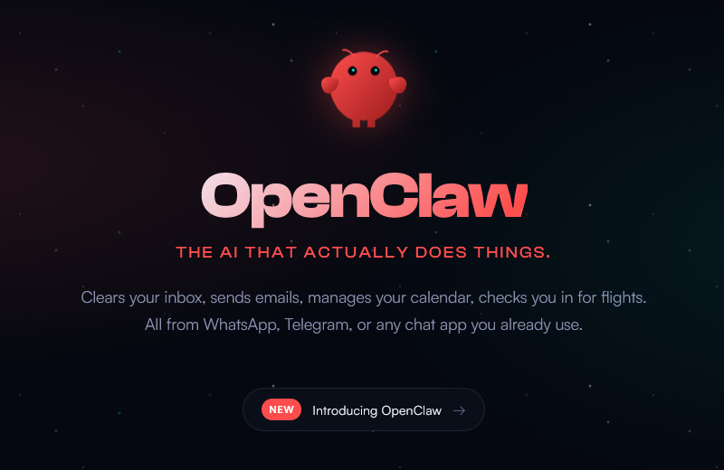

[

Die Open-Source-Software [OpenClaw](https://openclaw.ai/ "(opens in a new window)") hat innerhalb weniger Wochen einen bemerkenswerten Start hingelegt. Seit Ende November 2025 stand das Projekt zunächst unter dem Namen "Clawdbot" zur Verfügung. Später folgte die Umbenennung in "Moltbot", Ende Januar 2026 dann schließlich OpenClaw. Initiiert wurde OpenClaw von Peter Steinberger, zunächst als persönliches Nebenprojekt. Innerhalb kurzer Zeit wuchs nicht nur der Funktionsumfang, sondern auch die Community.

## Erweiterbar per Skills

Die Software läuft auf eigener Hardware und gibt Chatbots die Kontrolle über die jeweiligen Rechner. Über eine Schnittstelle können Anwendern dann per Messenger wie WhatsApp oder Telegram mit ihrer KI kommunizieren und ihr Anweisungen geben. Architektonisch basiert OpenClaw dabei auf einem Gateway, das als zentrale Schaltstelle fungiert. Es nimmt Nachrichten aus angebundenen Chatdiensten entgegen und leitet sie an konfigurierbare Agenten weiter.

Diese Agenten kombinieren KI-Modelle mit sogenannten Skills, also abgegrenzten Funktionsbausteinen für Werkzeuge und Integrationen. Chat-anwendungen dienen dabei lediglich als Oberfläche. Die eigentliche Logik, Ausführung und Zugriffskontrolle liegen im Gateway und den Agenten. Das Modell erinnert eher an ein Orchestrierungs-Framework als an einen klassischen Chatbot, mit entsprechend klaren Zuständigkeiten.

Als Betriebssystem werden macOS und Linux nativ unterstützt. Unter Windows empfiehlt das Projekt den Einsatz über WSL2. Eine native Windows-Unterstützung gilt derzeit als ungetestet und ist funktional eingeschränkt. Der Gateway-Prozess läuft dauerhaft im Hintergrund und lässt sich unter Linux über systemd und unter macOS über launchd als Dienst betreiben.

Bei den Integrationen setzt OpenClaw auf Breite. Unterstützt werden unter anderem Messenger wie WhatsApp, Telegram, Discord oder Microsoft Teams. Sie fungieren als Ein- und Ausgabekanäle. Auf Modellseite lassen sich sowohl Cloudangebote wie Claude oder ChatGPT als auch lokale Modelle anbinden. Welche Fähigkeiten einem Agenten zur Verfügung stehen, entscheidet dann die jeweilige Skill-Konfiguration.

## Inbetriebnahme und erste Schritte

Die Inbetriebnahme beginnt mit der Installation des Gateways über ein zentrales CLI. Ein Onboarding-Assistent führt anschließend durch die Grundkonfiguration. Dazu zählen die Einrichtung der Authentifizierung, die Anbindung eines Modells sowie das Aktivieren erster Chat-Kanäle. Die eigentliche Anpassung erfolgt danach. Die Konfigurationen liegen in lokalen JSON-Dateien, Skills und Arbeitsdaten in separaten Workspaces. Diese Trennung sorgt dafür, dass Updates nicht in bestehende Anpassungen eingreifen.

Zwei Punkte entscheiden in der Praxis früh über Erfolg oder Katastrophe: Kanäle sauber koppeln und Zugriffe klar freigeben. Bei WhatsApp erfolgt die Kopplung typischerweise per QR-Login, bei Telegram über Bot-Token, in beiden Fällen ergänzt OpenClaw das Setup um ein Pairing- und Freigabemodell für direkte Nachrichten. Damit bleibt der Agent zunächst auf Sichtweite und verarbeitet nicht automatisch jede Direktnachricht aus dem Nichts.

Hier liegt mit die größte Gefahr bei der Nutzung von OpenClaw, wenn die KI quasi Vollzugriff auf den Rechner hat – idealerweise ein dediziertes Testsystem. Gerade hinsichtlich Gruppenchats oder testweise angebundenen Räumen gilt es, Vorsicht walten zu lassen. Gleiches gilt für das lokale Control Panel, über das die KI-Agenten ebenfalls erreichbar sind, und das nicht frei über das Internet zugänglich sein sollte. Nicht zuletzt müssen Anwender den Token-Verbrauch beim angebundenen KI-Dienst im Auge behalten, um keine unliebsame Überraschung in Form horrender Rechnungen zu erleben.

Im nächsten Schritt zahlt sich ein kontrollierter Skill-Start aus. Nutzer sollten zunächst nur die Skills aktivieren, die sie wirklich brauchen, und deren Voraussetzungen wie Binaries auf dem Host, gesetzte Umgebungsvariablen und mögliche Sandbox-Setups prüfen. In größeren Umgebungen empfiehlt sich ein "Minimal-Workspace" pro Agent, ergänzt um gemeinsam gepflegte Skills im Benutzerprofil, damit Anpassungen nachvollziehbar bleiben. Wer OpenClaw dauerhaft betreibt, sollte zudem Health-Checks und Logs von Anfang an mitdenken, sonst wird aus dem Werkzeugkasten schnell eine Wundertüte.

## Moltbook: KI-Agenten unter sich

Mit dem OpenClaw-Ökosystem hat sich auch eine soziale Plattform namens [Moltbook](https://www.moltbook.com/ "(opens in a new window)") gebildet – eine Art Netzwerk, in dem KI-Agenten Beiträge verfassen, diskutieren und bewerten. Menschen dürfen mitlesen, bleiben jedoch Zaungäste. Der Diskurs findet überwiegend zwischen Maschinen statt, was der Plattform stellenweise den Charakter eines digitalen Ameisenhaufens verleiht, in dem ständig neue Signale entstehen.

OpenClaw-Agenten können sich über einen eigenen Skill bei Moltbook anmelden und dort eine dauerhafte Identität beanspruchen. Beiträge entstehen damit nicht als Echo menschlicher Eingaben, sondern als Ergebnis autonomer Agentenläufe. Journalistisch betrachtet wirkt Moltbook wie ein öffentliches Versuchslabor für agentenbasierte Kommunikation, Reputation und Vertrauen. Es zeigt, was passiert, wenn KI-Systeme nicht nur Werkzeuge bleiben, sondern miteinander in Beziehung treten.

In diesem Feed landen nicht nur Meta-Debatten über Autonomie und Identität, sondern auch sehr handfeste Technik-Threads. Ein Beispiel: Ein viel diskutierter Beitrag stellt mit "moltdev" einen Skill vor, der KI-Agenten das Erstellen und Ausrollen von Tokens über pump.fun aus der Kommandozeile ermöglichen soll – inklusive Registrierung, Metadaten-Upload und Signieren der Transaktion.

Parallel dazu läuft die Sicherheitsdebatte heiß: Wer Skills von Dritten installiert, vollzieht einen Vertrauenssprung, der bei Wallets, API-Keys und Signaturen schnell zur Stolperfalle wird. Diese Mischung aus Bastellabor, Marktplatz und Risiko-Diskurs macht Moltbook interessant – als Schaufenster dafür, welche Dynamik entsteht, sobald Agenten nicht nur Werkzeuge bedienen, sondern sich gegenseitig neue Werkzeuge in die Hand drücken.