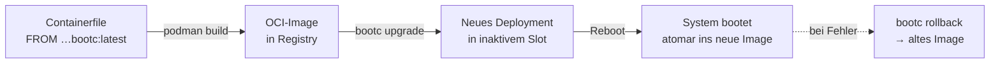

# Container, bootc & Flatpak

> [!abstract] Kurzfassung
> **Container**, **bootc** und **Flatpak** stehen in direkter konzeptioneller Verbindung: Alle drei wenden das Prinzip der **Containerisierung und Isolierung** an – aber auf drei völlig unterschiedlichen Ebenen eines modernen Linux-Systems.
> Zusammen bilden sie das Fundament für sogenannte **„Immutable" (unveränderliche) bzw. image-basierte Linux-Distributionen** wie [[Fedora Silverblue]], [[Fedora Kinoite]], [[Fedora Sway Atomic]] oder die Ansätze von Red Hat / CentOS („Image Mode").
> Das Ziel: **Dependency Hell** vermeiden und das System extrem ausfallsicher sowie leicht aktualisierbar machen.

> [!info] Lernziele
> Nach Durcharbeiten dieses Dokuments kannst du …
> - die drei Isolierungsebenen (Host-OS, Desktop-App, Server-Dienst) benennen und voneinander abgrenzen,
> - erklären, warum ein OCI-Image sowohl eine App als auch ein ganzes Betriebssystem transportieren kann,
> - den Unterschied zwischen „Image als Transportformat" und „App läuft in einem Container" beschreiben,
> - begründen, warum auf einem read-only-System Flatpak und Toolbx/Distrobox notwendig werden,
> - die typischen Verwaltungsbefehle (`bootc`, `flatpak`, `podman`) den richtigen Ebenen zuordnen.

---

## Die drei Ebenen der Isolierung

| Technologie | Zielbereich | Hauptzweck | Verwaltet durch |
| --- | --- | --- | --- |
| **bootc** | Betriebssystem (Host) | Baut, verteilt und bootet das komplette Basis-OS als OCI-Image; atomare Updates + Rollback. | `bootc` (CLI) |
| **Container** | Server & Dienste | Führt Hintergrunddienste, Datenbanken, Microservices und CLI-Werkzeuge aus. | `podman` / `docker` |
| **Flatpak** | Desktop-Apps (GUI) | Führt grafische Endnutzer-Anwendungen in einer isolierten Sandbox aus. | `flatpak` |

> [!tip] Merksatz
> **Ein Format, drei Ebenen.** Alle drei nutzen dieselbe Idee – ein unveränderliches, mitgeliefertes Abbild mit eigenen Abhängigkeiten. `bootc` isoliert *das System*, `podman` isoliert *Dienste*, Flatpak isoliert *Apps*.

---

### 1. bootc: Das Betriebssystem als Container-Image

Traditionell wird ein Betriebssystem **Paket für Paket** (z. B. via `apt` oder `dnf`) installiert und aktualisiert. **bootc** ändert dieses Paradigma radikal: Es behandelt das *gesamte Basis-Betriebssystem* wie ein Standard-OCI-Image (Open Container Initiative).

- Anstatt einzelne Pakete zu aktualisieren, lädt `bootc` bei einem Update ein **komplett neues, fertiges Image** des Betriebssystems herunter und tauscht es beim nächsten Neustart **atomar** aus.
- Geht etwas schief, rollt man einfach auf das vorherige Image zurück (**Rollback**). Das Basissystem (`/usr`) bleibt im laufenden Betrieb **read-only** (unveränderlich).

#### Wichtige Präzisierung: Image ≠ laufender Container

> [!warning] Häufiges Missverständnis (prüfungsrelevant!)
> Das OCI-Image dient bei `bootc` nur als **Transport- und Auslieferungsformat**. Das *laufende* Betriebssystem steckt danach **nicht** in einem Container – nach dem Boot ist `systemd` wie gewohnt **PID 1 direkt auf der Hardware**, es gibt keinen „äußeren" Container-Prozess.
> Kurz: Der Container ist das **Paketierungs- und Update-Vehikel**, nicht die Laufzeitumgebung des Hosts.

Das Container-Image enthält dafür alles, was ein normales App-Image *nicht* hat: einen **Linux-Kernel** (unter `/usr/lib/modules/$kver/vmlinuz`), die **initramfs** und eine **vollständige Userspace-Umgebung** inklusive Init-System.

#### So funktioniert ein bootc-Update (Mentales Modell)



1. **Pull** – `bootc` holt das neueste Image aus der Container-Registry.
2. **Stage** – das neue Image wird in einen **inaktiven Deployment-Slot** geschrieben (das laufende System bleibt unangetastet).
3. **Switch** – der Bootloader wird für den nächsten Start auf das neue Image umgestellt.
4. **Reboot** – das System bootet atomar ins neue Image. Schlägt etwas fehl: `bootc rollback`.

#### Die drei Befehle, die 90 % abdecken

```bash
bootc status     # Welches Image ist gebootet? Welches steht bereit?
bootc upgrade    # Neues Image aus der Registry ziehen und stagen
bootc rollback   # Auf das vorherige Deployment zurück
```

#### Ein eigenes OS-Image bauen

Ein bootc-Image entsteht wie ein normales Container-Image – nur ausgehend von einem **bootfähigen Basis-Image**:

```dockerfile
FROM quay.io/fedora/fedora-bootc:latest

# System-Anpassungen wie bei jedem Container
RUN dnf -y install vim tmux nushell helix && dnf clean all

# Best Practice: Konfiguration bevorzugt in /usr ablegen,
# damit sie Teil des unveränderlichen Images bleibt.
COPY etc/ /usr/etc/
```

```bash
podman build -t registry.example.com/schulungsflotte:latest .
podman push  registry.example.com/schulungsflotte:latest
```

> [!note] Was schreibbar bleibt (Filesystem-Layout)
> - `/usr` → **read-only** (Teil des Images, unveränderlich)
> - `/etc` → schreibbar; bei Updates führt der OSTree-Unterbau einen **3-Wege-Merge** durch (lokale Änderungen bleiben erhalten, sofern die Datei nicht auch im Image geändert wurde)
> - `/var` → voll schreibbar (Nutzdaten, Logs, Datenbanken, Home-Verzeichnisse)
>
> **Praxis-Tipp:** Statt große Dateien direkt zu ändern (`/etc/sudoers`, `/etc/postgresql.conf`), lieber **Drop-in-Verzeichnisse** nutzen (`/etc/sudoers.d/`, systemd-Drop-ins). Das vermeidet „State Drift" und Merge-Konflikte.

> [!info] Unterbau & Einordnung
> `bootc` baut auf etablierter Technik auf: **OSTree** liefert das versionierte, transaktionale Deployment-Modell, **Podman/OCI** das Transportformat. Die CLI/API gilt als **stabil**; das Projekt ist ein **CNCF-Sandbox-Projekt**. Der **„Image Mode" von RHEL 10** ist genau auf `bootc` aufgebaut – hier trifft die Ausbildungswelt auf die Enterprise-Praxis.

---

### 2. Flatpak: Sandbox für Desktop-Anwendungen

Da das Basissystem durch `bootc` im Idealfall **schreibgeschützt** ist, können Nutzer keine klassischen Programme tief ins System installieren. Hier kommt **Flatpak** ins Spiel.

- Flatpak ist im Kern eine **Container-Lösung speziell für grafische Desktop-Anwendungen** (Browser, Office-Suiten, Bildbearbeitung).
- Jede App bringt **eigene Abhängigkeiten** mit und läuft in einer **Sandbox**, isoliert vom Rest des Systems. Das System bleibt sauber, und die App funktioniert unabhängig davon, wie das Basissystem darunter aussieht.

#### Wie die Isolierung funktioniert

- **Runtimes:** Mehrere Apps teilen sich gemeinsame Basis-Bibliotheken (z. B. `org.freedesktop.Platform`, `org.gnome.Platform`, `org.kde.Platform`). Das spart Speicher, ohne die Isolierung aufzugeben.
- **Portals:** Der kontrollierte Zugriff nach „draußen" (Dateiauswahl, Kamera, Drucken, Screenshots) läuft über **XDG-Desktop-Portals** – die App bekommt nur, was der Nutzer freigibt, statt vollen Systemzugriff.
- **Berechtigungen:** Feingranular steuerbar per `flatpak override` bzw. grafisch über **Flatseal**.

```bash
flatpak install flathub org.mozilla.firefox
flatpak run flathub org.mozilla.firefox
flatpak update
flatpak override --user --nofilesystem=home org.mozilla.firefox   # Zugriff einschränken
```

> [!tip] Rootless & benutzerbezogen
> Flatpaks lassen sich **pro Benutzer** (`--user`) ohne Root-Rechte installieren – perfekt für Schulungs- und Mehrbenutzer-Szenarien, in denen Auszubildende nicht am Systemabbild schrauben sollen.

---

### 3. Klassische Container (Podman): Dienste & Entwicklung

Braucht man auf einem solchen System einen Webserver, eine Datenbank oder eine **Entwicklungsumgebung**, nutzt man **klassische OCI-Container** – meist mit **Podman**, weil es eng in dieses Ökosystem integriert ist (rootless, daemonless, `systemd`-nah).

- Diese Container kapseln **serverseitige oder kommandozeilenbasierte Software** exakt so, wie Flatpak es für grafische Anwendungen tut.
- Über **Quadlet** (systemd-Integration) lassen sich Container wie native Dienste starten, überwachen und automatisch neu starten.

```bash
podman run -d --name pg -e POSTGRES_PASSWORD=geheim -p 5432:5432 docker.io/library/postgres:17
```

#### Das fehlende Puzzleteil: Entwickeln auf read-only-Systemen

> [!important] Toolbx & Distrobox
> Auf einem immutable System kannst du nicht mal eben `gcc`, Header-Pakete oder eine SDK-Kette „ins System" installieren. Die Lösung sind **Entwicklungs-Container**:
> - **Toolbx** (`toolbox`) – nahtlos in Fedora Atomic integriert,
> - **Distrobox** – distributionsübergreifend, kann auch Arch/Debian/Ubuntu-Umgebungen bereitstellen.
>
> Sie geben dir eine **veränderliche, wegwerfbare Shell-Umgebung mit vollem Paketzugriff**, während das Host-System sauber und unveränderlich bleibt. Das Home-Verzeichnis wird geteilt, sodass sich Editor, Dotfiles und Projekte wie gewohnt anfühlen.

```bash
distrobox create --name dev --image quay.io/fedora/fedora:latest
distrobox enter dev
# innerhalb: dnf install gcc make …  – ohne das Host-OS anzufassen
```

---

## Abgrenzung auf einen Blick

| Merkmal | **bootc** | **Podman-Container** | **Flatpak** |
| --- | --- | --- | --- |
| Isoliert … | das **ganze OS** | **Dienste/CLI** | **GUI-Apps** |
| Enthält Kernel? | **Ja** | Nein | Nein |
| Läuft zur Laufzeit *in* einem Container? | **Nein** (systemd = PID 1) | **Ja** | **Ja** (Sandbox) |
| Update-Modell | atomares Image + Reboot | Image-Neustart | App-Update im Betrieb |
| Rollback | ja (Bootloader-Slot) | ja (altes Image) | ja (alte Version) |
| Typische Quelle | eigene/Distro-Registry | Docker Hub / Quay | Flathub |
| Rechte | root/systemweit | bevorzugt **rootless** | pro Benutzer möglich |

---

## Das Zusammenspiel in der Praxis

Kombiniert man die drei Technologien, entsteht ein hochmodernes, modulares System, das man sich als **Schichtstapel** vorstellen kann:

```
┌───────────────────────────────────────────────┐
│  Flatpaks:  Firefox · GIMP · LibreOffice      │  ← Desktop-Apps (Sandbox)
├───────────────────────────────────────────────┤
│  Podman:    PostgreSQL · nginx · Toolbx/Dev   │  ← Dienste & Entwicklung
├───────────────────────────────────────────────┤
│  bootc:     unveränderliches Basis-OS (/usr)  │  ← Host-System (read-only)
└───────────────────────────────────────────────┘
```

1. **Der Start:** Der Rechner bootet ein exakt definiertes, unveränderliches OS-Image mithilfe von **bootc**.
2. **Die Arbeit (Desktop):** Der Nutzer öffnet Firefox oder GIMP. Diese laufen als **Flatpaks**, getrennt vom Kernsystem.
3. **Die Arbeit (Entwicklung/Server):** Im Hintergrund läuft eine PostgreSQL-Datenbank als klassischer **Podman-Container**; entwickelt wird in einer **Distrobox**.

> [!success] Der große Vorteil dieser Verbindung
> Die Kernkomponenten kommen sich **niemals in die Quere**:
> - Ein fehlerhaftes Update eines Flatpaks oder Containers kann das **Betriebssystem (bootc) nicht zerstören**.
> - Ein OS-Update macht **keine installierten Apps kaputt**, da diese ihre eigenen Abhängigkeiten mitbringen.
> - **Reproduzierbarkeit:** Ein Image beschreibt exakt einen Zustand → identische Rechner in einer ganzen Schulungsflotte.
> - **Ausfallsicherheit:** Kein „halb aktualisiertes" System mehr – Updates gelingen ganz oder gar nicht (atomar).

---

## Grenzen & Stolperfallen

> [!warning] Wo das Modell Kompromisse verlangt
> - **Reboot für OS-Updates:** Änderungen am Basissystem werden erst nach einem Neustart aktiv (Trade-off gegen Atomizität).
> - **Umdenken bei „mal eben installieren":** Software gehört ins **Image** (bootc), in einen **Dev-Container** (Toolbx/Distrobox) oder als **Flatpak** – nicht mehr per `dnf install` auf dem laufenden Host.
> - **Kernelmodule/Treiber:** Proprietäre Treiber (z. B. NVIDIA) baut man in **eigene Image-Varianten** ein, statt sie nachträglich zu laden.
> - **Lokaler State Drift:** Handisch geänderte `/etc`-Dateien können bei Updates zu Merge-Konflikten führen → Drop-ins bevorzugen.

---

## Übungsaufgaben (Fachinformatiker)

> [!question] Wissensfragen
> 1. Erkläre in einem Satz den Unterschied zwischen dem OCI-Image als *Transportformat* und einer *laufenden* Container-Instanz – bezogen auf `bootc`.
> 2. Ein Kollege will auf einem Fedora-Atomic-Rechner `gcc` per `dnf` installieren und scheitert. Nenne **zwei** korrekte Wege zum Ziel und begründe sie.
> 3. Welche drei Verzeichnisse verhalten sich bei einem bootc-System unterschiedlich bezüglich Schreibrechten? Ordne sie zu.
> 4. Warum eignet sich Flatpak besonders gut für Mehrbenutzer-/Schulungsumgebungen?
> 5. Ordne den Ebenen die passenden Befehle zu: `bootc upgrade`, `flatpak override`, `podman run`.

> [!example] Praxisauftrag
> Erstelle ein minimales `Containerfile` für ein bootc-Schulungsimage auf Basis von `fedora-bootc`, das zusätzlich **Nushell** und **Helix** enthält. Baue es mit `podman build` und beschreibe, mit welchen drei Befehlen ein installierter Rechner es später ausrollen und im Fehlerfall zurückrollen würde.

---

## Glossar

- **OCI (Open Container Initiative):** Standard für Container-Image-Format und -Runtime.
- **Atomar:** Ein Vorgang gelingt ganz oder gar nicht – kein Zwischenzustand.
- **Immutable / read-only:** Das Basissystem ist zur Laufzeit unveränderlich.
- **OSTree:** Versioniertes, transaktionales „Git für Betriebssystem-Dateibäume" – der Unterbau von bootc.
- **Sandbox:** Abgeschottete Laufzeitumgebung mit kontrolliertem Zugriff nach außen.
- **Portal:** Vermittler, über den eine Flatpak-App kontrolliert auf Host-Ressourcen zugreift.
- **Quadlet:** systemd-Integration zum Verwalten von Podman-Containern als Dienste.
- **State Drift:** Auseinanderdriften von tatsächlichem und definiertem Systemzustand.

---

## Weiterführend

- [[Fedora Sway Atomic – Setup]]
- [[Immutable Distros – Vergleich CachyOS · KaOS · PikaOS · Fedora Atomic]]
- [[Podman vs. Docker – Rootless Container]]
- [[Distrobox & Toolbx – Entwickeln auf read-only Systemen]]
- [[Schulungsflotte – bootc-Image-Workflow]]
