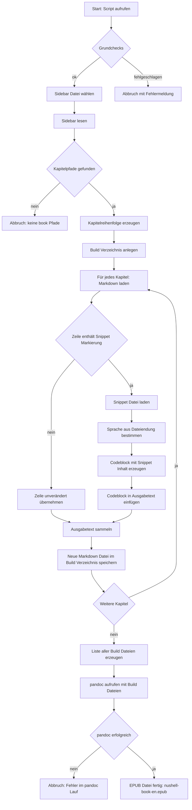

# 🧩 Zweck des Scripts

- Erzeugt eine **EPUB-Version** des **englischen Nushell Books**
- Nutzt die **echte Kapitelreihenfolge** aus der VuePress-Sidebar
- Ersetzt **VuePress-Spezialsyntax**  
    `@[code](@snippets/…)`  
    durch **normale Markdown-Codeblöcke**, die `pandoc` versteht
- Läuft **offline**, ohne VuePress oder Node.js

---

# 0️⃣ Hilfsfunktionen

### `infer_lang`

- Ermittelt anhand der Dateiendung (`.sh`, `.nu`, `.toml`, …)
- die **Sprache für den Markdown-Codeblock**
- Ergebnis wird verwendet in
````md
```lang
````
---

### `expand_file`

- Verarbeitet **eine einzelne Markdown-Datei**
- Schritte:
    - Datei lesen
    - Zeile für Zeile prüfen
    - findet Zeilen mit `@[code](@snippets/…)`
    - lädt die referenzierte Snippet-Datei
    - ersetzt die Zeile durch einen **fenced code block**
- Schreibt die veränderte Datei in ein Build-Verzeichnis
- Originaldateien bleiben **unangetastet**

---

# 1️⃣ Grundprüfungen (Safety-Checks)

- Prüft, ob folgende Ordner existieren:
    - `book/` → Kapitel
    - `snippets/` → Code-Snippets
    - `.vuepress/` → Sidebar-Definition
- Prüft, ob `pandoc` im PATH verfügbar ist
- Bricht das Script sofort ab, wenn etwas fehlt
- Verhindert „stille“ fehlerhafte EPUBs

---

# 2️⃣ Sidebar-Datei bestimmen

Fallback-Logik:
1. `.vuepress/configs/sidebar/en.ts`
2. `.vuepress/configs/sidebar/en.js`
3. `.vuepress/config.js`
→ stellt sicher, dass **alte und neue Repo-Layouts** funktionieren

---

# 3️⃣ Kapitelreihenfolge extrahieren

- Sidebar-Datei wird **zeilenweise gelesen**
- Regex findet Einträge wie:
    - `/book/installation`
    - `"book/thinking_in_nu"`
    - mit oder ohne `.md`
- `.md` wird ergänzt, falls nötig
- `book/README.md` wird immer an den Anfang gesetzt
- `uniq` entfernt direkte Duplikate
- Ergebnis: **korrekte Reihenfolge für das Ebook**

---

# 4️⃣ Build-Verzeichnis vorbereiten

- Zielordner: `build_epub_en/`
- Existierender Ordner wird gelöscht
- Struktur wird **1:1 nachgebildet**:
```
build_epub_en/
  book/
	installation.md
	…
```
- Dient als „vorverarbeitete Quelle“ für pandoc

---

# 5️⃣ Markdown-Dateien expandieren

Für jede Datei aus der Kapitelreihenfolge:
- Quell-Markdown lesen
- Jede Zeile prüfen:
    - **normale Zeilen → unverändert**
    - `@[code](@snippets/…)` →
        - Snippet-Datei laden
        - Sprache bestimmen
        - Markdown-Codeblock erzeugen
- Ergebnisdatei ins Build-Verzeichnis schreiben
- Pfad zur verarbeiteten Datei merken

---

# 6️⃣ Vorbereitung für pandoc

- Liste aller **aufbereiteten Markdown-Dateien**
- Diese Liste ersetzt die Original-`book/*.md`
- pandoc sieht **nur noch Standard-Markdown**

---

# 7️⃣ pandoc-Aufruf

- Optionen:
    - `--toc` → Inhaltsverzeichnis
    - `--toc-depth=2`
    - Metadaten (Titel, Autor)
    - Ausgabe: `nushell-book-en.epub`
- Fehler werden abgefangen (`try / catch`)
- Erfolgs- oder Fehlermeldung wird angezeigt

---

# ✅ Ergebnis

- Vollständige **EPUB-Datei**
- Alle Code-Snippets korrekt eingebettet
- Kapitelreihenfolge identisch zur Webseite
- Offline-lesbar auf eReadern / Tablets
- Reproduzierbar und versionsunabhängig

---

# 🎓 Didaktischer Mehrwert (für deine Kurse)

Das Script zeigt sehr schön:
- strukturierte Datenverarbeitung in Nushell
- Datei-Pipelines statt Text-Streams
- defensive Programmierung (early failure)
- Transformation statischer Dokumentation
- reale Praxisprobleme (VuePress → pandoc)




### Wichtige Schritte im Ablauf

- **Grundchecks**  
    Prüfen, ob `book/`, `snippets/`, `.vuepress/` und `pandoc` vorhanden sind.
- **Sidebar lesen**  
    Ermitteln der echten Kapitelreihenfolge des Nushell Books.
- **Build-Verzeichnis**  
    Temporärer Ordner mit aufbereiteten Markdown-Dateien  
    (Originaldateien bleiben unverändert).
- **Snippet-Expansion**  
    Ersetzt  
    `@[code](@snippets/…)`  
    durch echte Markdown-Codeblöcke mit Snippet-Inhalt.
- **pandoc-Lauf**  
    Wandelt die vorbereiteten Markdown-Dateien in ein EPUB um.

---


```nushell
# build_nushell_book_en.nu
#
# Usage:
#   nu build_nushell_book_en.nu
#
# Erzeugt eine EPUB-Version des englischen Nushell-Books:
# - Kapitelreihenfolge aus Sidebar (en.ts/en.js oder config.js)
# - VuePress-Snippet-Syntax @[code](@snippets/...) wird ersetzt
#   durch echte Markdown-Codeblöcke.
#
# Voraussetzungen:
#   - Script im Root von https://github.com/nushell/nushell.github.io
#   - Ordner "book/" und "snippets/" existieren
#   - Sidebar-Datei:
#       .vuepress/configs/sidebar/en.ts  (oder .js)
#       Fallback: .vuepress/config.js
#   - pandoc ist installiert und im PATH

# -------------------------------------------------------
# 0. Hilfsfunktionen
# -------------------------------------------------------

# Dateiendung -> Sprache für ```lang
def infer_lang [snip_path: string] {
    if ($snip_path | str ends-with ".sh") {
        "sh"
    } else if ($snip_path | str ends-with ".nu") {
        "nu"
    } else if ($snip_path | str ends-with ".ps1") {
        "powershell"
    } else if ($snip_path | str ends-with ".toml") {
        "toml"
    } else if ($snip_path | str ends-with ".yaml") or ($snip_path | str ends-with ".yml") {
        "yaml"
    } else if ($snip_path | str ends-with ".json") {
        "json"
    } else {
        ""
    }
}

# Eine einzelne Markdown-Datei:
# - lesen
# - @[code](@snippets/...) im Text finden
# - durch Codeblock mit Inhalt aus snippets/... ersetzen
# - Ergebnis nach dst schreiben
def expand_file [src: string, dst: string] {
    mkdir ($dst | path dirname)

    let text = open --raw $src
    let lines = $text | lines

    mut out = []

    for line in $lines {
        let trimmed = ($line | str trim)

        if ($trimmed | str starts-with "@[code](@snippets/") {
            # Versuchen, den Pfad mit einem einfachen parse zu holen
            let parsed = (
                $trimmed
                | parse "@[code](@snippets/{snip})"
                | default []
            )

            if ($parsed | is-empty) {
                # Falls das parse wider Erwarten scheitert: Zeile unverändert übernehmen
                $out = ($out | append $line)
            } else {
                let snip_rel = ($parsed | get 0 | get snip)
                let snip_path = $"snippets/($snip_rel)"

                let snippet_text = if ($snip_path | path exists) {
                    open --raw $snip_path
                } else {
                    $"// snippet nicht gefunden: ($snip_path)"
                }

                let lang = (infer_lang $snip_path)
                let first_line = if $lang == "" { "```" } else { $"```($lang)" }

                let code_block = [
                    $first_line
                    $snippet_text
                    "```"
                ] | str join "\n"

                $out = ($out | append $code_block)
            }
        } else {
            $out = ($out | append $line)
        }
    }

    let new_text = ($out | str join "\n")
    $new_text | save --raw $dst
}

# -------------------------------------------------------
# 1. Grundchecks: Repo-Struktur & pandoc
# -------------------------------------------------------

if not ("book" | path exists) {
    error make {
        msg: "Bitte im Root-Verzeichnis von 'nushell.github.io' ausführen (Ordner 'book/' fehlt)."
    }
}

if not ("snippets" | path exists) {
    error make {
        msg: "Ordner 'snippets/' nicht gefunden – benötige ihn für @[code](@snippets/...)"
    }
}

if not (".vuepress" | path exists) {
    error make {
        msg: "Ordner '.vuepress/' nicht gefunden – bist du im richtigen Repo?"
    }
}

if (which pandoc | is-empty) {
    error make {
        msg: "pandoc wurde nicht gefunden. Bitte installieren und in den PATH aufnehmen."
    }
}

# Sidebar-Datei bestimmen:
let sidebar_path = if (".vuepress/configs/sidebar/en.ts" | path exists) {
    ".vuepress/configs/sidebar/en.ts"
} else if (".vuepress/configs/sidebar/en.js" | path exists) {
    ".vuepress/configs/sidebar/en.js"
} else if (".vuepress/config.js" | path exists) {
    ".vuepress/config.js"
} else {
    error make {
        msg: "Keine Sidebar-Datei gefunden (.vuepress/configs/sidebar/en.ts|en.js oder .vuepress/config.js)."
    }
}

print $"Verwende Sidebar-Datei: ($sidebar_path)"

# -------------------------------------------------------
# 2. Kapitelreihenfolge aus Sidebar holen
# -------------------------------------------------------

let config_lines = open $sidebar_path | lines

# Erlaubt:
#   '/book/installation'
#   "/book/thinking_in_nu"
#   '/book/installation.md'
#   "/book/thinking_in_nu.md"
let sidebar_files = (
    $config_lines
    | parse --regex ".*[\"']/?(?P<file>book/[^\"']+)[\"'].*"
    | get file
)

if ($sidebar_files | is-empty) {
    error make {
        msg: $"In ($sidebar_path) wurden keine 'book/...'-Einträge gefunden. Sidebar-Format hat sich evtl. geändert."
    }
}

# .md anhängen, falls nicht vorhanden
let sidebar_files = (
    $sidebar_files
    | each {|f|
        if ($f | str ends-with ".md") {
            $f
        } else {
            $"($f).md"
        }
    }
)

# README an den Anfang, direkte Duplikate entfernen
let files = (
    ["book/README.md"]
    | append $sidebar_files
    | uniq
)

print "Kapitel (in Reihenfolge aus der Sidebar):"
$files | each {|f| print $"  - ($f)" }

# -------------------------------------------------------
# 3. Build-Verzeichnis erstellen und Dateien expandieren
# -------------------------------------------------------

let out_root = "build_epub_en"

if ($out_root | path exists) {
    print $"Entferne vorhandenes Build-Verzeichnis '($out_root)'…"
    rm -r $out_root
}

mkdir $out_root

mut build_files = []

for src in $files {
    let dst = $"($out_root)/($src)"
    expand_file $src $dst
    $build_files = ($build_files | append $dst)
}

print ""
print "Aufbereitete Book-Dateien (für pandoc):"
$build_files | each {|f| print $"  - ($f)" }

print $"Baue EPUB aus insgesamt ($build_files | length) Dateien…"

# -------------------------------------------------------
# 4. pandoc aufrufen
# -------------------------------------------------------

let pandoc_args = [
    "--from" "markdown+yaml_metadata_block"
    "--toc"
    "--toc-depth=2"
    "--metadata" "title=Nushell Book (unofficial EPUB, EN)"
    "--metadata" "author=Nushell community"
    "-o" "nushell-book-en.epub"
]

try {
    ^pandoc ...$pandoc_args ...$build_files
    print ""
    print "✅ EPUB erfolgreich erzeugt: nushell-book-en.epub"
    print $"   (Quellen: aufbereitete Markdown-Dateien in '($out_root)/...')"
} catch {
    print ""
    print "❌ Fehler beim Erzeugen der EPUB-Datei."
    print "👉 Bitte prüfe die pandoc-Ausgabe oben (fehlende Dateien, Pfade etc.)."
    exit 1
}

```
