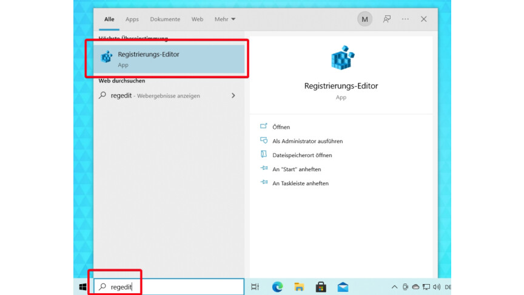
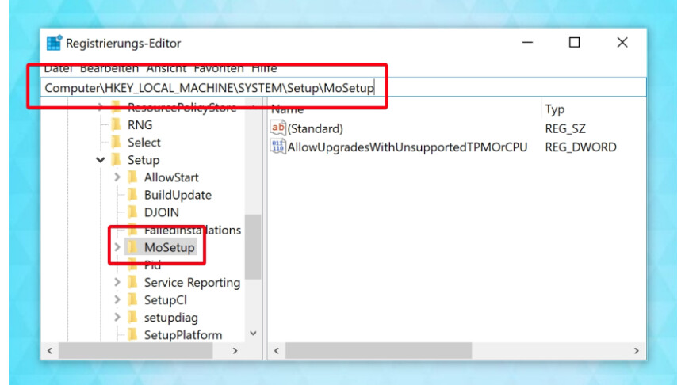
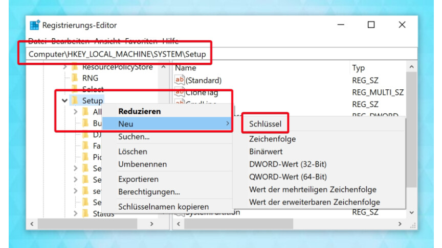
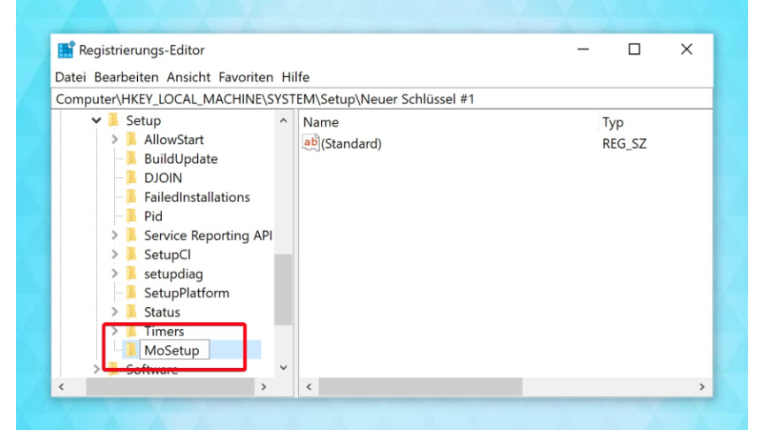
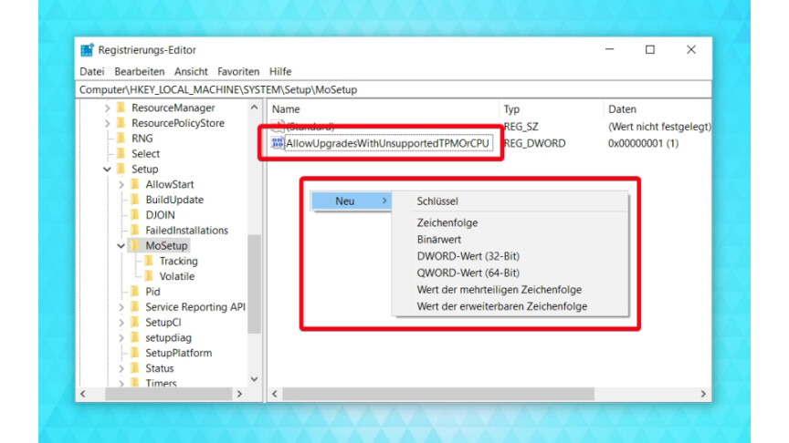
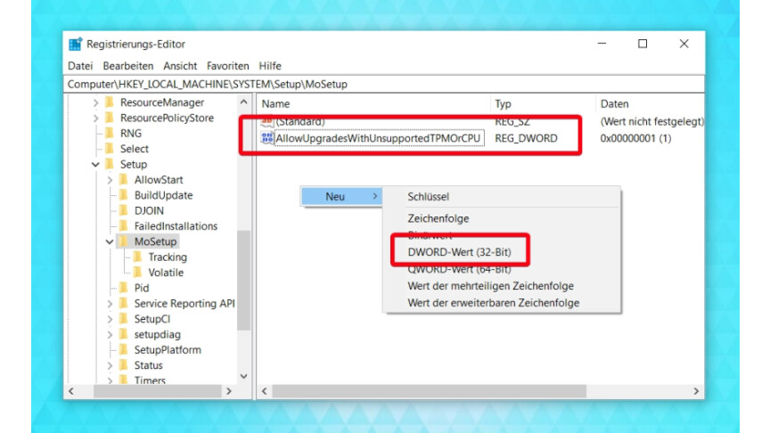
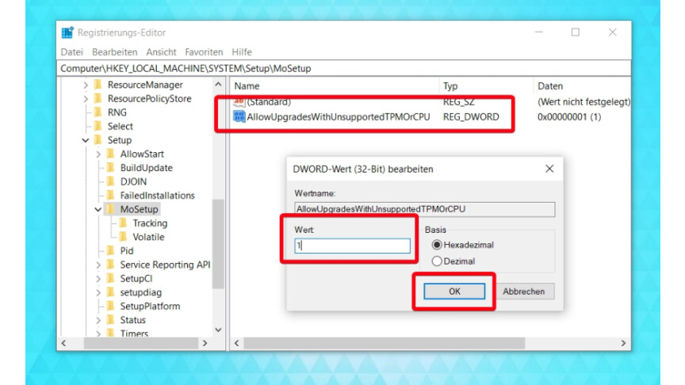

1. [
    
    
    
    ](https://www.netzwelt.de/picture/index.html#330433 "Großbildansicht: 01 Windows 10 - Regedit")
    
    1
    
    Öffnet über die Windows 10-Suche den Registrierungs-Editor.
    
2. 
    
    
    
    
    
    ❮❯
    
    2
    
    Navigiert über die Adressleiste zu "Computer\HKEY_LOCAL_MACHINE\SYSTEM\Setup\MoSetup". Bild 1 Falls dieser Pfad nicht existiert, wechselt ihr stattdessen zu "Computer\HKEY_LOCAL_MACHINE\SYSTEM\Setup\", um den entsprechenden Schlüssel erst noch zu erstellen. Wie das geht, zeigen die nächsten beiden Schritte. Klickt dazu mit der rechten Maustaste links auf "Setup" und wählt "Neu - Schlüssel" aus. Bild 2 Gebt dem neuen Schlüssel den Namen "MoSetup" und wählt diesen anschließend per Mausklick aus. Bild 3
    
3. 
    
    
    
    ❮❯
    
    3
    
    Prüft, ob im rechten Teilfenster das DWORD "AllowUpgradesWithUnsupportedTPMOrCPU" liegt. Bild 1 Wenn nicht, öffnet ihr per Rechtsklick das Kontextmenü und erstellt dieses mit "Neu - DWORD (32-Bit)". Bild 2
    
4. [
    
    
    
    ](https://www.netzwelt.de/picture/index.html#331601 "Großbildansicht: Windows 11-CPU-Sperre-7")
    
    4
    
    Anschließend öffnet ihr das DWORD "AllowUpgradesWithUnsupportedTPMOrCPU" per Doppelklick, tragt bei Wert "1" ein und speichert mit "OK" ab. Nach einem Neustart ist die CPU-Sperre entfernt und ihr könnt Windows 11 installieren, sofern die anderen Systemvoraussetzungen erfüllt sind.
    

Nach dem Windows 11-Upgrade vermisst ihr vielleicht die alte Taskleiste oder das klassische Kontextmenü. Dann könnt ihr [die alte Taskleiste wiederherstellen](https://www.netzwelt.de/anleitung/198025-windows-11-alte-taskleiste-wiederherstellen-fenster-gruppierenso-gehts.html) und [das Kontextmenü wiederherstellen](https://www.netzwelt.de/anleitung/198028-windows-11-so-aktiviert-alte-kontextmenue.html). Falls ihr nur Drag & Drop bei der Windows 11-Taskleiste vermisst, gibt es dafür einen [gesonderten Trick](https://www.netzwelt.de/anleitung/198240-windows-11-so-aktiviert-drag-drop-taskleiste.html).