Git ist derzeit das am häufigsten genutzte Versionskontrollsystem. Ein Git-Workflow ist eine Rezeptur oder Empfehlung zur Verwendung von Git, die eine konsistente und produktive Arbeitsweise ermöglichen soll. Git-Workflows ermutigen die Entwickler und [DevOps-Teams](https://www.atlassian.com/de/devops/what-is-devops), Git effektiv und konsistent zu nutzen. Git lässt sich für das Management von Änderungen sehr flexibel einsetzen. Aufgrund dieser Flexibilität gibt es keinen standardisierten Prozess für die Interaktion mit Git. Wenn ein Team an einem in Git verwalteten Projekt arbeitet, ist es wichtig, dass alle Teammitglieder für Änderungen dieselbe Methode anwenden. Um dies sicherzustellen, sollte das Team sich auf einen bestimmten Git-flow einigen. Es gibt verschiedene veröffentlichte Git-flows, die für dein Team möglicherweise gut geeignet sind. Im Folgenden behandeln wir einige dieser Git-Workflow-Optionen.

Bei der Vielzahl möglicher Git-Workflows ist es nicht leicht, einen Anfang zu finden, wenn man Git in der Arbeitsumgebung implementieren möchte. Diese Seite gibt einen Überblick über die gängigsten Git-Workflows für Software-Teams und bietet so einen ersten Ansatzpunkt.

Beachte im Folgenden, dass diese Git-Workflows mehr als Richtlinien und weniger als konkrete Regeln dienen sollen. Wir möchten dir Möglichkeiten aufzeigen, sodass du die Vorteile der verschiedenen Git-Workflows so nutzen kannst, wie es zu deinen individuellen Anforderungen passt.

---

---

Wenn du einen Git-Workflow für deinen Team auswählst, musst du dabei unbedingt die Teamkultur berücksichtigen. Du möchtest mit dem Workflow die Effizienz deines Teams steigern und nicht die Produktivität behindern. Du solltest bei der Bewertung eines Git-Workflows u. a. die folgenden Punkte beachten:

- Kann dieser Git-Workflow entsprechend der Teamgröße skaliert werden?
- Können Fehler und Irrtümer mit diesem Workflow einfach rückgängig gemacht werden?
- Erzeugt dieser Workflow eine neue unnötige, kognitive Überlastung für das Team?

---

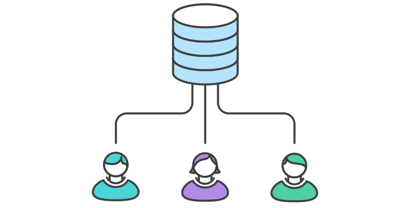

Der zentralisierte Git-Workflow ist hervorragend für Teams geeignet, die von SVN auf Git umstellen. Ganz wie in Subversion arbeitest du auch im zentralisierten Workflow mit einem zentralen Repository, in dem alle Änderungen am Projekt vorgenommen werden. Dabei heißt der standardmäßige Entwicklungs-Branch nicht `trunk`, sondern `main`, in den sämtliche Änderungen committet werden. Außer dem `main` werden in diesem Workflow keine weiteren Branches benötigt.

Die Umstellung auf ein verteiltes Versionskontrollsystem mag kompliziert erscheinen. Du kannst Git jedoch nutzen, ohne deinen aktuellen Workflow verändern zu müssen. Dein Team kann Projekte exakt so entwickeln wie mit Subversion.

Gegenüber SVN hat Git für den Entwicklungs-Workflow jedoch eine ganze Reihe von Vorteilen. Zunächst hat jeder Entwickler eine eigene lokale Kopie des gesamten Projekts zur Verfügung. In dieser isolierten Umgebung kann er unabhängig von seinen Kollegen arbeiten, ohne Rücksicht auf deren Änderungen am Projekt zu nehmen. Commits werden dem lokalen Repository hinzugefügt und Upstream-Änderungen erst einbezogen, wenn er dazu bereit ist.

Zweitens erhältst du Zugriff auf das robuste Verzweigungs- und Zusammenführungsmodell von Git. Im Gegensatz zu SVN sind Git-Branches als ausfallsicherer Mechanismus für die Integration von Code und den Austausch von Änderungen zwischen Repositorys konzipiert. Der zentralisierte Workflow ähnelt anderen Workflows in seiner Nutzung eines serverseitig gehosteten Remote-Repositorys, das Entwickler per Push und Pull nutzen. Im Vergleich zu anderen Workflows hat der zentralisierte Workflow keine definierten Pull request- oder Forking-Muster. Ein zentralisierter Workflow eignet sich im Allgemeinen besser für Teams, die von SVN zu Git migrieren, und für kleinere Teams.

---

Jeder Entwickler klont zunächst das zentrale Repository. Anschließend bearbeitet er die Dateien in seiner lokalen Kopie des Projekts und committet seine Änderungen wie in SVN. Der einzige Unterschied ist, dass die neuen Commits lokal gespeichert werden, vollständig isoliert vom zentralen Repository. Eine Upstream-Synchronisierung wird erst dann durchgeführt, wenn der Entwickler es für angebracht hält.

Sollen die Änderungen im offiziellen Projekt veröffentlicht werden, pusht der Entwickler seinen lokalen `main` -Branch in das zentrale Repository. Dieser Vorgang entspricht `svn commit`, fügt jedoch alle lokalen Commits hinzu, die nicht bereits im zentralen `main` -Branch abgelegt sind.

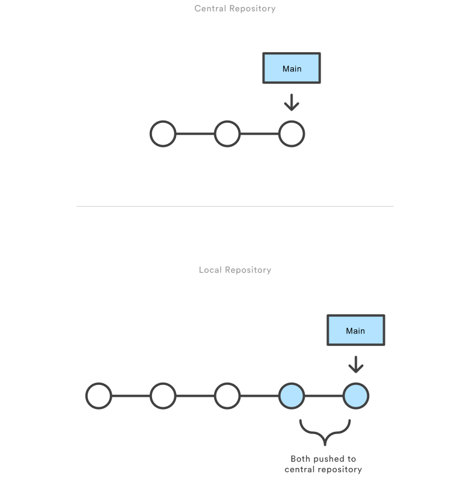

Zunächst muss jemand das zentrale Repository auf einem Server anlegen. Handelt es sich um ein neues Projekt, kannst ein leeres Repository anlegen. Andernfalls muss du ein vorhandenes Git- oder SVN-Repository importieren.

Zentrale Repositorys sollten immer Bare-Repositorys sein (sie sollten kein Arbeitsverzeichnis haben). Du kannst sie folgendermaßen erstellen:

```bash
ssh user@host git init --bare /path/to/repo.git
```

Gib dabei einen gültigen SSH-Benutzernamen für `user`, die Domäne oder die IP-Adresse deines Servers für `host` und den gewünschten Speicherort deines Repositorys für `/path/to/repo.git` an. Es ist Konvention, die Erweiterung `.git` an den Repository-Namen anzuhängen, um das Repository als Bare-Repository zu kennzeichnen.

### Gehostete zentrale Repositorys

Zentrale Repositorys werden oft über Git-Hosting-Services von Drittanbietern wie [Bitbucket Cloud](https://bitbucket.org/de/product/de/) erstellt. Das Anlegen eines Bare-Repositorys wie oben erläutert wird von deinem Hosting-Service übernommen. Der Hosting-Service stellt anschließend eine Adresse für dieses zentrale Repository bereit, auf das du von deinem lokalen Repository aus zugreifen kannst.

Als Nächstes erstellt jeder Entwickler eine lokale Kopie des gesamten Projekts. Dazu dient der Befehl [git clone](https://www.atlassian.com/de/git/tutorials/setting-up-a-repository/git-clone):

```bash
git clone ssh://user@host/path/to/repo.git
```

Wird ein Repository geklont, fügt Git automatisch ein Kürzel mit dem Namen `origin` hinzu, das auf das Ursprungs-Repository verweist. So kannst du später mit diesem Repository interagieren.

### Änderungen vornehmen und committen

Nachdem das Repository lokal geklont wurde, kann ein Entwickler mit dem standardmäßigen Commit-Prozess in Git – bearbeiten, auf die Staging-Ebene verschieben und committen – Änderungen vornehmen. Falls du mit der Staging-Umgebung nicht vertraut bist, solltest du wissen, dass sie eine Möglichkeit bietet, einen Commit vorzubereiten, ohne dabei jede einzelne Änderung dem Arbeitsverzeichnis hinzufügen zu müssen. So kannst du, auch wenn du viele lokale Änderungen vorgenommen hast, sehr fokussierte Commits erstellen.

```bash
git status # View the state of the repo
git add <some-file> # Stage a file
git commit # Commit a file</some-file>
```

Du erinnerst dich sicher, dass mit diesen Befehlen lokale Commits erstellt werden. Daher kann John diesen Prozess so oft wiederholen, wie er will, ohne sich darum kümmern zu müssen, was im zentralen Repository passiert. Das kann sehr nützlich sein bei umfangreichen Features, die in einfachere und kleinere Teile zerlegt werden müssen.

### Pushen von neuen Commits in das zentrale Repository

Nachdem neue Änderungen in das lokale Repository committet wurden, müssen diese Änderungen gepusht werden, um sie mit den anderen Entwicklern, die an diesem Projekt mitarbeiten, zu teilen.

```
git push origin main
```

Mit diesem Befehl werden die neu committeten Änderungen in das zentrale Repository gepusht. Beim Pushen von Änderungen in das zentrale Repository ist es möglich, dass Updates von anderen Entwicklern zuvor gepusht wurden und Code enthalten, der mit den vorgesehenen Push-Updates in Konflikt gerät. Git gibt in solchen Fällen eine Konfliktmeldung aus. Dies bedeutet, dass zuerst `git pull` ausgeführt werden muss. Im folgenden Abschnitt gehen wir auf dieses Konfliktszenario noch genauer ein.

### Konflikte beheben

Das zentrale Repository stellt das offizielle Projekt dar. Deshalb sollte dessen Commit-Verlauf als unveränderlich betrachtet werden. Wenn die lokalen Commits eines Entwicklers vom zentralen Repository abweichen, verhindert Git, dass Änderungen an ihnen verschoben werden, um das Überschreiben offizieller Commits zu verhindern.

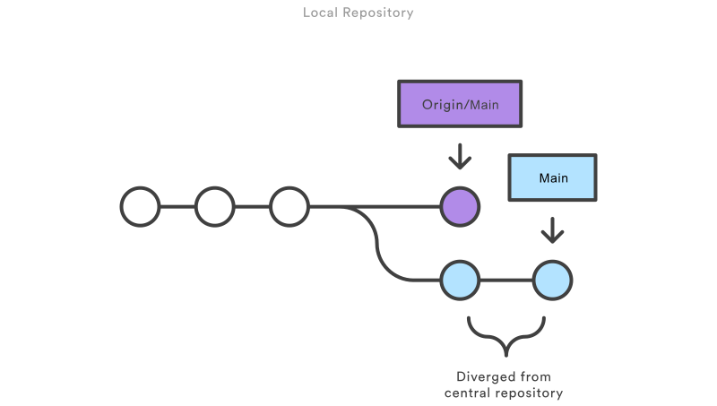

Bevor der Entwickler ein Feature veröffentlichen kann, muss er die aktuellen zentralen Commits abrufen und seine Änderungen voranstellen. Er könnte also sagen: "Ich möchte auf der Arbeit der anderen aufbauen und meine Änderungen hinzufügen." Als Ergebnis entsteht ein absolut linearer Verlauf, genau wie in herkömmlichen SVN-Workflows.

Sollten lokale Änderungen in direktem Konflikt mit Upstream-Commits stehen, stoppt Git den Rebase-Prozess. Du hast dann die Möglichkeit, die Konflikte manuell zu lösen. Ein Vorteil von Git: Mit den Befehlen `git status` und `git add` kannst du nicht nur Commits erzeugen, sondern auch Merge-Konflikte lösen. Neue Entwickler können auf diese Weise ihre eigenen Merges unkompliziert verwalten. Sollten sie auf Probleme stoßen, können sie mit Git ebenso einfach den gesamten Rebase abbrechen und es nochmals versuchen (oder sich Unterstützung holen).

---

Sehen wir uns nun ein allgemeines Beispiel an, wie sich die Zusammenarbeit eines typischen kleinen Teams mit diesem Git-Workflow gestaltet. Wir zeigen, wie zwei Entwickler – nennen wir sie John und Mary – an separaten Features arbeiten und über ein zentrales Repository ihre Beiträge teilen.

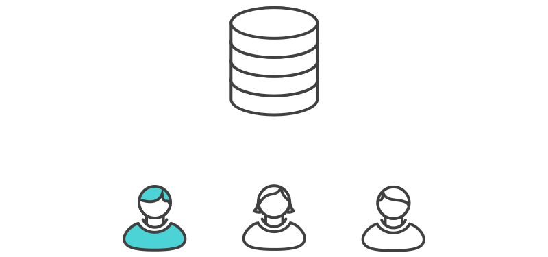

John kann in seinem lokalen Repository mit dem standardmäßigen Commit-Prozess in Git – bearbeiten, auf die Staging-Ebene verschieben und committen – Features entwickeln.

Du erinnerst dich sicher, dass mit diesen Befehlen lokale Commits erstellt werden. Daher kann John diesen Prozess so oft wiederholen, wie er will, ohne sich darum kümmern zu müssen, was im zentralen Repository passiert.

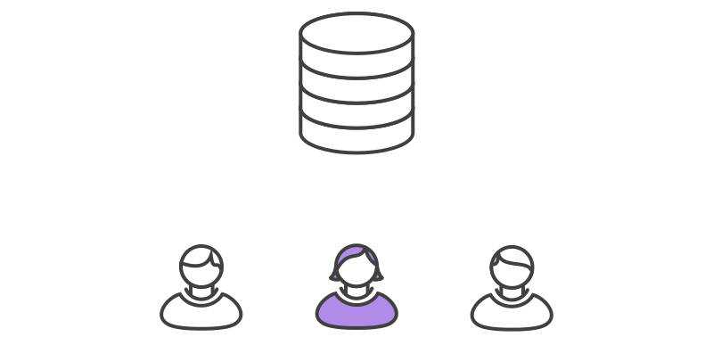

Mary arbeitet parallel an einem eigenen Feature in ihrem lokalen Repository und nutzt dazu denselben Prozess nach dem Muster "Bearbeitung/Staging/Commit". Ganz wie John kann sie dabei das zentrale Repository vollständig ignorieren. Auch die Änderungen, die John in seinem lokalen Repository vornimmt, sind für sie *vollkommen unwichtig*, da alle lokalen Repositorys *privat* sind.

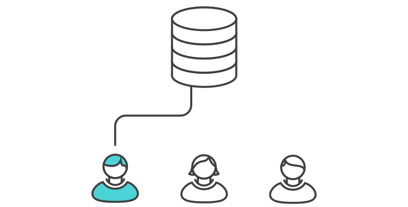

Sobald John sein Feature abgeschlossen hat, sollte er seine lokalen Commits auf dem zentralen Repository veröffentlichen, damit andere Teammitglieder darauf zugreifen können. Das kann er mit dem Befehl [git push](https://www.atlassian.com/de/git/tutorials/syncing/git-push) tun:

```
git push origin main
```

Denke daran, dass es sich bei `origin` um die Remote-Verbindung zum zentralen Repository handelt, das mit Git erstellt wurde, als John es geklont hat. Das `main` -Argument weist Git an, den `main` -Branch von `origin` so aussehen zu lassen wie seinen lokalen `main` -Branch. Da das zentrale Repository nicht mehr aktualisiert wurde, seit John es geklont hat, wird es keine Konflikte geben und der Push-Vorgang erwartungsgemäß verlaufen.

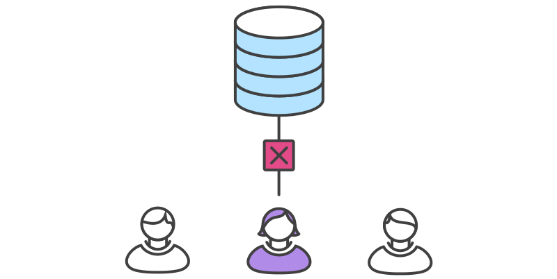

Sehen wir uns mal an, was passiert, wenn Mary ihr Feature versucht zu verschieben, nachdem John seine Änderungen in das zentrale Repository verschoben hat. Sie kann haargenau denselben Befehl zum Verschieben nutzen:

```
git push origin main
```

Doch ihr lokaler Verlauf weicht vom zentralen Repository ab. Deshalb lehnt Git den Request ab und zeigt eine längere Fehlermeldung an:

```bash
error: failed to push some refs to '/path/to/repo.git'
hint: Updates were rejected because the tip of your current branch is behind
hint: its remote counterpart. Merge the remote changes (e.g. 'git pull')
hint: before pushing again.
hint: See the 'Note about fast-forwards' in 'git push --help' for details.
```

So wird Mary daran gehindert, offizielle Commits zu überschreiben. Sie muss die Aktualisierungen von John in ihr Repository verschieben, ihre lokalen Änderungen implementieren und es noch einmal versuchen.

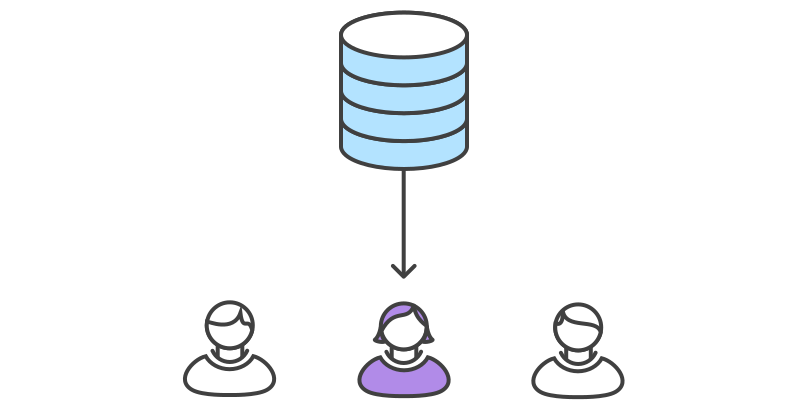

Mary kann [git pull](https://www.atlassian.com/de/git/tutorials/syncing/git-pull) verwenden, um Upstream-Änderungen in ihr Repository zu integrieren. Dieser Befehl ist `svn update` ähnlich – damit wird der gesamte Upstream-Commit-Verlauf in Marys lokales Repository gepullt und in ihre lokalen Commits integriert:

```
git pull --rebase origin main
```

Die Option `--rebase` weist Git an, alle Commits von Mary zur Spitze des `main` -Branch zu verschieben, nachdem dieser mit den Änderungen aus dem zentralen Repository synchronisiert wurde, wie unten gezeigt:

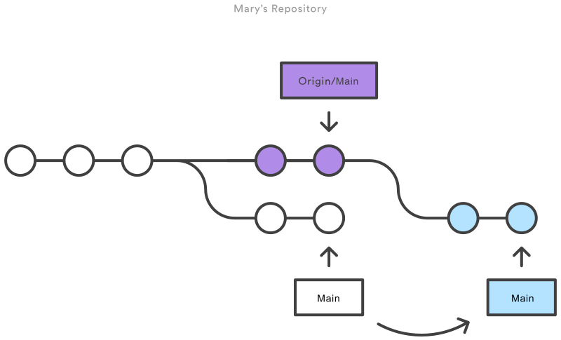

Das Verschieben würde auch ohne diese Option funktionieren. Dann würdest du aber jedes Mal, wenn jemand eine Synchronisierung mit dem zentralen Repository durchführen muss, einen überflüssigen "Merge-Commit" erzeugen. Für diesen Git-Workflow eignet sich das Rebasing immer besser als ein Merge-Commit.


Das Rebasing erfolgt, indem jeder lokale Commit einer nach dem anderen an den aktualisierten `main` -Branch übertragen wird. Das bedeutet, dass du Merge-Konflikte für jeden einzelnen Commit erfasst, anstatt alle gleichzeitig in einem massiven Merge-Commit zu lösen. Dadurch bleiben deine Commits weitestgehend fokussiert, was zu einem sauberen Projektverlauf führt. Das macht es wiederum wesentlich einfacher herauszufinden, wo Bugs entstanden sind und ob Änderungen mit minimalen Auswirkungen auf das Projekt zurückgesetzt werden können.

Wenn Mary und John an nicht ähnlichen Features arbeiten, sind Konflikte durch den Rebasing-Prozess unwahrscheinlich. Kommt es dennoch zu Konflikten, hält Git das Rebasing bei dem aktuellen Commit an und gibt folgende Meldung zusammen mit einigen relevanten Anweisungen aus:

```
CONFLICT (content): Merge conflict in <some-file>
```

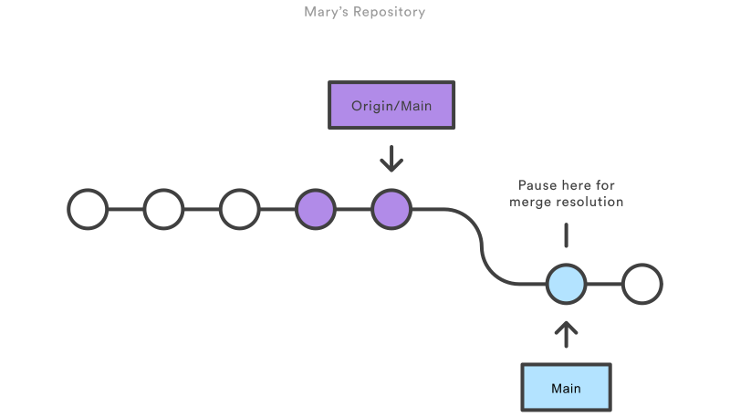

Das Tolle an Git ist, dass *jeder* seine eigenen Merge-Konflikte lösen kann. In unserem Beispiel würde Mary einfach den Befehl [git status](https://www.atlassian.com/de/git/tutorials/inspecting-a-repository) ausführen, um festzustellen, wo das Problem liegt. In Konflikt stehende Dateien werden im Abschnitt mit nicht gemergten Pfaden angezeigt:

```bash
# Unmerged paths:
# (use "git reset HEAD <some-file>..." to unstage)
# (use "git add/rm <some-file>..." as appropriate to mark resolution)
#
# both modified: <some-file>
```

Danach wird sie die Datei(en) entsprechend ihren Anforderungen bearbeiten. Wenn sie mit dem Ergebnis zufrieden ist, kann sie die Datei(en) wie üblich stagen. Den Rest erledigt dann [git rebase](https://www.atlassian.com/de/git/tutorials/rewriting-history/git-rebase):

```bash
git add <some-file>
git rebase --continue
```

Und das war's schon. Git fährt mit dem nächsten Commit fort und wiederholt den Prozess für alle anderen Commits, die Konflikte erzeugen.

Wenn du an dieser Stelle feststellst, dass du keine Ahnung hast, worum es geht, keine Sorge. Führe einfach den folgenden Befehl aus und du wirst wieder dort landen, wo du angefangen hast:

```
git rebase --abort
```

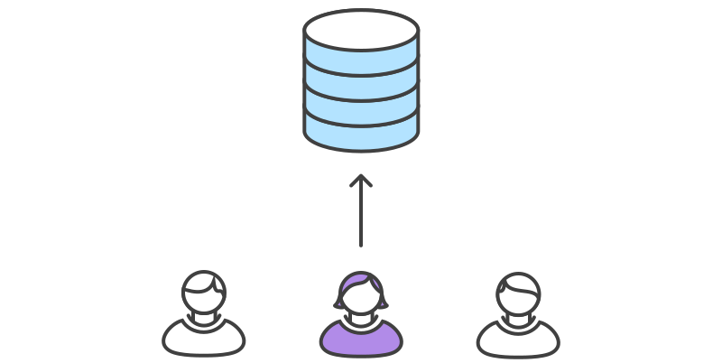

Nachdem Mary die Synchronisierung mit dem zentralen Repository abgeschlossen hat, kann sie ihre Änderungen erfolgreich veröffentlichen:

```
git push origin main
```

Wie du siehst, kann man mit ein paar Git-Befehlen die herkömmliche Entwicklungsumgebung einer Subversion replizieren. Das ist gut, wenn Teams die Umstellung von SVN durchführen wollen. Doch dabei kommen die Möglichkeiten, die Git zur verteilten Zusammenarbeiten bietet, nicht zum Einsatz.

Der zentralisierte Git-Workflow eignet sich gut für kleine Teams. Der oben beschriebene Konfliktlösungsprozess kann bei größeren Teams zu Engpässen führen. Wenn dein Team mit dem zentralisierten Git-Workflow einigermaßen vertraut ist und jetzt seine Zusammenarbeit optimieren möchte, solltest du dir auf jeden Fall einmal die Vorteile des [Feature-Branching-Workflows](https://www.atlassian.com/de/git/tutorials/comparing-workflows/feature-branch-workflow) ansehen. Wenn jedem Feature ein isolierter Branch zugewiesen wird, können ausführliche Diskussionen über neue Ergänzungen angestoßen werden, bevor diese in das offizielle Projekt integriert werden.

---

Der zentralisierte Git-Workflow ist im Wesentlichen ein Baustein für andere Workflows. Die meisten beliebten Git-Workflows verfügen über ein zentralisiertes Repository in irgendeiner Form, von dem die einzelnen Entwickler pullen und in das sie pullen. Im Folgenden sprechen wir kurz einige andere beliebte Git-Workflows an. Diese erweiterten Workflows bieten stärker spezialisierte Muster für das Management von Branches für die Feature-Entwicklung, von Hotfixes und von Releases.

---

Feature Branching ist eine logische Erweiterung des zentralisierten Workflows. Die Grundidee hinter dem [Feature-Branching-Workflow](https://www.atlassian.com/de/git/tutorials/comparing-workflows/feature-branch-workflow) ist, dass die gesamte Feature-Entwicklung in einem dedizierten Branch und nicht im `main` -Branch stattfinden sollte. Diese Einkapselung erleichtert mehreren Entwicklern die Arbeit an einem bestimmten Feature, ohne dabei die Haupt-Codebasis zu stören. Außerdem wird der `main` -Branch dadurch niemals beschädigten Code enthalten, wodurch das Feature Branching für Continuous Integration-Umgebungen ein immenser Vorteil ist.

---

Der [Git-flow-Workflow](https://www.atlassian.com/de/git/tutorials/comparing-workflows/gitflow-workflow) wurde erstmals 2010 in einem hoch angesehenen Blogpost von [Vincent Driessen auf nvie](http://nvie.com/posts/a-successful-git-branching-model/) veröffentlicht. Der Git-flow-Workflow definiert ein strenges Branching-Modell, das um den Release des Projekts konzipiert wurde. Dieser Workflow fügt keine neuen Konzepte oder Befehle hinzu, die über das für den Feature Branch Workflow Erforderliche hinausgehen. Stattdessen weist der Git-flow-Workflow verschiedenen Branches äußerst spezifische Rollen zu und definiert, wie und wann diese interagieren sollen.

---

Der [Forking-Workflow](https://www.atlassian.com/de/git/tutorials/comparing-workflows/forking-workflow) unterscheidet sich vollkommen von den in diesem Tutorial besprochenen Git-Workflows. Anstatt ein einzelnes serverseitiges Repository als zentrale Codebasis zu verwenden, bietet er jedem Entwickler ein serverseitiges Repository. Jeder Beteiligte arbeitet also nicht mit einem sondern zwei Git-Repositorys: einem privaten, lokalen und einem öffentlichen, serverseitigen.

---

Einen universell nutzbaren Git-Workflow gibt es nicht. Wie zuvor erläutert ist es wichtig, einen Git-Workflow zu entwickeln, der die Produktivität deines Teams steigern kann. Er sollte nicht nur zur Teamkultur, sondern auch zur allgemeinen Unternehmenskultur passen. Git-Features wie Branches und Tags sollten den Release-Zeitplan deines Unternehmens ergänzen. Wenn dein Team [Projektmanagementsoftware zum Verfolgen von Aufgaben](https://www.atlassian.com/de/software/jira) nutzt, solltest du Branches einsetzen, die mit den in Arbeit befindlichen Aufgaben übereinstimmen. Darüber hinaus solltest du bei der Auswahl eines Workflows einige Leitlinien beachten:

### Kurzlebige Branches

Je länger ein Branch separat vom Produktions-Branch existiert, desto höher wird das Risiko, dass es zu Merge-Konflikten und Deployment-Problemen kommt. Kurzlebige Branches sorgen für sauberere Merges und Deployments.

Es ist wichtig, dass der verwendete Git-Workflow proaktiv Merges verhindert, die rückgängig gemacht werden müssen. Ein Git-Workflow, bei dem ein Branch getestet wird, bevor ein Merge in den `main` -Branch möglich ist, wäre ein Beispiel hierfür. Allerdings wird es immer wieder Fälle geben, wo eine Rückgängigmachung unvermeidlich ist. Daher ist es von Vorteil, wenn der Workflow dies auf einfache Weise ermöglicht, ohne dass andere Teammitglieder bei ihrer Arbeit gestört werden.

Der Git-Workflow sollte zum Release-Zyklus für Softwareentwicklung in deinem Unternehmen passen. Wenn du mehrere Releases pro Tag planst, solltest du deinen `main` -Branch stabil halten. Wenn dein Release-Zeitplan weniger gedrängt ist, wären für dich Git-Tags zum Taggen eines Branch zu einer Version eine Überlegung wert.

---

In diesem Artikel haben wir Git-Workflows erläutert. Wir haben uns einen zentralisierten Workflow mit praktischen Beispielen genauer angeschaut. Aufbauend auf den zentralisierten Git-Workflows haben wir weitere spezialisierte Workflows wie das Feature Branching oder Git-flow behandelt. Hier noch einmal eine Zusammenfassung der wichtigsten Punkte dieses Artikels:

- Einen universell nutzbaren Git-Workflow gibt es nicht
- Ein Git-Workflow sollte einfach sein und die Produktivität deines Teams steigern.
- Deine geschäftlichen Anforderungen sollten in die Gestaltung deines Git-Workflows einfließen.

Wenn du einen weiteren Git-Workflow kennenlernen möchtest, dann wirf einen Blick in unsere umfassende Dokumentation zum [Feature-Branching-Workflow](https://www.atlassian.com/de/git/tutorials/comparing-workflows/feature-branch-workflow).

---

[Feature Branch Workflow](https://www.atlassian.com/de/git/tutorials/comparing-workflows/feature-branch-workflow)


[Mehr erfahren](http://bitbucket.org/de/blog)


[Mehr erfahren](https://university.atlassian.com/student/path/837218-devops?sid=40f7e9cd-efb5-4168-8587-49c3d15610a0&sid_i=0)


[Jetzt ansehen](https://www.youtube.com/watch?v=kr2zkyxnhAk)

Thank you for signing up