ASUS EZ Flash 3 - Einführung

Um eine detailliertere Anleitung zu erhalten, können Sie auch auf den unten stehenden ASUS Youtube-Video-Link klicken, um mehr über das BIOS-Update mit EZ Flash zu erfahren.

[https://www.youtube.com/embed/2QJ9v37qYUQ](https://www.youtube.com/embed/2QJ9v37qYUQ)

**Beschreibung**

Das ASUS EZ Flash 3 Programm erlaubt die einfache Aktualisierung der BIOS Version. Sichern Sie die BIOS Datei auf einem USB Stick. Sie können das UEFI BIOS Tool auf dem Motherboard aktualisieren.

**Nutzungsszenario**

Die gängige Methode für die Aktualisierung von BIOS für allgemeine Nutzer ist die Verwendung des Windows Update Tools.  
Aber manchmal ist das Betriebssystem infiziert oder es gibt eine große Anzahl an Programmen und andere destabilisierende Faktoren, die verursachen können, dass die BIOS Aktualisierung fehlschlägt.  
Verwenden Sie ASUS EZ Flash 3, um die BIOS Version zu aktualisieren, ohne das Windows Betriebssystem zu verwenden.

**Inhalt:**

[**1\. Vorbereitung**](https://rog.asus.com/de/support/faq/1012815/#A1)

[**2\. Schritte zum Update des BIOS**](https://rog.asus.com/de/support/faq/1012815/#A2)

[**2-1. BIOS aktualisieren via USB Stick**](https://rog.asus.com/de/support/faq/1012815/#A21)

**3.**[**Fragen & Antworten**](https://rog.asus.com/de/support/faq/1012815/#A3)

**1\. Vorbereitung**

**Schritt 1:** Bevor Sie die BIOS Version aktualisieren, sichern Sie bitte alle Daten auf der Hard Disk.

**Schritt 2:** USB Sticks erfordern einen einzelnen Sektor im FAT 16/32 Format, und 1GB oder mehr sind empfohlen.

**Schritt 3:** Wie erhalten Sie das (BIOS)?

Sie erhalten die aktuellste Software, Bedienungshandbücher, Treiber und Firmware beim [ASUS Download Center](https://www.asus.com/support/Download-Center/).  
Wenn Sie mehr Information über das ASUS Download Center benötigen, bitte gehen Sie zu diesem [Link](https://www.asus.com/support/FAQ/1015629).  
\*So überprüfen Sie Ihr Produktmodell: [https://www.asus.com/de/support/Article/565/](https://www.asus.com/support/Article/565/)

**Vorgehen**

1\. Laden Sie die aktuellste BIOS Datei entsprechend dem Modell Ihres Motherboards vom [ASUS Download Center](https://www.asus.com/tw/support/Download-Center/) herunter und speichern Sie sie auf dem USB Stick.  
Gehen Sie zum Modell -> klicken Sie auf Treiber und Dienstprogramm (driver and utility).  
(Beispiel: ROG CROSSHAIR VII HERO)  
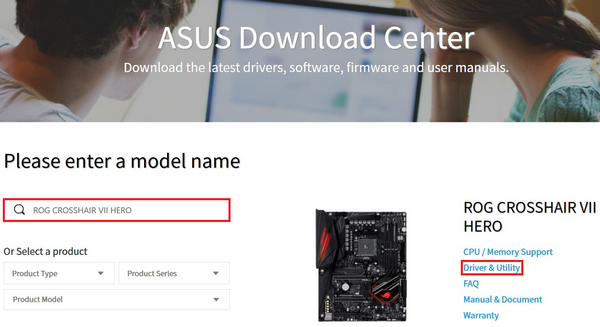  

2\. Klicken Sie Treiber und Dienstprogramm (Driver & Utility) ->BIOS & FIRMWARE, wählen Sie die erforderliche BIOS Version und laden Sie sie herunter (die Verwendung der neusten Version ist empfohlen).  
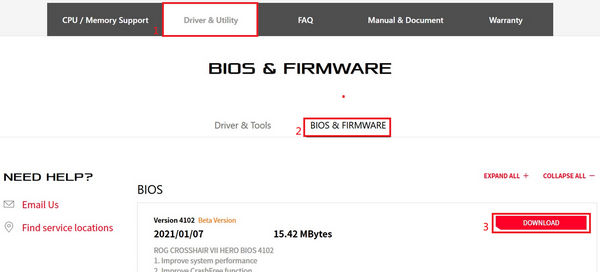

  

**Schritt 4:** Nach Klicken des Download-Schaltfeldes, speichern Sie das BIOS auf Ihrem USB Stick, dann entpacken Sie sie (Windows 10 hat seine eigene Unzip ZIP Funktion). Überprüfen Sie, ob sich eine.CAP Datei im Hauptverzeichnis des USB Sticks befindet.  
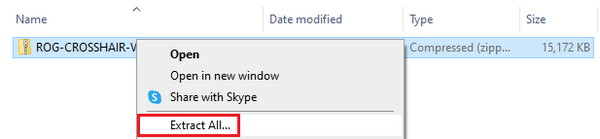  
  
Nach dem Entpacken erscheint eine.CAP Datei, sie ist die Aktualisierungsdatei für das BIOS.  
  

**Schritt 5:** Verbinden Sie den USB Stick mit dem USB Port des Motherboards.

[Zurück zum Inhalt](https://rog.asus.com/de/support/faq/1012815/#inhalt)

**2\. Schritte zum Update des BIOS**

Bitte folgen Sie den unten angegebenen Schritten, das BIOS aufzurufen

1. Nach dem Hochfahren, wenn das ASUS LOGO erscheint, drücken Sie auf die DEL Taste Ihrer Tastatur.  
	
2. Wenn der BIOS Bildschirm erscheint, drücken Sie F7 oder klicken Sie mit der Maus auf Advance Modus, um den fortgeschrittenen Modus aufzurufen.  
	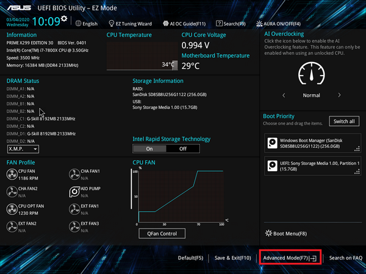
3. Klicken Sie mit der Maus auf die Werkzeugseite Tool, dann klicken Sie ASUS EZ Flash 3 Dienstprogramm.  
	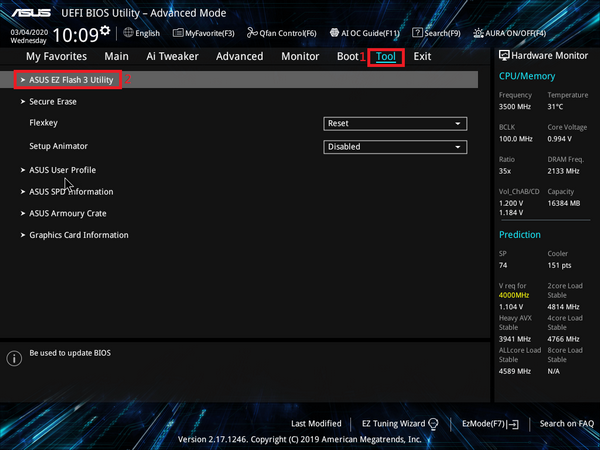
4. Nach dem Aufrufen von ASUS EZ Flash 3 Utilities: Sie können wählen, ob Sie das BIOS mit USB Stick oder Netzwerk aktualisieren möchten.  
	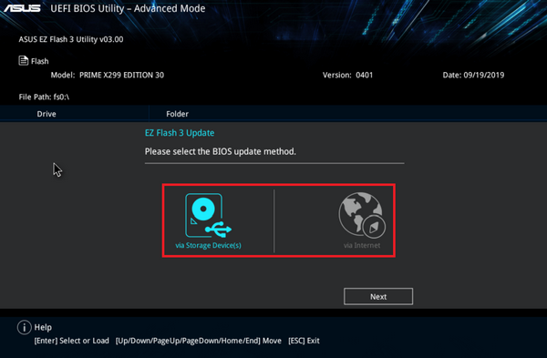

[Zurück zum Inhalt](https://rog.asus.com/de/support/faq/1012815/#inhalt)

**2-1. BIOS per USB Stick aktualisieren**

1. Klicken Sie auf das USB-Flash-Laufwerk, in dem die BIOS-Datei gespeichert ist, und klicken Sie auf die BIOS-Datei, die Sie aktualisieren möchten.  
	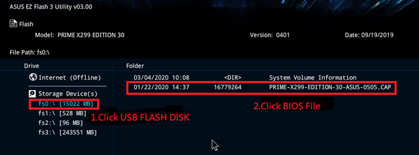
2. Klicken Sie auf "YES".  
	[Open: f37f79868fd44ed9f0a9125d9a530a79_MD5.png](../../Linux/Fedora/_resources/da54708d8cfdd8cf903ea1ce313c6505_MD5.jpg)
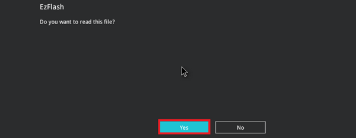
3. Bestätigen Sie die BIOS Information, Klicken Sie auf "YES" um die Aktualisierung zu starten.  
	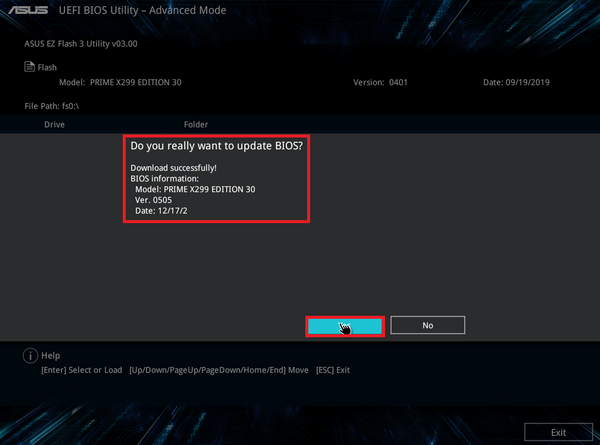
1. Wenn der Vorgang abgeschlossen ist sehen Sie folgendes Bild, dort klicken auf OK um den Vorgang abzuschließen und den Computer neuzustarten.  
	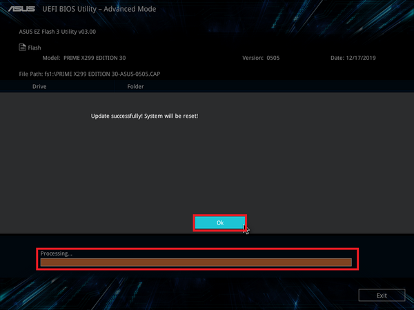

**※ Hinweis:**

1. Diese Funktion unterstützt nur USB Sticks mit einzelnem Sektor in FAT16/32 Format.
2. Wenn Sie das BIOS aktualisieren, schalten Sie das System nicht aus oder setzen Sie es nicht zurück, um Fehler beim Hochfahren des Systems zu vermeiden.

**3.**[**Fragen & Antworten**](https://rog.asus.com/de/support/faq/1012815/#A3)

**F1: Wie kann ich feststellen, ob mein Motherboard ASUS EZ Flash 3 unterstützt?**  
A1：ASUS EZ Flash 3 gilt nur für UEFI-BIOS-Motherboards mit integriertem ASUS EZ Flash 3, Sie können die Produktspezifikationen auf der offiziellen Website überprüfen.

Klicken Sie auf der Produktvorstellungsseite auf Produktspezifikationen.

[Open: 72413e9b739fa4b4a1bc534a5a771376_MD5.png](../../Linux/Fedora/_resources/10b6b9064702a59ecbe4681a1354c358_MD5.jpg)
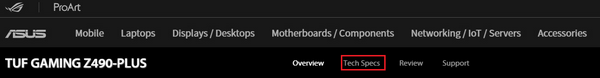

Sie können in den Software-Funktionen überprüfen, ob eine Unterstützung vorhanden ist.

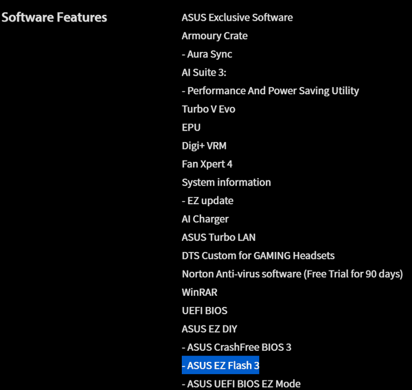

**F2: Nach der Aktualisierung des BIOS kann das System instabil werden oder abstürzen. Was sollte ich tun?**  
A2：Nach der BIOS-Aktualisierung wird empfohlen, die BIOS-Standardeinstellungen wiederherzustellen, um ein instabiles System aufgrund falscher BIOS-Einstellungen zu vermeiden.  
Bitte beachten Sie die folgenden Schritte:  

1：Bitte rufen Sie das BIOS erneut auf und drücken Sie die DEL-Taste auf dem ASUS-Logo.

On the BIOS screen, press F5 key.

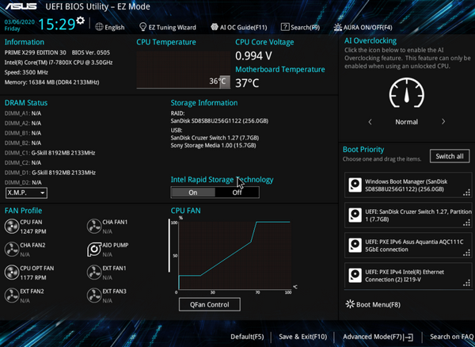

Der folgende Bildschirm wird angezeigt, klicken Sie auf OK.

[Open: 28d4214c42e9f7e4a5785003cdae314b_MD5.png](../../Linux/Fedora/_resources/9cc1b356fb9688c2de50b31e864a53f8_MD5.jpg)
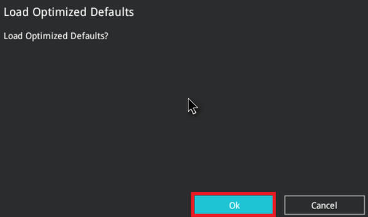

2\. Der folgende Bildschirm erscheint, klicken Sie auf OK, dann startet das System neu, Sie können die BIOS-Standardeinstellungen wiederherstellen.

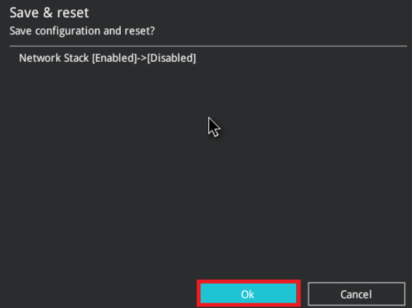

**F3：Wie erstellt man ein USB-Flash-Laufwerk im Format FAT16 / 32？?**  
A3: Bitte beachten Sie die folgenden Schritte:  
1\. Formatieren Sie das USB-Flash-Laufwerk. Klicken Sie mit der rechten Maustaste auf das USB-Flash-Laufwerk und wählen Sie FAT16 / 32 formatieren. \*Beim Formatieren werden alle Daten auf dem USB-Stick gelöscht.

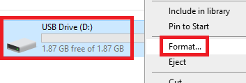

2\. File system format, select FAT32, and then click start.

[Open: a73a62dcc101b193c788a2a9c7c519da_MD5.png](../../Linux/Fedora/_resources/a2a4ac94a8d2f1816fe4fc0526b080bd_MD5.jpg)
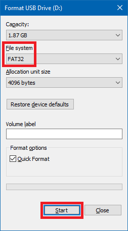

3\. Die Formatierung ist abgeschlossen.

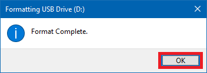

- Die oben genannten Informationen könnten teilweise oder vollständig von externen Websites oder Quellen zitiert sein. Bitte beziehen Sie sich auf die Informationen basierend auf der Quelle, die wir angegeben haben. Bei weiteren Fragen wenden Sie sich bitte direkt an die Quelle und beachten Sie, dass ASUS weder mit deren Inhalt noch mit deren Service in Verbindung steht oder dafür verantwortlich ist.
- Diese Informationen gelten möglicherweise nicht für alle Produkte derselben Kategorie/Serie. Einige der Screenshots und Vorgänge können je nach Softwareversion abweichen.
- ASUS stellt die oben genannten Informationen nur zur Orientierung zur Verfügung. Wenn Sie Fragen zum Inhalt haben, wenden Sie sich bitte direkt an den oben genannten Produktanbieter. Bitte beachten Sie, dass ASUS nicht für den Inhalt oder Service des oben genannten Produktanbieters verantwortlich ist.