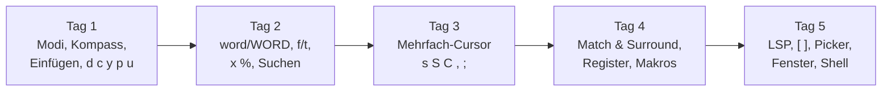

# Helix – Leitfaden zum Spickzettel

Dieser Leitfaden erklärt die Befehle des zweiseitigen Spickzettels in der Reihenfolge, in der man sie lernen sollte. Zu jeder Grafik des Spickzettels gibt es einen Abschnitt **„So liest du die Grafik“** und kurze Übungen mit aufklappbaren Lösungen.

> [!info] Begleitmaterial
> - Spickzettel: [[Helix_Spickzettel_A4_erweitert.pdf]] (Seite 1: Grundlagen, Seite 2: Fortgeschritten)
> - Die Grafiken liegen einzeln als SVG in `_resources/` neben dieser Notiz und werden hier eingebettet.
> - Schreibweise: `^` bzw. `Strg` = Ctrl, `Alt` = ⌥ (Option), `Space` = Leertaste, `⏎` = Enter.
> - ● hinter einem Befehl bedeutet: Language Server oder Tree-sitter-Grammatik nötig.

> [!tip] Vor dem Start
> - `hx --tutor` öffnet das eingebaute Tutorial – ideal als Einstieg vor diesem Leitfaden.
> - `hx --health` zeigt, welche Sprachen Syntax-Highlighting, Language Server und Textobjekte unterstützen. Fehlt dort ein ✓, funktionieren die mit ● markierten Befehle für diese Sprache nicht.

## Inhalt

1. [[#1 Das Grundprinzip Auswahl → Aktion]]
2. [[#2 Die Modi]]
3. [[#3 Bewegen ist Auswählen – der Kompass]]
4. [[#4 word vs. WORD]]
5. [[#5 Zeichen finden mit f und t]]
6. [[#6 Einfügen – wo landet der Cursor?]]
7. [[#7 Bearbeiten, Kopieren, Rückgängig]]
8. [[#8 Suchen und Makros]]
9. [[#9 Mehrfach-Cursor]]
10. [[#10 Match & Surround]]
11. [[#11 Goto, LSP und die Klammer-Navigation]]
12. [[#12 Fenster und Ansicht]]
13. [[#13 Picker, Jumplist, Shell und Konfiguration]]
14. [[#14 Rezepte]]
15. [[#15 Lernpfad und Übungsdatei]]

---

## 1 Das Grundprinzip Auswahl → Aktion

In Vim sagt man zuerst **was man tun will** und dann **worauf**: `d3w` = „lösche drei Wörter“.
In Helix ist es umgekehrt: Zuerst wird **ausgewählt**, dann **gehandelt**. Man sieht also vor dem Löschen, was gelöscht wird.

| Baustein | Beispiel | Bedeutung | Pflicht? |
|---|---|---|---|
| Modus | `v` | Auswahl erweitern statt ersetzen | optional |
| Anzahl | `3` | wie oft die Bewegung ausgeführt wird | optional |
| Auswahl | `w` | Bewegung oder Textobjekt | ja |
| Aktion | `d` | Operator, der auf die Auswahl wirkt | ja |

> [!example] Drei Wörter löschen
> `3w` wählt drei Wörter aus – sie werden farbig hervorgehoben. Erst `d` löscht sie.
> Ist die Auswahl falsch, drückt man einfach eine andere Bewegung; es ist noch nichts passiert.

> [!important] Die wichtigste Denkregel
> **Der Cursor ist immer eine Auswahl** – im einfachsten Fall ein einzelnes Zeichen. Jede Aktion wirkt auf die aktuelle Auswahl. Wer sich das merkt, versteht fast alle weiteren Befehle.

> [!warning] Falle für Vim-Umsteiger
> - `U` ist **Redo**, nicht „Zeile wiederherstellen“.
> - `x` wählt die **Zeile** aus, löscht aber kein Zeichen. Löschen ist immer `d`.
> - `f`/`t` wirken **über Zeilengrenzen** hinweg.

---

## 2 Die Modi

![[helix-modi.svg|620]]

> [!abstract] So liest du die Grafik
> - **Mitte (dunkel):** Der Normalmodus ist die Zentrale. Hier bewegt man sich, wählt aus und löst Aktionen aus.
> - **Die drei Kästen außen** sind Modi, in denen man bleibt, bis man sie verlässt. Die Beschriftung am Pfeil **zum** Kasten ist die Taste für den Einstieg, die am Pfeil **zurück** die Taste für den Ausstieg.
> - **Der gestrichelte Kasten** listet die *Untermodi*: Man drückt die Präfix-Taste, dann **eine** weitere Taste, und ist sofort wieder im Normalmodus. Nach dem Präfix zeigt Helix unten rechts ein Menü mit allen Möglichkeiten.

| Modus | Einstieg | Ausstieg | Wofür |
|---|---|---|---|
| Einfügemodus | `i` `a` `I` `A` `o` `O` `c` | `Esc` | Text tippen |
| Auswahlmodus | `v` | `v` oder `Esc` | Bewegungen **erweitern** die Auswahl |
| Befehlsmodus | `:` | `⏎` (ausführen) oder `Esc` | Kommandos wie `:w`, `:q`, `:set` |

> [!tip] Das Menü nach dem Präfix
> Wer eine Taste vergessen hat, drückt nur das Präfix – `g`, `m`, `z`, `Space` oder `Strg-w` – und liest im eingeblendeten Menü nach. `Space ?` öffnet zusätzlich die durchsuchbare **Befehlspalette** mit allen Kommandos.

> [!question]- Übung 2.1 – Welcher Modus?
> Du willst am Ende der aktuellen Zeile ein Semikolon anfügen und danach speichern. Welche Tastenfolge?
>
> > [!success]- Lösung
> > `A` `;` `Esc` `:w` `⏎` – `A` springt ans Zeilenende in den Einfügemodus, `Esc` zurück in den Normalmodus, `:w` speichert.

---

## 3 Bewegen ist Auswählen – der Kompass

![[helix-bewegung-kompass.svg|700]]

> [!abstract] So liest du die Grafik
> - **Der Punkt in der Mitte** ist die Cursorposition.
> - **Waagerechter Pfeil:** Bewegungen innerhalb der Zeile. Je weiter eine Taste vom Mittelpunkt entfernt ist, desto **größer der Sprung**: `h`/`l` ein Zeichen, `b`/`w`/`e` ein Wort, `B`/`W`/`E` ein WORD, `gh`/`gl` bis zum Zeilenrand.
> - **Senkrechter Pfeil:** Bewegungen durch die Datei, ebenfalls nach Reichweite sortiert: `k`/`j` eine Zeile, `^u`/`^d` eine halbe Seite, `^b`/`^f` eine Seite, `gg`/`ge` Anfang und Ende der Datei.
> - **Die vier Ecken** ergänzen Sprünge, die nicht in eine Richtung passen: Bildschirmposition (`gt` `gc` `gb`), „zuletzt …“-Sprünge (`g.` `ga` `gm` `gw`), Zähler und die Merkregel.

### Warum der Titel „Bewegen = Auswählen“?

Die Wort-Bewegungen `w` `b` `e` (und groß `W` `B` `E`) **wählen den überstrichenen Text aus**. Ein direkt folgendes `d` löscht genau diesen Text. Einzelzeichen-Bewegungen `h` `j` `k` `l` wählen dagegen nichts aus.

| Befehl | Wirkung |
|---|---|
| `w` | zum Anfang des nächsten Wortes, Wort wird ausgewählt |
| `e` | zum Ende des Wortes, Wort wird ausgewählt |
| `b` | zum Anfang des vorigen Wortes |
| `gs` | zum ersten Zeichen der Zeile, **ohne** Einrückung |
| `gh` / `gl` | Zeilenanfang / Zeilenende |
| `gg` / `ge` | erste / letzte Zeile |
| `10G` oder `:10` | zu Zeile 10 |
| `gw` | Sprungmarken: Helix blendet zweibuchstabige Marken ein, man tippt die Marke des Ziels |
| `g.` | zur letzten Änderung |
| `ga` / `gm` | zuletzt besuchte / zuletzt geänderte Datei |

> [!tip] Zähler
> Fast jede Bewegung nimmt eine Zahl davor: `5j` = fünf Zeilen runter, `3w` = drei Wörter auswählen.

### Auswahl-Grundlagen (Leiste unter dem Kompass)

| Befehl | Wirkung |
|---|---|
| `x` | aktuelle Zeile auswählen, jedes weitere `x` nimmt die nächste Zeile dazu |
| `X` | Auswahl auf ganze Zeilen erweitern |
| `%` | ganze Datei auswählen |
| `;` | Auswahl auf den Cursor zusammenziehen |
| `Alt-;` | Anker und Cursor tauschen (die Auswahl wächst dann am anderen Ende) |
| `,` | bei mehreren Auswahlen nur die Haupt-Auswahl behalten |
| `v` | Auswahlmodus ein/aus |

> [!question]- Übung 3.1 – Auswahl erweitern
> Der Cursor steht am Anfang von `alpha beta gamma delta`. Du willst `alpha beta gamma` löschen – aber **ohne Zähler**.
>
> > [!success]- Lösung
> > `v` `e` `e` `e` `d` – ohne `v` würde jedes `e` die Auswahl **ersetzen**, mit `v` wird sie **erweitert**.

---

## 4 word vs. WORD

![[helix-word-vs-WORD.svg|420]]

> [!abstract] So liest du die Grafik
> Dieselbe URL, zweimal gezählt:
> - **Unten** die kleinen Balken: Für `w` `b` `e` ist jede Folge aus Buchstaben, Ziffern und `_` ein eigenes *word*, und jede Satzzeichengruppe ebenfalls. Die URL besteht aus **9 words**.
> - **Oben** die Klammer: Für `W` `B` `E` zählt alles bis zum nächsten Leerzeichen als **ein WORD**.

> [!tip] Faustregel
> Kleinbuchstaben für Code **innerhalb** eines Bezeichners, Großbuchstaben, um Pfade, URLs oder Ausdrücke wie `foo.bar()` in einem Rutsch zu überspringen.

---

## 5 Zeichen finden mit f und t

![[helix-f-t-suchen.svg|420]]

> [!abstract] So liest du die Grafik
> - Der Cursor steht auf `c` (hell hinterlegt).
> - **Petrol-Balken `f,`**: wählt bis **einschließlich** des nächsten Kommas aus.
> - **Oranger Balken `t,`**: wählt bis **vor** das Komma aus („till“).
> - `F` und `T` suchen rückwärts. Anders als in Vim suchen alle vier auch über das Zeilenende hinaus.

| Befehl | Wirkung |
|---|---|
| `f` *z* | bis einschließlich Zeichen *z* |
| `t` *z* | bis vor Zeichen *z* |
| `F` *z* / `T` *z* | dasselbe rückwärts |
| `t⏎` | bis zum Zeilenende |
| `Alt-.` | letzte `f`/`t`-Bewegung wiederholen |

> [!question]- Übung 5.1
> In `call(foo, bar)` steht der Cursor auf `c`. Ersetze `call(foo` durch `run(foo`.
>
> > [!success]- Lösung
> > `t(` wählt `call`, dann `c` `run` `Esc`.

---

## 6 Einfügen – wo landet der Cursor?

![[helix-einfuegepositionen.svg|460]]

> [!abstract] So liest du die Grafik
> - Die Zeile ist eingerückt, das `x` ist die aktuelle Auswahl (hell hinterlegt).
> - Die Striche **über** der Zeile zeigen, wo der Einfügemodus beginnt: `I` am ersten Zeichen **nach** der Einrückung, `i` vor der Auswahl, `a` nach der Auswahl, `A` am Zeilenende.
> - `O` und `o` links öffnen eine neue Zeile darüber bzw. darunter.
> - `c` ist die Kombination aus „Auswahl löschen“ und `i`.

> [!note] Im Einfügemodus
> | Befehl | Wirkung |
> |---|---|
> | `Strg-x` | Autovervollständigung |
> | `Strg-r` *x* | Inhalt von Register *x* einfügen |
> | `Strg-s` | Undo-Checkpoint setzen (ein späteres `u` springt nur bis hierher zurück) |
> | `Strg-w` | Wort rückwärts löschen |

---

## 7 Bearbeiten, Kopieren, Rückgängig

Alle Aktionen wirken auf die **aktuelle Auswahl**. Das Muster ist deshalb immer: *auswählen, dann Taste*.

### Bearbeiten

| Befehl | Wirkung | Beispiel |
|---|---|---|
| `d` | Auswahl löschen (und kopieren) | `x` `d` löscht die Zeile |
| `Alt-d` | löschen **ohne** kopieren | Zwischenablage bleibt erhalten |
| `c` / `Alt-c` | ändern (löschen + Einfügemodus), mit/ohne kopieren | `w` `c` ersetzt ein Wort |
| `r` *z* | jedes Zeichen der Auswahl durch *z* ersetzen | `x` `r` `-` macht die Zeile zu Strichen |
| `R` | Auswahl durch Kopie ersetzen | |
| `>` / `<` | ein- / ausrücken | `x` `x` `>` rückt zwei Zeilen ein |
| `J` | Zeilen verbinden | |
| `~` `` ` `` `` Alt-` `` | Groß/klein tauschen, klein, GROSS | |
| `Strg-a` / `Strg-x` | Zahl unter dem Cursor +1 / −1 | `5` `Strg-a` addiert 5 |
| `.` | letztes Einfügen wiederholen | |
| `_` | Leerraum am Anfang und Ende der Auswahl entfernen | |
| `Strg-c` | Kommentar an / aus | |
| `:fmt` | Datei mit dem Language Server formatieren ● | |
| `:sort` / `:rsort` | Auswahlen sortieren / rückwärts sortieren | |

### Kopieren & Einfügen

| Befehl | Wirkung |
|---|---|
| `y` | Auswahl kopieren (yank) |
| `p` / `P` | nach / vor der Auswahl einfügen |
| `Space y` / `Space Y` | in die System-Zwischenablage kopieren (alle / nur Haupt-Auswahl) |
| `Space p` / `Space P` | aus der System-Zwischenablage einfügen |
| `Space R` | Auswahl durch Zwischenablage ersetzen |

> [!warning] Zwei Zwischenablagen
> `y` und `p` verwenden das **Helix-interne** Register. Nur die `Space`-Varianten sprechen mit der Zwischenablage des Betriebssystems – also mit dem Browser oder einem anderen Programm.

### Rückgängig & Wiederholen

| Befehl | Wirkung |
|---|---|
| `u` | Rückgängig |
| `U` | Wiederherstellen (Redo) |
| `Alt-u` / `Alt-U` | in der Änderungshistorie zurück / vor |
| `:ear` / `:lat` | früherer / späterer Stand (auch mit Zeitangabe, z. B. `:ear 5m`) |

### Register

Register sind benannte Zwischenablagen. Man wählt sie mit `"` und einem Buchstaben, **bevor** man die Aktion auslöst.

| Befehl | Wirkung |
|---|---|
| `"ay` | Auswahl in Register `a` kopieren |
| `"ap` | Register `a` einfügen |
| `"ad` / `"ac` | in `a` speichern, dann löschen / ändern |
| `"_d` | löschen ins „Nichts“ – kein Register wird überschrieben |

| Spezialregister | Inhalt |
|---|---|
| `/` | letzte Suche |
| `:` | letzter Befehl |
| `"` | letzte Kopie (Standard) |
| `_` | Black Hole – schluckt alles |
| `+` / `*` | System-Zwischenablage / Primary Selection (X11, Wayland) |
| `%` | Name der aktuellen Datei |
| `#` | Nummer der jeweiligen Auswahl (1, 2, 3 …) |

> [!example] Nummerierung mit `#`
> Mit fünf Cursorn (siehe [[#9 Mehrfach-Cursor]]) fügt `"#p` bei jedem Cursor seine laufende Nummer ein – praktisch für Listen oder Testdaten.

---

## 8 Suchen und Makros

| Befehl | Wirkung |
|---|---|
| `/` / `?` | vorwärts / rückwärts suchen (regulärer Ausdruck) |
| `n` / `N` | nächster / voriger Treffer |
| `*` | aktuelle Auswahl als Suchmuster übernehmen |
| `Space /` | globale Suche im ganzen Projekt (mit Picker) |

| Befehl | Wirkung |
|---|---|
| `Q` | Makro-Aufnahme starten / stoppen |
| `q` | Makro abspielen (`5q` = fünfmal) |
| `"aQ` / `"aq` | Makro in Register `a` aufnehmen / aus `a` abspielen |

> [!tip] Makro oder Mehrfach-Cursor?
> Was in allen Zeilen **gleich** passiert, geht mit Mehrfach-Cursor meist schneller. Makros lohnen sich, wenn jede Stelle erst **gesucht** werden muss.

---

## 9 Mehrfach-Cursor

Mehrfach-Cursor sind in Helix kein Zusatz, sondern Grundwerkzeug. Die zentrale Idee: **Eine große Auswahl wird in viele kleine zerlegt**, danach wirkt jede Aktion auf alle gleichzeitig.

### Cursor erzeugen

| Befehl | Wirkung |
|---|---|
| `C` / `Alt-C` | Auswahl in die Zeile darunter / darüber kopieren (neuer Cursor) |
| `s` | in der Auswahl alle Treffer eines regulären Ausdrucks auswählen |
| `S` | Auswahl **an** den Treffern aufteilen (die Treffer selbst fallen weg) |
| `Alt-s` | Auswahl an Zeilenumbrüchen aufteilen – eine Auswahl pro Zeile |

### Cursor verwalten

| Befehl | Wirkung |
|---|---|
| `,` / `Alt-,` | nur Haupt-Auswahl behalten / Haupt-Auswahl entfernen |
| `;` | jede Auswahl auf ihren Cursor zusammenziehen |
| `K` / `Alt-K` | Auswahlen behalten / entfernen, die einen Regex enthalten |
| `(` `)` | anderer Cursor wird Haupt-Cursor |
| `Alt-(` `Alt-)` | **Inhalte** der Auswahlen rotieren (z. B. zwei Argumente tauschen) |
| `&` | Auswahlen spaltenbündig ausrichten |
| `Alt-_` | angrenzende Auswahlen verschmelzen |

> [!example] Schritt für Schritt: Variablen umbenennen
> Ausgangstext:
> ```python
> wert = 1
> print(wert)
> summe = wert + wert
> ```
> 1. `%` – ganze Datei auswählen
> 2. `s` `wert` `⏎` – vier Cursor, einer pro Vorkommen
> 3. `c` `betrag` `Esc` – alle vier gleichzeitig ersetzt
> 4. `,` – zurück zu einem Cursor

> [!example] Werte ausrichten mit `&`
> Bei `a = 1`, `abc = 2`, `ab = 3` untereinander: alle drei Zeilen mit `x` `x` `x` wählen, `s` `=` `⏎` wählt die Gleichheitszeichen, `&` richtet sie in einer Spalte aus.

### Syntaxbaum ●

| Befehl | Wirkung |
|---|---|
| `Alt-o` | Auswahl auf den umgebenden Syntaxknoten vergrößern (Ausdruck → Anweisung → Block → Funktion) |
| `Alt-i` | wieder verkleinern |
| `Alt-p` / `Alt-n` | vorigen / nächsten Nachbarknoten wählen (z. B. nächstes Argument) |

> [!tip] `Alt-o` mehrmals drücken
> Das ist oft der schnellste Weg, „die ganze Funktion“ oder „den ganzen `if`-Block“ auszuwählen, ohne Zeilen zu zählen.

---

## 10 Match & Surround

![[helix-surround-textobjekte.svg|440]]

> [!abstract] So liest du die Grafik
> - Der Cursor steht auf dem `h` in `"hi there"`.
> - Jeder Balken zeigt, was die Befehlsfolge darunter auswählt. Je **tiefer** der Balken, desto **weiter außen** die Auswahl.
> - `mi"` = **inside** (innen, ohne Anführungszeichen), `ma"` = **around** (einschließlich Anführungszeichen).
> - `mi(` und `ma(` wirken genauso auf die runden Klammern – obwohl der Cursor gar nicht direkt an einer Klammer steht. Helix sucht das nächste umschließende Paar.

### Textobjekte nach `mi` bzw. `ma`

| Taste | Objekt | | Taste | Objekt |
|---|---|---|---|---|
| `w` | Wort | | `f` | Funktion ● |
| `W` | WORD | | `c` | Klasse / Typ ● |
| `p` | Absatz | | `a` | Argument / Parameter ● |
| `(` `[` `{` `"` `'` | das jeweilige Paar | | `o` | Kommentar ● |
| `m` | nächstes umschließendes Paar, egal welches | | `t` | Test ● |
| | | | `g` | Änderung (Git-Diff) |

### Surround-Befehle

| Befehl | Wirkung |
|---|---|
| `mm` | zur passenden Klammer springen ● |
| `ms(` | Auswahl mit `( )` umschließen |
| `mr([` | umschließendes `( )` durch `[ ]` ersetzen |
| `md"` | umschließende `" "` entfernen |

> [!question]- Übung 10.1
> Aus `print(name)` soll `print("name")` werden. Der Cursor steht irgendwo auf `name`.
>
> > [!success]- Lösung
> > `miw` wählt `name`, `ms"` umschließt es mit Anführungszeichen. Alternativ `mi(` statt `miw`, falls der Klammerinhalt länger ist.

> [!question]- Übung 10.2
> Lösche den kompletten Funktionsaufruf-Inhalt von `f(x, "hi there")`, also `x, "hi there"`, und tippe stattdessen `y`.
>
> > [!success]- Lösung
> > `mi(` `c` `y` `Esc`

---

## 11 Goto, LSP und die Klammer-Navigation

Diese Befehle brauchen einen Language Server (●). Ob einer läuft, zeigt `hx --health <sprache>`.

| Befehl | Wirkung |
|---|---|
| `gd` / `gy` | zur Definition / Typdefinition |
| `gr` / `gi` | zu den Referenzen / zur Implementierung |
| `Space k` | Dokumentation zum Symbol (Hover) |
| `Space r` | Symbol im ganzen Projekt umbenennen |
| `Space a` | Code-Aktion anwenden (z. B. Import ergänzen) |
| `Space h` | alle Referenzen des Symbols in der Datei auswählen (Mehrfach-Cursor!) |
| `Space s` / `Space S` | Symbol-Picker Datei / Workspace |
| `Space d` / `Space D` | Diagnose-Picker Datei / Workspace |
| `:lsp-restart` / `:lsp-stop` | Language Server neu starten / stoppen |

### Vorige / nächste mit `[` und `]`

Auf dem Spickzettel steht dazu eine symmetrische Tabelle: **links `[` = rückwärts, rechts `]` = vorwärts**, in der Mitte das Ziel.

| rückwärts | Ziel | vorwärts |
|---|---|---|
| `[d` | Diagnose (Fehler, Warnung) ● | `]d` |
| `[D` | erste / letzte Diagnose | `]D` |
| `[f` | Funktion ● | `]f` |
| `[t` | Typ / Klasse ● | `]t` |
| `[a` | Argument ● | `]a` |
| `[c` | Kommentar ● | `]c` |
| `[T` | Test ● | `]T` |
| `[p` | Absatz | `]p` |
| `[g` | Git-Änderung | `]g` |
| `[G` | erste / letzte Git-Änderung | `]G` |
| `[Space` | Leerzeile darüber / darunter einfügen | `]Space` |

> [!tip] Fehler abarbeiten
> `]d` springt zum nächsten Fehler, `Space k` zeigt die Meldung, `Space a` bietet oft direkt eine Korrektur an.

---

## 12 Fenster und Ansicht

### Fenster

![[helix-fenster.svg|380]]

> [!abstract] So liest du die Grafik
> - Das Rechteck in der Mitte ist der Bildschirm mit vier geteilten Fenstern, das hervorgehobene ist das aktive.
> - Die vier Beschriftungen zeigen, **in welche Richtung** man mit `Strg-w` + `h` `j` `k` `l` wechselt – dieselben Richtungen wie beim Cursor.
> - Mit **Großbuchstaben** `H` `J` `K` `L` wird das aktive Fenster in diese Richtung **verschoben**.
> - `Strg-w` und `Space w` sind gleichwertige Präfixe.

| Befehl | Wirkung |
|---|---|
| `Strg-w v` / `Strg-w s` | senkrecht / waagerecht teilen |
| `Strg-w q` | Fenster schließen |
| `Strg-w o` | alle anderen Fenster schließen |
| `:vs datei` / `:hs datei` | Datei in senkrechtem / waagerechtem Split öffnen |
| `:vnew` / `:hnew` | leeren Buffer im Split öffnen |

> [!example]- Tipp aus dem Spickzettel: Fenster wechseln ohne Präfix
> In `~/.config/helix/config.toml` (öffnen mit `:config-open`):
> ```toml
> [keys.normal]
> C-h = "jump_view_left"
> C-j = "jump_view_down"
> C-k = "jump_view_up"
> C-l = "jump_view_right"
> ```
> Danach `:config-reload`. Achtung: `Strg-l` ist damit nicht mehr frei für andere Belegungen.

### Ansicht mit `z` und `Z`

![[helix-ansicht-z.svg|420]]

> [!abstract] So liest du die Grafik
> Drei Mal derselbe Bildschirm. Die orange Zeile ist die Zeile mit dem Cursor. `zt` schiebt sie nach **oben**, `zz` in die **Mitte**, `zb` nach **unten**. Der Cursor bleibt dabei in derselben Textzeile – es bewegt sich nur der sichtbare Ausschnitt.

| Befehl | Wirkung |
|---|---|
| `zk` / `zj` | Ansicht zeilenweise scrollen, Cursor bleibt |
| `z ^f` / `z ^b` | eine Seite runter / hoch |
| `z ^d` / `z ^u` | halbe Seite runter / hoch |
| `Z` … | **Sticky**: bleibt im Ansichtsmodus, `z` muss nicht wiederholt werden; `Esc` beendet |

> [!example] Langen Code überfliegen
> `Z` `j` `j` `j` `j` `^f` `^f` `Esc` – ohne jedes Mal `z` zu tippen.

---

## 13 Picker, Jumplist, Shell und Konfiguration

### Picker (`Space`)

Picker sind durchsuchbare Listen mit Unschärfesuche: Einfach ein paar Buchstaben tippen.

| Befehl | Picker |
|---|---|
| `Space f` / `Space F` | Dateien (Projekt / aktuelles Verzeichnis) |
| `Space b` | offene Buffer |
| `Space j` | Jumplist |
| `Space '` | letzten Picker wieder öffnen |
| `Space ?` | Befehlspalette |

| Im Picker | Wirkung |
|---|---|
| `↑` `↓` | Eintrag wählen |
| `⏎` | öffnen |
| `Strg-v` / `Strg-s` | senkrecht / waagerecht geteilt öffnen |
| `Strg-t` | Vorschau ein / aus |
| `Esc` | schließen |

### Jumplist – Helix' Lesezeichen

Helix kennt keine benannten Marken. Stattdessen merkt sich die Jumplist Positionen.

| Befehl | Wirkung |
|---|---|
| `Strg-s` | aktuelle Position merken |
| `Strg-o` / `Strg-i` | zurück / vor in der Jumplist |
| `Space j` | alle gemerkten Positionen im Picker |

### Dateien & Buffer

| Befehl | Wirkung |
|---|---|
| `:w` / `:w pfad` | speichern / speichern unter |
| `:wa` | alle Buffer speichern |
| `:u` | nur speichern, wenn geändert |
| `:q` / `:q!` | beenden / ohne Speichern beenden |
| `:wq` = `:x`, `:wqa` = `:xa` | speichern und beenden (eine / alle Dateien) |
| `:o datei` | Datei öffnen |
| `:reload` / `:reload-all` | Änderungen verwerfen, neu von der Platte laden |
| `:bc` / `:bco` / `:bca` | Buffer schließen / alle anderen / alle |
| `gn` / `gp` | nächster / voriger Buffer |

> [!note] Das Ausrufezeichen
> Ein `!` am Ende erzwingt den Befehl trotz ungespeicherter Änderungen: `:q!`, `:bc!`, `:wqa!`.

### Shell-Pipes

Shell-Befehle arbeiten wie Mehrfach-Cursor: **jede Auswahl** wird einzeln verarbeitet.

| Befehl | Eingabe | Ergebnis |
|---|---|---|
| `\|` | Auswahl → Befehl | Ausgabe **ersetzt** die Auswahl |
| `Alt-\|` | Auswahl → Befehl | Ausgabe wird verworfen |
| `!` | nur Befehl | Ausgabe **vor** der Auswahl einfügen |
| `Alt-!` | nur Befehl | Ausgabe **nach** der Auswahl einfügen |
| `$` | Auswahl → Befehl | nur Auswahlen **behalten**, bei denen der Befehl Exit-Code 0 liefert |

> [!example] Praxisbeispiele
> - Zeilen sortieren: `x` `x` `x` `|` `sort` `⏎`
> - Datum einfügen: `!` `date +%F` `⏎`
> - JSON formatieren: `%` `|` `jq .` `⏎`
> - Nur Zeilen mit Zahlen behalten: Zeilen mit `x` … wählen, `Alt-s`, dann `$` `grep -q '[0-9]'` `⏎`

Weitere: `:sh befehl` (ausführen, Ausgabe im Popup), `:pipe` (wie `|`), `:pipe-to` (wie `Alt-|`), `:cd` / `:pwd`.

### Konfiguration

| Befehl | Wirkung |
|---|---|
| `:theme name` | Farbschema wechseln (Tab zeigt Vorschläge) |
| `:set option wert` / `:get option` | Option setzen / anzeigen |
| `:toggle option` | Wahrheitswert umschalten, z. B. `:toggle soft-wrap.enable` |
| `:lang sprache` | Sprache des Buffers festlegen |
| `:config-open` / `:config-reload` | `config.toml` öffnen / neu laden |
| `:config-open-workspace` | `.helix/config.toml` im Projekt öffnen |

Nützliche Einzelbefehle: `:char` (Unicode-Infos zum Zeichen), `:encoding` (Kodierung), `:diffg` (Git-Änderung an der Cursorposition zurücksetzen).

---

## 14 Rezepte

Diese drei Kombinationen stehen unten auf Seite 2 des Spickzettels. Sie zeigen, wie sich die einzelnen Befehle zu Arbeitsabläufen zusammensetzen.

> [!example] Alles ersetzen: `% s regex ⏎ c neu Esc`
> 1. `%` – ganze Datei auswählen
> 2. `s` `regex` `⏎` – jeder Treffer wird eine eigene Auswahl
> 3. `c` `neu` `Esc` – alle Treffer gleichzeitig überschreiben
>
> Ohne `%` wirkt das nur innerhalb der aktuellen Auswahl, etwa in einer mit `mi{` gewählten Funktion.

> [!example] Wort unter dem Cursor suchen: `miw * n`
> `miw` wählt das Wort, `*` übernimmt es als Suchmuster, `n` springt zum nächsten Vorkommen.
> Mit Language Server geht auch `Alt-o` `*` `n`.

> [!example] Blockauswahl: `C C C → l l → c`
> Helix hat keinen Block-Modus. Stattdessen stapelt `C` Cursor nach unten, normale Bewegungen ziehen die Auswahl in die Breite, und `c`, `d` oder `i` wirken auf den ganzen Block.

---

## 15 Lernpfad und Übungsdatei



> [!tip] Lernempfehlung
> Pro Tag nur **eine Seite** des Spickzettels neben die Tastatur legen und die markierten Befehle bewusst benutzen. Nach einer Woche mit Seite 1 sitzt die Grammatik „Auswahl → Aktion“.

### Übungsdatei

Diesen Text als `uebung.py` speichern und mit `hx uebung.py` öffnen:

```python
# Übung 1: Benenne "wert" überall in "betrag" um (Rezept: Alles ersetzen)
wert = 10
print(wert)
summe = wert + wert

# Übung 2: Richte die Gleichheitszeichen aus (x x x, s = ⏎, &)
a = 1
abc = 2
ab = 3

# Übung 3: Setze "name" in Anführungszeichen (miw, ms")
print(name)

# Übung 4: Tausche die beiden Argumente (mi(, s \w+ ⏎, Alt-))
teile(zaehler, nenner)

# Übung 5: Sortiere die Zeilen alphabetisch (x x x x, | sort ⏎)
zitrone
apfel
melone
banane

# Übung 6: Nummeriere die Liste (C C C, "#P)
- punkt
- punkt
- punkt
- punkt
```

> [!question]- Lösung Übung 4 (Argumente tauschen)
> Cursor in die Klammer, `mi(` wählt `zaehler, nenner`, `s` `\w+` `⏎` wählt beide Wörter einzeln, `Alt-)` rotiert die Inhalte → `teile(nenner, zaehler)`.

> [!question]- Lösung Übung 6 (Nummerieren)
> Cursor auf das erste `p` von `punkt`, `C` `C` `C` erzeugt vier Cursor untereinander, `"#P` fügt vor jedem Cursor dessen Nummer ein → `- 1punkt` usw. Leerzeichen danach mit `a` `␣` `Esc` nachtragen.

---

## Anhang: Grafiken in Obsidian verwenden

Die Grafiken liegen als SVG-Dateien vor und lassen sich überall im Vault einbetten.

| Datei | Thema |
|---|---|
| `helix-modi.svg` | Modi & Übergänge |
| `helix-bewegung-kompass.svg` | Bewegen = Auswählen |
| `helix-word-vs-WORD.svg` | word vs. WORD |
| `helix-f-t-suchen.svg` | Zeichen finden mit f / t |
| `helix-einfuegepositionen.svg` | Einfügepositionen |
| `helix-surround-textobjekte.svg` | Match & Surround |
| `helix-fenster.svg` | Fenster wechseln |
| `helix-ansicht-z.svg` | Ansicht zt / zz / zb |

**Einbetten:**

```markdown
![[helix-modi.svg]]          ← volle Breite
![[helix-modi.svg|400]]      ← 400 Pixel breit
```

**Einzelne PDF-Seite des Spickzettels einbetten:**

```markdown
![[Helix_Spickzettel_A4_erweitert.pdf#page=1]]
![[Helix_Spickzettel_A4_erweitert.pdf#page=2]]
```

> [!note] Dunkles Theme
> Die SVGs haben einen hellen Hintergrund eingebaut und bleiben deshalb auch im dunklen Obsidian-Theme lesbar. Die Schriften *IBM Plex Sans* und *JetBrains Mono* werden verwendet, wenn sie installiert sind, sonst eine Systemschrift.

> [!note] Ablage im Vault
> Die Links funktionieren unabhängig vom Ordner, solange die Dateinamen im Vault eindeutig sind. In diesem Vault liegen Leitfaden und die übrigen Helix-Notizen in `02-Tech/Terminal/Helix/`, alle Anhänge – SVGs und PDFs – im Unterordner `_resources/`, siehe [[Struktur-Übersicht]].

---

## Verwandt

- [[Helix_Spickzettel_A4_erweitert.pdf]] – der Spickzettel, den dieser Leitfaden erklärt
- [[Helix_Spickzettel_A4.pdf]] – einseitige Kurzfassung, [[Vim_Spickzettel_A4.pdf]] zum Vergleich
- [[Helix_Tutorial_erweitert]] – Tutorial mit Übungen zu denselben Themen
- [[helix-tutor-de]] – deutsche Fassung des eingebauten `:tutor`
- [[Migrating from Vim]] – Umstiegshilfe
- [[Nushell Editor setzen]] – Helix als `$EDITOR`
