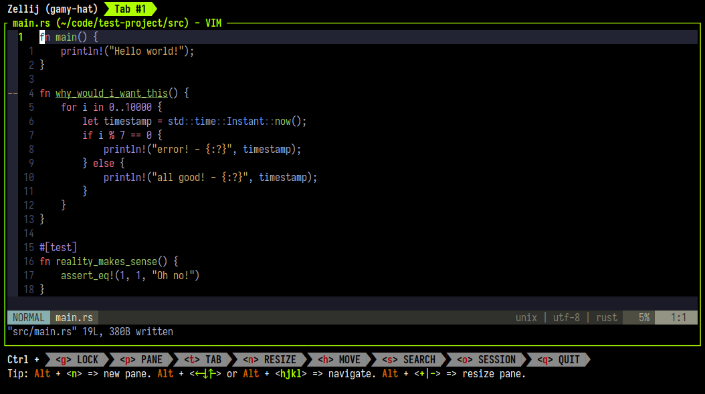
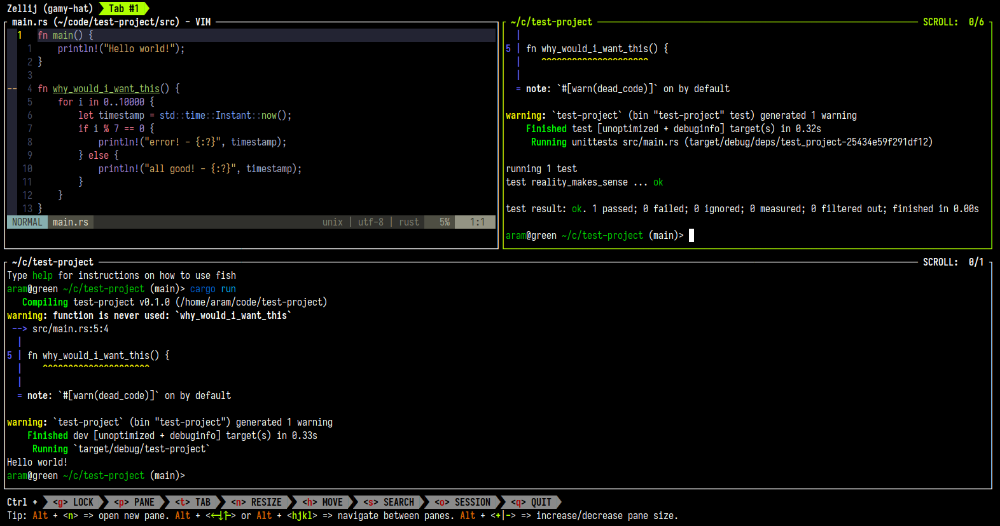
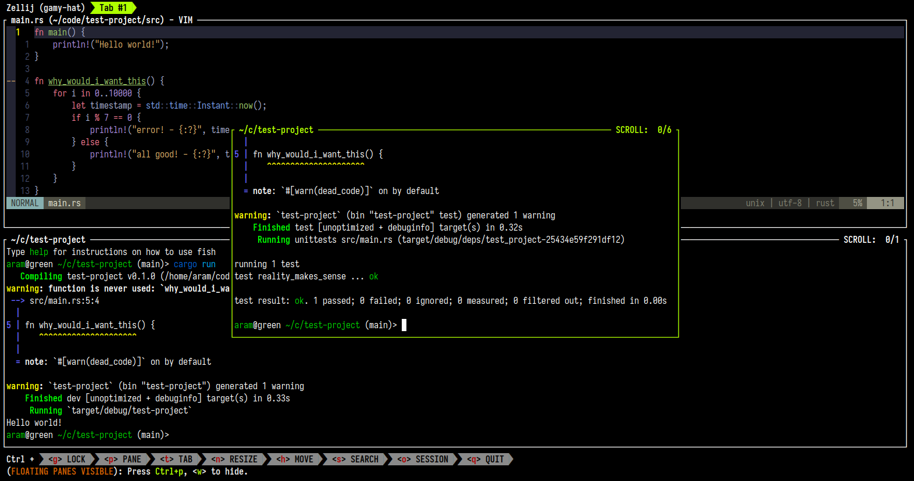
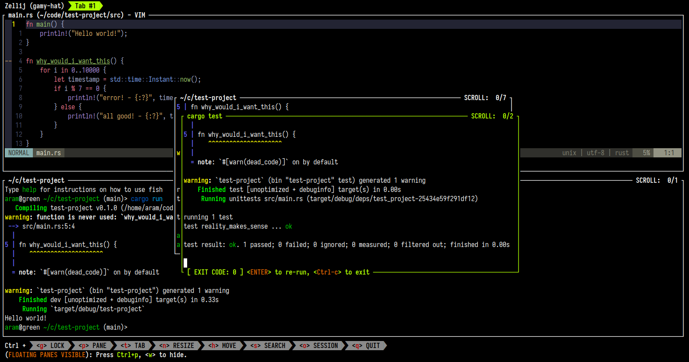
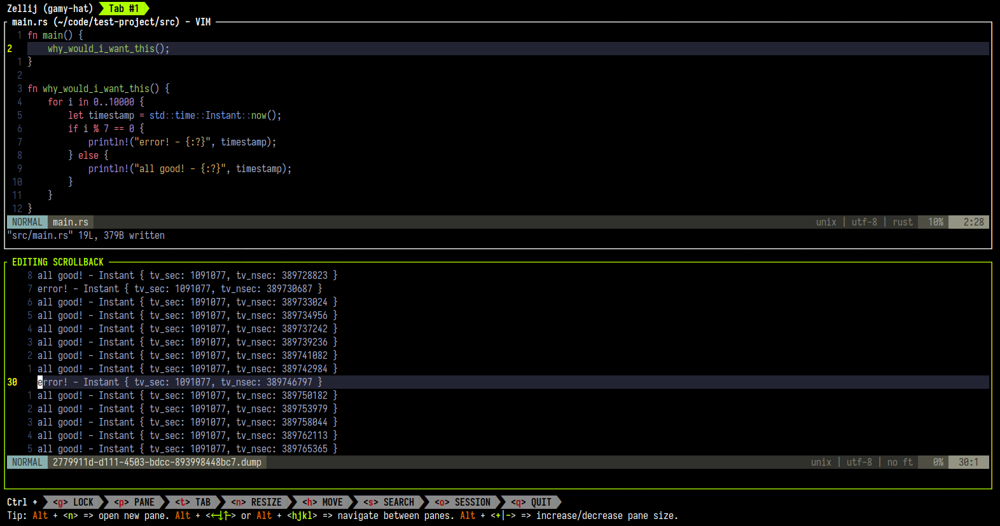

## Getting Started



An image of Zellij running inside a terminal with vim open to the main.rs file of the project.

We’ll use a basic Rust project as an example, but it can work with any sort of code. To follow along, you can clone [the repository](https://github.com/imsnif/zellij-screencast-1).

After [installing Zellij](https://zellij.dev/documentation/installation.html), let’s start it up in the project’s directory.

Then let’s open up `vim` to the main file in the repository: `vim src/main.rs`

## Opening New Panes



An image of Zellij with three panes, one open to main.rs, one running cargo run and the third running cargo test

The most basic functionality of Zellij is opening up different terminal panes in the same tab. Let’s open up some and run different commands in each.

First we split the terminal down so that we can run our code: `Ctrl p` + `d` then `cargo run` in the new pane.

Next, let us open another pane to run tests: `Alt n` will open a new pane in the largest available space. `cargo test` inside this new pane will run our tests.

## Using Floating Panes



An image of Zellij with a floating pane running cargo test

Floating panes can be a powerful tool for toggling context. Running tests inside them is a classic use-case.

Let’s make our existing “tests” pane floating by ejecting it with: `Ctrl p` + `e`

Now that it is floating, we can toggle its visibility and focus: `Ctrl p` + `w` to hide, and `Ctrl p` + `w` again to show.

*Tip:* When toggling floating panes with `Ctrl p` + `w`, if none exist one will be opened.

*Another tip:* When floating panes are visible, you can open new ones with `Alt n`, move existing ones with the mouse or use all Zellij keyboard shortcuts on them as you would with regular “tiled” panes.

## Starting Command Panes from the CLI



An image of Zellij with two floating panes, the front one running cargo test and showing its exit status and extra controls on screen

Instead of retyping, pressing the up arrow or searching our history for a particular command - we can have it waiting for us in a command pane.

From the CLI, we use the `zrf` [alias](https://zellij.dev/documentation/controlling-zellij-through-cli.html#completions) (zellij run floating) to run the `cargo test` command as a floating command pane:

```bash
$ zrf cargo test
Bash
```

We see the exit status of the pane, can scroll / search through its output normally and can re-run it by pressing `<ENTER>`

## Editing the Scrollback with your own $EDITOR



An image of Zellij with a pane open to the vim editor editing its own scrollback

Zellij allows you to open a pane’s existing scrollback with your own `$EDITOR` eg. vim. Let’s try it out.

To get some output, let’s change the `main` function in `main.rs` to:

```rust
fn main() {
    why_would_i_want_this();
}
Rust
```

Now let’s move focus to the bottom pane either by clicking it with the mouse, with `Alt j` or with `Alt <down-arrow>`.

We run the program with `cargo run` and see all the output on screen.

Now, let’s press `Ctrl s` + `e` and the output is opened up in our editor (vim in the author’s case). When using vim, we can issue the following command to delete all lines that don’t contain the word “error”: `:%g!/error/d`.

Then, let’s save the resulting lines to a different file (in vim: `:s /tmp/my-other-file.md`) and we can send it to a friend or do whatever we like with it.

## Finally

Here we learned the very basics of Zellij usage. Be they classic multiplexer features such as splitting panes or slightly more advanced workspace features such as managing Command Panes and editing scrollback.