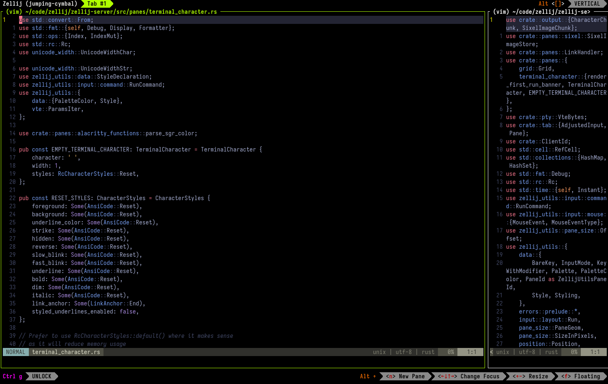
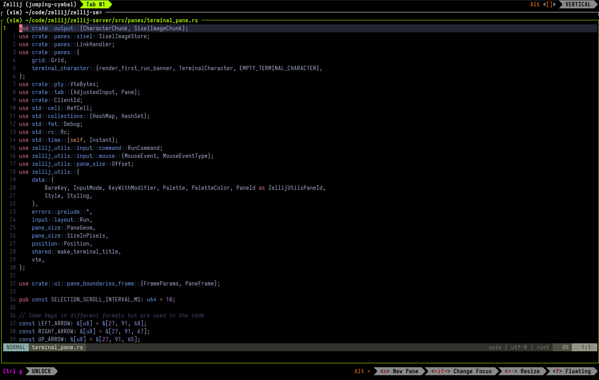
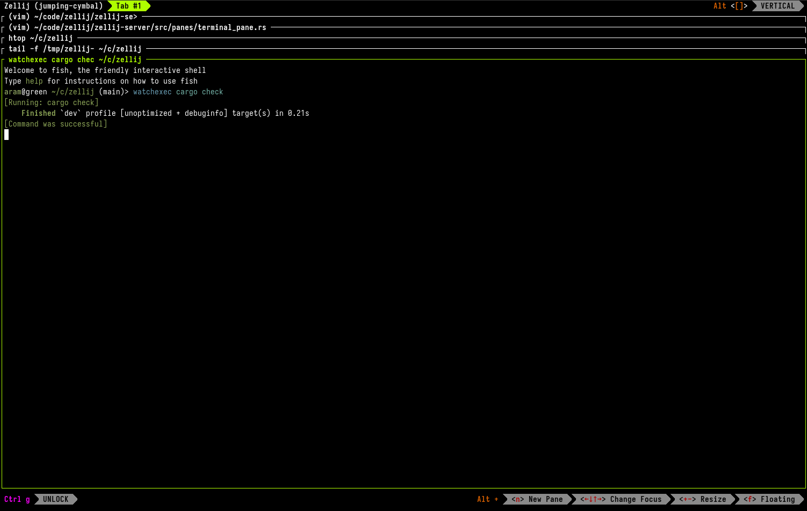
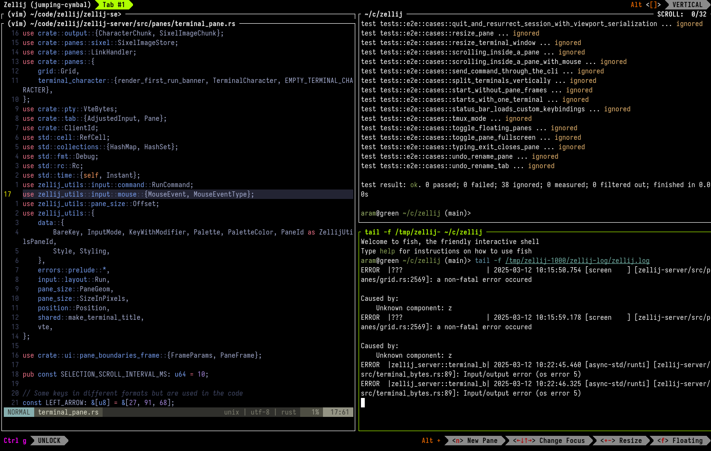
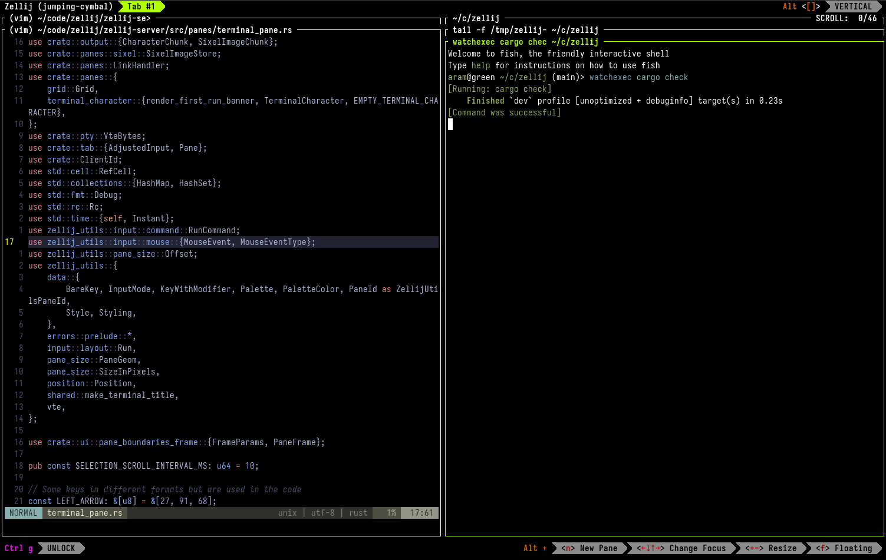
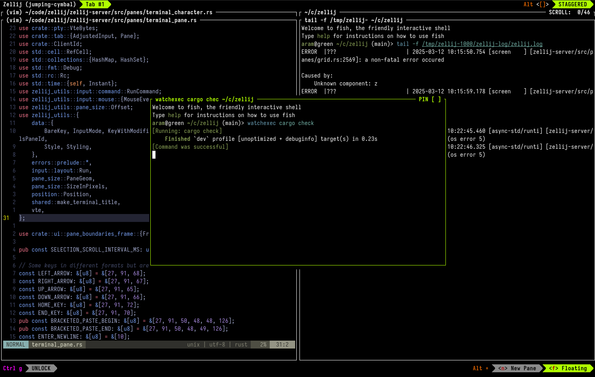
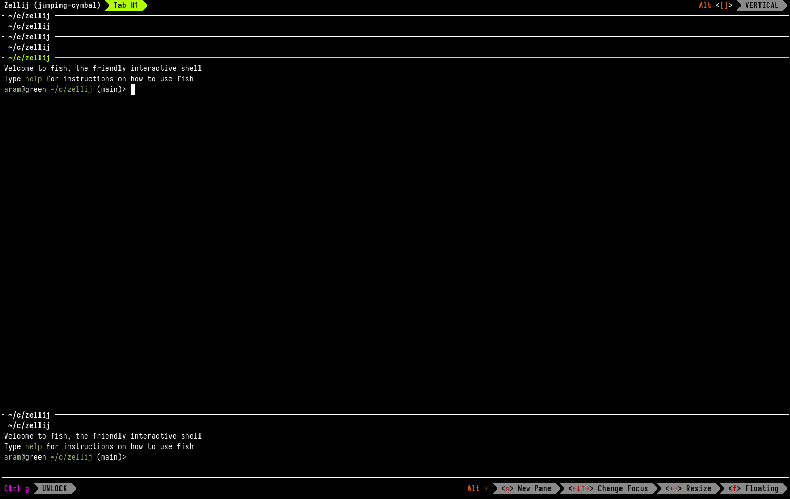
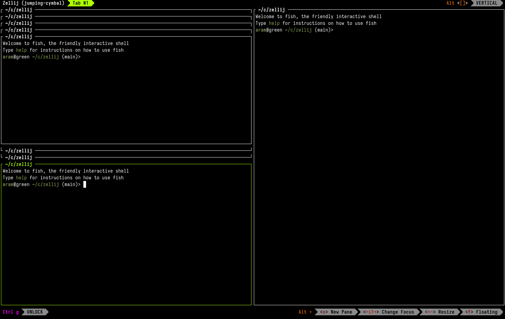

The practical example uses some applications to demonstrate the utility of these features and gives them as examples, if you would like to follow along you could either use these or other applications that fit your workflow, or just open up empty terminal panes to understand the functionality.

## Practical Workflow Example

### Introduction

In this example, we’re going to use `vim` to open two files side-by-side, resize them into stacks and move them around to make more panes. In the end, we’ll also use a pinned floating pane in order to get information in real time as we’re developing.

### Start with two panes side-by-side

An image of Zellij two editor panes side by side.

We start out with an empty Zellij session and then open a file in our editor.

*Example:*`vim /path/to/my-file`

We then split the pane to the right with: `Ctrl p` + `r`. And in the new pane, we’ll open another file.

*Example:*`vim /path/to/my-other-file`

### Resize one pane

An image of Zellij two editor panes side by side, one of them taking up more space.

Now, we’ll resize one of the panes to be able to better read its contents while still keeping the other pane open. We’ll do this with `Alt +`. The pane will be resized 30% of the screen in an available direction so long as it does not override another pane or panes completely. We’ll resize it back into its original position with `Alt -`.

### Resize panes into a stack

An image of Zellij two editor panes in a stack one on top of the other.

If we want to concentrate on one of these panes at a time, but still keep the other pane’s title visible on screen we can press `Alt +` twice to stack them. Once stacked, we can navigate up and down the stack with `Alt <←↓↑→>` (either arrow keys or `hjkl`).

### Open new panes in the stack

An image of a stack of panes taking up the full Zellij screen, with two editor panes and some additional panes running other commands.

When we’re focused on a stack, we can open additional panes in the stack with `Alt n`. We can close these panes normally with `Ctrl p` + `x`.

### Split the stack Right

An image of a stack of panes taking up the right side of the Zellij screen, with an additional single pane taking up the left side.

Now, let’s split the whole stack to the right to add a new terminal pane. We do this like splitting a regular pane to the right with `Ctrl p` + `r`. In this new pane, we’re going to run a new command that we can view and interact with as we’re working with the files in our stack on the left.

*Example:*`cargo test`

### Split the new pane Down

An image of a stack of panes taking up the right side of the Zellij screen, with two additional panes taking up the left side one on top of the other - one running cargo test, the other tailing a log file.

Let’s now split this new pane down in order to run an additional command. We do this with `Ctrl p` + `d`. In this new pane, we’re going to tail a log file in order to give us information in real time as we’re developing.

*Example:*`tail -f /path/to/my/log-file`

### Resize into a second stack

An image of a stack of panes taking up the right half of the Zellij screen, with an additional stack taking up the left half of the screen.

We will now create a second stack from the log file pane and the test pane. We will do this by pressing `Alt +` while focused on the log file pane until it stacks with the test pane.

### Add another pane to the second stack

An image of a stack of panes taking up the right half of the Zellij screen, with an additional stack taking up the left half of the screen. This time, the bottom of the stack includes the watchexec cargo check command.

We’ll add a new pane to this second stack with `Alt n`. In this new pane, we’ll run a syntax checker that will execute whenever we save a file. This will be helpful to give us more detailed errors on any syntax errors we get while editing the files in our left stack.

*Example:*`watchexec cargo check`

### Go to the left stack and resize the stack until it’s full-screen

An image of a single editor pane taking up the full screen. This time the tab name has a (FULLSCREEN) suffix to it to indicate this.

Now that we have our workspace set up, we’re going to navigate back to one of our edited files and expand it until it takes up the full-screen. We navigate with `Alt <←↓↑→>` (either arrow keys or `hjkl`) into one of the panes in the left stack and then press `Alt +` until it takes up the full screen.

### Go back to the original state

An image of a stack of panes taking up the right half of the Zellij screen, with an additional stack taking up the left half of the screen. This time, the bottom of the stack includes the watchexec cargo check command.

Now that we know how to get to this state, we may want to bring another pane with us. Let’s return to the original state by pressing `Alt -` until all of our panes appear on screen.

### Eject the last pane to have access to it in the full-screen pane

An image of two pane stacks on the left and right halves of the screen, with an additional pane floating above them in the middle running the watchexec cargo check command.

Then, we’re going to navigate to the syntax checker pane (the `watchexec cargo test` pane in our example) and eject it to become a floating pane. We do this with `Ctrl p` + `e`. Once we’ve done so, we’re going to toggle off the floating panes with `Alt f` for a moment while we resize back to full screen.

### Set the last ejected pane as Pinned so it’s always-on-top

An image of one editor pane taking up the whole screen with a floating watchexec cargo check pane set as pinned (always-on-top) on the top right of the screen, showing compiler errors relating to the editor pane below it in real time.

We navigate back to our editor pane, press `Alt +` until it’s full screen again and then toggle back our syntax checker pane with `Alt f`.

Finally, we toggle it to become `Pinned` either by clicking with the mouse on its top right corner, or with `Ctrl p` + `i`. This will make it stay always on top even if we focus on the pane below it (either with `Alt f` or by clicking it with the mouse). If we’d like, we can drag our pinned pane out of the way with the mouse, by clicking and dragging on its frame, or with the keyboard with `Ctrl h` + `<←↓↑→>` (arrow keys or `hjkl`).

## How stacked-resize works

In this section, we’re going to take a deeper dive into how the “stacked resize” algorithm works. Namely looking at its behavior and what can be done with it so that you’ll be able to take better advantage of it in your day-to-day workflows.

When in `stacked resize` mode (which is the default and can be turned off in the configuration by adding `stacked_resize false`), whenever we resize our focused pane with `Alt +` Zellij will try to increase its size by 30% of the screen in one direction. If it is not able to do this in any direction (eg. because this would mean it covers up one or more panes completely), it will try to stack this pane with adjacent panes in each direction.

The above is also true and transparent if the focused pane is already stacked, and/or if the adjacent panes are already stacked. If a stack takes up the whole screen and we increase the pane size once more with `Alt +`, the pane will become full-screened (similar to what would happen if we issue `Ctrl p` + `f` on any focused pane normally).

When reducing the size of panes in a stack with `Alt -`, Zellij will try to break the stack away from the focused pane (eg. if the focused pane is on the bottom of the stack, it will break out the top-most pane of the stack).

Zellij also remembers the previous sizes of panes on screen when resizing in this manner. Meaning that an `Alt +` and `Alt -` is essentially an “undo chain”, so long as the same pane is focused and no new panes have been added to the tab.

Let’s look at this in practice:

### In a new tab, open 6 directionless panes

An image of six terminal panes of different sizes arranged in different locations on the same tiled surface on screen.

In a new Zellij session, or a new Zellij tab, open 6 panes with `Alt n`.

*Note: if the panes you opened don’t look like the screenshot, try snapping them into the `VERTICAL` layout by pressing `Alt [` one or more times*

### Go to the middle pane and resize it a few times

An image of three terminal panes of different sizes arranged in different locations on the same tiled surface on screen with an additional pane stack in the middle.

Navigate to one of the panes in the middle with `Alt <←↓↑→>` (either arrow keys or `hjkl`), and then resize it with `Alt +` a few times.

### Go to the middle pane and resize it until full screen

An image of a single terminal pane taking up the whole screen with the (FULLSCREEN) indication on its tab above.

Keep resizing the pane with `Alt +` until you’ve reached the full screen.

### Resize it back

An image of six terminal panes of different sizes arranged in different locations on the same tiled surface on screen.

Now, we’ll resize this pane back to its original state by pressing `Alt -` until it is again in the middle of the screen. This takes advantage of the “undo chain” we described at the beginning of this session.

### Resize it again, focus a different pane and try to resize it back

An image of a stack of panes taking up the whole screen except an additional smaller pane on their bottom.

Let’s now once again resize this pane a few times with `Alt +`, but this time we’ll stop one resize before it hits full screen. We’ll then navigate to a different pane in the stack and hit `Alt -` a few times. Notice how now the stack is broken into individual panes rather than bringing us back to the original stack: we have broken the “undo chain” by focusing a different pane and resizing it.

### Split the stack right

An image of a stack of panes taking up the left half of the screen with a single pane taking up the right half.

We now press `Alt +` until we have one stack filling the whole screen. We can split this whole stack to the right and add a new terminal pane with `Ctrl p` + `r`.

### Split the stack down

An image of a stack of panes taking up the upper left corner of the screen with a single pane taking up the right half and a single pane taking up the bottom left corner of the screen.

Finally, let’s focus back on one of our panes in the stack to the left and split it down with `Ctrl p` + `d`. Notice that the whole stack splits down and we get one additional pane on the bottom.

## Do you like Zellij? ❤️

Me too. So much so that I spend 100% of my time developing and maintaining it and have no other income.

Zellij will always be free and open-source. Zellij will never contain ads or collect your data.

If the tool gives you value and you are able, please consider [a recurring monthly donation](https://github.com/sponsors/imsnif) of 5-10$ to help me pay my bills. There are Zellij stickers in it for you!