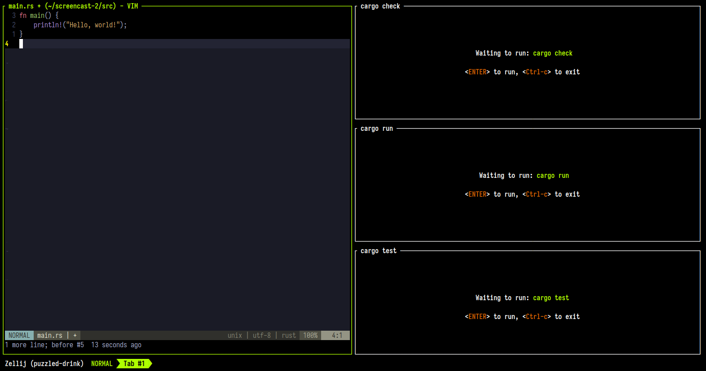
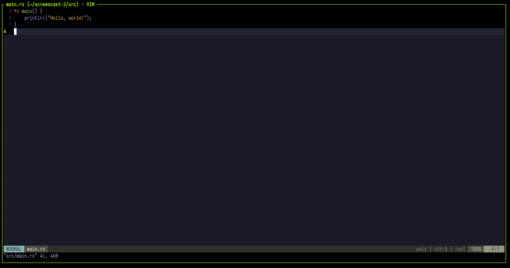
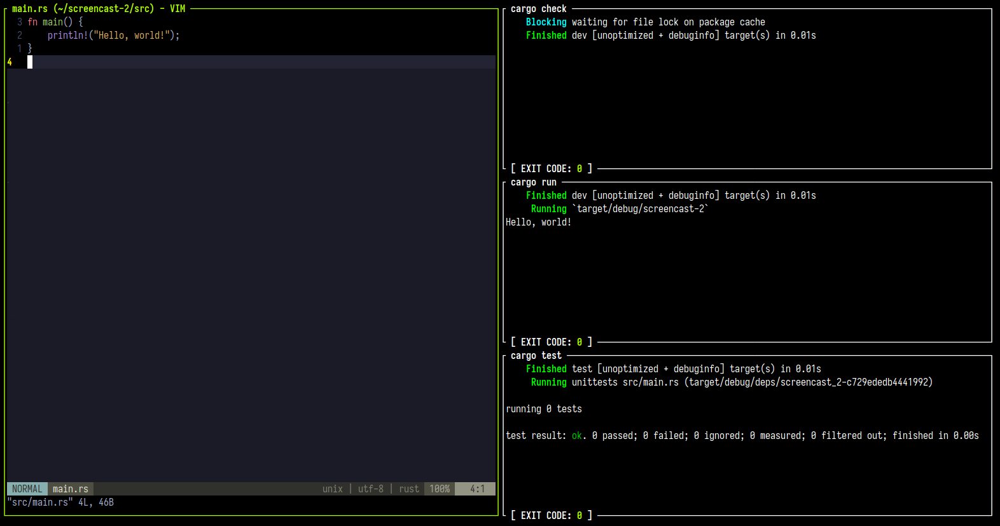
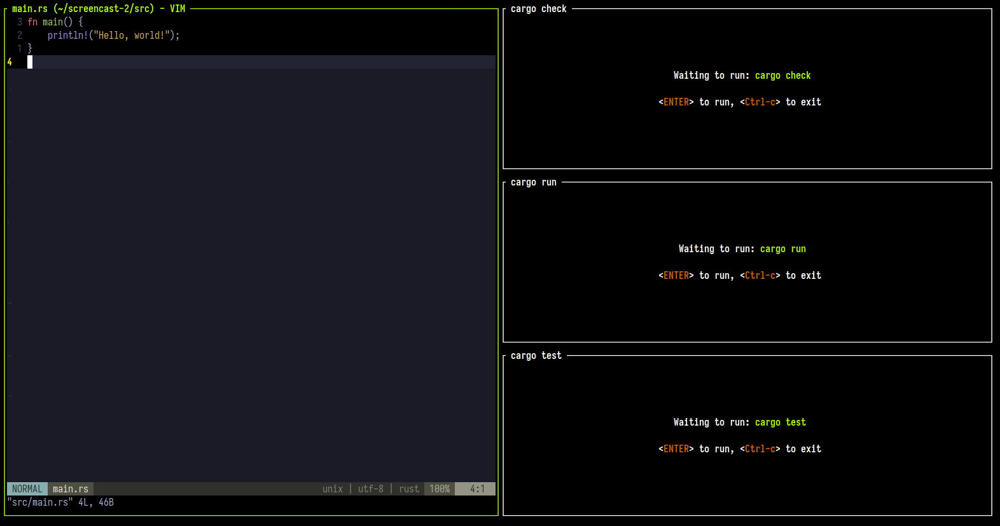

This tutorial walks you through creating Zellij [layouts](https://zellij.dev/documentation/creating-a-layout.html) to automate tasks and workflows.

Layouts describe a pre-defined set of panes and tabs with different terminals, commands and plugins. They can be great to automate and formalize workflows and tasks.
## The Goal



The layout we’re creating is for a default Rust project. Rust is used as an example, but knowledge of Rust is not required to benefit from this tutorial.

*In the above screenshot*: on the left, we have our default editor (vim in the author’s case) opened to the main file (`src/main.rs`), and on the right we have three often-used commands - one in each pane. These are Command Panes, meaning they’re first-class citizens of Zellij rather than a command run in a terminal. This means we get to see their `Exit Code` as well as re-run them by pressing `Enter`.

## What we’ll cover

- [Creating and Opening a Basic Layout](https://zellij.dev/tutorials/layouts/#creating-and-opening-a-basic-layout-file)
- [Edit and Command Panes](https://zellij.dev/tutorials/layouts/#edit-and-command-panes)
- [Changing Pane Orientation](https://zellij.dev/tutorials/layouts/#changing-pane-orientation)
- [Avoiding Repetition with Pane Templates](https://zellij.dev/tutorials/layouts/#avoiding-repetition-with-pane-templates)
- [Do you like Zellij?](https://zellij.dev/tutorials/layouts/#do-you-like-zellij-)

## Getting Started

To follow along, you can clone [the repository](https://github.com/imsnif/zellij-screencast-2).

Zellij uses [KDL](https://kdl.dev/) as its configuration language. You can get syntax highlighting for your favorite editor on the KDL website.

*OPTIONAL:* If you don’t have `cargo` installed, you can install it through [rustup](https://rustup.rs/) so that the layout we’re creating will work on your computer. This step is not necessary to benefit from this tutorial.

## Creating and Opening a Basic Layout File

Let’s start by creating an empty layout file and add a single `layout` node to it:

### basic-rust-layout.kdl

```rust
layout
Rust
```

Now let’s navigate to our Rust project and open the layout, in a new Zellij session if we’re not inside one already:

```
zellij --layout /path/to/basic-rust-layout.kdl
```

Or in a new-tab if we’re in an existing Zellij session:

```
zellij action new-tab -l /path/to/basic-rust-layout.kdl
```


Here we are greeted with one terminal window, which is the default single-pane for an empty layout file.

## Edit and Command Panes

Let’s add some content to our layout. First, let’s add an `edit` pane:

### basic-rust-layout.kdl

```rust
layout {
    pane edit="src/main.rs"
}
Rust
```

Opening this layout now, we’re greeted with a single editor pane. This pane uses our default `$EDITOR` (vim in the author’s case), opened to the main.rs file:



Moving onwards, let’s add three Command panes to run 3 often used commands:

1. `cargo check` - to see if our code compiles without running it
2. `cargo run` - to compile and run our project
3. `cargo test` - to run our tests

In our layout file, this looks like this:

```rust
layout {
    pane edit="src/main.rs"
    pane command="cargo" {
        args "check"
    }
    pane command="cargo" {
        args "run"
    }
    pane command="cargo" {
        args "test"
    }
}
Rust
```

Opening this layout now, we get:


We now have all the panes we need, but their content is not very easy to read or manage. We could definitely take better advantage of our screen real-estate!

## Changing Pane Orientation

To change pane orientation between vertical and horizontal, we need to create logical containers around the panes whose orientation we’d like to change.

Our first container is around the entire layout, and out second container is around just the three Command panes.

```rust
layout {
    pane split_direction="vertical" { // first logical container
        // all these panes will be laid out vertically next to each other
        pane edit="src/main.rs"
        pane split_direction="horizontal" { // second logical container
            // all these panes will be laid out horizontally next to each other
            pane command="cargo" {
                args "check"
            }
            pane command="cargo" {
                args "run"
            }
            pane command="cargo" {
                args "test"
            }
        }
    }
}
Rust
```

Opening this layout now, we get:



## Suspending Pane Command Startup

While the commands we added are relatively short lived, there might be occasions where we’d like to add a pane with a resource-intensive command that we’d only like to run on demand, and not immediately when we open the layout.

To do this, we add the `start_suspended` attribute to our Command panes:

```rust
layout {
    pane split_direction="vertical" {
        pane edit="src/main.rs"
        pane split_direction="horizontal" {
            pane command="cargo" {
                args "check"
                start_suspended true
            }
            pane command="cargo" {
                args "run"
                start_suspended true
            }
            pane command="cargo" {
                args "test"
                start_suspended true
            }
        }
    }
}
Rust
```

Now, when we open the layout, these three commands will be patiently waiting for us to press `Enter` to run them for the first time:



## Adding the Zellij UI (plugins)

When we open the layout we created above, we don’t see the Zellij UI. This is because the Zellij UI is made up of plugins that, while they come built-in with Zellij, need to be specified in the layout. So let’s add them.

We’re going to add the compact-bar, which is the minimal Zellij UI showing the session name, the current input mode and the open tabs. To do this, we can take a look at one of the default layouts (the compact layout) and copy it from there: `zellij setup --dump-layout compact`.

Here’s what we’ll end up with:

```rust
layout {
    pane split_direction="vertical" {
        pane edit="src/main.rs"
        pane split_direction="horizontal" {
            pane command="cargo" {
                args "check"
                start_suspended true
            }
            pane command="cargo" {
                args "run"
                start_suspended true
            }
            pane command="cargo" {
                args "test"
                start_suspended true
            }
        }
    }
    pane size=1 borderless=true {
        plugin location="zellij:compact-bar"
    }
}
Rust
```

And now we get:


## Avoiding Repetition with Pane Templates

We could make the above layout more succinct by using a `pane_template`. We have 3 panes which all run `cargo`, all have the `start_suspended true` attribute and only differ in the arguments passed to the command. If we create a template like this:

```rust
pane_template name="cargo" {
    command "cargo"
    start_suspended true
}
Rust
```

We would be able to shorten each pane declaration to:

```rust
cargo { args "test"; }
Rust
```

So finally, our layout looks like this:

```rust
layout {
    pane split_direction="vertical" {
        pane edit="src/main.rs"
        pane split_direction="horizontal" {
            cargo { args "check"; }
            cargo { args "run"; }
            cargo { args "test"; }
        }
    }
    pane size=1 borderless=true {
        plugin location="zellij:compact-bar"
    }
    pane_template name="cargo" {
        command "cargo"
        start_suspended true
    }
}
Rust
```

Here we learned how to create a basic layout to facilitate working with a Rust project through the terminal. There are plenty additional layout features to explore, such as tabs, tab\_templates and cwd composition. Check out more in the [official docs](https://zellij.dev/documentation/creating-a-layout.html).

## Do you like Zellij? ❤️

Me too. So much so that I spend 100% of my time developing and maintaining it and have no other income.

Zellij will always be free and open-source. Zellij will never contain ads or collect your data.

If the tool gives you value and you are able, please consider [a recurring monthly donation](https://github.com/sponsors/imsnif) of 5-10$ to help me pay my bills. There are Zellij stickers in it for you!