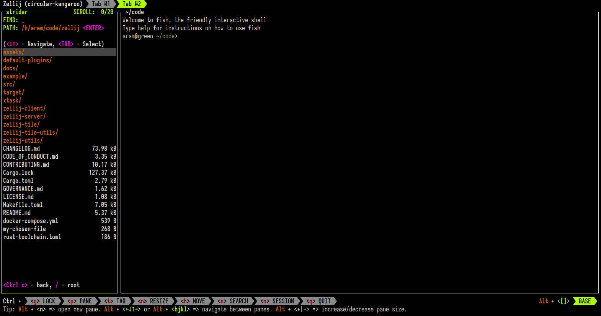

This tutorial shows how to use the Zellij filepicker, also known as Strider.
## Why use the Zellij filepicker?

The Zellij filepicker is a built-in plugin that will allow you to dynamically traverse your filesystem, optionally using fuzzy finding to look for files or folders in a deterministic way. It’s much faster than doing the usual cycle of “cd”, “ls”, look for folder, “cd” and “ls” again.

It’s also versatile: you can launch the filepicker directly and close it once you’ve chosen a file, you can keep it open to open multiple files and you can even insert it into traditional shell pipelines to pipe your chosen path into a different command.
## Basic usage of the filepicker


An image of Zellij filepicker.

When launching the filepicker, it will start in the working directory of the focused pane. We are presented with a list of the files and folders, allowing us to traverse through them with the arrow keys, backspace and tab.

When we select a file or folder (either with the right arrow or with `<TAB>`), it will be added to our `PATH:`. When we press `<ENTER>`, the filepicker will open whatever is in the `PATH:` either in our default editor if it’s a file or open a terminal to this location if it’s a folder.

We can toggle hidden files on and off with `Ctrl e`.

## How to launch the filepicker through a keybinding

To launch the filepicker through a keyboard shortcut, we’ll need to add the following lines (starting from `bind`) to the `shared_except "locked"` section of our `keybindings` in the [configuration file](https://zellij.dev/documentation/configuration.html).

```kdl
    shared_except "locked" {
		...
        bind "Alt f" {
            //ToggleFloatingPanes;
            LaunchPlugin "filepicker" {
                floating true
                //close_on_selection true
            };
        }
```

For more info, please see [configuring keybindings](https://zellij.dev/documentation/keybindings.html).

## How to launch the filepicker from the command line

To launch the filepicker from the command line:

```bash
zellij plugin -- filepicker
```

## How to get an IDE-like experience with the filepicker



An image of Zellij filepicker opened on the side, similar to an IDE.

We can get an “IDE-like” experience of having the filepicker always open on the side by using the “strider” built in layout.

We can either start a session with it from the command line:

```bash
zellij -l strider
```

Start a session with it through the [welcome screen](https://zellij.dev/tutorials/session-management).

Or, we could open a new tab with it in an existing session:

```bash
zellij action new-tab -l strider
```

## How to pipe the filepicker’s output to another command

We can also pipe the output of the filepicker - our chosen file or folder - into another command with a traditional CLI pipeline.

To do this, we launch the filepicker through the `zpipe` alias (or using `zellij pipe`):

```bash
zpipe filepicker
zellij pipe -p filepicker
```

This will open the filepicker, allowing us to choose a file or folder. Once we press `<ENTER>`, the filepicker will close and print our chosen path to `STDOUT`. This means that we can use it to select paths dynamically and send them to other commands, for example:

```bash
zpipe filepicker | xargs -i cp {} my-chosen-file
```

This will open the filepicker so that we can select a file and then copy this file to `my-chosen-file` in our local directory.