Heute mal wieder ein [Wunschthema](https://blog.novatrend.ch/deine-themen-roadmap/)!

Ein immer wiederkehrendes Problem bei Content Management Systemen ist die Strukturierung der Inhalte. Wenn sich derjenige, der den Inhalt eingibt und pflegt, an die Erstellung eines Artikels macht, dann „muss“ alles möglich sein und mindestens so komfortabel, wie in Microsoft Word. In WordPress, Joomla und Drupal gibt es für den Artikeltext als Standard ein! Textfeld zur Eingabe des Inhalts und ein separates Feld für den Titel. Damit die Textbearbeitung komfortabel für den Bearbeiter ist, wird ein WYSIWYG Editor eingebunden, der alle gewünschten Funktionen wie Bild-Upload, Formatierungen und vieles andere mehr beinhaltet. Der Editor erzeugt wiederum das benötigte Markup automatisch und schreibt es in das Textfeld. In diesem Textfeld befindet sich bei längeren Artikeln ein großer „HTML Klumpen“, der heutzutage natürlich auch responsive sein sollte. Spätestens bei Videos und Bildern wird das, sagen wir mal, anspruchsvoll. Eine weitere Herausforderung ist die seitenweite Anpassung oder Änderung vorhandener Artikel. Bei mehr als 500 Artikeln kann man so etwas nicht mehr manuell anpassen. Je mehr Autoren an einer Seite arbeiten, desto wichtiger wird eine Strukturierung der Texte.

An dieser Stelle setzt das Paragraphs Modul für Drupal an. Wenn ein Autor einen neuen Artikel schreibt, so kann er die entsprechenden Paragraph Typen auswählen und beliebig oft verwenden. In diesem Artikel beschreibe ich die Einrichtung und Konfiguration des Paragraphs Moduls in Drupal 8.

## Installation

Die Installation von Modulen erfolgt in Drupal 8, je nach Art der Drupal Instanz, über die Kommandozeilen Tools Composer und Drush oder über die Drupal Benutzeroberfläche, also

```
composer require paragraphs
```

oder

```
drush dl paragraphs
drush en paragraphs
```

oder

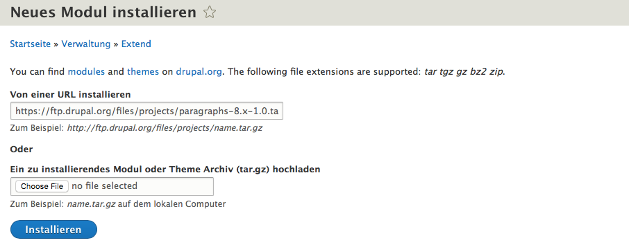

Drupal 8 – Modul installieren

## Konfiguration

Damit man Paragraph Typen benutzen kann, müssen sie zunächst erstellt werden. Im einfachsten Fall nehmen wir mal ein Bild und einen Text. In *Admin -> Struktur -> Paragraphs Type* (/admin/structure/paragraphs\_type) können die Typen angelegt werden.

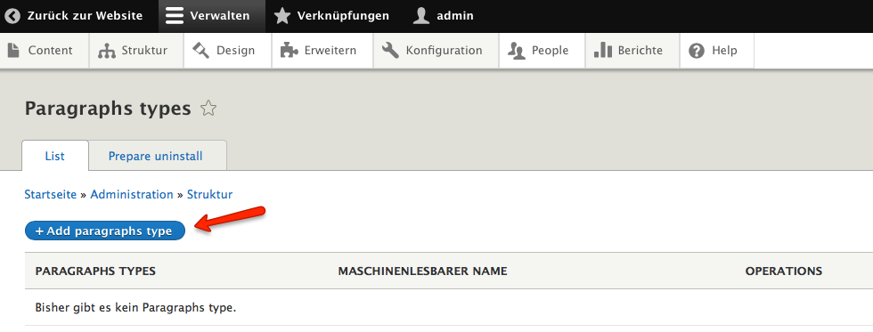

Paragraphs Typen erstellen

### Text Typ erstellen

Nach einem Klick auf den *Add paragraph type* Button wird zunächst der Name des gewünschten Typs abgefragt. Ich möchte einen *Text* Typ erstellen. Dies ist auch der Name, der später dem Autor des Artikels angezeigt werden wird.

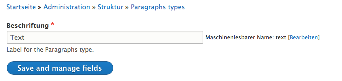

Paragraphs Typ Text erstellen

Nachdem der Typ erstellt ist, muss ein Feld hinzugefügt werden. In meinem Fall natürlich ein Textfeld.

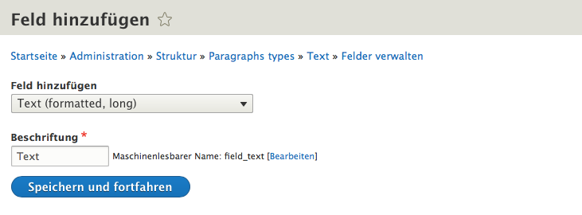

Paragraphs Typ Textfeld hinzufügen

Drupal bietet die Möglichkeit die Anzahl der Felder festzulegen. In meinem einfachen Fall möchte ich nur ein Textfeld. Ich könnte aber auch beispielsweise drei Textfelder erlauben, die dann entsprechend gestylt werden, so dass sie in einem Slider oder in drei Spalten nebeneinander dargestellt werden könnten.

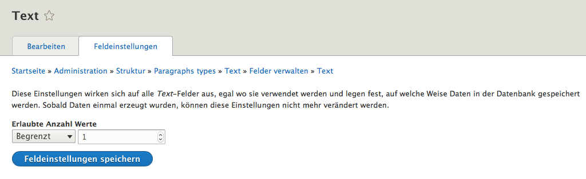

Anzahl der Textfelder im Paragraphs Typ

### Bild Typ erstellen

Der Bild Typ wird genauso erstellt, wie der Text Typ. Als Feldinhalt muss natürlich Bild *(Image)* ausgewählt werden. Die Schritte sind

- neuen Paragraph Typ anlegen
- in dem Typ ein Feld Bild anlegen
- Anzahl der Bilder begrenzen auf eins
- *alt* und *title* Text konfigurieren (nach Bedarf)
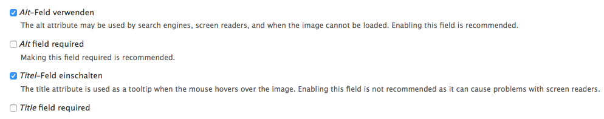

Paragraphs Typ Bild – alt und title Text

## Formatierung

Im Ergebnis haben wir jetzt zwei Paragraph Typen, die jedoch noch für die Ausgabe und Eingabe formatiert werden müssen.

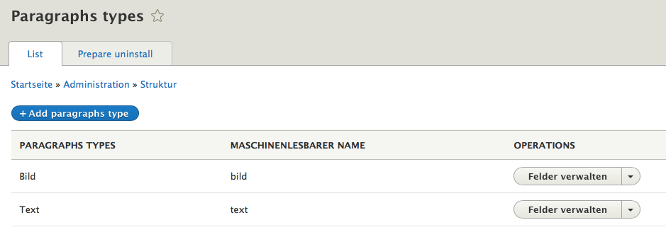

Paragraphs Typen

Als Beispiel blende ich beim Bild das Label aus und ändere die Anzeige von Originalbild auf einen vordefinierten Style (hier 480 x 480 px).

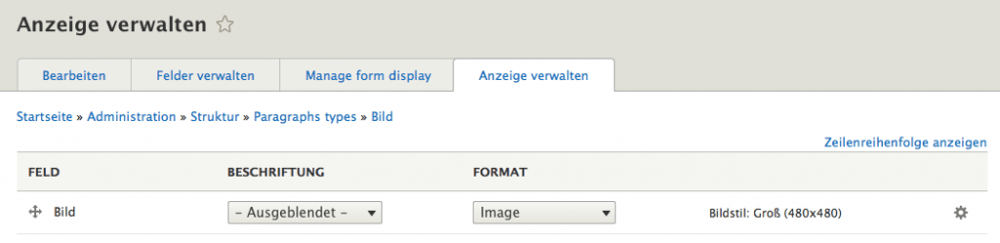

Feld Anzeige – Bild

## Strukturierten Inhaltstyp konfigurieren

Nach der Erstellung der Paragraph Typen kann ich einen neuen Inhaltstyp erstellen, in dem der spätere Autor die unterschiedlichen Paragraphen auswählen kann *(/admin/structure/types)*. Ich nenne den Inhaltstyp *Struktur*, lösche das standardmäßig erzeugte *Body* Feld heraus und füge ein Referenzfeld auf *Paragraphs* hinzu. Hier ist es nun wichtig, die Anzahl der möglichen Werte auf *unbegrenzt* zu setzen, da der strukturierte Artikel ja beliebig viel Paragraphen enthalten soll.

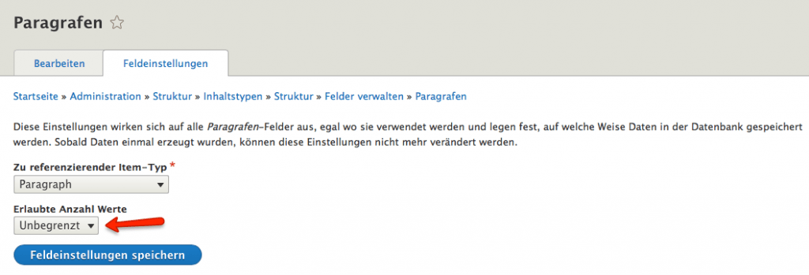

Referenzfeld

## Inhalt eingeben

Jetzt kann der Autor Inhalte eingeben (*Content -> Inhalt hinzufügen -> Struktur* oder */node/add/struktur*). Das Interessante dabei ist nun, dass er einen Titel festlegt und dann den entsprechenden Paragrafen wählt. In meinem einfachen Fall ist das entweder ein Text oder ein Bild. Man könnte aber natürlich auch Videos, Slideshows und vieles andere mehr hier anbieten. Die Möglichkeit Fehler zu machen, ist für den Autor viel geringer als wenn er das Bild selbst positionieren müsste.

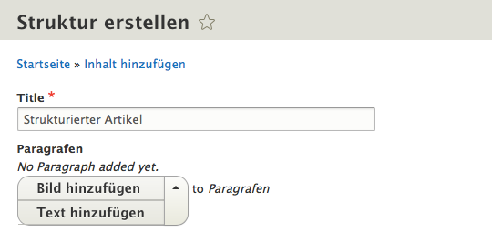

Inhalt eingeben

## Anzeige für den Besucher der Website

Hier ein Beispiel Inhalt. Ich habe den Titel *(strukturierter Artikel)*, drei Text Paragraphen und zwei Bild Paragraphen angelegt und so sieht das Ergebnis auf der Website für den Besucher aus:

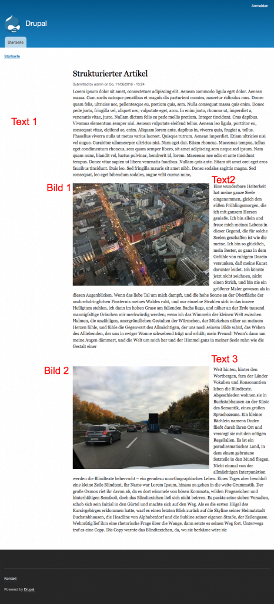

Strukturierter Artikel

Die Ausgabe kann durch individuelle Templates natürlich verändert werden.

## Fazit

Je nach Anwendungsfall ist es notwendig, Inhalte zu strukturieren und dabei gleichzeitig den Autoren die Arbeit zu erleichtern. Das Paragraphs Modul bietet dafür eine elegante Vorgehensweise an.

## Links

- [drupal.org](https://www.drupal.org/)
- [drupal.org/project/paragraphs](https://www.drupal.org/project/paragraphs)