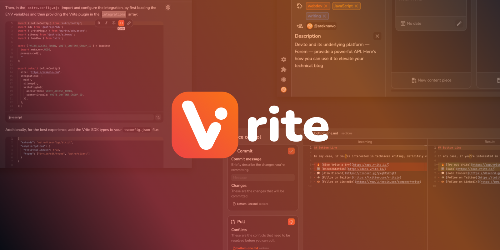

#### [Usage Guide](https://docs.vrite.io/) | [Website](https://vrite.io/) | [Vrite Cloud](https://app.vrite.io/)

Vrite is an open-source, collaborative space to create, manage, and deploy product documentation, technical blogs, and knowledge bases. It aims to provide a high-quality, integrated user and developer experience, with features like:

- **Built-in management dashboard** for managing content production and delivery using Kanban or List view;
- Modern **WYSIWYG** editing experience with support for **Markdown**, integrated **code editor**, code formatting and real-time collaboration;
- AI-powered **semantic search** for organizing and searching through your content base;
- Versitile **API** and **Extension System** for customizing your experience and delivering content to any frontend;
- **Open-source**, with options to both self-host and use [Vrite Cloud](https://app.vrite.io/).

Learn more about all the features of Vrite and how to use them from the [official Usage Guide](https://docs.vrite.io/).

## Links

- 🔥 [**Try out Vrite**](https://app.vrite.io/)
- ℹ️ [**Usage guide**](https://docs.vrite.io/)
- 🚀 [**Blog**](https://vrite.io/blog)
- 📝 [**Report a bug**](https://github.com/vriteio/vrite/issues)
- 🙋‍♀️ [**Request a feature**](https://github.com/vriteio/vrite/discussions)
- 💬 [**Join Discord**](https://discord.gg/yYqDWyKnqE)
- 🐦 [**Follow on Twitter**](https://twitter.com/vriteio)
- 💼 [**Follow on LinkedIn**](https://www.linkedin.com/company/vrite)