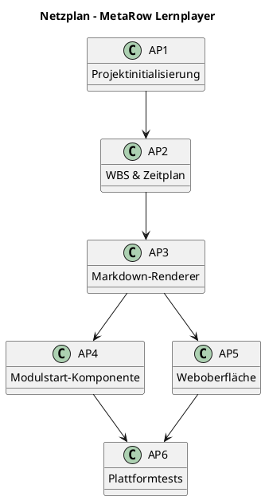

# Projektplanung I  
**Projekt:** MetaRow Lernplayer  
**Team:** Projektteam MetaRow  
**Datum:** 05.06.2025

---

## 🔹 Projektstruktur (WBS)

### Projektbeschreibung  
**Ziel:** Entwicklung einer plattformübergreifenden Desktop-Anwendung zur Offline-Nutzung interaktiver Markdown-Lerninhalte mit:
- Lokalem Modulstart (.py/.sh/.html)
- Mobiler Weboberfläche zur Steuerung
- Logging ohne Cloud oder Benutzerkonten
- Open Source-Ansatz

### WBS – Level 1  
| Bereich                         | Beschreibung                          | Verantwortlich              |
|---------------------------------|----------------------------------------|-----------------------------|
| 1.0 Projektvorbereitung         | Initialisierung, Anforderung, Struktur | Projektleitung              |
| 2.0 Systemdesign & Architektur  | Technische Konzepte                    | Anwendungsentwicklung       |
| 3.0 Implementierung & Integration | Markdown, Modulstart, Web             | Anwendungsentwicklung       |
| 4.0 Test & Qualitätssicherung   | Plattformtests, Performance            | Tester:innen, Systemintegration |
| 5.0 Distribution & Projektabschluss | Verteilung, Lizenz, Abschluss        | Projektleitung, Dokumentation |

### WBS – Level 2 (Auszug)
- 1.1 Projektinitialisierung  
- 1.2 Anforderungserhebung  
- 1.3 Projektstrukturplanung  
- 2.1 Softwarearchitektur  
- 3.1 Markdown-Renderer  
- 3.2 Modulstart-Komponente  
- 3.3 Weboberfläche  
- 4.1 Plattformtests  
- 5.1 Verteilungskonzept

---

## 🔹 3-Punkt-Schätzung

### Schätzwerte (realistische APs)

| Arbeitspaket           | Aufwand (Ø) | Puffer (15%) | Gesamt |
|------------------------|-------------|--------------|--------|
| 3.1 Markdown-Renderer  | 24.3 h      | 3.6 h        | 27.9 h |
| 3.2 Modulstart         | 30.7 h      | 4.6 h        | 35.3 h |
| 3.3 Weboberfläche      | 29.3 h      | 4.4 h        | 33.7 h |
| 2.1 Softwarearchitektur| 20.7 h      | 3.1 h        | 23.8 h |
| 4.1 Plattformtests     | 18.7 h      | 2.8 h        | 21.5 h |

**Gesamtaufwand inkl. Puffer:** **142.3 Stunden**

### Reflexion  
- Größte Unsicherheiten: Rechte, Webtechnologie, mobile Zugriffe  
- Technische Risiken: Linux/macOS-Kompatibilität, WLAN

---

## 🔹 Termin- & Meilensteinplanung

### Meilensteine

| Nr | Bezeichnung                              | Termin       | Verantwortlich |
|----|------------------------------------------|--------------|----------------|
| M1 | Projektauftrag genehmigt                 | 05.06.2025   | Projektleitung |
| M2 | WBS & Zeitplan abgeschlossen             | 10.06.2025   | Projektleitung |
| M3 | Markdown-Renderer funktionsfähig         | 31.07.2025   | L. Kubbe       |
| M4 | Modulstart einsatzbereit                 | 15.09.2025   | D. Bierbüsse   |
| M5 | Websteuerung mobil verfügbar             | 01.11.2025   | R. Puppe       |

### Zeitstrahl (vereinfachte Darstellung)

```markdown
### Zeitstrahl (Wochenansicht mit Monat)

Monat:         Jun           Jul           Aug           Sep           Okt           Nov
KW:            23 24 25 26   27 28 29 30   31 32 33 34   35 36 37 38   39 40 41 42   43 44 45 46

AP1:           [███]
AP2:               [███]
AP3:                   [███████████]
AP4:                                [████████████]
AP5:                                     [██████████]
AP6:                                                  [██████]

Meilensteine:   M1   M2        M3             M4             M5

```

### Puffer & Risiken
- Arbeitspaketpuffer: **15 %**  
- Meilensteinpuffer: **10 %**  
- Gesamtprojekt: ~20 Tage  
- Kritische Faktoren: OS-Freigaben, WLAN-Testbarkeit, Teamverfügbarkeit

---

## 🔹 Netzplantechnik, Gantt & Kritischer Pfad

### ASCII-Netzplan (logisch)

```
[AP1] → [AP2] → [AP3] ─┐  
					   ├→ [AP6]  
		 [AP3] → [AP4] ┘  
		 [AP3] → [AP5]
```


### PlantUML-Version (optional renderbar)



### Glossar (Auszug)

| Begriff         | Bedeutung                                     |
| --------------- | --------------------------------------------- |
| Kritischer Pfad | Aufgabenfolge ohne Zeitpuffer                 |
| Gesamtpuffer    | Verschiebung ohne Projektverzug               |
| Freier Puffer   | Verschiebung ohne Folgebeziehung zu gefährden |
| EA              | Ende-Anfang (Standardbeziehung)               |

---

## 🔺 Kritischer Pfad – MetaRow Lernplayer

### Definition  
Der **kritische Pfad** ist die längste logische Kette abhängiger Vorgänge im Projekt – jede Verzögerung auf diesem Pfad **verzögert automatisch das gesamte Projekt**.  
→ Er bestimmt die **Mindestprojektdauer** und zeigt die **aufwandskritischen Schritte ohne Puffer**.

---

### Kritischer Pfad (Arbeitspakete mit 0 T Puffer)

[AP1] → [AP2] → [AP3] → [AP4] → [AP6]

| AP-Nr. | Arbeitspaket              | Dauer     | Puffer | Verantwortlich  |
|--------|---------------------------|-----------|--------|-----------------|
| AP1    | Projektinitialisierung    | 5 Tage    | 0 T    | Projektleitung  |
| AP2    | WBS & Zeitplan            | 5 Tage    | 0 T    | Projektleitung  |
| AP3    | Markdown-Renderer         | 15 Tage   | 0 T    | L. Kubbe        |
| AP4    | Modulstart-Komponente     | 20 Tage   | 0 T    | D. Bierbüsse    |
| AP6    | Plattformtests            | 10 Tage   | 0 T    | Tester:innen    |

**Gesamtdauer (kritischer Pfad):** **55 Tage** netto  
→ Das entspricht **11 Wochen** bei 5-Tage-Woche.

---

### Nicht-kritische Aufgaben (mit Puffer)

| AP-Nr. | Arbeitspaket              | Dauer     | Puffer | Kommentar                    |
|--------|---------------------------|-----------|--------|------------------------------|
| AP5    | Weboberfläche             | 15 Tage   | 3 T    | Parallel zu AP4/6 möglich    |

---

### Fazit

- **AP5 (Weboberfläche)** liegt außerhalb des kritischen Pfads, bietet Spielraum.
- Fokus, Kontrolle und Eskalation müssen auf **AP1 → AP2 → AP3 → AP4 → AP6** liegen.
- Der kritische Pfad ist entscheidend für **Projektzeit, Ressourcenplanung und Risikosteuerung**.

---

**Merksatz:**  
> "Der kritische Pfad ist nicht optional – er ist das Rückgrat des Projektterminplans."

