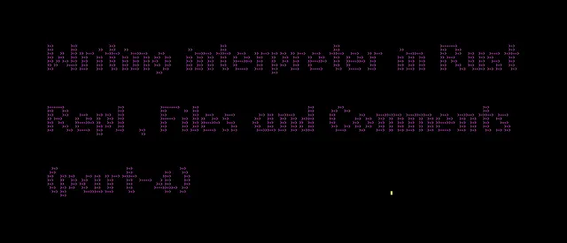

## [Better Programming](https://medium.com/better-programming?source=post_page---publication_nav-d0b105d10f0a-5a11d41613ba---------------------------------------)

[](https://medium.com/better-programming?source=post_page---post_publication_sidebar-d0b105d10f0a-5a11d41613ba---------------------------------------)

Advice for programmers.



Image by author

## Abstract

We’re continuing our journey implementing our interpreter, Coconut.

In this article, we will implement the REPL (Read-Eval-Print Loop), reorganise the project, and add file and comments support. It will be a collection of small changes that will extend the usability of our interpreter.

If you haven’t already, I recommend checking out my previous article, [Writing an Interpreter in Rust: Bytecode and Stack-Based VM (Part 3)](https://medium.com/better-programming/writing-an-interpreter-in-rust-bytecode-and-stack-based-vm-part-3-943af4acf9e0).

## Introduction

REPL (Read-Eval-Print Loop) allows users to execute code and see the results immediately interactively.

Not all interpreters have REPL, but having REPL allows them to prototype and test ideas and language features quickly.

REPL is very handy, especially when I am not 100% familiar with the language interface.

## Project Structure

I have restructured the code, but nothing fundamentally changed from the last implementation. I just moved the code from the main to separate modules to have a clear separation of concerns.

Here’s our `src` directory’s content:

```rb
$ ls -l ./src

ast.rs - AST logic
bytecode.rs - Bytecode logic
coconut.l - Lexer logic
coconut.y - Parser logic
lib.rs - Main library crate
main.rs - Main program
parser.rs - Parsing logic
```

Our `main.rs` file is very simple:

```rb
use std::env;

use coconut::eval_str;

fn main() {
    println!("Writing Interpreter With Rust Part 4");
    let args: Vec<String> = env::args().collect();
    if args.len() > 1 {
        let input = &args[1];
        match eval_str(input) {
            Ok(Some(result)) => {
                println!("{}", result);
            }
            _ => eprintln!("Unable to evaluate expression."),
        }
    } else {
        println!("Please provide at least one cli argument!")
    }
}
```

The main responsibility of `main.rs` is to get the program input, call the appropriate functions of the `lib.rs` crate, and display results or errors to the console.

Here’s our high-level program’s evaluation flow:

We get program input as a CLI argument, `eval_str`, which will parse the string to an AST, translate AST to bytecode, and then evaluate this bytecode.

## Let’s implement the REPL

So far, we have been running our Coconut programs as CLI arguments. Here’s what that looks like:

```rb
$ cargo run '2+2'
4
```

We’re about to change that!

The main component of REPL is, surprisingly, the loop, so let’s start with that by looking at the code below:

```rb
use std::{
    env,
    io::{stdin, stdout, Write},
};

use coconut::eval_str;

fn main() {
    println!("Writing Interpreter With Rust Part 4");
    let args: Vec<String> = env::args().collect();
    if args.len() > 1 {
        eval(&args[1])
    } else {
        repl()
    }
}

fn repl() {
    loop {
        print!("> ");
        stdout().flush().unwrap();
        match stdin().lines().next() {
            Some(Ok(input)) => {
                if input.trim() == "exit" {
                    break;
                }
                if input.trim().is_empty() {
                    continue;
                }
                eval(&input);
            }
            _ => {}
        }
    }
}

fn eval(input: &String) {
    match eval_str(input) {
        Ok(Some(result)) => {
            println!("{}", result);
        }
        _ => eprintln!("Unable to evaluate expression."),
    }
}
```

Try it out

```rb
$ cargo run
> 2+2
4
> 5
5
> exit
```

Works as expected. Each line will be evaluated separately, and the process will repeat until we type `exit`.

That’s it, we have a REPL!

## Adding file support

So now, we have two ways of executing our Coconut programs — with CLI arguments or as a REPL. Let’s add another way — file.

It will allow us to save programs into files and pass them to the interpreter, which will evaluate the source code line by line as if we were typing the lines in the REPL.

Let’s add file support with the following code:

```rb
use std::{
    env, fs,
    io::{stdin, stdout, Write},
};

fn main() {
    println!("Writing Interpreter With Rust Part 4");
    let args: Vec<String> = env::args().collect();
    if args.len() > 1 {
        if args[1].ends_with(".cnt".clone()) {
            eval_file(args[1].clone())
        } else {
            eval(&args[1])
        }
    } else {
        repl()
    }
}

fn eval_file(file_name: String) {
    match fs::read_to_string(file_name) {
        Ok(content) => {
            eval(&content);
        }
        Err(_) => eprintln!("Unable to evaluate expression."),
    }
}
```

Before running the interpreter, we check whether the CLI argument contains the extension.cnt (short for Coconut). If it is, we read the file and evaluate it in the same fashion — line by line.

That’s about it.

## Adding comment support

That might feel like a feature creep by now, but I thought we could add a small feature to our interpreter anyway. As you will witness, it will be a very tiny change. We’re going to add comment support.

For simplicity reasons, we’re going to support only single-line comments.

So, if we have a file named `math.cnt` with the following content:

```rb
// 1+2
2+2
```

We would expect our interpreter to evaluate only the `2+2`.

Luckily, the only thing we need to do for that is to add the following line to our Lexer:

```rb
//[^\n]*?$ ;
```

You can check the Regex yourself. It will match anything between the `//` characters and the end of the line and remove it from parsing.

Our Lexer should look something like this:

```rb
%%
[0-9]+ "INTEGER"
\+ "ADD"
\* "MUL"
\( "LPAR"
\) "RPAR"
//[^\n]*?$ ;
[\t\n ]+ ;
```

Run it

```rb
$ cargo run math.cnt
4
```

And don’t forget about tests

```rb
#[test]
fn comments() {
    assert_eq!(
        eval_str(&"// 2+2\n 1+1".to_string()).unwrap(),
        Some(2),
        "expected 1+1=2"
    );
    assert_eq!(
        eval_str(&"// 2+2".to_string()).unwrap(),
        None,
        "expected 1+1=2"
    );
}
```

And we’re done.

The full source code can be found [here](https://github.com/Pavel-Durov/blog/tree/main/src/writing-interpreter-with-rust-part-4-repl/coconut).

## Summary

This time, we didn’t introduce any new concepts or components into the Coconut interpreter. We refactored the project and added REPL, file evaluation, and comment support.

REPL will allow us to try out our interpreter’s functionality without relaunching the interpreter every time, the program files will allow us to store our Coconut programs for later evaluation, and we can add comments to our source code. What more do we need?:)

This article was written to help me understand the concepts, organise my thoughts, and share knowledge.

I trust it proved valuable!

[](https://medium.com/better-programming?source=post_page---post_publication_info--5a11d41613ba---------------------------------------)

[/e3499289fdc8dd9b866b0ce4be2b5eee_MD5.png)](https://medium.com/better-programming?source=post_page---post_publication_info--5a11d41613ba---------------------------------------)

[Last published Nov 10, 2023](https://medium.com/better-programming/let-a-thousand-programming-publications-bloom-bf37baef8f27?source=post_page---post_publication_info--5a11d41613ba---------------------------------------)

Advice for programmers.

Software Engineer. Human. I write about techy stuff I find interesting. @pav3ldurov

## More from Pavel Durov and Better Programming

## Recommended from Medium

[

See more recommendations

](https://medium.com/?source=post_page---read_next_recirc--5a11d41613ba---------------------------------------)