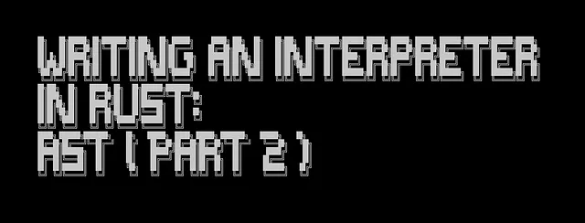

## [Better Programming](https://medium.com/better-programming?source=post_page---publication_nav-d0b105d10f0a-59fd20dbc60f---------------------------------------)

[/0dd5361a9bad802a6f8904316176a15a_MD5.png)](https://medium.com/better-programming?source=post_page---post_publication_sidebar-d0b105d10f0a-59fd20dbc60f---------------------------------------)

Advice for programmers.



Image by author

## Abstract

We’re continuing our journey of implementing an interpreter called Coconut in Rust!

Here, we’ll delve into the concept of AST (Abstract Syntax Tree) and transition from parse-time evaluation to AST-time.

If you haven’t already, I recommend checking out my previous article:  
[Writing and interpreter in Rust using grmtools](https://p3ld3v.medium.com/writing-interpreter-in-rust-using-grmtools-7a6a0458b99f), where we set the stage for our interpreter project.

So, fasten your seatbelts, and let’s get started!

## What is an AST?

The previous article discussed lexing and parsing phases, which helped us convert raw source code into a structured representation.

We ended up with something called parse-tree (aka Concrete Syntax Trees). We never called it by its name or used it explicitly, but that’s where we got to.

An AST (Abstract Syntax Tree) is called “abstract” since it does not contain every detail of the real syntax but only structural and data-related information.

It is a more refined and abstract representation of the code’s syntax. It strips away the irrelevant details in a parse-tree, such as braces, semicolons, etc.

AST contains solely the essential elements required for the execution of the program.

## AST-Time Evaluation

==When we implemented our parse-tree, we evaluated our computation at parse-time. We’ll call it parse-time evaluation from now on.==

While this approach works fine for simple interpreters, it’s not ideal for more complex projects.

## AST-time evaluation advantages

Separation of Concerns — With AST, we separate the parsing and evaluation phases. This makes our code more modular and easier to maintain.

Optimisations — ASTs allow us to optimise code before execution. We can perform various transformations on the AST to improve performance (not covered here).

Error handling — ASTs provide a clearer structure for error reporting as we can pinpoint errors to specific locations in the code.

## Terminology recap

AST — strips out syntactic information that is not needed for evaluation while keeping the essential, structural, and values information.

Parse Tree — includes all the “useless” syntactic information alongside structural and data information.

## Where We Ended Up

Our starting point from the previous article is as follows:

Lexer file `coconut.l`

```c
%%
[0–9]+ "INTEGER"
\+ "ADD"
\* "MUL"
\( "LPAR"
\) "RPAR"
[\t\n ]+ ;
```

Parser file `coconut.y`

```c
%start Expr
%%
  Expr -> Result<u64, ()>:
  Expr 'ADD' Term { Ok($1? + $3?) }
    | Term { $1 }
  ;
  Term -> Result<u64, ()>:
    Term 'MUL' Factor { Ok($1? * $3?) }
    | Factor { $1 }
  ;
  Factor -> Result<u64, ()>:
    'LPAR' Expr 'RPAR' { $2 }
    | 'INTEGER'
  {
    let v = $1.map_err(|_| ())?;
    parse_int($lexer.span_str(v.span()))
  }
  ;
  %%
  fn parse_int(s: &str) -> Result<u64, ()> {
    match s.parse::<u64>() {
      Ok(val) => Ok(val),
      Err(_) => Err(())
    }
}
```

Can you spot where we evaluate addition and multiplication?

Here's the `main.rs` file:

```c
use std::env;

use lrlex::lrlex_mod;
use lrpar::lrpar_mod;

lrlex_mod!("coconut.l"); // brings the Lexer for \`coconut.l\` into scope.
lrpar_mod!("coconut.y"); // brings the Parser for \`coconut.y\` into scope.

fn main() {
    let args: Vec<String> = env::args().collect();
    if args.len() > 1 {
        let input = &args[1]; // Create a lexer
        let lexer_def = coconut_l::lexerdef(); // Lex the input.
        let lexer = lexer_def.lexer(&input);
        let (res, errs) = coconut_y::parse(&lexer); // Parse the input.
        // Check for errors
        for e in errs {
            println!("{}", e.pp(&lexer, &coconut_y::token_epp));
        }
        // Print results
        match res {
            Some(Ok(r)) => println!("{:?}", r),
            _ => eprintln!("Unable to evaluate expression."),
        }
    } else {
        println!("Please provide at least one cli argument!")
    }
}
```

That’s all we have. Let’s add AST to our interpreter.

## Adding AST

First, let’s add a new file, `src/ast.rs`:

```c
#[derive(Debug)]
pub enum Node {
    Add { lhs: Box<Node>, rhs: Box<Node> },
    Mul { lhs: Box<Node>, rhs: Box<Node> },
    Number { value: u64 },
}
```

Nothing special here.

We just defined our operations and the single basic type number as `enum`.

Next, we’re going to change our Parser a bit using the following code:

```c
%start Nodes
%avoid_insert "INTEGER"
%%

Nodes -> Result<Vec<Node>, ()>:
    Nodes Node { flattenr($1, $2) }
  | { Ok(vec![]) }
  ;

Node -> Result<Node, ()>:
      Node 'ADD' Term {
        Ok(Node::Add{ 
          lhs: Box::new($1?), 
          rhs: Box::new($3?) 
        })
      }
    | Term { $1 }
    ;

Term -> Result<Node, ()>:
      Term 'MUL' Factor {
        Ok(Node::Mul{  
          lhs: Box::new($1?), 
          rhs: Box::new($3?) 
        })
      }
    | Factor { $1 }
    ;

Factor -> Result<Node, ()>:
      'LPAR' Node 'RPAR' { $2 }
    | 'INTEGER' { 
        match $1.map_err(|err| format!("Parsing Error: {}", err)) {
            Ok(s) => {
              let s = $lexer.span_str(s.span());
              match s.parse::<u64>() {
                  Ok(n_val) => Ok(Node::Number{ value: n_val }),
                  Err(_) => Err(())
              }
            }
            Err(_) => Err(())
        }
      }
    ;
%%
use crate::ast::Node;

/// Flatten \`rhs\` into \`lhs\`.
fn flattenr<T>(lhs: Result<Vec<T>, ()>, rhs: Result<T, ()>) -> Result<Vec<T>, ()> {
    let mut flt = lhs?;
    flt.push(rhs?);
    Ok(flt)
}
```

Note that we no longer execute the operations in our Parser; we return AST nodes as a vector of type `Vector<ast::Node>`.

The only thing we need to change in our `main.rs` is to add `mod ast;` to make our ast module accessible in our Parser.

If we run our interpreter, we should get the following:

```c
$ cargo run 2+2
[Add { lhs: Number { value: 2 }, rhs: Number { value: 2 } }]
$ cargo run 2+2*2
[Add { lhs: Number { value: 2 }, rhs: Mul { lhs: Number { value: 2 }, rhs: Number { value: 2 } } }]
```

That looks like an AST!

If we format it a bit, it will look even more like a tree. So, let’s do that with this code:

```c
Add { 
  lhs: Number { value: 2 }, 
  rhs: Mul { 
    lhs: Number { value: 2 }, 
    rhs: Number { value: 2 } 
  }
}
```

We have a tree-like structure with the correct order of operations (check it!).

That’s all thanks to the grmtools Parser that does the heavy lifting for us.

Looking at this tree, we can infer that we need to add 2 to a result of multiplication of 2 and 2.

And that’s what we’re going to do next!

## AST-Time Evaluation

We have our AST defined, and we removed the parse-time evaluation.

Next, we’re going to implement ast-time evaluation. We’re going to add two functions `eval` and `eval_exp`.

Notice that `eval_exp` is recursive, as it handles both operations and numbers.

Our `main.rs` content:

```c
use std::env;

use lrlex::lrlex_mod;
use lrpar::lrpar_mod;

lrlex_mod!("coconut.l"); // brings the lexer for \`coconut.l\` into scope.
lrpar_mod!("coconut.y"); // brings the Parser for \`coconut.y\` into scope.

mod ast;

fn main() {
    let args: Vec<String> = env::args().collect();
    if args.len() > 1 {
        let input = &args[1]; // Create a lexer
        let lexer_def = coconut_l::lexerdef(); // Lex the input.
        let lexer = lexer_def.lexer(&input);
        let (res, errs) = coconut_y::parse(&lexer); // Parse the input.
                                                    // Check for errors
        for e in errs {
            println!("{}", e.pp(&lexer, &coconut_y::token_epp));
        }
        // Print results
        match res {
            Some(Ok(r)) => println!("{:?}", eval(r).unwrap()),
            _ => eprintln!("Unable to evaluate expression."),
        }
    } else {
        println!("Please provide at least one cli argument!")
    }
}

pub fn eval(ast: Vec<ast::Node>) -> Result<u64, String> {
    for node in ast {
        return eval_exp(node);
    }
    return Err(String::from("Couldn't evaluate!"));
}

fn eval_exp(exp: ast::Node) -> Result<u64, String> {
    match exp {
        ast::Node::Add { lhs, rhs } => eval_exp(*lhs)?
            .checked_add(eval_exp(*rhs)?)
            .ok_or("overflowed".to_string()),
        ast::Node::Mul { lhs, rhs } => eval_exp(*lhs)?
            .checked_mul(eval_exp(*rhs)?)
            .ok_or("overflowed".to_string()),
        ast::Node::Number { value } => Ok(value),
    }
}
```

Let’s run it.

```c
$ cargo run 2+2*2
6
```

Looks good.

What about parentheses?

```c
$ cargo run '(2+2)*3'
12
```

Also good! And we preserved the operation precedence!

If you don’t 100% follow, there’s no better teacher than your debugger. Try running this code and step through the evaluation of our brand-new AST. It will be worth it, I promise.

## Tests

I hope you didn’t think we’d forget about tests!

We won’t cover all the edge cases, but we’ll add at least a demonstration of how to test our code.

You’ll notice that it won't be easy to test our code. It's not cause its rocket science; it's cause its structured in a non-testable way.

Let’s add a few changes.

We want to test a string input and assert the evaluated output.

So, let’s do just that.

We will extract the main logic from `main` to a new function `from_str`.

This new function `from_str` will accept a string, parse it, evaluate, and will return the result. That change will allow us to streamline our tests.

Here’s what our `main.rs` with a single test looks like:

```c
use std::env;

use lrlex::lrlex_mod;
use lrpar::lrpar_mod;

lrlex_mod!("coconut.l"); // brings the lexer for \`coconut.l\` into scope.
lrpar_mod!("coconut.y"); // brings the Parser for \`coconut.y\` into scope.

mod ast;

fn main() {
    let args: Vec<String> = env::args().collect();
    if args.len() > 1 {
        let input = &args[1]; // Create a lexer
                              // Print results
        match from_str(input) {
            Ok(r) => println!("{:?}", r),
            _ => eprintln!("Unable to evaluate expression."),
        }
    } else {
        println!("Please provide at least one cli argument!")
    }
}

fn from_str(input: &String) -> Result<u64, String> {
    let lexer_def = coconut_l::lexerdef(); // Lex the input.
    let lexer = lexer_def.lexer(&input);
    let (res, errs) = coconut_y::parse(&lexer); // Parse the input.
                                                // Check for errors
    for e in errs {
        println!("{}", e.pp(&lexer, &coconut_y::token_epp));
    }
    // Print results
    match res {
        Some(Ok(r)) => eval(r),
        _ => Err("Unable to evaluate expression.".to_string()),
    }
}

pub fn eval(ast: Vec<ast::Node>) -> Result<u64, String> {
    for node in ast {
        return eval_exp(node);
    }
    return Err(String::from("Couldn't evaluate given opcodes."));
}

fn eval_exp(exp: ast::Node) -> Result<u64, String> {
    match exp {
        ast::Node::Add { lhs, rhs } => eval_exp(*lhs)?
            .checked_add(eval_exp(*rhs)?)
            .ok_or("overflowed".to_string()),
        ast::Node::Mul { lhs, rhs } => eval_exp(*lhs)?
            .checked_mul(eval_exp(*rhs)?)
            .ok_or("overflowed".to_string()),
        ast::Node::Number { value } => Ok(value),
    }
}

#[test]
fn eval_expressions() {
    assert_eq!(
        from_str(&"0+1*1*1".to_string()).unwrap(),
        1,
        "expected 0+1*1*1"
    );
    assert_eq!(from_str(&"1+1".to_string()).unwrap(), 2, "expected 1+1=2");
    assert_eq!(
        from_str(&"1*(1+2)".to_string()).unwrap(),
        3,
        "expected 1*(1+2)=3"
    );
}
```

Now, let's run the test:

```c
$ cargo test
running 1 test
test eval_expressions ... ok

test result: ok. 1 passed; 0 failed; 0 ignored; 0 measured; 0 filtered out; finished in 0.01s
```

Isn’t it beautiful?

Now, we can sleep at night knowing we’re not breaking our code as we add more changes to our Coconut interpreter.

That’s it!

## Summary

In this article, we talked about our previous implementation of a parse-time evaluation interpreter.

We introduced the concept of AST, compared it to parse-tree, and moved the evaluation from parse-time to ast-time.

We talked briefly about tests and showed how we can restructure our code to make it more testable. Now we have a more modular and testable interpreter that we can confidently extend its functionality.

This article was written for my own sake of understanding and the organisation of my thoughts as it was about knowledge sharing.

I trust that it proved valuable!

[/e3499289fdc8dd9b866b0ce4be2b5eee_MD5.png)](https://medium.com/better-programming?source=post_page---post_publication_info--59fd20dbc60f---------------------------------------)

[/104d6d8950f80707ccec8d3099adffbc_MD5.png)](https://medium.com/better-programming?source=post_page---post_publication_info--59fd20dbc60f---------------------------------------)

[Last published Nov 10, 2023](https://medium.com/better-programming/let-a-thousand-programming-publications-bloom-bf37baef8f27?source=post_page---post_publication_info--59fd20dbc60f---------------------------------------)

Advice for programmers.

Software Engineer. Human. I write about techy stuff I find interesting. @pav3ldurov

## More from Pavel Durov and Better Programming

## Recommended from Medium

[

See more recommendations

](https://medium.com/?source=post_page---read_next_recirc--59fd20dbc60f---------------------------------------)