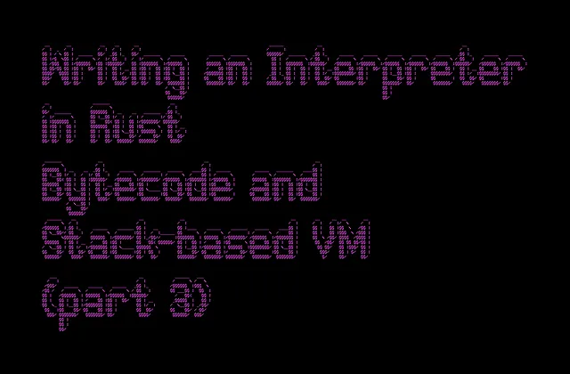

Get unlimited access to the best of Medium for less than $1/week.[Become a member](https://medium.com/plans?source=upgrade_membership---post_top_nav_upsell-----------------------------------------)

[

Become a member

](https://medium.com/plans?source=upgrade_membership---post_top_nav_upsell-----------------------------------------)## [Better Programming](https://medium.com/better-programming?source=post_page---publication_nav-d0b105d10f0a-943af4acf9e0---------------------------------------)

[/0dd5361a9bad802a6f8904316176a15a_MD5.png)](https://medium.com/better-programming?source=post_page---post_publication_sidebar-d0b105d10f0a-943af4acf9e0---------------------------------------)

Advice for programmers.



Image by author

## Abstract

We’re continuing our journey of implementing an interpreter called Coconut in Rust!

In this article, we will explore Bytecode’s advantages and its implementation within the Coconut interpreter.

We will also discuss bytecode evaluation in stack-based virtual machines and compare them to other alternatives.

If you haven’t already, I recommend checking out my previous article: [Writing an Interpreter in Rust: AST (part 2)](https://betterprogramming.pub/writing-an-interpreter-in-rust-ast-part-2-59fd20dbc60f#ea91-3dd23bb8da31)

## What’s Bytecode?

Bytecode is crucial in many interpreters and VMs (Virtual Machines). In our context, VM is a software-based environment simulating program execution. Our Coconut language is not running directly on the hardware, it is simulated by our interpreter.

We’re going to use the terms VM and Interpreter interchangeably.

Bytecode is a low-level representation of a program’s source code designed to be executed by the VM. It acts as an intermediary step between the high-level human-readable source code and the machine code intended to be executed by the VM.

## Bytecode vs AST

It might not be very clear, but Bytecide is totally different from AST.  
AST is a structural representation of the program, while Bytecode is just a set of instructions executed by the VM.

It will make more sense once we see an actual practical example.

## Bytecode advantages

You might wonder why our interpreter needs so many components: Lexer, Parser, AST, and Bytecode. What’s next?

And I admit, it’s hard to justify when we’re facing our toy Coconut interpreter that all it does is add to numbers.

But I will try. Here are a few advantages of Bytecode:

## Portability

Bytecode can be generated once and executed on multiple platforms. Think about it as a compilation of the source code.

## Performance and optimisations

Interpreting and making optimisations on the Bytecode level is often faster than interpreting or compiling from the source code.

Bytecode can serve as an intermediary phase for JIT compilation. Some VMs, like the JVM (Java Virtual Machine), can compile bytecode into native machine code at runtime. JIT can lead to significant performance gains. But it’s *definitely* out of this article’s scope.

## Separation of Concerns

When we implemented AST, we separated the parsing and evaluation phases.

Bytecode separates the code structural model (how the program is organized) from the execution model (how the program is run).

It makes our code more modular and easier to maintain.

## Stack-Based VM

Why are we talking about stacks suddenly?

There are different types of VMs. The two most common are:

## Stack-based VM

Stack-based machines use an operand stack to push and pop results.

## Stack-based VM

Register-based machines use several registers to store values or pass arguments.

I chose to implement Coconut with a stack-based VM because I think it’s simpler. With stack-based machines, there’s no need to keep track of multiple register usage compared to Register-based VMs.

Our stack will be very simple: just a vector and an array with two functions, `pop` and `push`.

## Defining Bytecode

Bytecode instructions encapsulate the operations and actions that the VM can perform.

Let’s define it based on the interpreter functionality we have so far:

```rb
#[derive(Debug, PartialEq, Clone)]
pub enum Op {
    Add, 
    Mull,
    Push { value: u64 }, 
}
```

> Op is short for operation.

Here’s a breakdown:

`Add ` — This instruction represents the addition operation. It will pop the top two values from the `stack`, perform addition, and push the result back onto the `stack`.

`Mull ` — This instruction represents the multiplication operation. Like the `Add` instruction, it will pop the top two values from the `stack`, perform multiplication, and push the result back onto the `stack`.

`Push ` — This instruction loads a numeric value onto the `stack` via the `push ` operation.

## Implementing Stack-Based VM

To implement a stack-based VM, we will need to have a `stack ` (surprisingly enough). But we will also convert our AST to Bytecode since we want to move away from AST-time evaluation.

And that’s what we’re going to do next.

```rb
pub fn ast_to_bytecode(node: Node, ops: &mut Vec<Op>) {
    match node {
        Node::Add { lhs, rhs } => {
            ast_to_bytecode(*lhs, ops);
            ast_to_bytecode(*rhs, ops);
            ops.push(Op::Add {})
        }
        Node::Mul { lhs, rhs } => {
            ast_to_bytecode(*lhs, ops);
            ast_to_bytecode(*rhs, ops);
            ops.push(Op::Mull {})
        }
        Node::Number { value } => ops.push(Op::Push { value }),
    }
}
```

Note that `ast_to_bytecode` is recursive since we’re dealing with a tree here.

An expression such as 3+2\*(2+1) would be parsed as AST:

```rb
Add { 
        lhs: Number { value: 3 }, 
        rhs: Mul { 
            lhs: Number { value: 2 }, 
            rhs: Add { 
                lhs: Number { value: 2 }, 
                rhs: Number { value: 1 } 
        } 
    } 
}
```

And the Bytcode would look like this:

```rb
Push { value: 3 }, 
Push { value: 2 }, 
Push { value: 2 }, 
Push { value: 1 }, 
Add, 
Mull, 
Add
```

Let’s break down the actual evaluation of these Bytcode items: `Add`, `Mul`, and `Stack` operations with the following code:

```rb
# stack = []
Push 3                                  # stack = [3]
Push 2                                  # stack = [3,2]
Push 2                                  # stack = [3,2,2]
Push 1                                  # stack = [3,2,2,1]
Push (Add(pop(), pop()) = 1 + 2 = 3)    # stack = [3,2,3]
Push (Mul(pop(), pop()) = 2 * 3 = 6)    # stack = [3,6]
Push (Add(pop(), pop()) = 6 + 3 = 9)    # stack = [9]
```

The result is 9. As expected!

Next, we’re going to evaluate these operations one by one:

```rb
pub fn eval(ast: Vec<Node>) -> Option<u64> {
    let ops = &mut vec![];
    for a in ast {
        ast_to_bytecode(a, ops);
    }
    
    let mut stack: Vec<u64> = vec![]; // Our stack
    
    for instruction in ops {
        match instruction {
            Op::Push { value } => stack.push(*value),
            Op::Add => {
                let rhs = stack.pop().unwrap();
                let lhs = stack.pop().unwrap();
                stack.push(lhs + rhs);
            }
            Op::Mull {} => {
                let rhs = stack.pop().unwrap();
                let lhs = stack.pop().unwrap();
                stack.push(lhs * rhs);
            }
        }
    }
    return stack.pop();
}
```

That’s it. We have an interpreter that parses our syntax into AST and then generates Bytecode, which is evaluated as a Stack-based VM.

Now, we have basic components that will allow us to extend our interpreter functionality more easily in the future.

## Tests

We did change our interpreter internals, but nothing really changed from the end user’s perspective, so the tests we’ve implemented before should be still good to go.

Tests are great. Make more tests!

## Source Code

instruction.rs

ast.rs

main.rs

The full source code can be found here:## [blog/src/writing-interpreter-with-rust-part-3-bytecode/coconut at main · Pavel-Durov/blog](https://github.com/Pavel-Durov/blog/tree/main/src/writing-interpreter-with-rust-part-3-bytecode/coconut?source=post_page-----943af4acf9e0---------------------------------------)

Blog articles and posts. Contribute to Pavel-Durov/blog development by creating an account on GitHub.

github.com

[View original](https://github.com/Pavel-Durov/blog/tree/main/src/writing-interpreter-with-rust-part-3-bytecode/coconut?source=post_page-----943af4acf9e0---------------------------------------)

## Summary

We’ve implemented Bytecodes in our Coconut interpreter and moved away from AST-time evaluation.

We discussed briefly different VM implementations and the advantages of Stack-based VMs accompanied by practical Rust examples.

All the changes were interpreter internal only, so no changes in Parsing, Lexing, or Testing were needed.

This change will allow us to extend the Coconut interpreter further.

Next, we will start extending the Coconut interpreter functionality, and hopefully, it will be clearer why we need all these components: Lexer, Parser, AST, and Bytecode in our VM.

This article was written for my own sake of understanding and the organisation of my thoughts as it was about knowledge sharing.

I trust that it proved valuable!

[/e3499289fdc8dd9b866b0ce4be2b5eee_MD5.png)](https://medium.com/better-programming?source=post_page---post_publication_info--943af4acf9e0---------------------------------------)

[/104d6d8950f80707ccec8d3099adffbc_MD5.png)](https://medium.com/better-programming?source=post_page---post_publication_info--943af4acf9e0---------------------------------------)

[Last published Nov 10, 2023](https://medium.com/better-programming/let-a-thousand-programming-publications-bloom-bf37baef8f27?source=post_page---post_publication_info--943af4acf9e0---------------------------------------)

Advice for programmers.

Software Engineer. Human. I write about techy stuff I find interesting. @pav3ldurov

## More from Pavel Durov and Better Programming

## Recommended from Medium

[

See more recommendations

](https://medium.com/?source=post_page---read_next_recirc--943af4acf9e0---------------------------------------)