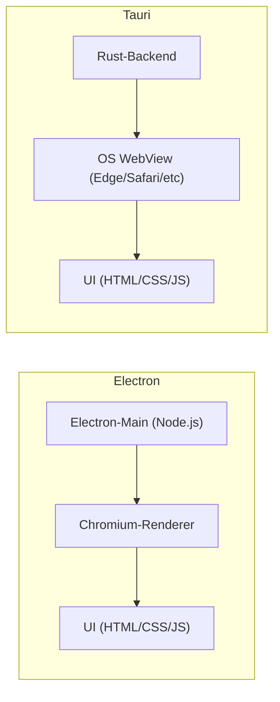

## Zusammenfassung  
- **Electron:** Basiert auf einem gebündelten Chromium-Browser plus Node.js. Führt zu großen Installationsdateien (typ. **80–150 MB**) und hohem Speicherverbrauch (Idle etwa **150–300 MB RAM**), liefert dafür aber auf allen Plattformen dasselbe Rendering【23†L132-L140】【30†L132-L140】. Electron ist sehr ausgereift, stark in JavaScript-Ökosystemen verwurzelt und bietet umfassende Werkzeuge (z.B. electron-builder/updater) für Packaging und Updates【23†L159-L167】【23†L271-L277】. Es eignet sich vor allem für Teams mit reiner JS/TS-Expertise und Projekten, in denen Time-to-Market wichtiger ist als Speicher- und Dateigröße【23†L201-L209】【23†L231-L239】.  
- **Tauri:** Verwendet das native WebView des Betriebssystems (WebKit, Edge WebView2, etc.) und eine Rust-basierte Laufzeit. Dadurch sind die Binärgrößen extrem klein (oft **2–10 MB**【23†L132-L140】【46†L64-L68】) und der Speicherbedarf gering (Idle **30–80 MB**【23†L132-L140】【30†L132-L140】). Der Startvorgang ist blitzschnell (unter **0,2 s**【30†L138-L142】). Tauri bietet ein standardmäßig geschlossenes, fähigkeitsbasiertes Sicherheitsmodell (Capabilities sind per Default deaktiviert)【23†L164-L172】【38†L296-L304】. Es unterstützt neben Desktop (Win/macOS/Linux) auch mobile Plattformen (iOS/Android) aus einer Codebasis【23†L181-L189】【30†L198-L207】. Tauri ist jünger und kleiner im Ökosystem, gewinnt jedoch rasant an Reife. Beide Frameworks sind produktionsreif, die Wahl hängt von Teamfähigkeiten und Projektanforderungen ab【23†L231-L239】【30†L141-L145】.  

## Architektur und Laufzeitmodell  
Electron integriert Chromium und Node.js in jede App: Der **Main-Prozess** läuft als Node.js-Server, der über **Renderer-Prozesse** Chromium-Fenster für die UI startet【2†L63-L68】【23†L132-L140】. Jede Anwendung enthält damit den kompletten Browser-Stack. Tauri dagegen trennt das Frontend und Backend strikt: Das Frontend rendert in **nativem WebView** (Edge WebView2 auf Windows, WebKitGTK auf Linux, WebView unter macOS), der **Backend-Prozess** läuft als Rust-Executable【27†L71-L79】【23†L132-L140】. Damit enthält eine Tauri-Anwendung keinen eigenen Chromium, sondern nutzt die auf dem System bereits vorhandene Browser-Engine【27†L81-L83】【30†L198-L207】. 

Dieses Modell führt zu merklichen Unterschieden. Electron liefert **identisches Rendering** auf allen Plattformen (da stets Chromium verwendet wird), während Tauri auf den verschiedenen OS-WebView-Engines basiert. Letzteres kann zu leichten Abweichungen in CSS oder Font-Rendering führen【23†L279-L284】. Electron erlaubt zudem grundsätzlich komplette Node.js-Zugriffe in allen Fenstern; bei Tauri findet die Kommunikation zwischen WebView und System über **Nachrichten/Commands** statt. Entwickler definieren Rust-Funktionen mit `#[tauri::command]`, die über eine typisierte JS-API (`invoke()`) aufrufbar sind【23†L164-L172】. Dieser Aufbau vermeidet eine separate Laufzeitumgebung: Tauri-Apps sind reine Native-Binaries, was Reverse-Engineering erschwert【27†L81-L83】【46†L64-L72】.

## Sicherheitsmodell und Angriffsfläche  
Electron bietet durch Node.js vollständigen Zugriff auf das System (Dateisystem, Prozesse, Netzwerke). Das ist sehr mächtig, erhöht aber die Angriffsfläche: Man muss im Renderer **NodeIntegration deaktivieren**, **Context-Isolation** aktivieren, Preload-Skripte und strenge **Content-Security-Policies (CSP)** verwenden, um sicher zu bleiben【23†L159-L167】. Bei unsachgemäßer Konfiguration können XSS u. a. zu vollständiger Kompromittierung führen. 

Tauri kehrt das Modell um: **Initial sind alle System-Fähigkeiten gesperrt**. Nur explizit freigegebene Rust-Befehle dürfen ausgeführt werden【23†L164-L172】【38†L296-L304】. Jede native Funktion (Dateisystem, API, etc.) muss in der `tauri.conf.json` oder per Annotation deklariert werden【38†L296-L304】. Dieses **Capability-System** minimiert die Angriffsfläche. So schreibt Tauri: „Das Prinzip der expliziten Berechtigungen zwingt dazu, jeden Dateisystemzugriff oder jede native Funktion zu deklarieren, wodurch die Angriffsfläche minimiert wird【38†L296-L304】.“ Entwickler definieren eine Whitelist an APIs, die über das Frontend erreichbar sind. In der Praxis bedeutet das: Sicherheitskritische Apps profitieren von dieser Strenge, Audits werden erleichtert. Beide Frameworks unterstützen zusätzlich Web-Sicherheitsmechanismen wie CSP und HTTPS, doch Tauri ist von Haus aus restriktiver konfiguriert.

## Ressourcenverbrauch und App-Größen (Benchmarks)  
Tauri-Apps sind in der Regel **deutlich schlanker** als Electron-Apps. Offizielle Vergleiche und Tests zeigen typische Zahlen: Electron-Anwendungen starten mit etwa **80–150 MB** Installationsgröße und belegen im Leerlauf **150–300 MB RAM**【23†L132-L140】【30†L138-L142】. Demgegenüber sind Tauri-Apps oft im einstelligen MB-Bereich (z.B. 3–10 MB Bundle【30†L138-L142】) mit Idle-RAM unter **50–80 MB**【23†L132-L140】【46†L64-L72】. Die Kaltstart-Zeit fällt ebenfalls geringer aus (Tauri meist < 1 s, Electron typ. 1–5 s【23†L147-L150】【30†L138-L142】). In einem praktischen Vergleich (Tauri- vs. Electron-Desktop-App "Authme") lag der Tauri-Installer bei **~2,5 MB** versus **~85 MB** für Electron【46†L64-L72】, der Start dauerte ~2 s statt 4 s【46†L84-L87】, und der Idle-Speicherbedarf betrug ca. 80 MB vs. 120 MB【46†L93-L100】. 

Diese Unterschiede entstehen hauptsächlich dadurch, dass Electron pro App die gesamte Chromium- und Node-Runtime mitschleppt, während Tauri nur die Komponenten kompiliert, die tatsächlich benötigt werden【30†L132-L140】【30†L198-L207】. Tauri profitiert vom Rust-Binärcode (effizienter als Node.js) und von der Nutzung eingebauter WebViews. Allerdings können Messmethoden variieren: In manchen Tests, insbesondere auf Linux (WebKitGTK), zeigte sich, dass Tauri in Extremszenarien etwas mehr RAM verbrauchte als Electron【31†L227-L235】. In der Praxis sind aber die meisten Vergleiche zugunsten von Tauri ausgefallen【23†L132-L140】【30†L138-L142】. 

## Build Output und Packaging  
Electron-Apps werden typischerweise mit Tools wie **electron-builder** oder **electron-forge** zu Installern gebündelt. Für Windows entstehen z.B. **.exe/.msi** (oft mittels NSIS/WinInstaller), für macOS **.app/.dmg**, für Linux **.deb/.rpm/.AppImage**. Diese Tools integrieren Code-Signing (Authenticode, Apple Notarization) und das Aufsetzen automatischer Update-Server. 

Tauri liefert mit **tauri-cli** und dem eingebauten **Bundler** eine eigene Packaging-Pipeline【36†L253-L261】. Mit wenigen Befehlen kann man native Installer für Win/Mac/Linux erstellen. Tauri-CLI unterstützt cross-compiling und signiert auf Wunsch die Binaries (z.B. via Azure Key Vault oder benutzerdefinierter Signierbefehle)【41†L1-L4】. Besonders hervorgehoben wird, dass Tauri „nativ Befehle für Build, Packaging und die Erstellung plattformübergreifender Installer“ bereitstellt【36†L253-L261】. Da Tauri-Apps nur kleinste Laufzeitanteile mitliefern, sind auch die erzeugten Installationspakete sehr kompakt (häufig nur ein paar MB für die App selbst). 

Beide Frameworks unterstützen gängige Distributionsmethoden (App-Stores, eigene Updater). Im Enterprise-Bereich kann Tauri über eine einheitliche CI/CD-Pipeline beliebig signierte Pakete erzeugen【38†L311-L319】. Ein Praxisbericht beschreibt beispielsweise, wie eine Umstellung auf Tauri die Installergröße um 50 % reduzierte, bei gleicher oder besserer Performance【38†L319-L322】.  

## Startzeit und Laufzeit-Performance  
Tauri-Apps starten meist spürbar schneller als Electron-Apps. Messungen zeigen, dass ein Kaltstart bei Electron oft mehrere Sekunden dauert, während Tauri innerhalb weniger hundert Millisekunden betriebsbereit ist【23†L147-L150】【30†L138-L142】. Im Beispiel mit der Authentifizierungs-App lag der Tauri-Start bei ~2 s, der Electron-Start bei ~4 s【46†L84-L87】. Diese Beschleunigung kommt durch die schlankere Architektur und Rust-Optimierungen. Im laufenden Betrieb kann Rust-Code CPU-intensiveres Processing effizienter handhaben als die Node-Umgebung; zudem bietet Rust Speicher- und Speichersicherheitsmechanismen (Borrow-Checker), während Electron auf Garbage Collection setzt【30†L158-L164】【38†L311-L319】. 

Für graphisch komplexe UIs oder Hardwarebeschleunigung nutzen beide Engines GPU-Features. Electron verwendet in jedem Fenster die Chromium-GPU (vereinheitlicht), Tauri die GPU-Unterstützung des nativen WebViews (z.B. Safari-WebGL unter macOS). In der Praxis liefern beide ähnlich flüssiges UI-Rendering, abgesehen von leichten Rendering-Unterschieden auf verschiedenen WebView-Engines【23†L279-L284】. Ein wesentlicher Laufzeitunterschied ist aber der Umgang mit Ressourcen: Tauri-Prozesse sind normalerweise sparsamer beim RAM und CPU als die dicken Electron-Prozesse.

## Entwicklererfahrung, Tooling und Sprachenunterstützung  
Electron ist seit vielen Jahren etabliert. Entwickler *programmieren primär in JavaScript/TypeScript*, nutzen gewohnte Tools (npm, webpack, Electron Forge/Builder) und können aus einem riesigen Pool von Node-Modulen schöpfen. React, Vue, Angular oder andere Web-Frameworks lassen sich direkt verwenden – das Frontend bleibt zwischen Electron und Tauri identisch【23†L255-L261】. Für Debugging stehen Chrome DevTools (F12, Rechtsklick → „Untersuchen“) und Node-Inspektoren zur Verfügung. Hot-Reload-Lösungen (z.B. [electron-reload]) ermöglichen schnelles Feedback bei UI-Änderungen. 

Tauri-Entwicklung kombiniert Web-Frontend (HTML/CSS/JS mit Vite, Parcel etc.) mit einem Rust-Backend. Die CLI `create-tauri-app` und `tauri dev` erzeugt zügig Grundgerüste und startet einen Dev-Server. Tauri unterstützt die gleichen Frontend-Frameworks wie Electron. Für die Kommunikation mit dem Betriebssystem werden Rust-Funktionen geschrieben und über `invoke()` aus JS aufgerufen【23†L164-L172】【46†L112-L120】. Grundlegende Rust-Kenntnisse sind nötig, vor allem wenn man eigene Funktionen oder Plugins implementiert【46†L112-L120】【23†L255-L261】. Viele Teams beginnen aber mit den fertig vorhandenen Tauris-APIs (Dateizugriff, Notifikationen, Dialoge etc.) und lernen Rust schrittweise.

Tauri hat **integriertes Hot Reload**: Änderungen am Frontend (HTML/CSS/JS) werden sofort in der WebView angewendet【36†L237-L242】. Änderungen am Rust-Backend erkennen CLI und Cargo automatisch: Nach Neuskompilierung startet die App neu, wodurch Full-Stack-Entwickler *nahtlos* arbeiten können【36†L237-L245】. Die Feedback-Schleife ist sehr kurz, was Prototyping beschleunigt. Auch Debugging-Tools sind vorhanden: Entwickler können in der Rust-Konsole (`tauri dev`) Logs ausgeben und einen Stacktrace sehen. Die WebView kann wie üblich per Rechtsklick inspiziert werden (unter Linux öffnet sich WebKitGTK-Inspector, unter Windows die Edge-DevTools, unter macOS Safari-Inspector)【33†L124-L132】. 

Zusammenfassend gilt: **Teamfähigkeiten entscheiden**. Ein reines JS/TS-Team ohne Rust-Erfahrung wird mit Electron schneller starten【23†L201-L209】. Ist aber Performance, Datensicherheit oder geringe Größe essenziell und man ist bereit, Rust kennenzulernen, bietet Tauri Vorteile【23†L201-L209】【36†L237-L245】.

## Native APIs und Plugin-Ökosystem  
Electron gewährt vollumfänglichen Zugriff auf das Betriebssystem via Node.js: Datei-, Netzwerk- oder Prozesszugriffe erfolgen direkt über Node-Module. Das Ökosystem ist riesig (tausende npm-Pakete, spezialisierte Electron-Libs). Windows-Tray, native Menüs, Notifikationen und viele andere Funktionen sind bereits durch Node/Chromium-Bordmittel abgedeckt. 

Tauri setzt dagegen auf ein modulareres Modell. Es stellt core-APIs (z.B. Dateisystem, Dialog, Notifikation, lokale Speicherung) über ein Typsystem bereit, das intern auf Rust zurückfällt. Entwickler aktivieren oder schreiben Rust-Befehle für jede benötigte Funktion. Das erleichtert Sicherheit, limitiert aber die Vielfalt: Im Standard bietet Tauri nur ausgewählte Systemfunktionen an. Das Plugin-Ökosystem von Tauri wächst jedoch: Es gibt bereits zahlreiche **Tauri-Plugins** (z.B. für automatische Updates, SQLite, OAuth, Bluetooth, etc.), die über Crates.io oder GitHub verfügbar sind. Dennoch ist das Ökosystem insgesamt kleiner als das von Electron【23†L221-L229】. 

Kurz: Electron hat tausende vorgefertigte Module und Beispiele (z.B. großen Apps wie VS Code, Slack, Discord, Figma【23†L219-L224】) und ist universell einsetzbar. Tauri hingegen setzt darauf, die meisten Features selbst bereitzustellen oder via Rust-Plugins zu ergänzen【23†L225-L229】【38†L318-L322】. In kritischen Bereichen – etwa Sicherheit oder hochperformante Workloads – ist Tauri oft schneller mit gut getesteten Kernfunktionen, während Electron auf schiere Quantität in npm vertraut.

## Plattformunterstützung und -einschränkungen  
Beide Frameworks decken klassische Desktopplattformen ab: **Windows, macOS und Linux** werden voll unterstützt. Electron war von Anfang an cross-platform konzipiert und bietet fertige Integration für alle gängigen Desktop-Distributionen. Tauri unterstützt Desktop ebenfalls plattformübergreifend. Zudem erweitert Tauri mit Version 2 seine Unterstützung auf **iOS und Android** aus derselben Codebasis【23†L181-L189】【30†L198-L207】. (Electron kann ohne externe Frameworks kein Mobile-Target.) 

Einige plattformspezifische Unterschiede: Tauri nutzt standardmäßig die bereits vorhandenen Browser-Engines der Plattform (Windows 10+ bringt WebView2/Chromium mit, macOS hat WKWebView, viele Linux-Distributionen liefern WebKitGTK mit【30†L198-L207】). Das reduziert Abhängigkeiten, kann aber zu unterschiedlichen Feature-Sets führen (z.B. fehlende CSS-Effekte in bestimmten Safari-Versionen【46†L125-L134】). Electron shippt selbst Chromium, sodass z.B. neueste Web-Features sofort verfügbar sind. 

Auf Linux sollte man sicherstellen, dass eine WebKitGTK-Laufzeit installiert ist. Auf Windows ist in der Regel keine zusätzliche Installation nötig (WebView2 ist Standard). Mobile-Unterstützung in Tauri erfordert native Toolchains (Xcode für iOS, Android SDK/NDK). Bei Electron gibt es keine offizielle Mobile-Option. Zusammengefasst: **Electron = Desktop überall gleich**, **Tauri = Desktop plus optional Mobile (momentan noch in Aufbau), jedoch leichte Unterschiede im UI-Rendering je Plattform**.

## Distribution, Auto-Update, Code Signing und Installer  
Beide Frameworks bieten ausgereifte Lösungen zum Verteilen und Aktualisieren von Anwendungen. 

- **Packaging:** Electron-Apps werden typischerweise mit `electron-builder` gepackt. Dies erlaubt die Erstellung von plattformspezifischen Installern (Windows-Installer, macOS-App/DMG, Linux-Pakete) und integriert Code-Signing für Windows (Authenticode) und macOS (Notarisierung). Tauri nutzt seinen eingebauten Bundler. Die CLI unterstützt die Erstellung von nativen Installern (z.B. MSI/EXE, PKG/APP/DMG, Deb/RPM). Edana hebt hervor, dass Tauri „nativ Befehle für Build, Packaging und die Erstellung plattformübergreifender Installer“ liefert【36†L253-L261】. Beide bieten Optionen für individuelle Signatur-Tools: Electron etwa über SignTool oder Apple-Zertifikate; Tauri kann über Konfigurationsoptionen z.B. ein Azure Key Vault-Zertifikat oder benutzerdefinierte Signaturbefehle einbinden【40†L446-L455】【41†L1-L4】. 

- **Auto-Update:** Beide haben eingebaute Update-Systeme. Electron-Apps nutzen häufig [electron-updater](https://www.npmjs.com/package/electron-updater) oder eigene Lösungen für differenzielle Updates. Tauri bietet ein **Updater-Plugin**, das GitHub Releases, S3 oder kundenspezifische Update-Server unterstützt. OpenReplay fasst zusammen: „Beide Frameworks bieten ausgereifte Auto-Update-Lösungen. Electron verwendet electron-updater (unterschiedliche Updatetypen, verschiedene Server), Tauri bietet ein integriertes Updater-Plugin mit ähnlichen Funktionen. Beide unterstützen Code-Signing und funktionieren mit GitHub Releases, S3 oder eigenen Servern“【23†L271-L277】. Praktisch bedeutet das: In beiden Fällen kann man das App-Update nahtlos gestalten; Electron profitiert von der großen Community (viele Beispiele), Tauri punktet mit Einfachheit und enger Integration in die Rust-Toolchain【46†L153-L160】【23†L271-L277】.

- **Code Signing:** Für offizielle Distribution ist Signierung oft Pflicht. Electron integrierte Prozesse nutzen z.B. Apple Developer ID, Windows-Certificates. Tauri unterstützt dies ebenfalls: In der Windows-Dokumentation beschreibt Tauri, wie man Zertifikate (z.B. per Azure Key Vault) einbindet【41†L1-L4】, und für macOS gelten die gleichen Prozesse (Xcode-Notarisierung). Fazit: Beide Plattformen erwarten signierte Binaries, was durch die jeweiligen Build-Tools abgedeckt ist.

## Community, Reife und Ökosystem  
Electron (erstmals 2013 von GitHub vorgestellt) ist ein etabliertes Projekt unter der [OpenJS Foundation](https://openjsf.org/). Es hat Jahrzehnte Produktionsreife, großen Einsatz bei Firmen (GitHub, Microsoft, Slack u.v.m.) und eine riesige Entwickler-Community. OpenReplay betont: „Electrons jahrzehntelanger Produktionseinsatz bedeutet Tausende von Paketen, umfangreiche Dokumentation und bewährte Lösungen. VS Code, Slack, Discord und Figma beweisen, dass es skaliert“【23†L219-L224】. Electron ist extrem „battle-tested“, Updates und Workarounds für Plattformprobleme sind reichlich vorhanden.

Tauri ist jünger (Gründung um 2019) und hat Version 1.x seit 2022 im Produktiveinsatz. Seit 2024 ist Tauri 2.x stabil mit offiziell angekündigter 1.0-Version【15†L49-L57】【30†L141-L145】. Das Ökosystem wächst schnell, insbesondere seit anerkannte Firmen (etwa 1Password, Sentry, Cloudflare) es einsetzen. Laut Rustify ist Tauri „in 2026 technisch die bessere Wahl für die meisten neuen Projekte“【30†L132-L140】. Gleichzeitig weist es noch Lücken auf: Die Anzahl der Spezial-Plugins und Bibliotheken ist deutlich kleiner als bei Electron【23†L225-L229】. Die Community organisiert sich über GitHub, Discord, OpenCollective etc., und es gibt Tutorials sowie Konferenzvorträge. Formell ist Tauri ein MIT-lizenziertes Open-Source-Projekt, das von einer gemischten Community (vorwiegend Rust-Entwickler) geführt wird【15†L79-L83】. 

**Zusammengefasst:** Electron hat die Marktreife und breite Adoption auf seiner Seite, Tauri punktet mit moderner Architektur und wachsender Unterstützung, aber kleineren Community-Ressourcen. Beide Projekte werden aktiv weiterentwickelt – für gängige Use-Cases sind beide praxiserprobt, die Entscheidung hängt also weniger von „Reife“ ab als von den Projektprioritäten【30†L141-L145】【23†L231-L239】.

## Entscheidungshilfe: Anwendungsfälle  
Es gibt kein universal überlegenes Framework – die Wahl richtet sich nach Anforderungen und Team:

- **Electron eignet sich besonders**, wenn  
  - das Entwicklerteam ausschließlich in JavaScript/TypeScript zuhause ist【23†L201-L209】,  
  - viele npm-Bibliotheken (z.B. Charting, graphische UI, Machine Learning in JS) benötigt werden,  
  - komplexe Multi-Window- oder in-prozessorielle Workflows gefragt sind,  
  - Entwicklungszeit/Time-to-Market wichtiger sind als Binärgröße【23†L201-L209】.  

- **Tauri ist vorteilhaft**, wenn  
  - extrem kompakte Binaries und geringer Ressourcenverbrauch gefragt sind (z.B. portable Tools)【23†L231-L239】【36†L253-L261】,  
  - Sicherheit und minimale Angriffsfläche hohe Priorität haben (z.B. bei Business-Apps)【23†L164-L172】【38†L296-L304】,  
  - das Team Rust-Kenntnisse mitbringt (oder bereit ist, sie zu erwerben)【23†L209-L213】【46†L114-L122】,  
  - neben Desktop auch Mobile aus einem Codebasis unterstützt werden soll【23†L181-L189】.  

OpenReplay fasst es schön zusammen: **Tabelle: Anforderung – bessere Wahl:** Kleinstmögliche Binärdatei → *Tauri*; Starke npm-Abhängigkeit → *Electron*; Sicherheitskritische Anwendung → *Tauri*; Schnelles Prototyping (JS-Team) → *Electron*; Desktop+Mobile → *Tauri*; komplexe Multi-Window-Workflows → *Electron*【23†L231-L239】. 

Oberstes Kriterium sind Team-Fähigkeiten und Produktziele: Keine der beiden Technologien erfordert unüberwindbare Expertise, aber Rust- und Web-Stack unterscheiden sich genug, dass man den größeren Entwicklungsaufwand gegen die Laufzeitvorteile abwägen sollte【23†L201-L209】【30†L141-L145】. Beide Frameworks sind reif genug für Produktion – etwa Nextcloud, WordPress-Client oder Open-Source-Editoren existieren in beiden Varianten. Ein sorgfältiger Vergleich anhand der oben genannten Kennzahlen (Größe, Performance, Sicherheit, Plattform-Support) führt zur besten Entscheidung für das jeweilige Projekt.

## Vergleichstabelle

| Aspekt                   | Electron                                  | Tauri                                       |
|--------------------------|-------------------------------------------|---------------------------------------------|
| **Architektur**          | Chromium + Node.js (Main-/Renderer-Prozesse)【2†L63-L68】【23†L132-L140】 | Rust-Backend + nativer OS-WebView (keine eigene Chromium-Laufzeit)【27†L71-L79】【23†L132-L140】 |
| **Binärgröße (Installer)** | Sehr groß (typ. *80–150 MB*)【23†L132-L140】【30†L138-L142】 | Sehr klein (oft *2–10 MB*)【30†L138-L142】【46†L64-L72】 |
| **Speicher (Idle)**      | Hoch (ca. *150–300 MB RAM*)【23†L132-L140】【30†L138-L142】  | Gering (ca. *30–80 MB RAM*)【23†L132-L140】【30†L138-L142】 |
| **Startzeit**            | Mehrere Sekunden (ca. *1–5 s*)【23†L147-L150】【30†L138-L142】 | Sehr kurz (< *0,2–1 s*)【23†L147-L150】【30†L138-L142】 |
| **Frontend**             | HTML/CSS/JS in Chromium (identisch über OS) | HTML/CSS/JS in native WebView (variierende Engine)【23†L279-L284】 |
| **Backend/Sprachen**     | Node.js (JavaScript/TS)                    | Rust (optionale Plugins; Web-UI bleibt JS)【23†L164-L172】【46†L112-L120】 |
| **Ökosystem**            | Riesig (npm, Tausende Electron-spezifische Module)【23†L219-L224】 | Kleiner, aber wachsend (Crates und Tauri-Plugins)【23†L225-L229】 |
| **Sicherheitsmodell**    | Offen (Node im Renderer; Developer müssen absichern)【23†L159-L167】 | Geschlossen (Capability-Whitelisting, Features disabled-by-default)【23†L164-L172】【38†L296-L304】 |
| **Plattformen**          | Windows, macOS, Linux                     | Windows, macOS, Linux **+ Mobile (iOS/Android)**【23†L181-L189】 |
| **Packaging & Signierung** | Umfangreiche Tools (electron-builder, CI-Skripts) | Integrierter Bundler (tauri-cli), Code-Signing via Konfiguration【36†L253-L261】【41†L1-L4】 |
| **Auto-Update**          | Ja (z.B. electron-updater, differenzielle Updates) | Ja (integrierter Updater-Plugin, unterstützt Server/JSON)【23†L271-L277】 |
| **Debugging**            | Chrome DevTools + Node-Debugger         | Rust-Konsolenausgaben + OS-WebView-Devtools【33†L124-L132】 |
| **Reife & Support**      | Sehr hoch (OpenJS Foundation, große Community)【23†L219-L224】【30†L141-L145】 | Reif (Stabiles V2 seit 2024, aktive Community)【30†L141-L145】【23†L225-L229】 |
| **Anwendungsfälle**      | JS-lastige Apps, Prototypen, mächtige Desktop-Tools | Performance-/Größen-kritische Apps, security-sensitive, Desktop+Mobile【23†L231-L239】 |

**Quellen:** Offizielle Dokumentation (Electron, Tauri) und aktuelle Analysen wurden für diese Gegenüberstellung herangezogen【2†L63-L68】【27†L71-L79】【23†L132-L140】【30†L132-L140】【36†L237-L245】【38†L296-L304】. Die Tabelle fasst typische Werte zusammen; Abweichungen je nach App-Komplexität und Plattform sind möglich. Alle genannten Frameworks sind produktionsreif, weitere Details siehe verlinkte Quellen.