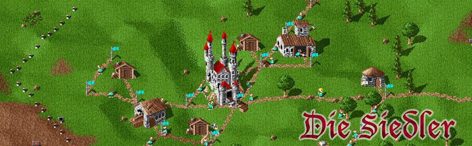
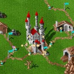
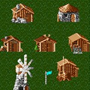
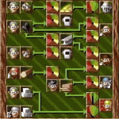
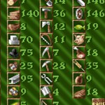
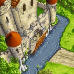
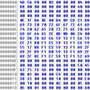

# Die Siedler

1993 veröffentlichte BlueByte Die  [Siedler](https://www.siedlercommunity.de/die-siedler/#) – eine Wirtschaftssimulation für den Amiga 500 die der Welt der Computerspiele ein ganz neues Genre schenkte. 1994 folgte Die Siedler für den PC. Hier findest Du viele Informationen um das Original Siedler, welches sich noch heute einer großen Beliebtheit erfreut.

- 
    
    ### [Die Siedler Spielbeschreibung](https://www.siedlercommunity.de/die-siedler/spielbeschreibung/ "Die Siedler Spielbeschreibung")
    
    Eine Legende wurde geboren. Mit dieser Spielbeschreibung wurde Die Siedler erstmals auf dem Amiga 1993 angekündigt und begründete nicht nur eine lange Serie Die Siedler, sondern schuf direkt ein neues Genre: Die Aufbau-Strategiespiele. Die Siedler ist DAS Original.
    
- 
    
    ### [Die Siedler Gegner / Charaktere](https://www.siedlercommunity.de/die-siedler/charaktere/ "Die Siedler Gegner / Charaktere")
    
    Glücklicherweise hat uns Bluebyte bei Die Siedler eine ganze Reihe verschiedener Siedler Gegner zur Verfügung gestellt an denen wir uns messen können. Durch Ihr unterschiedliches Verhalten ist man bei jedem Siedler Spiel durch geschickte Auswahl der Gegner aufs Neue gefordert. Hier werden die einzelnen gegnerischen Siedler Charaktere vorgestellt; mit Ihren unterschiedlichen Eigenschaften – soweit dies rekonstruierbar ist.
    
- 
    
    ### [Die Siedler Gebäude, Aufgaben & Baukosten](https://www.siedlercommunity.de/die-siedler/gebaeude/ "Die Siedler Gebäude, Aufgaben & Baukosten")
    
    Schon im ersten Siedler Teil wurde klar, dass hier etwas Neues erschaffen wurde: Die Liste der Gebäude sowie die Abhängigkeiten untereinander schufen einen neuen Mikrokosmos, der in der traditionellen Serie das Spiel so beliebt machte. Wir stellen alle Gebäude aus Die Siedler vor; mit ihren Bewohnern, benötigten Werkzeugen, benötigten Waren und der Ware, die der Bewohner des Gebäudes produziert.
    
- 
    
    ### [Die Siedler Berufe und Abhängigkeiten](https://www.siedlercommunity.de/die-siedler/berufe/ "Die Siedler Berufe und Abhängigkeiten")
    
    Die Siedler: Hier findet Ihr die verschiedenen Siedler Gruppen / Siedler Typen, deren Berufe und Aufgaben, sowie deren benötigtes Werkzeug und die Abhängigkeiten untereinander.
    
- 
    
    ### [Die Siedler Waren und Werkzeuge](https://www.siedlercommunity.de/die-siedler/waren-werkzeuge/ "Die Siedler Waren und Werkzeuge")
    
    Die Siedler ist komplex! Schon der erste Teil wartete mit einer Vielzahl unterschiedlicher Waren, Waffen und Werkzeugen auf und machte Komplexität zum Spielprinzip. Die Siedlung am Laufen halten und den Überblick behalten, das ist der Spielspaß bei Die Siedler 1, wo alles noch ein wenig gemächlicher zugeht als in den späteren Teilen der Siedler Serie.
    
- 
    
    ### [Die Siedler Einsteigertipps für Anfänger](https://www.siedlercommunity.de/die-siedler/einsteigertipps/ "Die Siedler Einsteigertipps für Anfänger")
    
    Auf dieser Seite wollen wir versuchen, alle grundsätzlichen Taktiken zu Siedler I näher zu bringen. Wir gehen ausführlich auf die Wahl des Geländes, Warenkreisläufe, Prioritäte etc. ein. Ob das letztendlich gelungen ist und hilfreich ist, muss jeder selbst entscheiden, aber einen Versuch sollte es schon wert sein mal auf die Worte derer zu hören, die über Jahre nichts anderes gemacht haben. 
    

- 
    
    ### [Die Siedler Tipps für das Militär](https://www.siedlercommunity.de/die-siedler/militaer/ "Die Siedler Tipps für das Militär")
    
    Das Militär sichert Euren Siedlern ein langes Leben, sorgt für Expansion und Sicherheit. Doch wie arbeitet das Siedler Militär, was ist zu tun wenn es ernst wird, und wie funktioniert das mit der Rekrutierung von Soldaten, und was ist mit der Aufwertung?
    
- 
    
    ### [Die Siedler Cheats](https://www.siedlercommunity.de/die-siedler/cheats/ "Die Siedler Cheats")
    
    Die Siedler bietet nicht viele Möglichkeiten für Cheats. Da steht auch schon das erste Spiel in bester Tradition zur gesamten Serie. Cheats sind im ersten Siedler Teil so gut wie nicht vorhanden. Viel mehr durch Nachlässigkeiten in der Programmierung von Die Siedler und direkte Änderungen von Dateien ermöglichen es, hier und da Die Siedler zu beeinflussen.