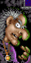
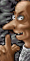
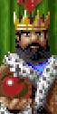
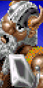

Glücklicherweise hat uns Bluebyte bei  [Die Siedler](https://www.siedlercommunity.de/die-siedler/charaktere/#) eine ganze Reihe verschiedener  [Siedler](https://www.siedlercommunity.de/die-siedler/charaktere/#) Gegner zur Verfügung gestellt an denen wir uns messen können. Durch Ihr unterschiedliches Verhalten ist man bei jedem Siedler Spiel durch geschickte Auswahl der Gegner aufs Neue gefordert. Hier werden die einzelnen gegnerischen Siedler Charaktere vorgestellt; mit Ihren unterschiedlichen Eigenschaften – soweit dies rekonstruierbar ist.

- **Lady Amalie** Lady Amalie ist bei Siedler 1 Spielern vor allem deshalb eine beliebte Gegnerin, weil sie selbst nicht den Angriff sucht. Man kann also in Ruhe vor sich hin siedeln und dann angreifen, wenn man soweit ist.
- **Kumpy Einfinger** Kumpy wird als feindseliger Gegner beschrieben. Das merkt man auch spätestens dann, wenn er in die Nähe von Gold kommt, oder die Goldproduktion des Gegners entdeckt. Dieser versucht er unter allen Umständen einzunehmen.
- **Balduin der ehemalige Mönch** Balduin ist wie Amalie friedlich lebend und eher zurückhaltend. Im Unterschied achtet er aber mehr auf den Schutz seiner eigenen Ländereien und baut dementsprechend die Verteidigung deutlich besser aus, vor allem an neuralgischen Punkten.
- **Frollin**Frollin ist von allen Charakteren in Siedler 1 im Allgemeinen sehr schwer auszurechnen – man weiß nie, was er als nächstes vorhat. Allerdings sollte man sich schnell ausbreiten, denn genau das versucht er auch!
- **Kallina**Sie zieht mal gerne in die Schlacht. Vor allem hat sie es auf die Nahrungsproduktion des Gegners abgesehen, die sie lahmzulegen versucht, um den Gegner zu schwächen.
- **Rasparuk der Druide** Wo immer es Rohstoffe zu ergattern gibt, ist Rasparuk der Druide nicht weit. Dabei macht er auch nicht halt vor den Bergen des Gegners und wird angreifen, wenn er eine Chance sieht.
- **Graf Aldaba**Der Graf weiß genau dass es die Lager sind, welche man am schmerzlichsten vermissen würde, wären sie nicht mehr da. Und hierauf fokussiert er sein militärisches Handeln.
- **Konig Rolph VII**Rolph ist der Römer unter den Siedler 1 Herrschern. Er verhält sich sehr ausgeglichen, und hat es, wenn er angreift, auf die Baumaterialindustrie des Gegners abgesehen.
- **Homen Doppelhorn**Er ist ein sehr aggressiver Gegner, der alles angreifen wird, was ihm sein Sichtfeld behindert. Er schert sich nicht um einzelne Bereiche und sein Vorlieben ist die Zerstörung an sich.
- **Sollok der Joker**Sollok ist im Grunde wie Homen. Allerdings sagt man ihm eine gewisse Hinterlistigkeit voraus. Eine gute Bewachung der Siedlung und Besetzung der Wachgebäude ist Pflicht!
- **Der Dunkle Ritter (The dark Knight)**Wenig bis gar nichts ist bekannt über den Dunklen Ritter, außer, dass man schon einen weiten Weg zurück gelegt haben muss, um auf ihn zu treffen. Aus dramaturgischen Gründen dürfe er nicht zur Kategorie Fallobst gehören.