Die Siedler I History Edition

In diesem speziellen Blog vermitteln wir euch die grundlegenden Mechaniken des Spiels, wie man seine ersten Siedlungen verwaltet und gegen Feinde kämpft.

[Open: Pasted image 20250224190610.png](_resources/1e1d58758f9a46d88c494266b929b74f_MD5.jpeg)
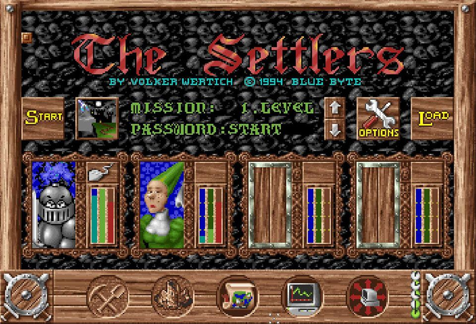

Nachdem ihr das Spiel gestartet habt, seht ihr einen Bildschirm, der diesem sehr ähnelt.

Der Ritter in der glänzenden Rüstung, – ihr kennt ihn vermutlich aus dem Intro – das seid ihr. So stattlich wie eh und je. Neben eurem Profilbild seht ihr ein Maus-Icon. Wenn ihr die Maus anklickt, könnt ihr wählen, ob ihr mit einem Freund auf geteiltem Bildschirm oder lieber alleine spielen wollt. Im Konfigurationsmenü könnt ihr vor Spielbeginn das Eingabegerät für euren Freund auswählen.

Ihr seht außerdem drei Balken in den Farben Blau, Grün und Rot. Diese Anzeigen sind sehr wichtig. Der blaue Balken zeigt die Vorräte einer Siedlung zu Beginn des Spiels. Ein großer Vorrat ermöglicht eine schnelle Ausdehnung und bringt gewisse Vorteile. Eine geringe Menge an Vorräten sorgt schnell für Probleme, wenn die Stadt zu wachsen beginnt.

Der grüne Balken zeigt die Intelligenzstufe der vom Computer gesteuerten Siedlungen an. Sie entscheidet, wie schnell der Computer agiert oder reagiert.

Der rote Balken steht für die Wachstumsrate. Je höher sie ist, desto schneller produziert eure Siedlung und desto schneller könnt ihr expandieren.

Wenn ihr das Spiel zum ersten Mal spielt, empfehlen wir, euren blauen und roten Balken immer über 50 % zu halten.

Jetzt ist es an der Zeit, das Spiel zu starten. Für das erste Spiel empfehlen wir, ohne Gegner zu spielen oder höchstens mit einem ganz schwachen.  
Sobald das Spiel den Ladevorgang abgeschlossen hat, erscheint die Spielwelt und ihr könnt euch mit der rechten Maustaste frei darin bewegen. Im Konfigurationsmenü könnt ihr die Steuerung ändern. Ihr könnt sogar auf die historische Steuerung umschalten, so wie sie 1993 / 1994 war.

[Open: Pasted image 20250224190542.png](_resources/e6789146f765cd0e30847cd4ae1b7f80_MD5.jpeg)
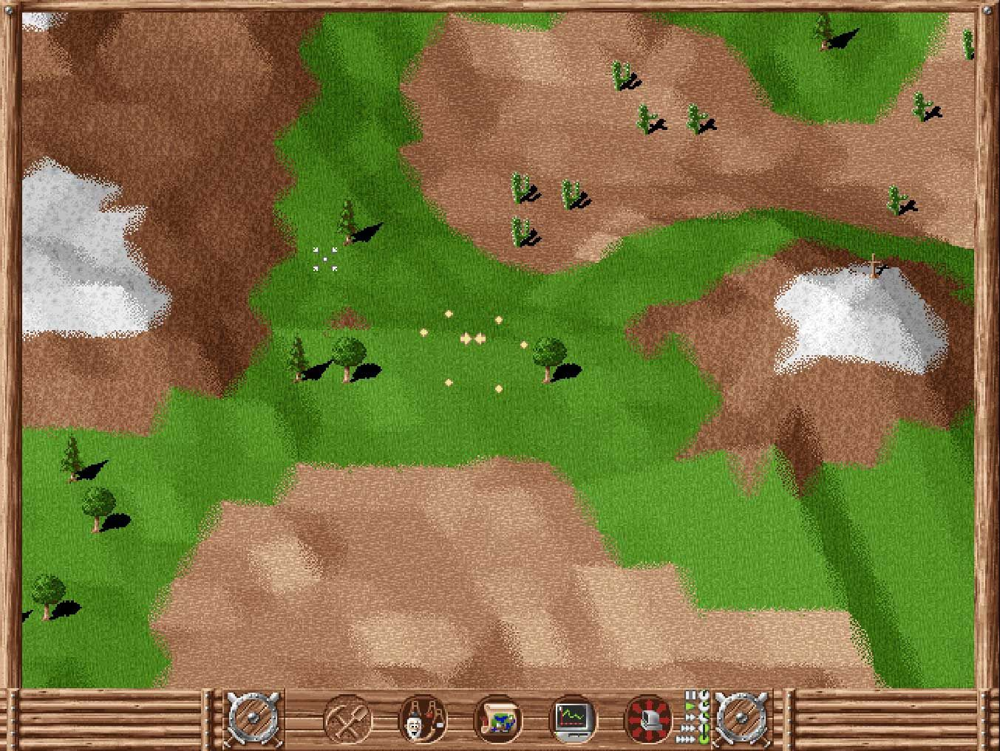

Jetzt ist es an der Zeit, einen guten Standort für unser Schloss zu finden und mit dem Aufbau unserer eigenen Siedlung zu beginnen.

Ihr solltet nach einem See, Bäumen, Steinen und Bergzügen Ausschau halten. Wenn ihr Bergzüge seht, könnt ihr über das Geologensymbol herausfinden, was sich im Inneren verbirgt.

[Open: Pasted image 20250224190641.png](_resources/fdb9394c7ab267f74a4a6df4f8bc37df_MD5.jpeg)
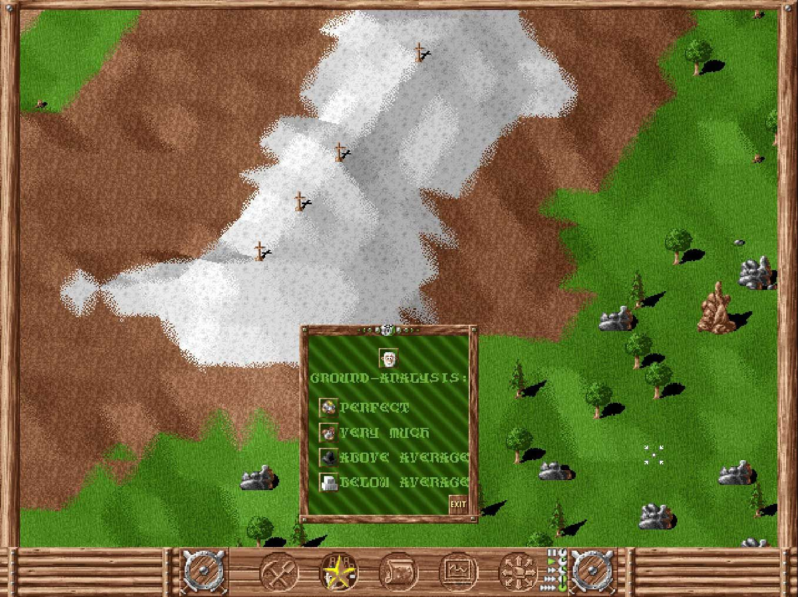

Durch einen gleichzeitigen Links-Rechtsklick (oder einem Klick mit der mittleren Maustaste) auf „Spitzhacke und Schaufel“ wird euch das gesamte verfügbare Bauland angezeigt. Sobald ihr den perfekten Standort gefunden habt, wird es Zeit, euer Schloss zu errichten. Habt ihr den Schnellbaumodus aktiviert, reicht ein Doppelklick, um euer Schloss zu platzieren.

[Open: Pasted image 20250224190702.png](_resources/eaf67232e3d7f621ad895984f2661021_MD5.jpeg)
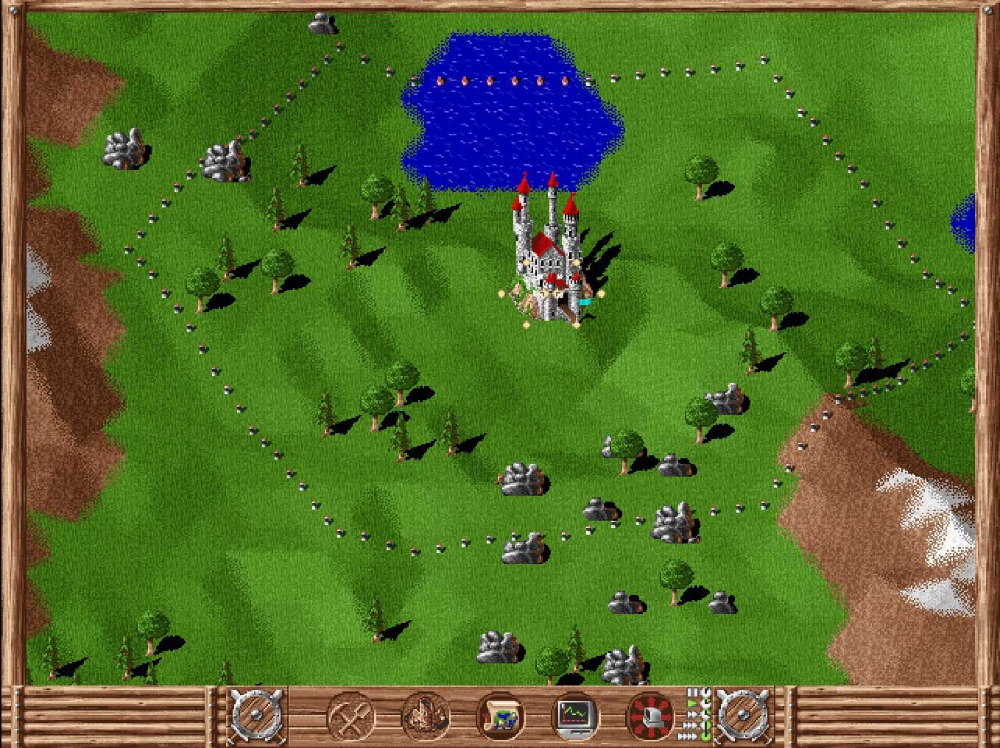

Wenn ihr eine Holzfällerhütte, einen Förster, eine Sägemühle und einen Steinbruch errichtet, habt ihr eure grundlegende Güterversorgung sichergestellt. Die Siedler benötigen Straßen, um die verschiedenen Gebiete der Siedlung zu erreichen. Vor jedem eurer Gebäude befindet sich eine Fahne. Am Anfang muss man eine Straße bauen, bevor man das erste Haus errichten kann. Vor dem im Bau befindlichen Gebäude erscheint eine Fahne, genau wie die vor eurem Schloss. Klickt auf eine der beiden Fahnen und ein Straßenbau-Symbol erscheint auf dem Mauszeiger sowie links unten im Menü. Verbindet die Fahnen und ihr könnt dabei zusehen, wie eure kleinen Helfer das Schloss verlassen. Je geringer die Entfernung zwischen zwei Gebäuden ist, desto besser. Falls ihr längere Wege zu überbrücken habt, solltet ihr, wo immer möglich, Fahnen platzieren. Dadurch unterteilt sich die lange Strecke in zwei Teilstücke und mehr Träger können dabei helfen, die Güter zu transportieren. Ein gutes Straßennetz sorgt für einen schnelleren Gütertransport und ermöglicht es euch, im Fall von Transportproblemen, schneller andere Lösungen zu finden.

[Open: Pasted image 20250224190722.png](_resources/cf38a5c8b4c074346393462ab367c584_MD5.jpeg)
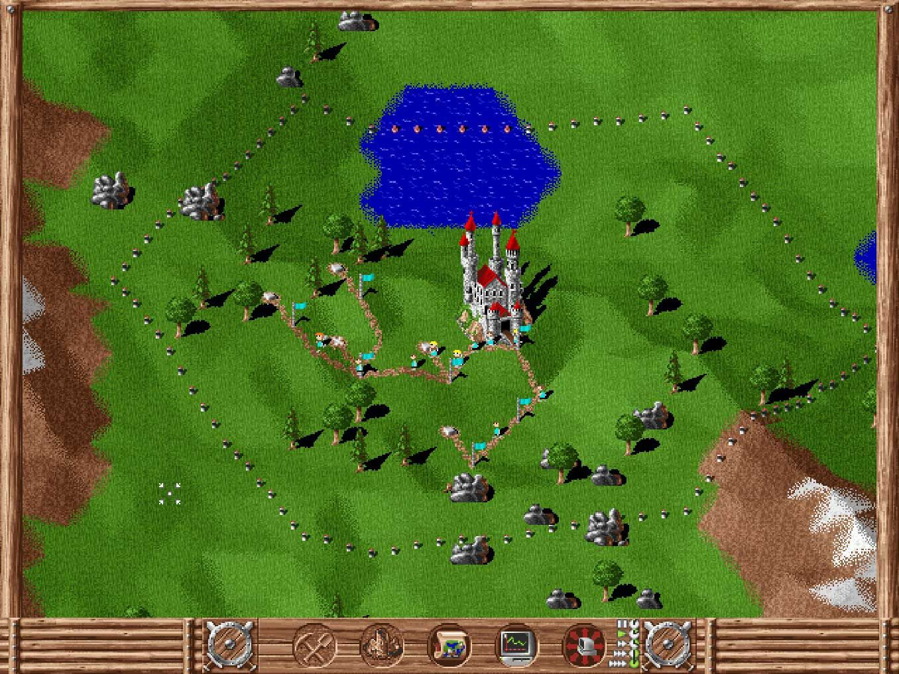

[Open: Pasted image 20250224190735.png](_resources/3e1599a3d9e586cc8da258de16345532_MD5.jpeg)

Da ihr eure Siedlungen vermutlich ausweiten möchtet, solltet ihr Wachhütten in allen 4 Himmelsrichtungen platzieren. Dadurch sichert ihr euch genug Raum, um Bauernhöfe und Industrie für die Produktion von Goldbarren sowie Schwertern und Schilden zu errichten, welche zum Rekrutieren von Soldaten benötigt werden.

[Open: Pasted image 20250224190807.png](_resources/d6753d703af35bc06f5addb524cd47d0_MD5.jpeg)
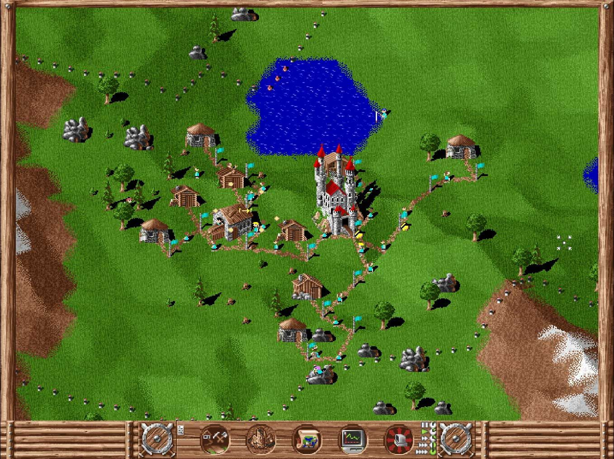

[Open: Pasted image 20250224190819.png](_resources/0eb61ae8cf2ab3853c92020503e75af0_MD5.jpeg)
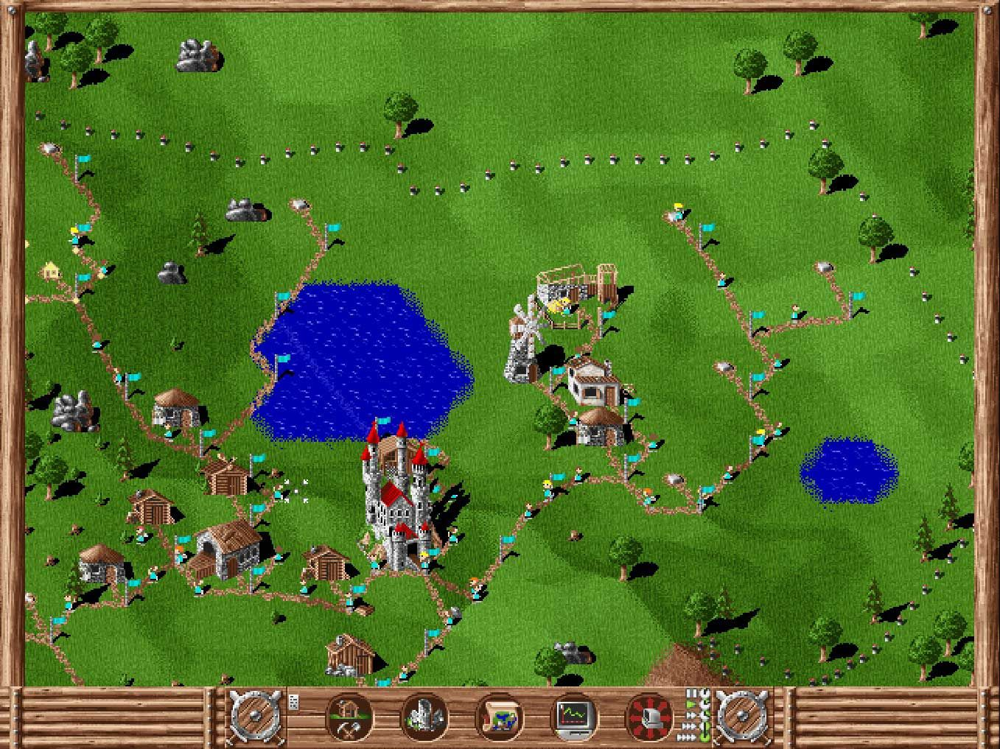

[Open: Pasted image 20250224190837.png](_resources/d9b5dd1bfb98b2247e39d79ebf0dd078_MD5.jpeg)
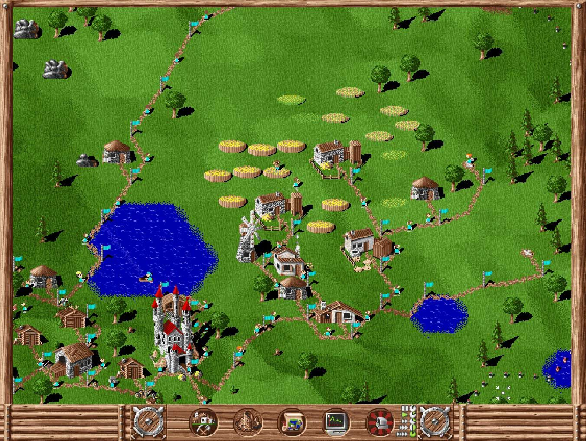

[Open: Pasted image 20250224190853.png](_resources/c276ba978a07d2c09e29399fce34513d_MD5.jpeg)
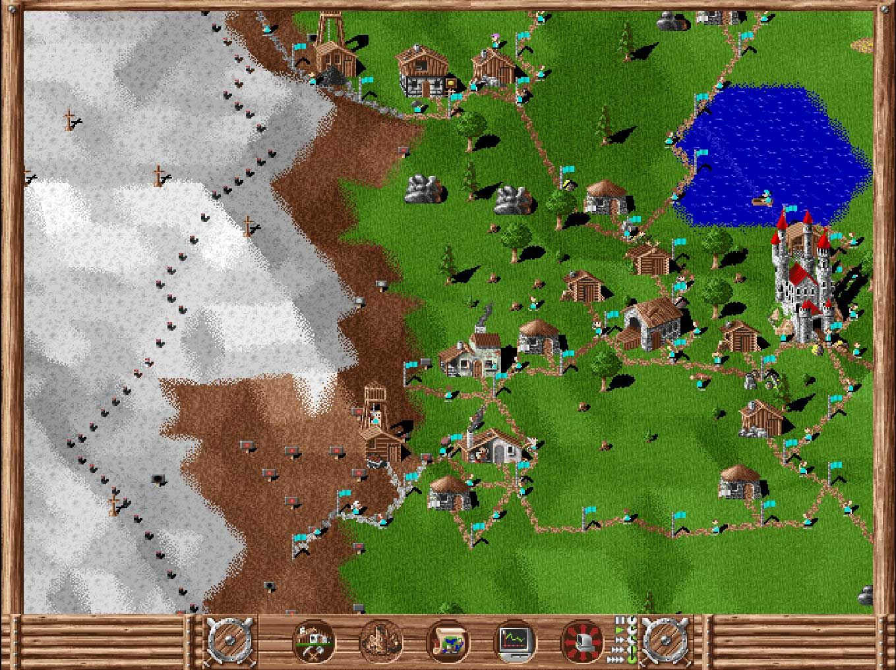

Sehen wir uns einmal die Militärgebäude und die Feinde an.

Ihr habt euer Gebiet durch die Errichtung von Wachhütten ausgedehnt. Wenn kein Feind in der Nähe ist, bleibt die Fahne neben dem Gebäude weiß. Rücken jedoch Feinde an, erscheint ein schwarzer Streifen und sobald sie sich nähern, wird daraus ein schwarzes Kreuz. Ist dies der Fall, solltet ihr euch auf einen Angriff vorbereiten.

[Open: Pasted image 20250224190921.png](_resources/fd3135d1f5e6c19ef94d4c88c9d3d3e4_MD5.jpeg)
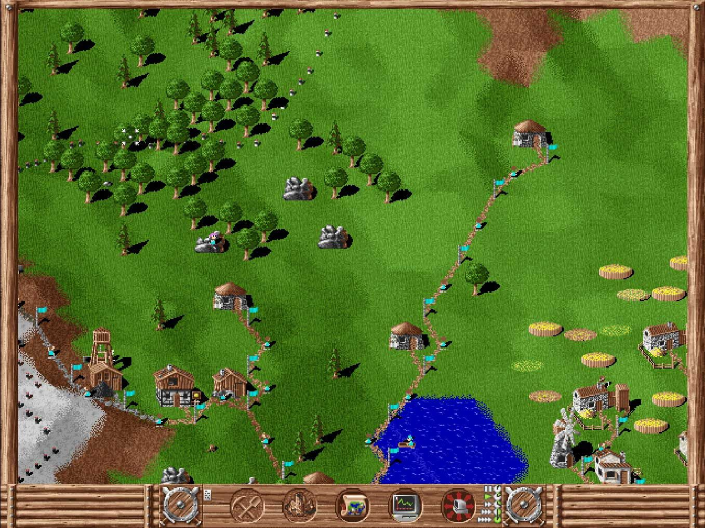

[Open: Pasted image 20250224190937.png](_resources/91522dba9cbca0e7f3e6378e9bba3945_MD5.jpeg)
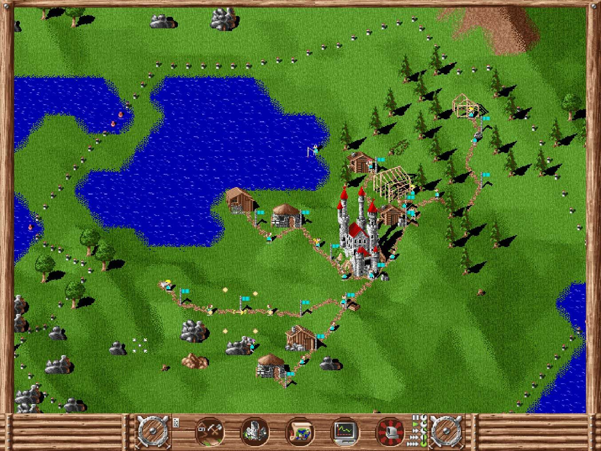

[Open: Pasted image 20250224190953.png](_resources/2bf2fd9707f14e9b726c42ebf2ee631e_MD5.jpeg)
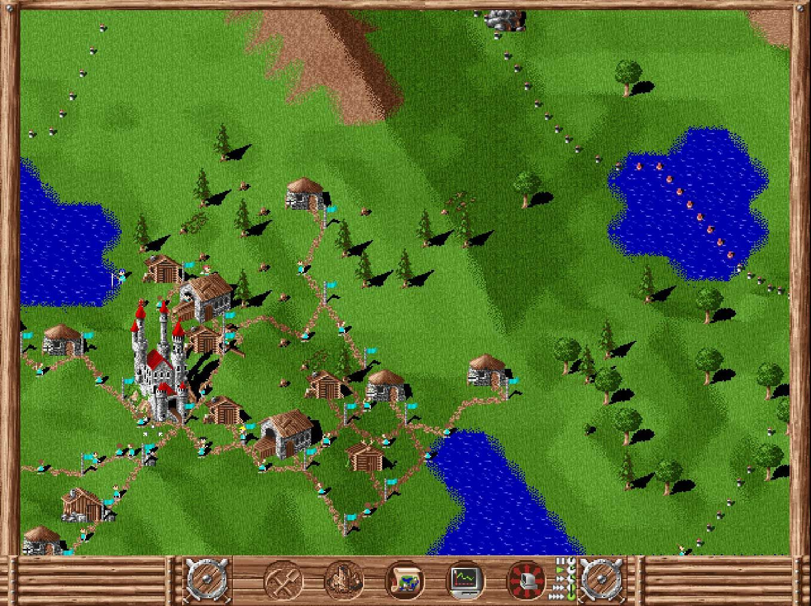

[Open: Pasted image 20250224191005.png](_resources/3945af2c6b8ee25c51c528ffcda82f14_MD5.jpeg)
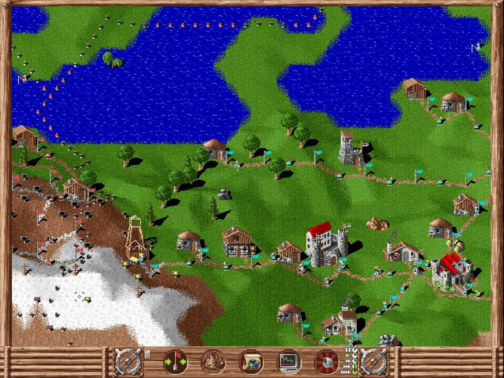

Die Flagge zeigt nicht nur die Gefahrenstufe an, sondern sagt euch auch, mit wie vielen Rittern das Gebäude besetzt ist. Je höher die Flagge gehisst ist, desto mehr Ritter halten sich in dem Gebäude auf. Eine Hütte kann 3, ein Wachturm 6 und ein Schloss 12 Ritter beherbergen.

Wie ihr unten seht, könnt ihr im Militärmenü festlegen, wie viele Ritter ein Gebäude besetzen sollen. Klickt einfach auf Plus oder Minus, um die Einstellung zu ändern. Mit der zweiten Einstellung bestimmt ihr, wie viele Ritter im Gebäude verbleiben, wenn ihr euch zum Angriff auf den Gegner entschließt. Dadurch ist sichergestellt, dass noch genügend Ritter für die Verteidigung eures Territoriums zurückbleiben.

[Open: Pasted image 20250224191029.png](_resources/6809dd673f035c6b9c2097f847151995_MD5.jpeg)
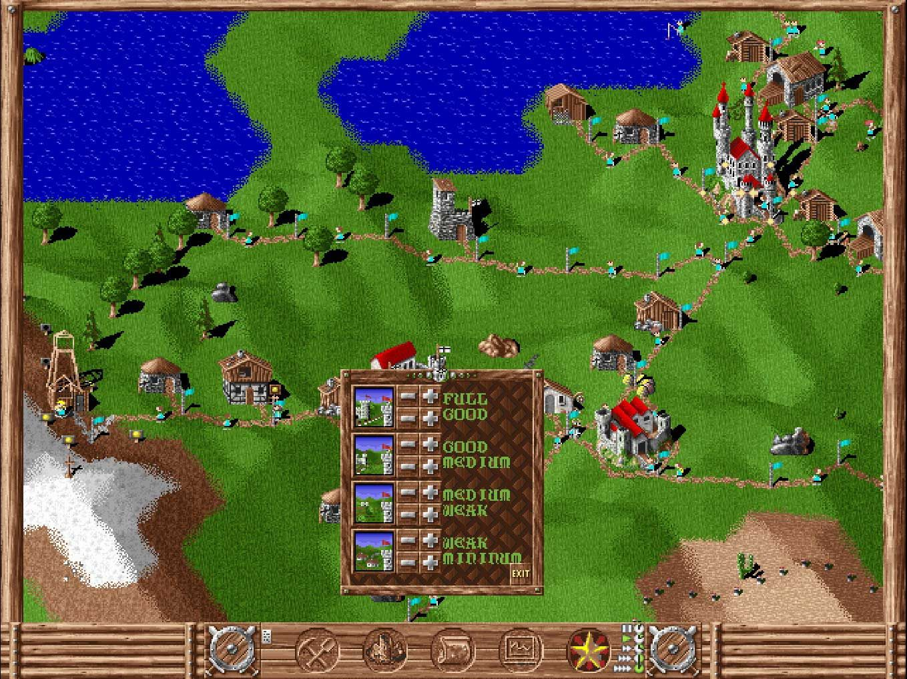

Natürlich gibt es noch mehr, was wir euch erzählen könnten, aber ihr sollt die Die Siedler 1 History Edition ja am besten selbst erkunden.

Bevor wir uns verabschieden, noch ein wichtiger Hinweis. SEID UMSICHTIG: Seht euch von Zeit zu Zeit eure Statistiken an, analysiert Fehlentwicklungen oder negative Ergebnisse einer Operation und findet die beste Lösung. Eine kleine Änderung kann große Wirkung haben. Es ist klüger, eure Strategie und euren Zeitplan sorgsam zu planen, als überstürzt Dinge zu bauen.

Im Installationsordner findet ihr ein Handbuch zum Spiel in den Sprachen Deutsch, Französisch und Englisch.